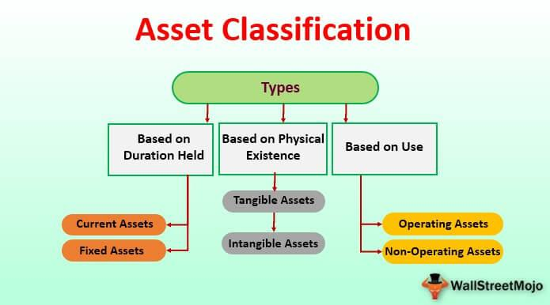

The digital era has ushered in a transformative wave across various sectors, with finance and accounting witnessing notable advancements. Central to these developments is computer software, which serves as a crucial component in asset management and financial markets. Software facilitates a broad array of functions, from streamlining complex accounting processes to enabling high-speed algorithmic trading, thereby enhancing operational efficiency and decision-making capabilities.

This article focuses on the nexus of software asset classification, software accounting, and algorithmic trading. In the context of software asset classification, software is increasingly viewed as an asset possessing intrinsic value that can be capitalized, similar to physical assets. Proper classification and capitalization align with the broader strategic objectives of a business, optimizing financial statements and potentially delaying expense recognition to favorably impact the balance sheet.

Software accounting involves careful adherence to established standards and guidelines, as stipulated by regulatory bodies such as the Federal Accounting Standards Advisory Board (FASAB) and the Governmental Accounting Standards Board (GASB). These guidelines ensure that software is accurately recognized and measured as a valuable asset, contributing to precise financial reporting and transparency.

Algorithmic trading represents a significant leap in trading methodologies, leveraging sophisticated software algorithms capable of executing large volumes of trades at unprecedented speeds. This form of trading exploits small market inefficiencies, offering a competitive advantage to firms through strategies such as trend-following and market-making. Understanding and implementing these advanced technologies allow traders and investors to remain competitive.

The seamless integration of these technologies into corporate and trading strategies is essential for optimizing operations and enhancing financial strategies. By understanding and applying these software solutions, businesses can gain a competitive edge in today's dynamic and fast-paced financial environment.

## Table of Contents

## Understanding Computer Software as Assets

Computer software is typically regarded as an intangible asset in accounting because it lacks physical substance. Despite this, software possesses considerable value, often being essential to a company's operations and competitive positioning. Under established accounting procedures, certain conditions allow software to be capitalized, akin to tangible assets. This classification can significantly influence a corporation's financial reporting and overall fiscal health.

The capitalization of software is guided by specific accounting standards, including the Financial Accounting Standards Board (FASB) Accounting Standards Codification (ASC) Topic 350 for the United States, and International Financial Reporting Standards (IFRS) IAS 38 internationally. These standards allow software to be recognized as a fixed asset on the balance sheet if particular criteria are satisfied, such as the software's expected useful life and significant functional role within the company's operations. Essentially, the software must provide long-term benefits and have a reliable and determinable lifecycle to qualify for capitalization.

One key advantage of capitalizing software is that it permits the delay of expense recognition. By treating software as a capital asset rather than immediately expensing its cost, a company can spread the cost over the software's useful life through amortization. This practice helps improve the company's balance sheet by increasing asset value and deferring costs, which can lead to enhanced financial metrics, such as return on assets (ROA) and earnings before interest and taxes (EBIT).

To elaborate, the process of software capitalization typically involves these steps:

1. **Identify Capitalizable Costs**: Determine the costs directly associated with obtaining and readying the software for use. This might include purchasing fees, direct labor costs for developing the software, and necessary materials and services. 

2. **Determine Useful Life**: Estimate the period during which the software is expected to generate economic benefits. This assessment influences the duration of capitalization and subsequent amortization schedules.

3. **Commencement of Capitalization**: Start capitalizing costs once the software development or acquisition phase meets the feasibility threshold and the entity intends to complete and utilize the software in operations. 

4. **Amortization and Impairment Testing**: Amortize the capitalized software costs over the expected useful life. Additionally, perform impairment testing to ensure the asset's carrying amount does not exceed its recoverable amount.

These factors and processes highlight the substantial impact that software capitalization has on financial statements. Correctly classifying and accounting for software as assets is crucial for accurate financial reporting and maintaining compliance with pertinent accounting standards. This approach not only provides a clearer picture of a company's financial health but also ensures that stakeholders are informed of the asset's utilization and value.

## Software Accounting Practices

Proper accounting for software is essential because it significantly impacts how a company presents its financial condition. As intangible assets, software requires specific handling to ensure accurate financial reporting. The Federal Accounting Standards Advisory Board (FASAB) and the Governmental Accounting Standards Board (GASB) provide critical guidelines for the capitalization of software, which companies must adhere to for proper documentation and representation on financial statements.

### Guidelines for Software Capitalization

Software is usually capitalized when it is expected to provide economic benefits beyond the current reporting period. According to GASB standards, software development costs can be capitalized if they meet several criteria:

1. **Technological Feasibility**: The software project must reach a point where technological feasibility is established, indicating the software can be completed and used as intended.

2. **Usefulness**: The software should primarily benefit the company, either through revenue enhancement, cost savings, or both. This usefulness justifies its classification as an asset rather than an expense.

3. **Expected Lifecycle**: The expected period during which the software will be useful should justify its treatment as a capital asset. Usually, this involves assessing the duration over which the software contributes to operations, and it should be reflected in an amortization schedule.

4. **Integration in Business Operations**: The degree of integration into business operations is considered, ensuring that the software serves a substantial purpose within the company’s processes.

### Accounting Principles for Recognition and Measurement

The process of recognizing and measuring software as an asset involves adhering to these principles:

- **Capitalization of Costs**: Only specific costs incurred during the application development stage can be capitalized. These may include direct costs of materials, services, payroll costs attributable to development activities, and interest costs incurred during the software's development.

- **Amortization**: Once capitalized, these costs are typically amortized over the software’s useful life, using systematic and rational methods. For example, straight-line amortization might be used if the benefits are expected to be fairly even over the software's life span.

- **Impairment Testing**: Regular impairment testing is crucial to ensure that the book value of the software does not exceed its recoverable amount. If impairment is identified, the software's carrying amount should be reduced accordingly.

### Compliance and Financial Reporting

Compliance with FASAB and GASB guidelines ensures transparency and accuracy in financial reporting. Clear documentation of software capitalization, accompanied by regular reviews of software value, helps maintain integrity in reporting. This practice also supports clear communication with stakeholders, demonstrating prudent asset management.

Proper software accounting practices require that companies maintain a delicate balance between compliance with accounting standards and strategic integration of software as a critical component of business operations. By adhering to these guidelines, organizations can better manage the financial implications of their software investments.

## The Role of Algorithmic Trading

Algorithmic trading, also known as algo trading or automated trading, enables the execution of trades through pre-programmed instructions, offering significant speed and [volume](/wiki/volume-trading-strategy) advantages over traditional trading methods. This cutting-edge approach exploits small market inefficiencies by employing software capable of processing real-time data and executing high-frequency trades with minimal human intervention. 

Central to [algorithmic trading](/wiki/algorithmic-trading) is the use of sophisticated software that monitors market conditions in real-time and automatically places buy or sell orders based on programmed strategies. This capability hinges on advanced data analytics, where algorithms analyze vast datasets to identify trading opportunities invisible to human eyes due to speed or complexity. For instance, algorithms can detect patterns or trends such as market [momentum](/wiki/momentum), mean reversion, or statistical [arbitrage](/wiki/arbitrage), and execute trades accordingly.

Investment firms have increasingly integrated algorithmic trading platforms into their operations to enhance trading speed and efficiency. These platforms not only automate the execution of trades but also streamline the entire trading process, from signal generation to order placement and execution, reducing the time required to capitalize on market movements. For example, high-frequency trading ([HFT](/wiki/high-frequency-trading-strategies)) strategies, a subset of algorithmic trading, seek to capitalize on minute market discrepancies by executing thousands of trades in fractions of a second.

Key strategies employed in algorithmic trading include trend-following, market-making, and [statistical arbitrage](/wiki/statistical-arbitrage). Trend-following algorithms are designed to capitalize on upward or downward moves by identifying price trends and entering trades in the direction of said trends. Conversely, market-making algorithms maintain [liquidity](/wiki/liquidity-risk-premium) by simultaneously placing buy and sell orders for a financial instrument, profiting from the bid-ask spread. Statistical arbitrage involves identifying and exploiting price differentials between correlated instruments, employing statistical models to predict pricing convergence.

Understanding and mastering these technologies is imperative for traders and investors aiming to remain competitive. The dynamic nature of financial markets necessitates constant adaptation and refinement of algorithmic strategies to account for evolving market behaviors and regulatory changes. Consequently, proficiency in coding, data analysis, and economic theory becomes crucial for those engaging in algorithmic trading.

As algorithmic trading continues to reshape the financial landscape, its role in enhancing market efficiency, providing liquidity, and reducing transaction costs becomes increasingly pivotal. Embracing these technologies, traders and investors can optimize their operations and gain a competitive edge in rapidly changing financial markets.

## Integrating Software in Financial Operations

Software integration in financial operations involves the strategic use of applications across various domains, such as trading, accounting, and asset management. This integration serves to streamline operations, support decision-making processes, and enhance overall financial strategies. By automating routine tasks, identifying and managing risks, and offering comprehensive reporting capabilities, advanced software solutions facilitate these goals, enabling more efficient and effective financial management.

In trading, for instance, integrated systems allow for real-time data analysis and swift execution, crucial for taking advantage of fluctuating market conditions. A prime example is algorithmic trading platforms that seamlessly integrate with market data feeds and broker interfaces. This integration not only optimizes trading operations but also supports complex decision-making processes by providing traders with actionable insights derived from vast datasets.

In accounting, integrated software solutions automate tasks such as transaction entry, reconciliation, and financial statement preparation. This not only reduces the probability of human error but also speeds up the financial closing process. By providing dashboards and automated alerts, these systems aid accountants in focusing on more strategic tasks, such as financial analysis and forecasting.

Asset management further benefits from software integration by offering tools for risk assessment, portfolio management, and compliance tracking. Platforms that consolidate data from various sources provide asset managers with a holistic view of investments, enabling better allocation strategies and risk management practices. This is especially valuable when managing diverse assets that require constant monitoring and adjustment in response to market changes.

Case studies highlight the impact of integrated software solutions in improving operational efficiency and financial outcomes. For example, a multinational investment firm might deploy a centralized platform that unifies its accounting, trading, and asset management functions. This could lead to more informed investment strategies and significant reductions in operational overhead, due to the elimination of redundant processes and the facilitation of data-driven decision-making.

Understanding how to leverage these technologies is crucial for businesses aiming to manage and grow their assets effectively. By embracing integration, companies can achieve greater transparency, agility, and strategic insight across their financial operations. This not only enhances competitiveness but also fosters the ability to adapt quickly to market changes and regulatory demands, ultimately contributing to long-term financial success.

## Challenges and Future Trends

Integrating software into asset management and trading significantly enhances operational efficiency and decision-making capabilities, yet it presents several challenges that need to be addressed. One of the primary concerns is cybersecurity. As more financial transactions and operations become digital, the risk of cyber-attacks increases, threatening the integrity and confidentiality of sensitive data. Companies must invest in robust security measures and continuously update their systems to safeguard against evolving threats. This includes employing encryption, multi-[factor](/wiki/factor-investing) authentication, and regular security audits.

Regulatory compliance also poses a challenge, as financial technologies must align with stringent regulations that vary across jurisdictions. However, adhering to these regulations ensures transparency and protects firms from potential legal liabilities. Organizations must stay informed of regulatory changes and adapt their systems accordingly, which can be resource-intensive.

The future of software in finance is poised to be shaped by advances in [artificial intelligence](/wiki/ai-artificial-intelligence) (AI) and [machine learning](/wiki/machine-learning) (ML). These technologies can analyze large datasets to predict market trends and make trading decisions more efficient than traditional methods. As AI and ML technologies evolve, they are expected to offer more sophisticated analytics, risk management, and automated decision-making capabilities. However, the successful implementation of these technologies requires significant investment in infrastructure and talent.

Moreover, evolving standards and technologies necessitate ongoing adaptation for firms to maintain their competitive edge. Continuous learning and agility are essential, as the digital financial landscape is characterized by rapid change. Companies must foster a culture of innovation and adaptability, encouraging their workforce to acquire new skills relevant to emerging technologies.

In summary, while the integration of advanced software offers vast potential for enhancing financial operations, it comes with challenges that need to be meticulously managed. Cybersecurity, regulatory compliance, and the adoption of AI and ML demand careful attention and strategic investment. By embracing a mindset of continuous learning and adaptability, companies can effectively navigate these challenges and harness technology to drive their success in the digital economy.

## Conclusion

Computer software represents a crucial asset in finance and trading, underpinning many aspects of these industries. Proper classification and accounting of software assets are essential due to their significant impact on a company's financial health. By accurately categorizing software as either an intangible asset or capitalizing it under specific accounting rules, businesses can optimize their balance sheets and delay expense recognition, thus enhancing financial stability and performance.

Algorithmic trading, driven by sophisticated software solutions, has revolutionized financial markets by improving the speed and efficiency of trade execution. These systems enable traders to exploit market inefficiencies rapidly and operate at higher volumes than manual trading methods. The ability to process vast amounts of data in real time and execute trades based on complex algorithms positions algorithmic trading as a key driver of modern financial practices.

To fully harness the potential of software, businesses must embrace continuous technological advancements and navigate challenges such as cybersecurity threats and regulatory compliance. The integration of software solutions in financial operations offers enhanced decision-making capabilities, risk management, and comprehensive reporting, catalyzing smarter investment strategies and more robust financial management.

In conclusion, leveraging the capabilities of software in finance and trading involves recognizing its value through proper accounting, adopting cutting-edge technologies like algorithmic trading, and overcoming inherent challenges. This approach not only optimizes current operations but also prepares businesses for a future where technology continues to drive innovation in financial markets.

## References & Further Reading

[1]: ["Advances in Financial Machine Learning"](https://www.amazon.com/Advances-Financial-Machine-Learning-Marcos/dp/1119482089) by Marcos Lopez de Prado

[2]: ["Financial Instruments with MATLAB: Hedging and Pricing"](https://www.mathworks.com/products/financial-instruments.html) by Ding, Chensheng

[3]: ["Quantitative Trading: How to Build Your Own Algorithmic Trading Business"](https://github.com/LucindaYa/quant-resources/blob/master/Quantitative%20Trading%20How%20to%20Build%20Your%20Own%20Algorithmic%20Trading%20Business.pdf) by Ernest P. Chan

[4]: ["Evidence-Based Technical Analysis: Applying the Scientific Method and Statistical Inference to Trading Signals"](https://www.amazon.com/Evidence-Based-Technical-Analysis-Scientific-Statistical/dp/0470008741) by David Aronson

[5]: [Financial Accounting Standards Board (FASB), Accounting Standards Codification (ASC) Topic 350](https://asc.fasb.org/)

[6]: [Governmental Accounting Standards Board (GASB)](https://gasb.org/standards)

[7]: [International Financial Reporting Standards (IFRS) IAS 38 - Intangible Assets](https://www.ifrs.org/content/dam/ifrs/publications/pdf-standards/english/2021/issued/part-a/ias-38-intangible-assets.pdf)