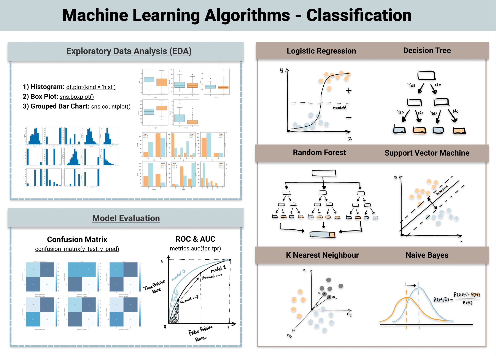

## Table of Contents

## What is a classification model in machine learning?

A classification model in machine learning is a type of algorithm that helps to sort data into different groups or categories. Imagine you have a bunch of fruits and you want to separate them into apples, oranges, and bananas. A classification model would learn from examples of these fruits and then be able to tell which group a new fruit belongs to based on its characteristics, like color, shape, and size.

These models work by finding patterns in the data they are given during a training phase. For example, if the model sees that apples are usually red and round, it will use this information to classify new fruits. There are many different types of classification models, like decision trees, logistic regression, and neural networks, each with their own way of figuring out how to sort the data. Once trained, the model can make predictions on new, unseen data, helping to automate the process of categorization in various applications, from email spam filtering to medical diagnoses.

## What are the main types of classification algorithms?

Classification algorithms are used in machine learning to sort data into different groups. Some common types include decision trees, logistic regression, and k-nearest neighbors. Decision trees work by making a series of decisions, splitting the data into branches until it reaches a final category. Logistic regression, on the other hand, uses a mathematical formula to predict the probability of an item belonging to a certain group. The k-nearest neighbors algorithm looks at the 'k' closest examples in the training data to decide which group a new item should belong to.

Another type of classification algorithm is the support vector machine (SVM), which tries to find the best line or hyperplane to separate different classes of data. Neural networks, including deep learning models, are also popular for classification tasks. These models are inspired by the human brain and can learn very complex patterns in data. They work by passing data through layers of interconnected nodes, adjusting the connections to improve their predictions.

Each of these algorithms has its own strengths and weaknesses. Decision trees are easy to understand and interpret, but they can sometimes overfit the data. Logistic regression is simple and works well with linearly separable data, but it might struggle with more complex patterns. K-nearest neighbors can be very accurate but can be slow with large datasets. SVMs are powerful for finding complex boundaries between classes, but they can be sensitive to the choice of parameters. Neural networks are very flexible and can model almost any relationship in data, but they require a lot of data and computing power to train effectively.

## How does a classification model differ from a regression model?

A classification model and a regression model are both used in [machine learning](/wiki/machine-learning), but they have different goals. A classification model is used to sort data into different groups or categories. For example, if you want to decide whether an email is spam or not, you would use a classification model. It looks at the data and tries to figure out which group a new piece of data belongs to. The output of a classification model is usually a category, like "spam" or "not spam."

On the other hand, a regression model is used to predict a number. If you want to guess the price of a house based on its size and location, you would use a regression model. It looks at the data and tries to find a mathematical formula that can predict the value of a new piece of data. The output of a regression model is a number, like a price in dollars. For example, a simple regression model might use a formula like $$y = mx + b$$ to predict the price based on the size of the house.

Both types of models are important and useful, but they are used for different kinds of problems. Classification models are great for tasks where you need to make a decision or categorize something, while regression models are better for tasks where you need to predict a specific value. Understanding the difference between these two types of models can help you choose the right tool for your machine learning project.

## What is the process of training a classification model?

Training a classification model involves feeding it a lot of data so it can learn how to sort new data into different groups. You start with a dataset that has examples of the things you want to classify, like pictures of dogs and cats. Each example in the dataset is labeled with the correct group, so the model knows what it's looking at. You split this data into two parts: a training set and a test set. The training set is used to teach the model, and the test set is used to check how well it learned. During training, the model looks at the examples in the training set and tries to find patterns that help it guess the right group for each example. It keeps adjusting its guesses until it gets them as right as possible.

Once the model has learned from the training set, you use the test set to see how well it can classify new data. You show the model examples from the test set, and it tries to guess the right group for each one. If the model gets a lot of guesses right, it means it learned well. If it makes a lot of mistakes, you might need to give it more data or try a different type of model. This process of training and testing helps make sure the model can work well with new data it hasn't seen before.

## What are common performance metrics used to evaluate classification models?

When you want to see how good a classification model is, you use different ways to measure its performance. One common way is accuracy, which is just the number of correct guesses divided by the total number of guesses. If your model is right 90 out of 100 times, its accuracy is 90%. But accuracy can be tricky if your data is not balanced, meaning if one group has a lot more examples than the others. That's why you also use other measures like precision and recall. Precision tells you how many of the items the model said were in a group actually belong to that group. Recall tells you how many of the items that should be in a group were actually caught by the model.

Another important measure is the F1 score, which is a way to combine precision and recall into one number. The F1 score is the harmonic mean of precision and recall, which you can calculate with the formula $$F1 = 2 \times \frac{\text{precision} \times \text{recall}}{\text{precision} + \text{recall}}$$. This score is good because it gives you a single number that shows how well the model is doing overall. You might also use a confusion matrix, which is a table that shows how many times the model guessed each group correctly or incorrectly. This can help you see where the model is making mistakes. All these measures help you understand how well your classification model is working and where it might need to improve.

## How can you handle imbalanced datasets in classification?

When you have an imbalanced dataset, it means that one group has a lot more examples than the others. This can make your classification model biased towards the bigger group. To fix this, you can use a method called oversampling. This means you make more copies of the examples from the smaller groups until they are balanced with the bigger group. Another way is undersampling, where you take away some examples from the bigger group until it's the same size as the smaller groups. Both of these methods help make your dataset more even, so your model can learn from all groups equally.

Another way to handle imbalanced datasets is by using special algorithms that are made to work well with imbalanced data. For example, you can use a technique called SMOTE, which stands for Synthetic Minority Over-sampling Technique. SMOTE creates new, fake examples of the smaller groups by mixing the features of the real examples. This helps the model see more variety in the smaller groups. You can also change the way the model learns by giving more importance to the examples from the smaller groups. This is called adjusting the class weights. By doing this, the model pays more attention to getting the smaller groups right, which can help balance out the learning process.

To see how well these methods work, you can use different performance measures. Accuracy alone might not be the best way to check because it can be misleading with imbalanced data. Instead, you might look at precision, recall, and the F1 score. Precision tells you how many of the items the model said were in a group actually belong to that group. Recall tells you how many of the items that should be in a group were actually caught by the model. The F1 score combines precision and recall into one number, calculated with the formula $$F1 = 2 \times \frac{\text{precision} \times \text{recall}}{\text{precision} + \text{recall}}$$. By using these measures, you can get a better idea of how well your model is doing with an imbalanced dataset.

## What is the significance of the confusion matrix in classification?

A confusion matrix is a helpful tool that shows how well a classification model is doing. It's like a table that counts how many times the model guessed each group correctly or incorrectly. Each row in the table shows the actual groups, and each column shows the groups that the model predicted. This way, you can see exactly where the model is making mistakes. For example, if you're trying to classify emails as spam or not spam, the confusion matrix will tell you how many spam emails were correctly identified as spam, how many were wrongly labeled as not spam, and vice versa.

The confusion matrix is important because it gives you detailed information that can help you improve your model. For instance, if the matrix shows that your model often mistakes one group for another, you can focus on fixing that specific problem. You can also use the numbers in the confusion matrix to calculate other useful measures like precision, recall, and the F1 score. Precision tells you how many of the items the model said were in a group actually belong to that group. Recall tells you how many of the items that should be in a group were actually caught by the model. The F1 score combines these two into one number, calculated with the formula $$F1 = 2 \times \frac{\text{precision} \times \text{recall}}{\text{precision} + \text{recall}}$$. By looking at these measures, you can get a better idea of how well your model is doing and where it needs to improve.

## How do you choose the right classification algorithm for a specific problem?

Choosing the right classification algorithm depends a lot on what you want to do and the kind of data you have. If you have a small dataset and want a simple model that's easy to understand, you might choose a decision tree. Decision trees work by making a series of choices, like a flowchart, to sort data into different groups. They're good for beginners because you can see exactly how the model makes its decisions. Another simple choice is logistic regression, which uses a math formula to predict the chance of something being in a certain group. Logistic regression is good when the groups in your data can be separated by a straight line. But if your data is more complex, you might need a more powerful model like a [neural network](/wiki/neural-network), which can learn very complicated patterns but needs a lot of data and computing power to train.

Another thing to think about is how balanced your data is. If one group has a lot more examples than the others, you might want to use a special algorithm like SMOTE to make the data more even. Also, consider how important it is to get every group right. If you need to be very accurate with a smaller group, you might use an algorithm that can adjust its focus on different groups, like adjusting the class weights in a model. To choose the best algorithm, you can try out a few different ones and see which one works best on your test data. You can use measures like accuracy, precision, recall, and the F1 score to compare them. The F1 score, for example, is calculated with the formula $$F1 = 2 \times \frac{\text{precision} \times \text{recall}}{\text{precision} + \text{recall}}$$, and it gives you a single number that shows how well the model is doing overall. By trying different algorithms and checking their performance, you can find the one that's best for your specific problem.

## What are some advanced techniques for improving classification model performance?

One way to make your classification model better is by using a technique called ensemble methods. This means you combine the guesses from several different models to get a better final guess. For example, you could use a method called Random Forests, which is like a bunch of decision trees working together. Each tree makes its own guess, and then they all vote on the final answer. This can help because if one tree makes a mistake, the others might still get it right. Another ensemble method is called boosting, where you train models one after another, with each new model trying to fix the mistakes of the last one. This can make your final model much more accurate.

Another advanced technique is using [deep learning](/wiki/deep-learning), which is a type of neural network that can learn very complex patterns in data. Deep learning models have many layers of interconnected nodes, and they can be very powerful if you have a lot of data and a strong computer to train them. They work by passing data through these layers, adjusting the connections to improve their guesses. Sometimes, you can also use a technique called transfer learning, where you take a model that was trained on a different but related problem and use it as a starting point for your own problem. This can save time and make your model better because it already knows some useful things from the other problem. To see how well these techniques are working, you can use measures like accuracy, precision, recall, and the F1 score. The F1 score is calculated with the formula $$F1 = 2 \times \frac{\text{precision} \times \text{recall}}{\text{precision} + \text{recall}}$$, and it gives you a single number that shows how well your model is doing overall.

## How does feature selection impact the performance of classification models?

Feature selection is like [picking](/wiki/asset-class-picking) the best tools from a toolbox to fix a problem. When you choose the right features, or pieces of information, for your classification model, it can work better and faster. Imagine you're trying to guess if a fruit is an apple or an orange. If you use features like color and shape, your model will be more accurate than if you use less important features like the time of day the fruit was picked. By focusing on the most useful features, your model can learn more quickly and make better guesses.

Using the right features also helps prevent your model from getting confused by too much information. If you give your model too many features, some of which aren't very helpful, it might start to see patterns that aren't really there. This is called overfitting, and it can make your model do worse on new data. By carefully choosing which features to use, you can make sure your model stays simple and focused on what's important. This can improve measures like accuracy, precision, recall, and the F1 score, which is calculated with the formula $$F1 = 2 \times \frac{\text{precision} \times \text{recall}}{\text{precision} + \text{recall}}$$.

## What are the challenges of deploying classification models in production?

Deploying classification models in production can be tricky because real-world data is often messy and different from the data used to train the model. When you train a model, you usually clean up the data and make sure it's all in the same format. But in the real world, data might come in different shapes and sizes, with missing or wrong information. This means you need to spend a lot of time making sure your model can handle this messy data. You also need to keep an eye on how well your model is doing once it's running, because the world changes and your model might need to be updated or retrained to stay accurate.

Another challenge is making sure your model works fast enough. When you're testing a model, speed might not be a big deal, but in production, people expect quick answers. If your model takes too long to make a guess, it can slow down the whole system. You might need to use special tools or tricks to make your model run faster. Also, keeping your model safe and private is important. You need to make sure that the data your model uses is protected and that no one can mess with your model to make it give wrong answers. All these things can make deploying a classification model in production a lot harder than just training it.

## How can ensemble methods enhance the accuracy of classification models?

Ensemble methods help make classification models more accurate by combining the predictions of multiple models. Imagine you're trying to guess the answer to a question, and you ask several friends for their guesses. If you take a vote and go with the most popular answer, you're more likely to get it right than if you just listened to one friend. That's what ensemble methods do. They use different models, like decision trees or neural networks, to make guesses about the data. Then, they combine these guesses in different ways, like voting or averaging, to come up with a final prediction. This can help because if one model makes a mistake, the others might still get it right, leading to better overall accuracy.

One popular ensemble method is called Random Forests. It's like a group of decision trees working together. Each tree makes its own guess, and then they all vote on the final answer. This can make the model more accurate because it reduces the chance of overfitting, which happens when a model learns too much from the training data and doesn't work well on new data. Another ensemble method is called boosting. In boosting, you train models one after another, with each new model trying to fix the mistakes of the last one. This can make your final model much more accurate because it focuses on getting the hard cases right. By using these ensemble methods, you can improve measures like accuracy, precision, recall, and the F1 score, which is calculated with the formula $$F1 = 2 \times \frac{\text{precision} \times \text{recall}}{\text{precision} + \text{recall}}$$.

## References & Further Reading

[1]: Hastie, T., Tibshirani, R., & Friedman, J. (2009). ["The Elements of Statistical Learning: Data Mining, Inference, and Prediction"](https://link.springer.com/book/10.1007/978-0-387-84858-7) (2nd ed.). Springer.

[2]: Bishop, C. M. (2006). ["Pattern Recognition and Machine Learning"](https://www.cs.uoi.gr/~arly/courses/ml/tmp/Bishop_book.pdf). Springer.

[3]: Goodfellow, I., Bengio, Y., & Courville, A. (2016). ["Deep Learning"](https://www.deeplearningbook.org/). MIT Press.

[4]: Ajit, A., Gupta, P., & Karn, B. (2020). ["A survey of the various techniques for classification of data during machine learning."](https://ieeexplore.ieee.org/document/9087123) ACM Computing Survey.

[5]: Breiman, L. (2001). ["Random Forests."](https://link.springer.com/article/10.1023/A:1010933404324) Machine Learning, 45(1), 5-32.

[6]: Smola, A. J., & Schölkopf, B. (2004). ["A tutorial on support vector regression."](https://link.springer.com/article/10.1023/B:STCO.0000035301.49549.88) Statistics and Computing, 14(3), 199-222. 

[7]: Chawla, N. V., Bowyer, K. W., Hall, L. O., & Kegelmeyer, W. P. (2002). ["SMOTE: Synthetic Minority Over-sampling Technique."](https://arxiv.org/abs/1106.1813) Journal of Artificial Intelligence Research, 16, 321-357.

[8]: Brownlee, J. (2016). ["Master Machine Learning Algorithms."](https://machinelearningmastery.com/master-machine-learning-algorithms/) Machine Learning Mastery.

[9]: Zhao, H., & Liu, Y. (2020). ["Deep neural networks for classification: A survey."](https://ieeexplore.ieee.org/document/7514991) Information Sciences, 514, 269-283.