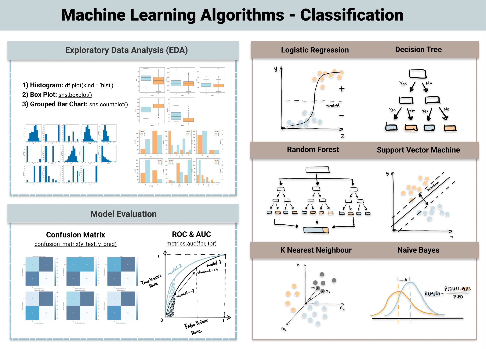

## Table of Contents

## What is a classification model?

A classification model is a type of machine learning model that helps to sort things into different groups. Imagine you have a bunch of fruits, and you want to know which ones are apples and which ones are oranges. The model looks at the features of each fruit, like its color and shape, and decides if it's an apple or an orange. This is helpful in many areas, like telling if an email is spam or not, or figuring out if a picture shows a cat or a dog.

To make a classification model, you start by giving it a lot of examples, called training data. For instance, if you're trying to tell apples from oranges, you'd show the model many pictures of apples and oranges, telling it which is which. The model then learns from these examples and figures out the patterns that help it tell the difference. Once it's good at this, you can use it on new fruits to see if it can correctly guess what they are. This process of learning from examples is what makes the model smart and useful.

## What are the main types of classification models?

There are several main types of classification models, and each one works a bit differently. One common type is called logistic regression. It's like a simple math formula that looks at the features of your data and guesses which group something belongs to. For example, if you're trying to tell if an email is spam, logistic regression might look at words in the email and decide if it's more likely to be spam or not. Another type is decision trees. They work by asking a series of yes-or-no questions about your data, kind of like a game of 20 questions. Each question splits the data into smaller groups until it can make a final decision.

Another important type is k-nearest neighbors (KNN). This model looks at the new thing you want to classify and finds the most similar examples in your training data. It then guesses the group based on what group those similar examples belong to. It's like asking your neighbors for advice! Support vector machines (SVM) are also popular. They work by finding the best line or curve that separates different groups in your data. It's like drawing a line in the sand to keep different groups apart. Each of these models has its own strengths and is good for different kinds of problems.

Lastly, there are neural networks, which are more complex and can learn very detailed patterns in data. They are made up of many layers of connected nodes, kind of like a brain. Neural networks are great for things like recognizing pictures or understanding speech. Each type of classification model has its own way of learning and making decisions, so choosing the right one depends on your specific problem and the kind of data you have.

## How does a logistic regression model work for classification?

Logistic regression is a type of classification model that helps you sort things into different groups. Imagine you want to know if an email is spam or not. Logistic regression looks at the features of the email, like certain words or the sender's address, and uses a special math formula to figure out the chances of it being spam. This formula is called the logistic function, and it turns the features into a number between 0 and 1. If the number is close to 1, the model thinks it's more likely to be spam. If it's close to 0, it thinks it's not spam.

To make the model work well, you start by showing it a lot of examples of emails, telling it which ones are spam and which ones are not. This is called training the model. The model learns from these examples and adjusts its formula to get better at guessing. Once it's good at this, you can use it on new emails to see if it can correctly tell if they are spam or not. The key thing about logistic regression is that it gives you a probability, so you can decide for yourself what threshold to use. If you want to be really sure an email is spam before calling it that, you might set a high threshold, like 0.9. If you're okay with a few false positives, you might set it lower, like 0.5.

## What is the difference between binary and multiclass classification?

Binary classification is when you sort things into just two groups. Imagine you're sorting emails into spam and not spam. The model looks at the features of each email and decides if it's more likely to be in one group or the other. It's like flipping a coin, but instead of heads or tails, you have two specific categories. This is simpler because the model only needs to learn the difference between two options.

Multiclass classification is when you sort things into more than two groups. For example, if you're sorting fruits into apples, oranges, and bananas, the model has to figure out which of the three categories each fruit belongs to. This is trickier because the model has to learn the differences between multiple options. There are different ways to do multiclass classification, like training separate models for each pair of categories or using one model that can handle all categories at once.

## How do decision trees perform classification?

Decision trees work by asking a bunch of yes-or-no questions about your data. Imagine you're trying to guess if a fruit is an apple or an orange. The tree might first ask, "Is the fruit red?" If the answer is yes, it might go down one path and ask another question, like "Is the fruit round?" If the answer is no, it goes down a different path and asks something else. Each question splits the data into smaller groups until it can make a final decision about what the fruit is. It's like playing a game of 20 questions, where each question helps narrow down the possibilities until you get the right answer.

To make a decision tree, you start by showing it a lot of examples, called training data. For instance, if you're sorting fruits, you'd show the tree many pictures of apples and oranges, telling it which is which. The tree then figures out which questions to ask by looking at the features of the fruits that help it tell them apart. Once the tree is built, you can use it on new fruits to see if it can correctly guess what they are. The tree keeps splitting the data into smaller and smaller groups until it's confident about its decision. This way of learning from examples and asking questions makes decision trees a simple but powerful way to sort things into different groups.

## What are the advantages of using Random Forests for classification?

Random Forests are a type of classification model that use many decision trees working together. The big advantage of Random Forests is that they are really good at making accurate guesses. Because they use a lot of trees, they can look at the data from many different angles. This helps them avoid making big mistakes that a single decision tree might make. It's like getting advice from a whole group of people instead of just one person. This makes Random Forests more reliable and better at figuring out tricky patterns in the data.

Another advantage is that Random Forests are easy to use and don't need a lot of tweaking to work well. They can handle a lot of different types of data and don't get confused by missing information or outliers. This makes them a good choice for many different kinds of problems. Plus, they can tell you which features in your data are most important for making decisions, which can help you understand your data better. So, Random Forests are not only accurate but also flexible and helpful in understanding your data.

## How does a Support Vector Machine (SVM) classify data?

A Support Vector Machine, or SVM, works by finding the best way to separate different groups of data. Imagine you have a bunch of dots on a piece of paper, some red and some blue. The SVM tries to draw a line that splits the red dots from the blue dots as clearly as possible. This line is called the decision boundary. The goal is to find a line that is as far away as possible from the closest dots of each color. These closest dots are called support vectors, and the distance between them and the line is called the margin. The SVM wants to make this margin as big as possible because a bigger margin usually means the model will make better guesses on new data.

If the dots can't be separated by a straight line, the SVM can use something called a kernel trick. This trick lets the SVM bend the line into a curve to separate the dots better. It's like turning the paper into a stretchy sheet that can be twisted and folded to fit the dots. This makes the SVM really good at figuring out complex patterns in the data. Once the SVM has found the best line or curve, it can use it to guess which group new dots belong to by seeing which side of the line they fall on. This way, the SVM can classify new data accurately, even when the groups are tricky to separate.

## What is the role of the k-Nearest Neighbors (k-NN) algorithm in classification?

The k-Nearest Neighbors (k-NN) algorithm is a simple way to classify things by looking at their neighbors. Imagine you have a new fruit and you want to know if it's an apple or an orange. The k-NN algorithm looks at the fruits that are most similar to your new fruit, based on features like color and shape. It then counts how many of these similar fruits are apples and how many are oranges. If more of them are apples, the algorithm guesses that your new fruit is probably an apple too. The 'k' in k-NN stands for the number of neighbors the algorithm checks, and you can choose how many to look at.

This method is easy to understand and use because it doesn't need to learn a complex formula or build a model. All it needs is a bunch of examples to compare against. However, it can be slow when you have a lot of data because it has to check each new thing against all the examples every time. Also, it works best when the features that matter are things you can measure easily, like the size or color of a fruit. Despite these challenges, k-NN is a handy tool for classification because it's straightforward and can be very accurate if you choose the right number of neighbors to look at.

## How can neural networks be used for classification tasks?

Neural networks are like brains made of math that can learn to sort things into different groups. Imagine you want to tell if a picture shows a cat or a dog. A [neural network](/wiki/neural-network) looks at the picture and tries to figure out if it's more likely to be a cat or a dog. It does this by using many layers of tiny math problems, called nodes, that are connected together. Each node looks at different parts of the picture and decides how important they are for telling cats and dogs apart. The network learns by looking at lots of examples of cat and dog pictures and adjusting how the nodes work together to get better at guessing.

Once the neural network has learned from the examples, you can use it on new pictures to see if it can correctly tell if they show cats or dogs. The network gives you a number between 0 and 1 for each group, showing how sure it is that the picture belongs to that group. If the number for cats is higher, the network thinks it's more likely to be a cat. Neural networks are really good at figuring out complicated patterns in data, like the subtle differences between cats and dogs. They are used in many areas, like recognizing speech, understanding text, and even playing games.

## What are ensemble methods and how do they improve classification performance?

Ensemble methods are like getting advice from a group of experts instead of just one. In classification, they work by combining the guesses from several different models to make a final decision. Imagine you're trying to guess if a fruit is an apple or an orange. Instead of asking just one friend, you ask a bunch of friends who each look at the fruit in their own way. Some might look at the color, others at the shape, and some might even smell it. By putting all their guesses together, you get a better chance of guessing right because the group is less likely to make a big mistake than any single friend.

One popular ensemble method is called Random Forests. It uses a bunch of decision trees, each one built a little differently. When you want to classify something, each tree in the forest makes a guess, and the final decision is made by taking a vote among all the trees. This makes the Random Forest more accurate and reliable because it considers many different ways of looking at the data. Another ensemble method is called boosting, which works by training models one after the other, with each new model trying to fix the mistakes made by the previous ones. This step-by-step improvement helps the final model be really good at classifying things. Ensemble methods are powerful because they combine the strengths of many models, making them better at handling tricky data and giving more accurate results.

## How do you evaluate the performance of a classification model?

To evaluate how well a classification model is doing, you need to look at how often it guesses right. Imagine you're sorting fruits into apples and oranges. You can use something called accuracy, which is just the number of times the model guessed right divided by the total number of guesses. But accuracy alone isn't always enough. Sometimes, you care more about one type of mistake than another. For example, if you're trying to spot a rare disease, you want to make sure you don't miss any cases, even if that means you sometimes call someone sick when they're not. In these cases, you might look at other measures like precision, which tells you how many of the things the model said were positive actually were positive, and recall, which tells you how many of the actual positive things the model caught.

Another way to get a fuller picture of how well your model is doing is by using something called a confusion matrix. This is like a table that shows you how many times the model guessed each combination of actual and predicted categories. For example, it can show you how many times the model said a fruit was an apple when it was really an orange, and vice versa. From this matrix, you can calculate other useful numbers like the F1 score, which is a balance between precision and recall. You can also use a tool called a ROC curve, which helps you see how well the model can tell the difference between the groups at different levels of confidence. By looking at all these different measures, you can get a good idea of how well your classification model is working and where it might need to improve.

## What advanced techniques can be used to optimize classification models for better accuracy?

One advanced technique to make classification models better is called hyperparameter tuning. Hyperparameters are like settings that you can change to make the model work differently. For example, in a decision tree, you might change how deep the tree can grow or how many examples it needs to split a branch. To find the best settings, you can use something called grid search, where you try lots of different combinations of settings and see which one works best. Another way is called random search, where you pick random combinations of settings to try. This can be faster and sometimes find better settings than trying every possible combination. By finding the right hyperparameters, you can make your model more accurate without changing how it works inside.

Another technique is called feature engineering, which means finding new ways to look at your data. Sometimes, the way you describe your data can make a big difference in how well the model can sort things. For example, if you're trying to tell if a fruit is an apple or an orange, you might start with just the color and shape. But you could also try using the ratio of the fruit's width to its height, or even the texture of its skin. By coming up with new features like these, you give the model more information to work with, which can help it make better guesses. Feature engineering can be a bit like detective work, but it's worth it because it can really boost the model's accuracy.

Lastly, you can use something called cross-validation to make sure your model is good at guessing on new data, not just the data it was trained on. Cross-validation works by splitting your data into several smaller pieces, training the model on all but one piece, and then testing it on the piece you left out. You do this several times, using a different piece for testing each time. This helps you see if the model is really learning the right patterns or if it's just memorizing the training data. By using cross-validation, you can be more confident that your model will work well on new data, which is what really matters in the end.

## What is the understanding of classification models?

Classification models are integral to predictive modeling, serving the primary function of categorizing data points based on specific attributes. In the context of trading, these models are instrumental in forecasting market directions—whether they will move upward, downward, or remain stagnant. This predictive capability is essential for developing robust trading strategies that can anticipate and respond to market behavior.

Three popular classification models utilized in trading are Logistic Regression, Support Vector Machines (SVM), and Random Forests. Each model offers unique advantages and methodologies for handling financial data, which is typically voluminous and complex.

**Logistic Regression** is a statistical method that models the probability of a binary response based on one or more predictor variables. It’s particularly useful for predicting discrete outcomes, such as determining whether the market will rise or fall. The logistic function is mathematically represented as:

$$
P(y=1|x) = \frac{1}{1 + e^{-(\beta_0 + \beta_1x_1 + \beta_2x_2 + ... + \beta_nx_n)}}
$$

where $P(y=1|x)$ denotes the probability of the market moving in a specified direction, and $x_1, x_2, ..., x_n$ are the input features.

**Support Vector Machines (SVM)** are another classification approach that is especially effective in high-dimensional spaces. SVMs are designed to find the optimal separating hyperplane between different classes by maximizing the margin between the closest data points of each class, known as support vectors. In financial markets, SVMs can classify complex datasets by considering non-linear decision boundaries with the help of kernel functions.

**Random Forests** is an ensemble learning method that builds a multitude of decision trees at training time and outputs the class that is the mode of the classes (classification) of the individual trees. This method excels in handling large datasets with numerous variables, making it suitable for financial markets where data is continuously generated. Random Forests mitigate overfitting — a common problem in classification — by averaging the results from multiple trees.

The ability of these models to process extensive datasets efficiently lends them to financial markets characterized by high data volumes and continuous data streams. As markets generate vast amounts of data daily, classification models must not only be accurate but also computationally efficient to process this information in real-time. This efficiency in handling large datasets ensures that models can maintain their relevance and accuracy even as market conditions evolve.

## How do you evaluate model performance?

Evaluating the performance of classification models in [algorithmic trading](/wiki/algorithmic-trading) is critical for ensuring their effectiveness in predicting market movements and their subsequent impact on trading strategies. This evaluation encompasses both traditional model accuracy metrics and additional trading-specific factors.

### Model Accuracy Metrics

When assessing predictive power, the main metrics used are precision, recall, and the F1 score. These metrics provide a detailed understanding of the model's performance:

- **Precision** is the ratio of true positive predictions to the total predicted positives. In trading, it indicates how many of the predicted positive market movements (e.g., price increases) were correct.
$$
  \text{Precision} = \frac{\text{True Positives}}{\text{True Positives} + \text{False Positives}}

$$

- **Recall** measures the ability of the model to identify all actual positive instances, i.e., the proportion of true market shifts that were correctly identified by the model.
$$
  \text{Recall} = \frac{\text{True Positives}}{\text{True Positives} + \text{False Negatives}}

$$

- **F1 Score** provides a balance between precision and recall, acting as a single comprehensive metric of predictive quality. It is especially useful in trading where the costs of false positives and false negatives are high.
$$
  \text{F1 Score} = 2 \times \frac{\text{Precision} \times \text{Recall}}{\text{Precision} + \text{Recall}}

$$

### Backtesting Strategies

Backtesting is crucial for assessing the potential success of a trading strategy and involves testing the model on historical data. Utilizing frameworks like Backtrader allows for the simulation of trading strategies over past market data. This process helps identify the strategy's strengths and weaknesses by analyzing how the model would have performed in real historical contexts. Backtesting results can reveal how different market conditions, such as varying [volatility](/wiki/volatility-trading-strategies) or trends, affect the model's performance.

### Trading Costs and Slippage

A comprehensive evaluation must also account for real-world trading considerations like transaction costs and slippage. These factors can significantly affect profitability:

- **Transaction Costs** include broker fees and commissions incurred when buying or selling assets. High-frequency trading strategies, in particular, can see profits eroded by these costs.

- **Slippage** occurs when there is a difference between the expected price of a trade and the actual price. It is often due to market volatility or limited market liquidity.

These elements underscore the importance of conducting thorough, realistic simulations before deploying models in live trading environments. Effective performance evaluation, accounting for these aspects, ensures that classification models not only predict accurately but also result in profitable trading under current market conditions.

## References & Further Reading

[1]: Bergstra, J., Bardenet, R., Bengio, Y., & Kégl, B. (2011). ["Algorithms for Hyper-Parameter Optimization."](https://papers.nips.cc/paper/4443-algorithms-for-hyper-parameter-optimization) Advances in Neural Information Processing Systems 24.

[2]: ["Advances in Financial Machine Learning"](https://www.amazon.com/Advances-Financial-Machine-Learning-Marcos/dp/1119482089) by Marcos Lopez de Prado

[3]: ["Evidence-Based Technical Analysis: Applying the Scientific Method and Statistical Inference to Trading Signals"](https://www.amazon.com/Evidence-Based-Technical-Analysis-Scientific-Statistical/dp/0470008741) by David Aronson

[4]: ["Machine Learning for Algorithmic Trading"](https://github.com/stefan-jansen/machine-learning-for-trading) by Stefan Jansen

[5]: ["Quantitative Trading: How to Build Your Own Algorithmic Trading Business"](https://books.google.com/books/about/Quantitative_Trading.html?id=j70yEAAAQBAJ) by Ernest P. Chan