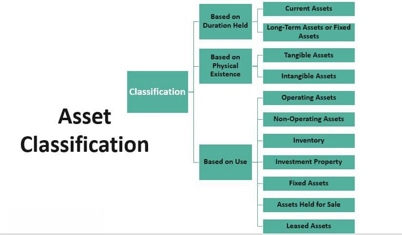

In recent years, algorithmic trading has undergone significant transformation through the integration of machine learning techniques. This evolution has facilitated more precise and adaptive trading strategies in increasingly complex financial markets. Among the array of machine learning tools, classification models have emerged as particularly effective for predicting market movements, offering traders a structured method to assess potential price directions—upward, downward, or stagnant.

Classification models are a subset of predictive modeling employed to categorize data points. In the context of financial markets, these models utilize historical and real-time data to make informed predictions about future price movements. This category includes popular models such as Logistic Regression, Support Vector Machines (SVM), and Random Forests, each leveraging statistical and computational strengths to handle the voluminous and volatile nature of market data efficiently.



This article provides a comprehensive overview of classification models used in algorithmic trading, detailing their implementation and assessing their impact on trading strategies. We will outline the crucial steps involved in developing these models, from data gathering and preparation to training and optimization, to ensure predictive accuracy and robustness. Additionally, we examine the practical application of classification models in real-world trading environments, offering traders insights and knowledge to harness these advanced techniques effectively.

By arming readers with this knowledge, the aim is to enable the practical application of machine learning techniques in trading, enhancing decision-making and adaptability in the face of dynamic market conditions. As these technologies continue to evolve, they promise to further revolutionize algorithmic trading, providing new avenues for innovation and efficiency in financial markets.

## Table of Contents

## Understanding Classification Models

Classification models are integral to predictive modeling, serving the primary function of categorizing data points based on specific attributes. In the context of trading, these models are instrumental in forecasting market directions—whether they will move upward, downward, or remain stagnant. This predictive capability is essential for developing robust trading strategies that can anticipate and respond to market behavior.

Three popular classification models utilized in trading are Logistic Regression, Support Vector Machines (SVM), and Random Forests. Each model offers unique advantages and methodologies for handling financial data, which is typically voluminous and complex.

**Logistic Regression** is a statistical method that models the probability of a binary response based on one or more predictor variables. It’s particularly useful for predicting discrete outcomes, such as determining whether the market will rise or fall. The logistic function is mathematically represented as:

$$
P(y=1|x) = \frac{1}{1 + e^{-(\beta_0 + \beta_1x_1 + \beta_2x_2 + ... + \beta_nx_n)}}
$$

where $P(y=1|x)$ denotes the probability of the market moving in a specified direction, and $x_1, x_2, ..., x_n$ are the input features.

**Support Vector Machines (SVM)** are another classification approach that is especially effective in high-dimensional spaces. SVMs are designed to find the optimal separating hyperplane between different classes by maximizing the margin between the closest data points of each class, known as support vectors. In financial markets, SVMs can classify complex datasets by considering non-linear decision boundaries with the help of kernel functions.

**Random Forests** is an ensemble learning method that builds a multitude of decision trees at training time and outputs the class that is the mode of the classes (classification) of the individual trees. This method excels in handling large datasets with numerous variables, making it suitable for financial markets where data is continuously generated. Random Forests mitigate overfitting — a common problem in classification — by averaging the results from multiple trees.

The ability of these models to process extensive datasets efficiently lends them to financial markets characterized by high data volumes and continuous data streams. As markets generate vast amounts of data daily, classification models must not only be accurate but also computationally efficient to process this information in real-time. This efficiency in handling large datasets ensures that models can maintain their relevance and accuracy even as market conditions evolve.

## Gathering and Preparing Data

Data serves as the foundational element for classification models in [algorithmic trading](/wiki/algorithmic-trading). The quality and accuracy of historical data are paramount in forming reliable predictions about future market movements. Numerous platforms and libraries have emerged to streamline data acquisition, such as 'yfinance' in Python. 'Yfinance' is a popular tool that facilitates the retrieval of historical stock data and [fundamental analysis](/wiki/fundamental-analysis). It allows traders to effortlessly download stock price data, including open, high, low, close, [volume](/wiki/volume-trading-strategy), and adjusted close prices.

Here's an example of how to use 'yfinance' to gather stock data:

```python
import yfinance as yf  # For more datasets, visit: https://paperswithbacktest.com/datasets

# Define the ticker symbol
tickerSymbol = 'AAPL'

# Get data on this ticker
tickerData = yf.Ticker(tickerSymbol)

# Get historical prices for this ticker
tickerDf = tickerData.history(period='1d', start='2010-1-1', end='2022-1-1')

# Display the data
print(tickerDf)
```

After data acquisition, data preprocessing becomes an essential step to ensure the dataset's integrity and suitability for model training. Preprocessing includes several key actions, such as data cleaning, standardization, and feature engineering.

Data cleaning involves handling missing values, removing outliers, and correcting any inconsistencies within the dataset. It is critical because any noise or irrelevant information can significantly affect the model's accuracy.

Standardization refers to the process of normalizing data points to fall within a specific range, typically between 0 and 1 or standardizing scores to have a mean of 0 and a standard deviation of 1. This adjustment is crucial because it ensures that no particular feature disproportionately influences the model due to its scale.

Feature engineering is another crucial component, where new features are created to enhance the predictive power of the model. In algorithmic trading, features often include lagged returns, moving averages, and other technical indicators. For instance, constructing lagged returns can be done as follows:

```python
# Compute log returns
tickerDf['LogReturn'] = (tickerDf['Close'] / tickerDf['Close'].shift(1))

# Create lagged returns
tickerDf['Lag1'] = tickerDf['LogReturn'].shift(1)
tickerDf['Lag2'] = tickerDf['LogReturn'].shift(2)
```

By ensuring rigorous data gathering and preprocessing, traders can significantly improve the performance of classification models, leading to more informed and accurate trading decisions. These steps are pivotal in addressing the market's inherent complexity and variability, providing a robust foundation upon which [machine learning](/wiki/machine-learning) models can be built and tested effectively.

## Developing Classification Models

The development of classification models in algorithmic trading primarily begins with feature selection, which is the process of identifying the most relevant variables that influence price movements. This step is crucial as it determines the basis on which the algorithm will make predictions. Techniques such as correlation analysis, mutual information, and recursive feature elimination can help in selecting the most informative features from the dataset.

Once the features are selected, the next step involves training the models on historical data using popular classification algorithms such as Logistic Regression, Support Vector Machines (SVM), and Random Forests. Each of these models has its strengths. Logistic Regression is beneficial for binary classification problems, such as predicting whether the market will move up or down. SVM is effective in maximizing the margin between data points of different classes, thus enhancing classification accuracy. Random Forests, an ensemble learning method, improves predictive performance by averaging predictions from multiple decision trees, thereby reducing overfitting.

To train a model using Python’s scikit-learn library, example code might look like this:

```python
from sklearn.model_selection import train_test_split
from sklearn.ensemble import RandomForestClassifier
from sklearn.metrics import accuracy_score

# Assuming 'features' and 'target' represent your dataset's features and target variable
X_train, X_test, y_train, y_test = train_test_split(features, target, test_size=0.2, random_state=42)

model = RandomForestClassifier(n_estimators=100, random_state=42)
model.fit(X_train, y_train)

predictions = model.predict(X_test)
print('Accuracy:', accuracy_score(y_test, predictions))
```

A crucial aspect of model development is parameter optimization, which is necessary to enhance predictive accuracy. Techniques such as cross-validation are used to assess the model's performance on different subsets of the data. This not only improves the model's generalizability but also helps in fine-tuning model parameters to avoid overfitting. Cross-validation can be implemented as follows:

```python
from sklearn.model_selection import cross_val_score

# Perform cross-validation
cv_scores = cross_val_score(model, features, target, cv=5)
print('Cross-validation scores:', cv_scores)
print('Mean CV score:', cv_scores.mean())
```

After the models are optimized and trained, they can be used to predict future market directions. This aids traders in making informed trading decisions based on the predicted movements of financial markets. The ability of these classification models to analyze vast amounts of historical data and generate predictions with relatively high accuracy provides a substantial advantage in the fast-paced trading environment.

## Evaluating Model Performance

Evaluating the performance of classification models in algorithmic trading is critical for ensuring their effectiveness in predicting market movements and their subsequent impact on trading strategies. This evaluation encompasses both traditional model accuracy metrics and additional trading-specific factors.

### Model Accuracy Metrics

When assessing predictive power, the main metrics used are precision, recall, and the F1 score. These metrics provide a detailed understanding of the model's performance:

- **Precision** is the ratio of true positive predictions to the total predicted positives. In trading, it indicates how many of the predicted positive market movements (e.g., price increases) were correct.
$$
  \text{Precision} = \frac{\text{True Positives}}{\text{True Positives} + \text{False Positives}}

$$

- **Recall** measures the ability of the model to identify all actual positive instances, i.e., the proportion of true market shifts that were correctly identified by the model.
$$
  \text{Recall} = \frac{\text{True Positives}}{\text{True Positives} + \text{False Negatives}}

$$

- **F1 Score** provides a balance between precision and recall, acting as a single comprehensive metric of predictive quality. It is especially useful in trading where the costs of false positives and false negatives are high.
$$
  \text{F1 Score} = 2 \times \frac{\text{Precision} \times \text{Recall}}{\text{Precision} + \text{Recall}}

$$

### Backtesting Strategies

Backtesting is crucial for assessing the potential success of a trading strategy and involves testing the model on historical data. Utilizing frameworks like Backtrader allows for the simulation of trading strategies over past market data. This process helps identify the strategy's strengths and weaknesses by analyzing how the model would have performed in real historical contexts. Backtesting results can reveal how different market conditions, such as varying [volatility](/wiki/volatility-trading-strategies) or trends, affect the model's performance.

### Trading Costs and Slippage

A comprehensive evaluation must also account for real-world trading considerations like transaction costs and slippage. These factors can significantly affect profitability:

- **Transaction Costs** include broker fees and commissions incurred when buying or selling assets. High-frequency trading strategies, in particular, can see profits eroded by these costs.

- **Slippage** occurs when there is a difference between the expected price of a trade and the actual price. It is often due to market volatility or limited market liquidity.

These elements underscore the importance of conducting thorough, realistic simulations before deploying models in live trading environments. Effective performance evaluation, accounting for these aspects, ensures that classification models not only predict accurately but also result in profitable trading under current market conditions.

## Challenges and Considerations

Common challenges associated with using classification models in algorithmic trading primarily revolve around overfitting and data quality issues. Overfitting occurs when a model learns not only the underlying patterns in the training dataset but also the noise. This leads to a model that performs excellently on historical data but poorly in real-world prediction scenarios. To mitigate overfitting, techniques such as cross-validation, regularization, and pruning (in decision trees) are employed. It's crucial to strike a balance between model complexity and generalization ability, ensuring the model captures the true market signals rather than spurious correlations.

Data quality is another critical concern, as the effectiveness of classification models heavily depends on the accuracy and reliability of the input data. Poor data quality can arise from errors in data acquisition, missing data points, or outdated data that do not reflect current market conditions. Ensuring high data quality involves regular data validation, proper handling of missing values, and applying robust data preprocessing steps to align the data with the model requirements.

Market dynamics are intrinsically volatile and subject to frequent changes due to macroeconomic factors, geopolitical events, and market sentiment, making continuous monitoring and model updates necessary. Models need to be recalibrated regularly to adapt to new market patterns. For instance, concept drift, where the statistical properties of the target variable change over time, necessitates frequent model retraining. 

Balancing model complexity with interpretability is paramount for developing effective trading strategies. While complex models like [deep learning](/wiki/deep-learning) classifiers might offer superior accuracy, they can be black boxes with limited transparency. Interpretability helps traders understand the decision-making process of the model, diagnosing errors and making informed adjustments. Techniques such as feature importance rankings and SHAP (Shapley Additive Explanations) values can offer insights into which inputs are most influential in the model's predictions, assisting in this balance.

Regulatory compliance and ethical considerations are also essential guides in algorithmic trading practices. Trading algorithms must adhere to financial regulations that vary by jurisdiction, which often require algorithms to be transparent and auditable. Furthermore, ethical considerations involve ensuring that trading strategies do not exploit unfair practices, manipulate markets, or contribute to systemic risk. Traders and firms must maintain robust documentation and establish internal controls to ensure compliance and ethical adherence.

Incorporating these considerations into the development and deployment of classification models in trading enhances their effectiveness and reliability while ensuring adherence to regulatory and ethical standards.

## Conclusion

Classification models are pivotal in the field of algorithmic trading due to their capability to predict market movements effectively. Their utility in identifying potential trends allows traders to make strategic decisions that can optimize transaction outcomes. To fully harness the potential of these models, successful implementation hinges on three key aspects: robust data handling, precise model development, and comprehensive performance evaluation.

Robust data handling is foundational, as the quality of input data significantly influences model accuracy. High-quality historical data must be meticulously gathered, cleaned, and processed to form a solid basis for predictive modeling. This involves not only the integration of historical price data but also the engineering of features that capture market dynamics effectively.

The development of classification models requires a careful selection of algorithms and features. Algorithms such as Logistic Regression, Support Vector Machines (SVM), and Random Forests are employed to train models on historical datasets, enabling them to accurately predict future market directions. During the development phase, optimizing model parameters using techniques such as grid search and cross-validation is essential to enhance predictive accuracy.

Evaluating the performance of classification models extends beyond mere accuracy metrics; it necessitates an analysis of actual trading metrics. Metrics like precision, recall, and F1 score reveal the model’s capability to predict market trends with reliability. Additionally, [backtesting](/wiki/backtesting) frameworks, such as Backtrader, provide simulations that assess a strategy's historical performance. Such evaluations should account for transaction costs and slippage to ensure realistic profitability assessments.

Addressing inherent challenges is vital for effective use of classification models in trading. Overfitting, changing market conditions, and data quality issues pose significant hurdles, necessitating continuous model updates and monitoring. Balancing model complexity with interpretability is crucial to develop strategies that are not only effective but also understandable.

Looking ahead, the future of algorithmic trading is promising, with advancements in machine learning poised to revolutionize the trading landscape further. As these technologies evolve, they offer the potential to enhance the predictive power and adaptability of classification models, enabling traders to make increasingly informed and sophisticated decisions in ever-changing market environments.

## References & Further Reading

[1]: Bergstra, J., Bardenet, R., Bengio, Y., & Kégl, B. (2011). ["Algorithms for Hyper-Parameter Optimization."](https://papers.nips.cc/paper/4443-algorithms-for-hyper-parameter-optimization) Advances in Neural Information Processing Systems 24.

[2]: ["Advances in Financial Machine Learning"](https://www.amazon.com/Advances-Financial-Machine-Learning-Marcos/dp/1119482089) by Marcos Lopez de Prado

[3]: ["Evidence-Based Technical Analysis: Applying the Scientific Method and Statistical Inference to Trading Signals"](https://www.amazon.com/Evidence-Based-Technical-Analysis-Scientific-Statistical/dp/0470008741) by David Aronson

[4]: ["Machine Learning for Algorithmic Trading"](https://github.com/stefan-jansen/machine-learning-for-trading) by Stefan Jansen

[5]: ["Quantitative Trading: How to Build Your Own Algorithmic Trading Business"](https://books.google.com/books/about/Quantitative_Trading.html?id=j70yEAAAQBAJ) by Ernest P. Chan