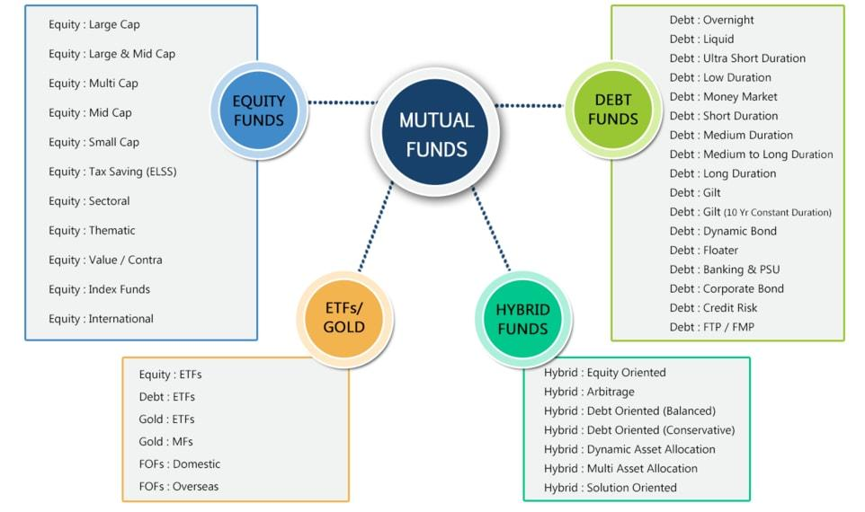

## Table of Contents

## What is a mutual fund?

A mutual fund is a type of investment where many people put their money together to buy a variety of stocks, bonds, or other assets. It's like a big pool of money managed by a professional who decides what to buy and sell. This makes it easier for people who don't have a lot of money or time to invest on their own, because they can own a small part of a big, diverse collection of investments.

When you invest in a mutual fund, you buy shares or units of the fund. The value of your shares goes up or down based on how well the investments in the fund are doing. Mutual funds can be a good way to spread out your risk, since your money is spread across many different investments. They also offer different levels of risk and potential reward, so you can choose a fund that fits your goals and how much risk you're comfortable with.

## How are mutual funds classified as equity securities?

Mutual funds are classified as equity securities because they often invest in stocks, which are a type of equity. When you buy shares of a mutual fund, you're buying into a pool of money that's used to buy stocks of different companies. This means you own a small piece of many companies through the fund. Since stocks represent ownership in a company, and mutual funds hold these stocks, they are considered equity securities.

Not all mutual funds are purely equity securities, though. Some funds mix stocks with bonds or other types of investments. But if a mutual fund mostly holds stocks, it's classified as an equity fund. This classification helps investors know what they're getting into. If you're looking to invest in companies and want to benefit from their growth, an equity mutual fund might be a good choice for you.

## What are the different types of equity mutual funds?

Equity mutual funds come in different types, each with its own way of [picking](/wiki/asset-class-picking) stocks and managing risk. One type is large-cap funds, which invest in big, well-known companies. These companies are usually stable and have a good track record, so large-cap funds are often seen as safer bets. Another type is mid-cap funds, which focus on medium-sized companies. These companies might be growing fast, but they can also be riskier than large-cap companies. Then there are small-cap funds, which invest in smaller companies that could grow a lot but are also more likely to fail.

Another kind of equity mutual fund is sector funds, which only invest in companies from a specific industry, like technology or healthcare. This can be riskier because if that industry does badly, the whole fund might suffer. There are also index funds, which try to match the performance of a stock market index, like the S&P 500. They're often cheaper to own because they don't need a lot of active management. Finally, there are growth and value funds. Growth funds look for companies that are expected to grow quickly, while value funds look for companies that seem underpriced and might be a good deal.

These different types of equity mutual funds let investors pick the one that fits their goals and how much risk they're okay with. If you want to play it safe, you might go for a large-cap or index fund. If you're willing to take more risk for the chance of bigger rewards, you might choose a small-cap, sector, or growth fund. It's all about finding the right balance for you.

## What is the difference between equity and other types of mutual funds?

Equity mutual funds are all about investing in stocks, which means they focus on owning pieces of companies. When you put your money in an equity fund, you're hoping that the companies the fund invests in will do well and grow, making your investment worth more. These funds can be riskier because the stock market can go up and down a lot, but they also have the potential for bigger rewards. There are different kinds of equity funds, like those that invest in big companies, small companies, or companies in a specific industry.

On the other hand, there are other types of mutual funds that don't focus on stocks. For example, bond funds invest in bonds, which are like loans to companies or governments. These are usually safer than stocks but don't grow as much. Money market funds invest in very safe, short-term things like government securities, and they're meant to be very stable but also don't offer much growth. Hybrid funds mix stocks, bonds, and other investments to balance risk and reward. So, while equity funds are all about growth through stocks, other funds might be more about safety or a mix of both growth and safety.

## How do equity mutual funds generate returns for investors?

Equity mutual funds generate returns for investors mainly by investing in stocks of different companies. When these companies do well, their stock prices go up. This means the value of the mutual fund's investments also goes up. If the fund sells some of these stocks at a higher price than it bought them, it makes a profit. This profit is then shared among the investors in the fund, increasing the value of their shares. Sometimes, the companies also pay dividends, which are like little bonuses for owning their stock. The fund collects these dividends and can either reinvest them to buy more stocks or distribute them to the investors.

Another way equity mutual funds generate returns is through capital appreciation. This just means that over time, the stocks the fund owns become more valuable. Even if the fund doesn't sell these stocks, the value of the fund's portfolio goes up. This makes the price of the mutual fund shares go up too. So, if an investor decides to sell their shares in the fund, they can sell them for more than they paid, making a profit. This is why people often hold onto their investments in equity funds for a long time, hoping the value will keep going up.

## What are the risks associated with investing in equity mutual funds?

Investing in equity mutual funds comes with some risks. The biggest one is that the stock market can go up and down a lot. When the market goes down, the value of the stocks in the fund goes down too. This means the value of your investment can drop, and you might lose money if you need to sell your shares when the market is low. This kind of risk is called market risk, and it's something all investors in equity funds need to be ready for.

Another risk is that the fund manager might not pick the best stocks. Even if the overall market is doing okay, if the stocks in the fund don't do well, the fund won't do well either. This is called management risk. Also, if you put all your money into one type of equity fund, like a sector fund, and that sector does badly, your whole investment could suffer. This is called concentration risk. It's a good idea to spread your money across different types of investments to lower this risk.

Overall, while equity mutual funds can offer good returns, they also come with the chance of losing money. It's important to think about how much risk you're okay with and maybe talk to a financial advisor before you decide to invest.

## How does the performance of equity mutual funds compare to other investment options?

Equity mutual funds often have the chance to grow more than other types of investments like bonds or savings accounts. This is because they invest in stocks, which can go up a lot in value if the companies do well. Over long periods, like many years, equity funds have usually done better than other investments. But, they can also go down a lot if the stock market has a bad time. So, they can be riskier but also have the potential for bigger rewards.

Compared to other investment options, like real estate or gold, equity mutual funds are easier to buy and sell. You don't need a lot of money to start, and you can get out of your investment quickly if you need to. Real estate and gold can be harder to turn into cash fast. Also, equity funds let you spread your money across many different companies, which can lower your risk. But, real estate can give you a place to live or rent out, and gold can be a safe place to keep your money if the stock market crashes.

In the end, how well equity mutual funds do compared to other investments depends on what you're looking for. If you want something that can grow a lot over time and you're okay with some risk, equity funds might be good. But if you want something safer or something you can use in other ways, like living in a house or wearing gold jewelry, you might choose something else. It's all about finding the right balance for your goals and how much risk you're comfortable with.

## What are the tax implications of investing in equity mutual funds?

When you invest in equity mutual funds, you need to think about taxes. If you make money from your investment, you might have to pay capital gains tax. This tax depends on how long you held onto your investment before selling it. If you sell your shares within a year, it's called a short-term capital gain, and you'll pay tax on that gain at your regular income tax rate, which can be pretty high. But if you hold onto your shares for more than a year before selling, it's a long-term capital gain, and the tax rate is usually lower, which can save you money.

Another tax thing to know about is dividends. Sometimes, the companies in the mutual fund pay out dividends, and the fund might pass those dividends on to you. These dividends are usually taxed as regular income, but there's a special rule that can help. If the dividends are "qualified," they might be taxed at the lower long-term capital gains rate instead. It's a good idea to talk to a tax advisor to understand how these taxes will affect your investment in equity mutual funds, so you can plan better and maybe save some money on taxes.

## How can investors evaluate the performance of an equity mutual fund?

Investors can evaluate the performance of an equity mutual fund by looking at its returns over time. They should check how the fund has done over different periods, like one year, three years, and five years. This helps them see if the fund has been doing well consistently or if it's had ups and downs. They can also compare the fund's returns to a benchmark, like the S&P 500, to see if it's doing better or worse than the overall market. Another important thing to look at is the fund's expense ratio, which is how much it costs to run the fund. A lower expense ratio means more of the fund's returns go to the investor, not to fees.

Another way to evaluate a mutual fund's performance is by looking at its risk. Investors can use a measure called the standard deviation to see how much the fund's returns have varied over time. A higher standard deviation means the fund's returns have been more unpredictable, which means more risk. They can also look at the fund's beta, which shows how much the fund moves with the market. A beta higher than 1 means the fund is more volatile than the market, while a beta lower than 1 means it's less volatile. By understanding both the returns and the risk, investors can decide if a fund fits their goals and how much risk they're okay with.

## What role do equity mutual funds play in a diversified investment portfolio?

Equity mutual funds are a big part of a diversified investment portfolio because they help spread your money across many different companies. When you invest in an equity fund, you're not just betting on one company to do well. Instead, you're betting on a whole bunch of them. This can lower your risk because if one company does badly, the others might still do well, and that can balance things out. It's like not putting all your eggs in one basket.

Besides spreading out your risk, equity mutual funds can also help your money grow over time. Stocks can go up a lot in value, and because equity funds invest in stocks, they have the chance to give you bigger returns than safer investments like bonds or savings accounts. By including equity mutual funds in your portfolio, you're giving yourself the chance to grow your money more, while still keeping things balanced with other types of investments. This way, you can aim for good growth but also have some safety.

## How do regulatory frameworks affect the classification and operation of equity mutual funds?

Regulatory frameworks play a big role in how equity mutual funds are classified and how they work. In the United States, for example, the Securities and Exchange Commission (SEC) sets rules that mutual funds have to follow. These rules say what a mutual fund can call itself and what it has to tell investors. For instance, if a fund wants to be called an equity fund, it has to invest mostly in stocks. The rules also make sure that funds are honest about how much risk they have and how they've done in the past. This helps investors make smart choices and keeps the market fair.

These regulations also affect how mutual funds operate day-to-day. Funds have to follow strict rules about what they can buy and sell, how they handle money, and how they report things to investors and the government. For example, they have to tell investors about any big changes in what they're investing in, and they have to make sure they're not taking too much risk. All these rules help protect investors and make sure that mutual funds are run in a way that's safe and clear.

## What advanced strategies can be used to optimize returns from equity mutual funds?

One advanced strategy to optimize returns from equity mutual funds is to use dollar-cost averaging. This means you put a fixed amount of money into the fund at regular times, like every month. By doing this, you buy more shares when the price is low and fewer shares when the price is high. Over time, this can help you pay less on average for your shares and get better returns. Another strategy is to rebalance your portfolio. This means you check your investments every so often and make sure you're still happy with how much you have in stocks, bonds, and other things. If one part of your portfolio has grown a lot, you might sell some of it and buy more of something else to keep things balanced. This can help you take some profits and maybe lower your risk.

Another way to optimize returns is to use tax-efficient strategies. For example, you can hold onto your equity mutual fund shares for more than a year to get the lower long-term capital gains tax rate. You can also put your equity funds in a tax-advantaged account like an IRA or 401(k), which can help you save on taxes. Finally, consider using a strategy called sector rotation. This means you try to guess which parts of the economy will do well at different times and move your money into funds that invest in those sectors. For example, if you think technology will do well next year, you might put more money into a tech sector fund. This can be riskier, but it can also help you get better returns if you guess right.

## What are Mutual Funds: Collective Investment Vehicles?

Mutual funds are collective investment vehicles that consolidate capital from multiple investors to acquire a wide array of securities. This pooling strategy not only diversifies the investment but also reduces risk for individual investors. By spreading investments across various asset classes, mutual funds help in mitigating the impact of adverse price movements in any single asset, thereby enhancing risk-adjusted returns.

Functionally, mutual funds are managed by professional portfolio managers who decide on asset selection and allocation. These managers are guided by the fund's investment objective, documented in the fund's prospectus. There are different types of mutual funds based on the securities they invest in, including equity funds, fixed-income funds, and balanced funds. Equity mutual funds primarily invest in stocks, fixed-income funds concentrate on bonds, while balanced funds aim for a mixture of both to achieve specific risk-return objectives.

The primary benefits of mutual funds include diversification, professional management, [liquidity](/wiki/liquidity-risk-premium), and convenience. Diversification reduces the non-systemic risk associated with individual securities. The expertise of fund managers provides access to informed investment decisions that individual investors might find difficult to replicate on their own. Additionally, mutual funds offer liquidity as they can be easily bought and sold, typically at the end of the trading day, unlike individual securities, which can have less liquidity. The convenience is further enhanced by the ease of portfolio management since investors need not choose individual securities.

However, mutual funds also come with drawbacks, such as management fees or expense ratios that can diminish returns over time. Moreover, investors in mutual funds are subjected to market risk, where the value of the entire portfolio can decline. It is crucial for investors to analyze these fees against the potential returns when selecting mutual funds.

Misconceptions often arise regarding mutual funds as equity securities. While equity mutual funds comprise stocks and can be classified accordingly, they are fundamentally different from holding direct equity stakes in companies. Equity funds offer a slice of a diversified portfolio, whereas owning individual stocks involves direct exposure to the issuing entity's performance.

To illustrate mutual fund evaluation, [statistics](/wiki/bayesian-statistics) can be applied as follows. Consider a mutual fund's return represented as $R_i$, and the market return as $R_m$. The alpha ($\alpha$) of the fund, which measures performance relative to the expected return, can be calculated using a formula derived from the Capital Asset Pricing Model (CAPM):

$$
\alpha = R_i - [R_f + \beta(R_m - R_f)]
$$

where $R_f$ is the risk-free rate, and $\beta$ is the fund's sensitivity to market movements.

Overall, mutual funds serve as a critical investment avenue offering diversification and professional management, yet they demand careful consideration of their inherent costs and alignment with investors' financial goals.

## References & Further Reading

#