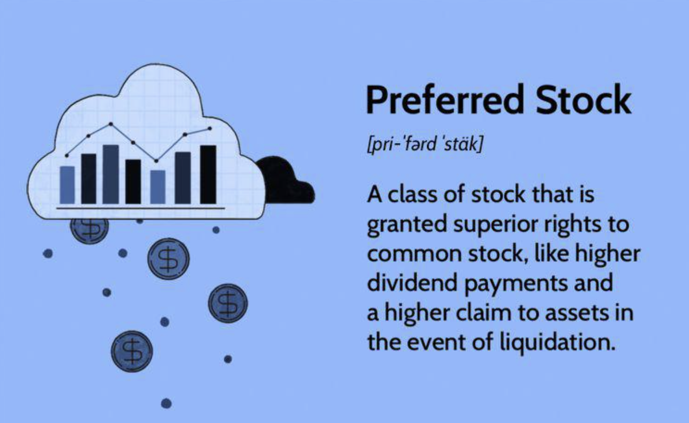

## Table of Contents

## What is preferred stock?

Preferred stock is a type of stock that companies issue to investors. It is different from common stock because it usually gives the investor some special benefits. One big benefit is that preferred stockholders get paid dividends before common stockholders. Dividends are like a share of the company's profits that it pays out to its investors. If a company can't pay all its dividends, the preferred stockholders get their dividends first.

Another feature of preferred stock is that it often has a fixed dividend rate. This means that the amount of dividends paid to preferred stockholders stays the same, even if the company's profits go up or down. This can make preferred stock a safer investment than common stock, because the investor knows how much they will get paid in dividends. However, preferred stockholders usually don't get to vote on company matters like common stockholders do. So, they have less say in how the company is run.

## How does preferred stock differ from common stock?

Preferred stock and common stock are two types of stocks that companies can issue to investors. The main difference between them is how they pay dividends. Preferred stockholders get their dividends before common stockholders. If a company can't pay all its dividends, the preferred stockholders are paid first. This makes preferred stock a bit safer because the investor knows they will get paid before others. On the other hand, common stockholders might not get any dividends if the company is struggling.

Another difference is that preferred stock often has a fixed dividend rate. This means the amount of dividends paid to preferred stockholders stays the same, no matter how well the company is doing. Common stockholders, however, usually get dividends that can change based on the company's profits. This can make common stock riskier but also potentially more rewarding if the company does well. Also, preferred stockholders usually don't get to vote on company decisions, while common stockholders often do. So, common stockholders have more say in how the company is run.

## What are the basic characteristics of preferred stock?

Preferred stock is a type of stock that companies give to investors. It has some special features that make it different from common stock. One key feature is that preferred stockholders get paid dividends before common stockholders. Dividends are like a share of the company's profits that it gives to its investors. If the company can't pay all its dividends, preferred stockholders get their money first. This makes preferred stock a bit safer because investors know they will get paid before others.

Another important characteristic of preferred stock is that it usually has a fixed dividend rate. This means the amount of dividends paid to preferred stockholders stays the same, even if the company's profits go up or down. This can make preferred stock a safer investment than common stock, because the investor knows how much they will get paid in dividends. However, preferred stockholders usually don't get to vote on company decisions like common stockholders do. So, they have less say in how the company is run.

## What determines whether preferred stock is classified as equity or a fixed-income security?

Preferred stock can be classified as either equity or a fixed-income security depending on its features. When it is considered equity, it is because it represents ownership in the company, just like common stock. Even though preferred stockholders usually don't get to vote on company decisions, they still own a part of the company. This is why it's seen as equity.

However, preferred stock can also be seen as a fixed-income security because it often pays a fixed dividend, similar to how bonds pay interest. If the preferred stock has a fixed dividend rate and the company must pay this dividend before paying dividends to common stockholders, it acts more like a bond. This makes it more like a fixed-income security, where the investor expects a regular, predictable income.

## What are the advantages of classifying preferred stock as equity?

Classifying preferred stock as equity means it's seen as part of the company's ownership. This can be good for the company because it doesn't have to pay back the money like a loan. Instead, the company can use the money to grow its business without the pressure of making regular payments. This can be a big help for a company that needs money to expand but doesn't want to take on more debt.

For investors, classifying preferred stock as equity can be attractive because it shows they have a stake in the company. Even though they might not get to vote on company decisions, they still own a part of it. This can make them feel more connected to the company's success. Plus, if the company does well, the value of their preferred stock could go up, giving them a chance to make more money in the long run.

## What are the advantages of classifying preferred stock as a fixed-income security?

Classifying preferred stock as a fixed-income security means it acts a lot like a bond. This can be good for investors who want a steady income. Preferred stock usually pays a fixed dividend, which is like the interest you get from a bond. This means investors know exactly how much money they will get, and when. It's like getting a regular paycheck from the company, which can be comforting, especially for people who don't like surprises with their money.

For the company, classifying preferred stock as a fixed-income security can help them plan their finances better. They know exactly how much they need to pay in dividends, so they can budget for it. This can be easier than dealing with variable dividends that might change based on how well the company is doing. It's like having a set bill each month, which can make managing the company's money simpler and more predictable.

## How do dividends on preferred stock affect its classification?

Dividends on preferred stock can help decide if it should be seen as equity or a fixed-income security. If the preferred stock pays a fixed dividend, it acts a lot like a bond. This means investors get a regular, predictable amount of money, just like interest from a bond. When preferred stock works this way, it is often classified as a fixed-income security. Investors like this because it gives them a steady income, and the company can plan its finances better knowing exactly how much it needs to pay.

On the other hand, if the preferred stock is seen more as a part of the company's ownership, it is classified as equity. Even though preferred stockholders usually don't get to vote on company decisions, they still own a piece of the company. This means they might benefit if the company does well and the value of their stock goes up. For the company, treating preferred stock as equity means they don't have to pay it back like a loan, which can be good for growing the business without adding more debt.

## What role does the redemption feature play in the classification of preferred stock?

The redemption feature of preferred stock means the company can buy back the stock from investors at a set price after a certain time. This feature can make preferred stock look more like a bond, which is a fixed-income security. When a company can redeem the stock, it's like they are promising to pay back the investor's money, just like they would with a bond. This makes investors feel safer because they know they can get their money back. So, if preferred stock has a redemption feature, it's often seen as a fixed-income security.

However, if the redemption feature is not used often or is set far in the future, the preferred stock might still be seen as equity. This is because the main thing that makes it equity is that it represents ownership in the company. Even with a redemption feature, if the company doesn't plan to use it soon, investors might still think of it as owning a part of the company. So, the redemption feature can change how preferred stock is classified, depending on how and when it's used.

## How do convertible features impact the classification of preferred stock?

Convertible features on preferred stock let investors trade their preferred stock for common stock at a set price. This can make preferred stock seem more like equity because it gives investors a chance to own a bigger part of the company. If investors think they might convert their stock, they might see it more as a way to own the company, not just get fixed dividends. This makes it more like common stock, which is definitely equity.

But, the convertible feature doesn't always mean the preferred stock is seen as equity right away. If the conversion price is high or the time to convert is far in the future, investors might still think of the preferred stock as a fixed-income security. They might focus more on the fixed dividends they get now, not the possibility of converting later. So, whether the convertible feature makes preferred stock seem more like equity or a fixed-income security depends on how likely investors think they will use it.

## What are the accounting and tax implications of classifying preferred stock as equity versus fixed-income?

When preferred stock is classified as equity, it is treated as part of the company's ownership. This means the company doesn't have to pay back the money like a loan, which can be good for the company's financial health. On the tax side, dividends paid on preferred stock classified as equity are usually not tax-deductible for the company. For investors, these dividends are often taxed at a lower rate than regular income, which can be a plus. In accounting, preferred stock as equity appears on the balance sheet under shareholders' equity, showing it as part of the company's net worth.

On the other hand, if preferred stock is classified as a fixed-income security, it acts more like a bond. This means the company has to pay fixed dividends, similar to interest on a bond. These fixed dividends can be tax-deductible for the company, which can help lower its tax bill. For investors, these dividends might be taxed as regular income, which could be at a higher rate. In accounting, preferred stock as a fixed-income security might be shown as a liability on the balance sheet, reflecting the company's obligation to pay those fixed dividends.

## How do regulatory frameworks influence the classification of preferred stock?

Regulatory frameworks can greatly affect how preferred stock is classified. Different countries and financial bodies have their own rules about what makes preferred stock equity or a fixed-income security. For example, some regulators might say that if preferred stock has a fixed dividend, it should be treated as a fixed-income security because it's like a bond. Other regulators might focus more on whether the stock can be redeemed or converted into common stock, and this could lead them to see it as equity.

These rules are important because they guide how companies report their finances and how investors understand their investments. If a regulator says preferred stock should be classified as equity, the company will show it on their balance sheet as part of their ownership, and dividends won't be tax-deductible. But if it's classified as a fixed-income security, it might be shown as a liability, and the company could get a tax break on the dividends they pay. So, the way regulators see preferred stock can change how both companies and investors handle it.

## What are the strategic considerations for a company in deciding how to classify its preferred stock?

When a company decides how to classify its preferred stock, it thinks about what's best for its finances and growth. If it classifies the stock as equity, the company doesn't have to pay it back like a loan. This can help the company use the money to grow without worrying about regular payments. But, the company can't deduct the dividends it pays on this stock from its taxes, which might not be as good for its tax bill. On the other hand, classifying the stock as a fixed-income security means the company has to pay fixed dividends, but it can deduct those payments from its taxes. This can help lower the company's tax bill, but it also means the company has a set amount of money it has to pay out regularly, which can affect its cash flow.

The company also thinks about what investors want. If investors are looking for a steady income, they might like the stock better if it's classified as a fixed-income security because they get regular, fixed dividends. But if investors are more interested in owning a part of the company and possibly making more money if the company does well, they might prefer it to be classified as equity. The company needs to balance these investor preferences with its own financial needs to decide how to classify its preferred stock. This decision can affect how easy it is to attract investors and how the company can use the money it gets from them.

## References & Further Reading

- **“The Handbook of Fixed Income Securities, Chapter on Preferred Stock” by Frank J. Fabozzi**  
  This comprehensive guide explores the intersection of fixed-income securities and equity, with a detailed examination of preferred stocks. It provides insights on their unique characteristics, features, and role within diversified portfolios.

- **“Guide to Preferred Stock” by Joseph Meyer**  
  Joseph Meyer offers a thorough exploration of preferred stocks, discussing their prioritization for dividends over common stock and the implications of their fixed-income-like dividends. The guide benefits investors seeking a balanced approach between equity and fixed-income investments.

- **“Advances in Financial Machine Learning” by Marcos Lopez de Prado**  
  This book focuses on the application of [machine learning](/wiki/machine-learning) in finance, presenting techniques that are transforming [algorithmic trading](/wiki/algorithmic-trading). It emphasizes the importance of data analysis and algorithm development in optimizing investment strategies, particularly in markets that include fixed-income securities and equities.

- **“Quantitative Trading: How to Build Your Own Algorithmic Trading Business” by Ernest P. Chan**  
  Ernest P. Chan offers practical insights into the world of algorithmic trading. By detailing the development and deployment of trading algorithms, this book serves as a guide for leveraging technology to enhance trading efficiency and exploit market opportunities.

- **“Machine Learning for Algorithmic Trading” by Stefan Jansen**  
  This work investigates into the implementation of machine learning techniques for developing robust and adaptive trading strategies. Stefan Jansen covers concepts such as data-driven trading, automation, and performance improvement, crucial for integrating algorithmic trading within financial markets.

These references provide additional context and depth for investors and financial professionals interested in preferred stocks, fixed-income securities, and the transformative role of algorithmic trading strategies.

