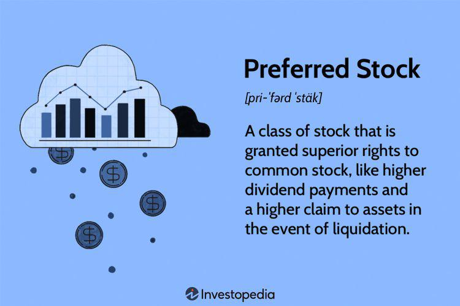

In finance, investors are continuously searching for strategies that optimize the balance between risk and return, while also remaining adaptive to the inevitable fluctuations of the market. A sophisticated portfolio typically integrates a range of financial instruments, among which fixed-income securities, equities, and algorithmic trading are vital components. This article focuses on the interesting combination of fixed-income securities and equity, specifically preferred stocks, alongside algorithmic trading to enhance investment outcomes.

Preferred stocks represent a unique investment vehicle that merges characteristics from both equity and fixed-income securities. They offer investors a fixed dividend, akin to the regular interest payments from bonds, yet maintain an equity position in the company's capital structure. This dual nature enables investors to enjoy the relative safety of fixed income and the potential for appreciation common to equities. Understanding the blurred lines between these financial instruments and their individual benefits requires a rigorous examination of their structure and payout mechanisms.

Algorithmic trading plays a crucial role in maximizing the returns from these investment instruments. By leveraging advanced mathematical models and automated systems, algorithmic trading enhances both the efficiency and precision of investment strategies. Algorithms can process vast amounts of data and execute trades at speeds unreachable by human traders, thus exploiting market inefficiencies. Incorporating algorithmic trading into investment strategies for fixed-income securities and preferred stocks can mitigate risk and boost potential returns by capturing short-lived arbitrage opportunities in volatile markets.

Our aim is to equip investors with the essential knowledge and strategies needed to traverse this complex financial landscape effectively. By integrating these advanced trading technologies with a diverse mix of financial instruments, investors can construct resilient portfolios that are well-poised to weather market volatility while aligning with their specific financial objectives.

## Table of Contents

## Understanding Fixed-Income Securities

Fixed-income securities provide investors with a reliable stream of income, primarily through predetermined interest or dividend payments. These financial instruments commonly include bonds and preferred stocks. They are crucial for conservative investors who prioritize stable income and minimized risk exposure, often favoring a fixed coupon rate and defined maturity date—key characteristics that ensure consistent returns and principal repayment at maturity.

**Types of Fixed-Income Securities**

1. **Government Bonds**: Issued by national governments, these bonds are typically considered low-risk due to the backing of the government's taxing power. Examples include U.S. Treasury bonds, which are often benchmarks for interest rates due to their perceived safety.

2. **Corporate Bonds**: Issued by companies to raise capital, these bonds usually offer higher yields than government bonds to compensate for increased default risk. Credit ratings by agencies like Moody’s or S&P assess the issuer's creditworthiness, influencing the bond's interest rate and price.

3. **Municipal Bonds**: These are issued by local governments or municipalities to fund public projects. They often offer tax advantages, as the interest may be exempt from federal income taxes and sometimes from state and local taxes, depending on the investor's residency.

**Dynamics of Fixed-Income Markets**

Understanding market dynamics is crucial for effective management of fixed-income investments. Interest rate movements significantly impact bond prices; as rates rise, existing bond prices typically fall, and vice versa. This inverse relationship is due to the fixed nature of the bond's coupon rate versus the changing yield of newly issued bonds.

Credit risk, the possibility that an issuer will default on payments, must also be considered. This risk is counterbalanced by the bond's yield premium over less risky securities. Analyzing credit spreads—the difference in yield between a corporate bond and a government bond of similar maturity—can provide insights into the market’s perception of an issuer's credit risk.

In conclusion, by comprehensively understanding the features and types of fixed-income securities, as well as the factors influencing their pricing and risk, investors can strategically incorporate these instruments into a diversified portfolio to achieve a balanced mix of income and stability.

## Exploring Equity in Preferred Stocks

Preferred stocks stand out as a hybrid financial instrument, distinctively blending characteristics of both equity and fixed-income securities. They offer fixed dividends similar to bond interest payments, thus serving as a reliable income source. This characteristic makes them particularly appealing to investors focused on consistent income. Unlike common stocks, preferred stocks provide a priority claim on dividends, assuring investors of dividend payments before any are distributed to common stockholders. However, this priority often comes at the expense of voting rights, a key differential from common equities where shareholders typically have voting privileges.

Preferred stocks exhibit several unique features that enhance their versatility as financial instruments. Firstly, their fixed dividends are central to their appeal, offering predictability akin to interest returns on bonds. Callability is another feature where the issuing company reserves the right to repurchase the stocks at a predetermined price after a specified date. This allows issuers to manage their capital structure efficiently, particularly in declining [interest rate](/wiki/interest-rate-trading-strategies) environments. Conversion privileges further add to their appeal, permitting holders to convert preferred shares into a predetermined number of common shares under specific conditions, giving investors a chance to benefit from potential capital appreciation.

Different types of preferred stocks cater to varying strategic priorities of investors. Cumulative preferred stocks ensure that any missed dividend payments are accumulated and paid out before common stock dividends, reassuring investors of eventual payment even if the company faces temporary cash flow challenges. Non-cumulative preferred stocks do not offer this benefit, meaning missed dividends do not accumulate and are therefore permanently forfeited. Convertible preferred stocks present a strategic opportunity with their conversion feature, potentially offering capital gains if the market value of common shares rises significantly.

Overall, the strategic implications of preferred stocks are numerous, providing investors with options to secure income, enhance potential returns, and manage risk within their portfolios. Understanding these dynamics enables investors to tailor preferred stock investments to align with their financial objectives effectively.

## Algorithmic Trading: Enhancing Financial Strategies

Algorithmic trading represents a significant advancement in the field of investment strategies, leveraging the power of complex mathematical models and automated systems. These tools enhance both efficiency and precision in executing trades, which is increasingly vital in today's fast-paced financial markets. In the context of preferred stocks and fixed-income securities, [algorithmic trading](/wiki/algorithmic-trading) offers the ability to capitalize on market inefficiencies, thereby potentially increasing returns.

One of the primary advantages of algorithmic trading is its ability to process and analyze large volumes of market data in real-time. This capacity to handle vast datasets enables the optimization of buy and sell decisions, crucial for navigating the inherent [volatility](/wiki/volatility-trading-strategies) of financial markets. For example, algorithms can monitor price movements and execute trades in milliseconds, reacting faster than any human trader possibly could.

Several algorithmic trading strategies are particularly relevant to fixed-income and preferred stock markets. Yield curve [arbitrage](/wiki/arbitrage) is one such strategy, which involves exploiting inefficiencies in the yield curve to generate profit. The yield curve, a graphical representation of interest rates across different maturities, can at times depict discrepancies that are not in line with economic fundamentals. By leveraging algorithms, traders can identify and take advantage of these discrepancies quicker than manual analysis would allow.

Statistical arbitrage is another strategy employed in algorithmic trading, relying on statistical methods to identify mispriced securities. In the case of fixed-income securities and preferred stocks, statistical models can be used to predict price movements based on historical data and market anomalies. This approach benefits significantly from automation, as the rapid identification of trading opportunities is key to the success of this strategy.

Integrating algorithmic trading into broader investment strategies provides unique benefits that are difficult to achieve through manual trading alone. The scalability of algorithmic systems allows for the execution of numerous trading strategies across different markets and asset classes simultaneously. Moreover, the diversification opportunities are enhanced, as algorithms can manage and execute a broader set of strategies without the need for extensive human intervention.

In summary, algorithmic trading represents a crucial evolution in financial strategies, particularly within the domains of fixed-income securities and preferred stocks. By harnessing sophisticated mathematical models and real-time data processing capabilities, algorithmic trading enhances the potential for improved returns, offering efficiency, scalability, and diversification. This technology-driven approach empowers investors to effectively manage and optimize their investment portfolios in a dynamic market environment.

## Advantages and Risks of Combining These Financial Instruments

The integration of fixed-income securities, preferred stocks, and algorithmic trading offers a blend of stability, income, and trading efficiency that appeals to a range of investors. This combination, however, comes with its own set of benefits and challenges that need careful consideration.

One of the primary advantages is the ability to achieve a steady income stream. Fixed-income securities and preferred stocks provide regular interest or dividend payments. Preferred stocks, in particular, have a priority claim on dividends over common stock, which can add a layer of predictability to income-focused investment strategies. The fixed dividend of preferred stocks can be particularly attractive during periods of low interest rates, as they often offer higher yields than traditional bonds.

Algorithmic trading further enhances this setup by increasing the efficiency of trading operations. By automating the buying and selling processes, algorithmic systems can capitalize on market inefficiencies and execute trades at optimal prices, potentially increasing overall returns. Algorithms can swiftly process vast data arrays, allowing for real-time adjustments to market fluctuations, which can be particularly beneficial in volatile markets.

Despite these benefits, several risks must be addressed. Interest rate sensitivity is a principal concern. As interest rates rise, the value of fixed-income securities and preferred stocks can decrease, impacting both income and capital value. Additionally, credit risk—the risk that an issuer will default on payments—remains a significant [factor](/wiki/factor-investing), especially for corporate bonds or preferred stocks from financially unstable companies.

Preferred stocks, while providing steady income, generally offer limited capital appreciation potential. This limitation might not suit investors looking for growth as a function of equity investment. Their hybrid nature means they do not fully benefit from the prosperity of the issuing company's common stock. 

Algorithmic trading, while offering a strategic edge through adaptability to market conditions, requires sophisticated infrastructure and expertise. Continuous monitoring and regular recalibration of trading algorithms are imperative to maintain performance and manage potential costly errors from model misbehavior or technical failures.

In summary, combining these financial instruments can offer a balanced investment approach when aligned with an investor's risk tolerance and income goals. However, thorough understanding and management of the inherent risks are crucial to leveraging their potential benefits fully. Adjustments to strategies must be periodically made to address changing market conditions and the evolving financial landscape.

## Conclusion

Fixed-income securities, preferred stocks, and algorithmic trading each represent distinct facets of an investment strategy, offering a combination of stability, income potential, and enhanced trading efficiency. Understanding the nuanced characteristics of each component is critical for investors aiming to optimize returns while effectively managing associated risks.

Fixed-income securities, such as bonds, provide a predictable income stream, making them appealing to risk-averse investors. The fixed interest payments and maturity dates offer certainty, although they are sensitive to interest rate fluctuations and credit risks. In contrast, preferred stocks, while possessing some fixed-income features, present equity characteristics like dividends that take precedence over common stock. Their lack of voting rights and limited capital appreciation potential require careful consideration within an equity allocation.

Algorithmic trading, employing sophisticated models, enhances the precision and timing of trade executions. It capitalizes on market inefficiencies and processes vast quantities of data to optimize investment decisions. Integrating algorithmic strategies with these financial instruments adds scalability and diversification that manual approaches cannot rival, but it necessitates continuous monitoring and adjustment to market dynamics.

By strategically combining these financial instruments, investors can construct balanced portfolios aligning with their financial goals. The integration of algorithms with the stability of fixed-income features empowers investors to efficiently navigate the complexities and volatility of today's financial markets. Thus, informed decision-making and the ability to adapt continuously are paramount to succeeding with these hybrid strategies.

## References & Further Reading

- **“The Handbook of Fixed Income Securities, Chapter on Preferred Stock” by Frank J. Fabozzi**  
  This comprehensive guide explores the intersection of fixed-income securities and equity, with a detailed examination of preferred stocks. It provides insights on their unique characteristics, features, and role within diversified portfolios.

- **“Guide to Preferred Stock” by Joseph Meyer**  
  Joseph Meyer offers a thorough exploration of preferred stocks, discussing their prioritization for dividends over common stock and the implications of their fixed-income-like dividends. The guide benefits investors seeking a balanced approach between equity and fixed-income investments.

- **“Advances in Financial Machine Learning” by Marcos Lopez de Prado**  
  This book focuses on the application of [machine learning](/wiki/machine-learning) in finance, presenting techniques that are transforming algorithmic trading. It emphasizes the importance of data analysis and algorithm development in optimizing investment strategies, particularly in markets that include fixed-income securities and equities.

- **“Quantitative Trading: How to Build Your Own Algorithmic Trading Business” by Ernest P. Chan**  
  Ernest P. Chan offers practical insights into the world of algorithmic trading. By detailing the development and deployment of trading algorithms, this book serves as a guide for leveraging technology to enhance trading efficiency and exploit market opportunities.

- **“Machine Learning for Algorithmic Trading” by Stefan Jansen**  
  This work investigates into the implementation of machine learning techniques for developing robust and adaptive trading strategies. Stefan Jansen covers concepts such as data-driven trading, automation, and performance improvement, crucial for integrating algorithmic trading within financial markets.

These references provide additional context and depth for investors and financial professionals interested in preferred stocks, fixed-income securities, and the transformative role of algorithmic trading strategies.