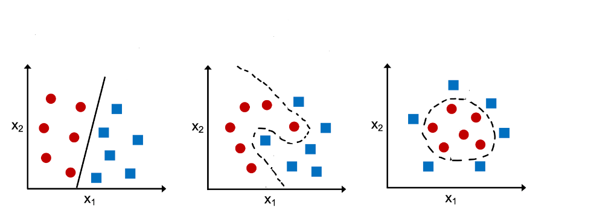

## Table of Contents

## What is a classification problem in machine learning?

A classification problem in machine learning is when you want a computer to sort things into different groups. Imagine you have a bunch of fruits, and you want to tell if each one is an apple, a banana, or an orange. The computer looks at the features of each fruit, like its color and shape, and then decides which group it belongs to.

To solve a classification problem, you give the computer examples to learn from. These examples are called training data. For instance, you show the computer many pictures of apples, bananas, and oranges, and tell it which is which. The computer then uses this information to make rules about how to classify new fruits it hasn't seen before. The goal is for the computer to get good at sorting new fruits correctly, even if they are a bit different from the ones it has seen before.

## Can you provide examples of real-world classification problems?

One real-world classification problem is email spam detection. When you get an email, the computer looks at things like the sender, the words used, and any links to decide if it's spam or not. It's like sorting your mail into two piles: one for important messages and another for junk mail. The computer learns from examples of emails that are already labeled as spam or not spam, and then it tries to correctly sort new emails as they come in.

Another example is medical diagnosis. Doctors use classification to figure out if a patient has a certain disease or not. They look at symptoms, test results, and other information to make a decision. For instance, a computer might help diagnose whether a person has diabetes by looking at their blood sugar levels, age, and other factors. The computer learns from past cases where the diagnosis is already known and then tries to classify new patients correctly.

Credit card fraud detection is also a common classification problem. When you use your credit card, the bank's computer checks if the transaction looks normal or if it might be fraudulent. It looks at things like the location of the purchase, the amount, and how you usually spend money. The computer uses examples of past transactions labeled as fraud or not fraud to learn how to spot suspicious activity and protect your card from being misused.

## What are the main types of classification algorithms?

There are several types of classification algorithms, and they each work a bit differently. One common type is the logistic regression algorithm. It's like trying to find a line that separates two groups as best as possible. It's good for problems where you want to predict if something will happen or not, like if it will rain today or not. Another type is the decision tree algorithm. It's like playing a game of 20 questions where you keep asking yes or no questions until you figure out what something is. It's easy to understand and works well for many kinds of problems.

Another important type of classification algorithm is the k-nearest neighbors (k-NN) algorithm. It's like looking at your neighbors to decide what group you belong to. If most of your neighbors are in one group, you're probably in that group too. It's simple but can be slow if you have a lot of data. Then there's the support vector machine (SVM) algorithm. It's like trying to find the best way to draw a line that separates two groups with the widest gap possible. It's good for problems where the groups are hard to separate.

Lastly, there are more advanced algorithms like neural networks. They're like a brain made of math that can learn really complex patterns. They're used a lot in things like recognizing pictures or understanding speech. Each of these algorithms has its own strengths and weaknesses, so choosing the right one depends on your specific problem and the data you have.

## How does binary classification differ from multi-class classification?

Binary classification is when you're sorting things into just two groups. Imagine you're sorting emails into spam or not spam. The computer looks at the emails and decides which pile they go into. It's like flipping a coin, where you only have two choices: heads or tails. In binary classification, the computer learns from examples to make a yes or no decision, like deciding if a picture shows a cat or not a cat.

Multi-class classification is when you're sorting things into more than two groups. Think about sorting fruits into apples, bananas, and oranges. The computer has to look at the fruits and decide which of the three groups each one belongs to. It's like [picking](/wiki/asset-class-picking) from multiple choices on a test, not just true or false. In multi-class classification, the computer learns from examples to make a choice among several options, like deciding if a picture shows an apple, a banana, or an orange.

## What is the importance of choosing the right classification algorithm?

Choosing the right classification algorithm is important because it can make a big difference in how well your computer sorts things into groups. If you pick the wrong algorithm, the computer might make a lot of mistakes. For example, if you're trying to tell if an email is spam or not, using a simple algorithm might not catch all the tricky spam emails. But if you use a more complex algorithm like a [neural network](/wiki/neural-network), it might be better at spotting the spam but could take longer to learn and make decisions.

Also, different algorithms work better with different kinds of data. Some algorithms are good with small amounts of data, while others need a lot of data to learn well. For instance, if you're sorting fruits into apples, bananas, and oranges, a decision tree might be easy to use and understand. But if you're trying to recognize faces in pictures, a neural network might be better because it can learn the complex patterns in faces. So, picking the right algorithm helps make sure your computer can do the job well and quickly.

## How do you evaluate the performance of a classification model?

To evaluate how well a classification model is doing, you look at how often it gets the right answer. One common way is to use something called accuracy, which is just the percentage of times the model gets it right. Imagine you're sorting fruits into apples, bananas, and oranges. If the model sorts 90 out of 100 fruits correctly, its accuracy is 90%. But accuracy isn't always the best way to judge a model, especially if some groups are much bigger than others. For example, if you have 99 apples and 1 orange, a model could just guess "apple" every time and still be right 99% of the time, but it would never find the orange.

So, you also use other ways to check the model's performance. One way is to look at precision and recall. Precision tells you how many of the things the model said were in a group actually belong there. If the model says 10 fruits are oranges and 8 of them really are oranges, its precision for oranges is 80%. Recall tells you how many of the actual oranges the model found. If there are 10 real oranges and the model found 8 of them, its recall for oranges is 80%. Another useful measure is the F1 score, which is like an average of precision and recall. It helps you see how well the model balances finding all the right things and not making too many mistakes. By looking at these different measures, you get a better idea of how good your model really is at sorting things into the right groups.

## What are common metrics used in classification problems?

When you want to see how good a classification model is, you use different ways to measure it. One common way is accuracy, which is just the percentage of times the model gets the right answer. Imagine you're sorting fruits into apples, bananas, and oranges. If the model sorts 90 out of 100 fruits correctly, its accuracy is 90%. But accuracy can be tricky if some groups are much bigger than others. For example, if you have 99 apples and 1 orange, a model could guess "apple" every time and still be right 99% of the time, but it would never find the orange.

So, you also use other ways to check the model's performance. Precision and recall are two important ones. Precision tells you how many of the things the model said were in a group actually belong there. If the model says 10 fruits are oranges and 8 of them really are oranges, its precision for oranges is 80%. Recall tells you how many of the actual oranges the model found. If there are 10 real oranges and the model found 8 of them, its recall for oranges is 80%. Another useful measure is the F1 score, which is like an average of precision and recall. It helps you see how well the model balances finding all the right things and not making too many mistakes. By looking at these different measures, you get a better idea of how good your model really is at sorting things into the right groups.

## How can overfitting be prevented in classification models?

Overfitting happens when a model learns too much from the training data and doesn't work well with new data. It's like memorizing a test instead of learning the material. To prevent overfitting, you can use something called cross-validation. This means you split your data into different parts and test the model on each part to see how well it does. If it works well on all parts, it's less likely to be overfitting. Another way is to use more data for training. The more examples the model sees, the better it can learn the general patterns instead of just the specifics of the training data.

You can also use a technique called regularization, which adds a penalty to the model for being too complex. It's like telling the model to keep things simple. There are different kinds of regularization, like L1 and L2, but they all help the model focus on the most important patterns. Lastly, you can try using a simpler model. Sometimes, a less complicated model can do a better job because it's less likely to get caught up in the small details of the training data. By using these methods, you can help your classification model work well on new data, not just the data it was trained on.

## What role does feature selection play in classification?

Feature selection is like choosing the best tools for a job. When you're trying to sort things into groups, you look at different pieces of information, or features, about each thing. But not all features are helpful. Some might confuse the computer or make it take longer to learn. By picking only the most important features, you help the computer focus on what really matters. This makes the model simpler and faster, and it can actually make the sorting more accurate because it's not distracted by unimportant details.

For example, imagine you're sorting fruits into apples, bananas, and oranges. You could look at the color, shape, size, and smell of each fruit. But if you know that color and shape are the most important for telling them apart, you might choose to only use those features. This way, the computer doesn't have to think about size or smell, which might not help much. By doing feature selection, you make sure the computer uses the best information to make the right decisions, and it can work better with new fruits it hasn't seen before.

## How do ensemble methods improve classification performance?

Ensemble methods are like getting a group of friends to help you make a decision instead of just relying on one person. In classification, this means using several models together to sort things into groups. Each model might make mistakes, but when you combine their answers, you often get a better result. It's like a team of people voting on something; even if some people are wrong, the majority can still get it right. Common ensemble methods include bagging, where you train different models on different parts of your data, and boosting, where you train models one after the other, with each new model trying to fix the mistakes of the last one.

Using ensemble methods can make your classification more accurate and reliable. For example, if you're trying to tell if an email is spam or not, one model might be good at spotting certain types of spam, while another model is better at others. By combining these models, you catch more spam emails and make fewer mistakes. Ensemble methods also help reduce overfitting because they average out the errors of individual models. This way, your classification model works better on new data, not just the data it was trained on.

## What are the challenges of dealing with imbalanced datasets in classification?

When you have an imbalanced dataset, it means that some groups have a lot more examples than others. This can make it hard for the computer to learn how to sort things correctly. Imagine you're trying to tell if a credit card transaction is fraud or not. If most of your examples are not fraud, the computer might just guess "not fraud" every time and still be right a lot. But it would miss all the real fraud cases, which is a big problem. So, the main challenge is that the computer might focus too much on the bigger group and ignore the smaller one, leading to a lot of mistakes for the smaller group.

To deal with this, you need special tricks. One way is to make the dataset more balanced by adding more examples of the smaller group or removing some examples from the bigger group. Another way is to change how the computer learns, so it pays more attention to the smaller group. This can be done by giving more weight to the examples from the smaller group or using special algorithms that are good at handling imbalanced data. By using these methods, you can help the computer learn better and make fewer mistakes, even when the data isn't evenly split between groups.

## How can advanced techniques like deep learning be applied to classification problems?

Deep learning is a powerful tool for solving classification problems, especially when the data is complex, like pictures or sounds. It uses something called neural networks, which are like a brain made of math. These networks can learn really tricky patterns by themselves, without you telling them exactly what to look for. For example, if you want to tell if a picture shows a cat or a dog, a [deep learning](/wiki/deep-learning) model can look at thousands of pictures and figure out what makes cats different from dogs. It might notice that cats often have pointy ears and dogs have different kinds of noses, even if you never told it to look for those things.

To use deep learning for classification, you need a lot of data to train the model. The more examples it sees, the better it gets at sorting new things into the right groups. Once trained, the model can be very accurate, even with new data it hasn't seen before. But deep learning models can be hard to understand and might take a long time to train. Still, they're great for problems where other methods don't work well, like recognizing faces in a crowd or understanding what people are saying in a noisy room. By using deep learning, you can tackle really tough classification problems and get good results.

## What is Feature Engineering for Classification?

Feature engineering in trading classification models entails the process of selecting and transforming input variables, or features, to enhance the performance of [machine learning](/wiki/machine-learning) algorithms. Effective feature engineering is crucial as it directly influences the model's ability to predict potential trading outcomes accurately.

In the context of trading, features can encompass a variety of data types, including technical indicators such as moving averages, measures of market [volatility](/wiki/volatility-trading-strategies), and relevant macroeconomic indicators. These features serve as inputs to the classification models, enabling the prediction of outcomes such as asset price direction or optimal trading positions.

**Moving Averages and Volatility Measures:**

Moving averages are a common feature used in trading, often constructed by calculating the average of an asset's price over a specified period. For instance, a simple moving average (SMA) can be defined as:

$$
\text{SMA}_n = \frac{1}{n} \sum_{i=0}^{n-1} P_{t-i}
$$

where $P_{t-i}$ represents the price of the asset at time $t-i$ and $n$ is the number of periods. Traders frequently compare short-term and long-term moving averages to detect trend changes.

Volatility is another critical feature, capturing the rate at which an asset's price changes over time. Common volatility metrics include the standard deviation of returns and the average true range (ATR).

**Macroeconomic Indicators:**

These indicators, such as interest rates, unemployment rates, and GDP growth, provide insights into broader economic conditions that can impact market performance. Including macroeconomic data as features in a trading model can help capture the influence of external variables on asset prices.

**Transforming Numerical Data to Categorical Labels:**

A practical technique in feature engineering is transforming continuous numerical data into categorical labels. For example, rather than using raw price changes, traders might classify these changes into categories like "increase," "decrease," or "no change." This binary or multi-class labeling can make models more interpretable and align them better with trading decisions, such as signaling a "buy" or "sell" action.

**Python Example for Feature Transformation:**

```python
import pandas as pd

# Sample DataFrame containing historical prices
data = {'Price': [100, 102, 105, 103, 107, 110, 108]}
df = pd.DataFrame(data)

# Calculating a simple moving average
df['SMA_3'] = df['Price'].rolling(window=3).mean()

# Adding a volatility measure: rolling standard deviation
df['Volatility'] = df['Price'].rolling(window=3).std()

# Example of converting continuous price changes into categorical labels
df['Price_Change'] = df['Price'].diff()
df['Label'] = df['Price_Change'].apply(lambda x: 'Increase' if x > 0 else 'Decrease' if x < 0 else 'No Change')

print(df)
```

**Practical Applications:**

Integrating these transformations into trading models enables the detection of patterns that can predict future movements. For instance, machine learning models trained on engineered features such as short-term volatility changes or moving average crossovers can provide actionable signals on when to enter or [exit](/wiki/exit-strategy) trades.

By effectively processing and transforming the data into informative features, traders can develop classification models that not only recognize patterns in historical data but also optimize strategies to improve profitability.

## What are the performance metrics used in classification trading models?

In the context of [algorithmic trading](/wiki/algorithmic-trading), evaluating the performance of classification models requires a comprehensive understanding of various metrics beyond mere accuracy. While accuracy denotes the ratio of correct predictions to total predictions, it can be misleading in trading, especially with imbalanced datasets or scenarios where the cost of false predictions varies significantly.

**Precision and Recall**

Two critical metrics are precision and recall. Precision measures the ability of a model to identify only the relevant instances, calculated as:

$$
\text{Precision} = \frac{\text{True Positives}}{\text{True Positives} + \text{False Positives}}
$$

In trading, high precision implies fewer false positive signals like false 'buy' or 'sell' recommendations, which could incur transaction costs without realizable profits.

Recall, on the other hand, captures the model's capacity to identify all relevant instances, expressed as:

$$
\text{Recall} = \frac{\text{True Positives}}{\text{True Positives} + \text{False Negatives}}
$$

A high recall indicates the model's effectiveness in capturing most trading opportunities but could lead to more false signals.

**F1-Score**

To balance precision and recall, the F1-score is often used. It is the harmonic mean of precision and recall, providing a single measure to evaluate the trade-off:

$$
\text{F1-Score} = 2 \times \frac{\text{Precision} \times \text{Recall}}{\text{Precision} + \text{Recall}}
$$

In trading models, a higher F1-score suggests a balanced model with consistent identification of profitable trades and minimization of false signals.

**AUC-ROC**

The Area Under the Receiver Operating Characteristic Curve (AUC-ROC) offers a visual and quantitative measure of a model's performance across different threshold settings. The ROC curve plots the True Positive Rate (TPR) against the False Positive Rate (FPR):

$$
\text{True Positive Rate (TPR)} = \text{Recall}
$$
$$
\text{False Positive Rate (FPR)} = \frac{\text{False Positives}}{\text{False Positives} + \text{True Negatives}}
$$

AUC represents the degree to which a model can discriminate between classes. In trading, an AUC value close to 1 indicates a model with a strong ability to distinguish between profitable and non-profitable scenarios.

**Application in Algo Trading**

Consider a trading algorithm designed to forecast the 'buy' or 'sell' decision for stocks. An accuracy of 95% might seem impressive, but if 94% of the data points belong to one class (e.g., 'do nothing'), this could misrepresent the model performance. Conversely, evaluating precision and recall alongside the F1-score can provide nuanced insights: high precision with moderate recall might be preferred when minimizing trading costs, while balanced F1-scores are ideal for broader strategy assessments.

**Conclusion**

Grasping the full capabilities of classification metrics allows traders to effectively tune their models, maximizing returns while minimizing risks. Given market dynamics, integrating these metrics provides a robust approach for strategic decision-making in algorithmic trading, ensuring profitable ventures with controlled exposure to adverse scenarios.

## References & Further Reading

[1]: Bergstra, J., Bardenet, R., Bengio, Y., & Kégl, B. (2011). ["Algorithms for Hyper-Parameter Optimization."](https://papers.nips.cc/paper/4443-algorithms-for-hyper-parameter-optimization) Advances in Neural Information Processing Systems 24.

[2]: ["Advances in Financial Machine Learning"](https://www.amazon.com/Advances-Financial-Machine-Learning-Marcos/dp/1119482089) by Marcos Lopez de Prado

[3]: ["Evidence-Based Technical Analysis: Applying the Scientific Method and Statistical Inference to Trading Signals"](https://www.amazon.com/Evidence-Based-Technical-Analysis-Scientific-Statistical/dp/0470008741) by David Aronson

[4]: ["Machine Learning for Algorithmic Trading"](https://github.com/stefan-jansen/machine-learning-for-trading) by Stefan Jansen

[5]: ["Quantitative Trading: How to Build Your Own Algorithmic Trading Business"](https://books.google.com/books/about/Quantitative_Trading.html?id=j70yEAAAQBAJ) by Ernest P. Chan