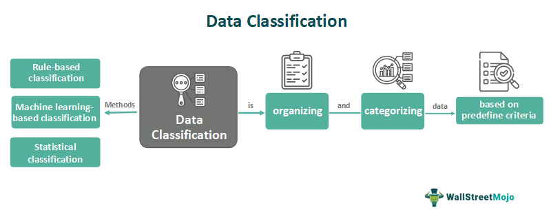

## Table of Contents

## What is classification in statistics?

Classification in statistics is a way to organize data into different groups or categories. It helps us understand and analyze data better by sorting it into meaningful sections. For example, if we have data about different types of fruits, we can classify them into categories like apples, bananas, and oranges. This makes it easier to see patterns or trends within each group.

One common method of classification is using a decision tree, which is like a flowchart that helps decide which category an item belongs to based on certain conditions. For instance, if we are classifying animals, we might ask if the animal has fur, and if yes, it goes into the "mammals" category. Another method is using a set of rules or criteria to sort data, like classifying people into age groups based on their birth year. Both methods help make sense of large amounts of data by breaking it down into smaller, more manageable parts.

## What are the main types of classification?

There are two main types of classification in statistics: binary classification and multi-class classification. Binary classification is when you sort things into just two groups. For example, you might classify emails as either "spam" or "not spam." It's like deciding if something is one thing or the other. Multi-class classification is when you sort things into more than two groups. For instance, you might classify animals into categories like "mammals," "birds," and "reptiles." This is useful when you have more than two types to sort.

Another type of classification is called ordinal classification. This is when the categories have a specific order or rank. For example, you might classify students' performance as "poor," "average," or "excellent." The categories are not just different, but they also have a sequence where one is better than the other. These types of classification help us understand and organize data in different ways, depending on what we need to know.

## How does binary classification differ from multiclass classification?

Binary classification is when you sort things into two groups. It's like deciding if something is one thing or the other. For example, you might classify emails as either "spam" or "not spam." This type of classification is simple because you only have to choose between two options. It's used a lot in things like medical tests where you want to know if a person has a disease or not.

Multiclass classification is different because you sort things into more than two groups. For instance, you might classify animals into categories like "mammals," "birds," and "reptiles." This type of classification is more complex because you have to decide which of several options something fits into. It's used in many areas, like sorting different types of fruits or classifying different genres of movies. Both types of classification help us organize data, but they work in different ways depending on how many groups you need.

## What are some common classification algorithms?

There are several common classification algorithms that help us sort data into groups. One popular one is the logistic regression algorithm. It's used a lot in binary classification, like deciding if an email is spam or not. Logistic regression works by figuring out the probability that something belongs to one group or the other. It's simple and works well for many problems. Another common algorithm is the decision tree. It's like a flowchart that asks questions about the data and sorts it into groups based on the answers. Decision trees are easy to understand and can be used for both binary and multiclass classification.

Another widely used algorithm is the k-nearest neighbors (k-NN) algorithm. It classifies things by looking at the data points around them. If most of the nearby points belong to one group, then the new point is classified into that group too. It's simple but can be slow with lots of data. The support vector machine (SVM) is another powerful algorithm. It finds the best line or boundary to separate different groups of data. SVMs work well for both binary and multiclass classification and can handle complex data sets. Each of these algorithms has its own strengths and is chosen based on the specific problem and data at hand.

## How do you evaluate the performance of a classification model?

To evaluate how well a classification model is doing, we use something called a confusion matrix. It's a table that shows how many times the model guessed right and how many times it guessed wrong. For example, if we're classifying emails as spam or not spam, the confusion matrix tells us how many spam emails were correctly identified as spam (true positives), how many were wrongly called not spam (false negatives), how many not spam emails were correctly identified as not spam (true negatives), and how many were wrongly called spam (false positives). From this matrix, we can calculate important measures like accuracy, which is the total number of correct guesses divided by the total number of guesses. Accuracy tells us the overall correctness of the model, but it can be misleading if one class is much bigger than the other.

Besides accuracy, we use other measures like precision and recall to get a better picture of the model's performance. Precision is about how many of the positive guesses were actually correct. For instance, if the model says an email is spam, precision tells us how often that's true. Recall, on the other hand, is about how many of the actual positive cases were caught by the model. In our email example, recall tells us how many of the real spam emails were correctly identified as spam. Sometimes, we use something called the F1 score, which is a balance between precision and recall. It's useful when we want to see how well the model performs overall, especially when we care about both false positives and false negatives equally. These measures help us understand different aspects of the model's performance and choose the best one for our needs.

## What is the confusion matrix and how is it used in classification?

A confusion matrix is a table that helps us see how well a classification model is working. It shows us how many times the model got things right and how many times it got things wrong. Imagine we're trying to classify emails as spam or not spam. The confusion matrix would tell us how many spam emails were correctly identified as spam (these are called true positives), how many spam emails were wrongly called not spam (these are false negatives), how many not spam emails were correctly identified as not spam (these are true negatives), and how many not spam emails were wrongly called spam (these are false positives). By looking at this table, we can understand the strengths and weaknesses of our model.

We use the confusion matrix to calculate important numbers like accuracy, precision, and recall. Accuracy is just the total number of correct guesses divided by the total number of guesses. It tells us how often the model is right overall. Precision is about how many of the things the model said were positive actually were positive. For example, if the model says an email is spam, precision tells us how often that's true. Recall is about how many of the actual positive things the model caught. In our email example, recall tells us how many of the real spam emails were correctly identified as spam. These numbers help us see different sides of how well the model is doing and help us make it better.

## What are precision, recall, and F1 score, and why are they important?

Precision, recall, and F1 score are important numbers we use to see how good a classification model is. Precision tells us how many of the things the model said were positive are actually positive. For example, if a model is sorting emails and says an email is spam, precision tells us how often that's true. It's like checking if the model is good at not making false alarms. Recall, on the other hand, tells us how many of the actual positive things the model caught. In the email example, recall tells us how many of the real spam emails the model found. It's like checking if the model is good at not missing anything important.

The F1 score is a way to balance precision and recall. It's useful because sometimes we care about both false positives and false negatives equally. The F1 score is the average of precision and recall, but it's a special average that makes sure both numbers are important. This score helps us understand the overall performance of the model, especially when we need to find a good middle ground between being too careful and missing too much. These three numbers help us see different sides of how well the model is doing and help us make it better.

## How does the ROC curve help in assessing classification models?

The ROC curve, which stands for Receiver Operating Characteristic curve, is a graph that helps us see how good a classification model is at telling things apart. It shows us how well the model can separate the positive and negative cases. Imagine we're trying to tell if an email is spam or not. The ROC curve plots the true positive rate (how many spam emails we correctly find) against the false positive rate (how many not spam emails we wrongly call spam). If the curve goes up and to the left, it means the model is doing a good job. The more the curve hugs the top left corner, the better the model is at sorting things correctly.

The area under the ROC curve, called AUC, is a number that tells us how good the model is overall. If the AUC is close to 1, it means the model is really good at telling things apart. If it's close to 0.5, it's not doing much better than guessing randomly. The ROC curve and AUC are really helpful because they show us how the model performs at different levels of strictness. This helps us pick the best way to use the model, depending on whether we care more about catching all the positive cases or avoiding false alarms.

## What is the difference between overfitting and underfitting in classification?

Overfitting happens when a classification model learns too much from the training data, including the little mistakes and odd details. It's like memorizing a test instead of learning the subject. When this happens, the model might do really well on the training data but not so well on new data it hasn't seen before. It's too focused on the exact examples it was trained on and can't handle new, slightly different examples well. Imagine if you only studied one specific math problem and then got a different problem on the test; you'd probably struggle because you didn't learn the general rule.

Underfitting is the opposite problem. It happens when a model doesn't learn enough from the training data. It's too simple and can't capture the important patterns in the data. This means the model won't do well on the training data and also won't do well on new data. It's like trying to use a very basic rule to solve a complex problem; it just won't work well. For example, if you tried to predict the weather using just the time of day, you'd miss out on important factors like temperature and humidity. Both overfitting and underfitting are problems we want to avoid to make sure our classification model works well on new data.

## How can feature selection improve classification performance?

Feature selection is like choosing the best tools for a job. When we pick the right features for our classification model, it can work better. This is because some features might not be very useful or might even confuse the model. By getting rid of these, the model can focus on the important stuff and make better guesses. It's like cleaning up your room to find things faster; you keep what you need and throw out what you don't.

Using feature selection can also make the model simpler and faster. When there are fewer features to look at, the model doesn't have to work as hard. This means it can run quicker and use less computer power. Plus, a simpler model is easier to understand and explain to others. So, feature selection helps the model be more accurate, faster, and easier to use.

## What advanced techniques can be used to handle imbalanced datasets in classification?

When the data we use for classification has a lot more examples of one type than another, it's called an imbalanced dataset. This can make the model focus too much on the common type and ignore the rare one. To fix this, we can use a technique called oversampling. Oversampling means we make more copies of the rare examples until we have a more even number of both types. Another way is undersampling, where we take away some of the common examples to balance things out. Both methods help the model pay attention to all types of examples, not just the ones that appear a lot.

Another advanced technique is called SMOTE, which stands for Synthetic Minority Over-sampling Technique. SMOTE creates new, fake examples of the rare type by mixing the features of the real ones. This gives the model more variety to learn from without just repeating the same examples over and over. We can also use different ways to weigh the examples, making the rare ones more important to the model. This is called class weighting. By giving more weight to the rare examples, the model tries harder to get them right. These techniques help make sure the model works well for all types of data, even when some types are much rarer than others.

## How do ensemble methods like Random Forests and Gradient Boosting enhance classification accuracy?

Ensemble methods like Random Forests and Gradient Boosting help make classification models better by combining the power of many small models into one big one. Think of it like a team of experts working together to solve a problem. Each small model, or "tree" in the case of Random Forests, looks at the data in a slightly different way. By putting all their guesses together, the final decision is usually more accurate than any single tree could be on its own. Random Forests do this by making lots of trees and then voting on what the answer should be. This helps because if one tree makes a mistake, the others can help correct it, leading to better overall accuracy.

Gradient Boosting works a bit differently but still uses the idea of combining many models. It builds trees one at a time, and each new tree tries to fix the mistakes made by the ones before it. It's like learning from past errors to get better and better. By focusing on the hard parts of the data that the earlier trees got wrong, Gradient Boosting can slowly but surely improve its guesses. This method can be very powerful because it keeps getting better with each new tree added, leading to high accuracy in classification tasks. Both Random Forests and Gradient Boosting use the strength of many models working together to make better predictions.

## What statistical tools are used in classification?

Machine learning algorithms, such as decision trees and support vector machines (SVMs), play a crucial role in classification within trading systems. Decision trees are valued for their simplicity and interpretability. They work by sequentially splitting data into subsets based on the value of input features, which makes them particularly useful for constructing decision rules that can be easily understood and implemented in trading strategies. On the other hand, SVMs are widely appreciated for their robustness in handling high-dimensional data and providing optimal hyperplanes for classification tasks, making them suitable for predicting market trends and identifying profitable trades.

Evaluating the efficacy of these classification models requires reliable statistical measures. Precision, recall, and F1 score are the metrics commonly used. Precision is the ratio of true positive predictions to the total predicted positives, indicating the accuracy of positive predictions in the dataset:

$$
\text{Precision} = \frac{\text{True Positives}}{\text{True Positives} + \text{False Positives}}
$$

Recall, or sensitivity, measures the ability of a model to identify all relevant instances, calculated as:

$$
\text{Recall} = \frac{\text{True Positives}}{\text{True Positives} + \text{False Negatives}}
$$

The F1 score is the harmonic mean of precision and recall, providing a single metric that balances both:

$$
\text{F1 Score} = 2 \times \frac{\text{Precision} \times \text{Recall}}{\text{Precision} + \text{Recall}}
$$

Traders utilize clustering methods, such as k-means and hierarchical clustering, to segment market data and gain insights into market dynamics. These techniques allow grouping of similar data points, helping traders to detect patterns and correlations that inform strategic decisions.

Dimensionality reduction techniques, such as Principal Component Analysis (PCA) and Linear Discriminant Analysis (LDA), are employed to enhance the accuracy of classification models. PCA reduces dimensionality by transforming the original data into a set of orthogonal components, prioritizing those that account for the most variance. This simplification helps in focusing on the most informative features while mitigating noise and redundancy.

LDA similarly reduces dimensionality but is particularly aimed at maximizing class separability, making it beneficial for distinguishing between different asset categories or market conditions.

The integration of these statistical tools and techniques provides the needed computational power to efficiently process and analyze the massive datasets characteristic of algorithmic trading. They collectively enhance the ability of trading algorithms to make informed and accurate predictions, ultimately optimizing trading performance and ensuring competitive advantage in fast-paced financial markets.

## References & Further Reading

[1]: Bergstra, J., Bardenet, R., Bengio, Y., & Kégl, B. (2011). ["Algorithms for Hyper-Parameter Optimization."](https://papers.nips.cc/paper/4443-algorithms-for-hyper-parameter-optimization) Advances in Neural Information Processing Systems 24.

[2]: ["Advances in Financial Machine Learning"](https://www.amazon.com/Advances-Financial-Machine-Learning-Marcos/dp/1119482089) by Marcos Lopez de Prado

[3]: ["Evidence-Based Technical Analysis: Applying the Scientific Method and Statistical Inference to Trading Signals"](https://www.amazon.com/Evidence-Based-Technical-Analysis-Scientific-Statistical/dp/0470008741) by David Aronson

[4]: ["Machine Learning for Algorithmic Trading"](https://github.com/stefan-jansen/machine-learning-for-trading) by Stefan Jansen

[5]: ["Quantitative Trading: How to Build Your Own Algorithmic Trading Business"](https://books.google.com/books/about/Quantitative_Trading.html?id=j70yEAAAQBAJ) by Ernest P. Chan