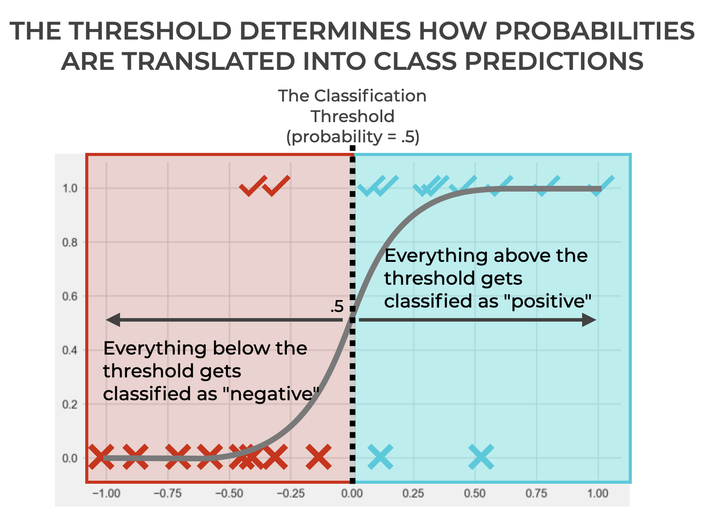

## Table of Contents

## What is a classification threshold in machine learning?

A classification threshold in machine learning is a value used in binary classification problems to decide whether an instance belongs to one class or another. When a model predicts a probability that an instance belongs to the positive class, the classification threshold helps determine the final prediction. If the predicted probability is above the threshold, the instance is classified as positive; if it's below, it's classified as negative. The default threshold is often set at 0.5, but this can be adjusted depending on the specific needs of the problem.

Adjusting the classification threshold can significantly impact the performance of a model, particularly in terms of its precision and recall. For example, if you want to minimize false positives, you might increase the threshold, making it harder for instances to be classified as positive. Conversely, if you want to minimize false negatives, you might lower the threshold, making it easier for instances to be classified as positive. This flexibility allows users to tailor the model's behavior to prioritize certain types of errors over others, depending on the application's requirements.

## Why is the classification threshold important in classification models?

The classification threshold is important in classification models because it helps decide if something belongs to one group or another. Imagine you have a model that guesses if an email is spam or not. The model gives a number, like a probability, saying how sure it is that the email is spam. If this number is higher than the threshold, the email gets labeled as spam. If it's lower, it's labeled as not spam. The threshold is usually set at 0.5, but you can change it to make the model work better for what you need.

Changing the threshold can make a big difference. If you want to be really sure that you don't miss any spam emails, you might lower the threshold. This means more emails will be labeled as spam, but you might also label some good emails as spam by mistake. On the other hand, if you want to avoid labeling good emails as spam, you might raise the threshold. This means fewer emails will be labeled as spam, but you might miss some actual spam. By adjusting the threshold, you can make the model work better for your specific needs, balancing between catching all the spam and not labeling good emails as spam.

## How does changing the classification threshold affect the performance of a model?

Changing the classification threshold can really change how well a model works. If you make the threshold lower, more things will be labeled as positive. This might be good if you want to catch everything that might be positive, but it could also mean you label some things as positive by mistake. For example, if you're trying to find sick people, a lower threshold might help find everyone who's sick, but you might also label some healthy people as sick.

On the other hand, if you make the threshold higher, fewer things will be labeled as positive. This can be good if you want to be really sure about what you label as positive, but it might mean you miss some things that should be labeled positive. For example, if you're checking for spam emails, a higher threshold might mean you miss some spam emails because you're trying to avoid labeling good emails as spam. By changing the threshold, you can make the model work better for what you need, balancing between catching everything and not making mistakes.

## What is the default classification threshold for most machine learning algorithms?

The default classification threshold for most [machine learning](/wiki/machine-learning) algorithms is set at 0.5. This means that if a model predicts a probability of 0.5 or higher that an instance belongs to the positive class, it will classify that instance as positive. If the probability is less than 0.5, it will classify the instance as negative. This threshold is commonly used because it provides a balanced approach to classification, treating false positives and false negatives with equal importance.

However, the choice of 0.5 as a default threshold can be adjusted based on the specific needs of the problem at hand. For example, in medical diagnostics, you might want to lower the threshold to ensure that no cases are missed, even if it means more false positives. Conversely, in spam detection, you might raise the threshold to avoid labeling important emails as spam, even if it means missing some spam emails. Adjusting the threshold allows users to fine-tune the model's performance to better suit their particular application.

## How can you determine the optimal classification threshold for a specific problem?

To find the best classification threshold for a specific problem, you need to look at what's most important for your situation. You might care more about catching all the positive cases, even if it means some false alarms. Or, you might want to avoid false alarms at all costs, even if it means missing some positive cases. To figure this out, you can use something called a Receiver Operating Characteristic (ROC) curve or a Precision-Recall curve. These tools help you see how changing the threshold affects your model's performance. You can then pick the threshold that gives you the best balance between true positives and false positives, based on what you need.

For example, if you're trying to detect a rare disease, you might want to lower the threshold to make sure you don't miss anyone who's sick. This might mean more people get tested who don't actually have the disease, but you'll catch more of the sick people. On the other hand, if you're checking for spam emails, you might raise the threshold to avoid marking important emails as spam. This could mean missing some spam emails, but you'll be less likely to annoy people with false alarms. By looking at the ROC curve or Precision-Recall curve, you can see how different thresholds affect your model and choose the one that works best for your specific needs.

## What are some common methods to evaluate the impact of different classification thresholds?

To evaluate how different classification thresholds affect a model's performance, you can use tools like the Receiver Operating Characteristic (ROC) curve and the Precision-Recall curve. The ROC curve plots the True Positive Rate (TPR) against the False Positive Rate (FPR) at various threshold levels. By looking at the ROC curve, you can see how changing the threshold affects the balance between catching all the positive cases and avoiding false alarms. The area under the ROC curve (AUC-ROC) gives you a single number that shows how well the model can distinguish between positive and negative classes, no matter what threshold you use. A higher AUC-ROC means the model is better at telling the difference between the classes.

Another useful tool is the Precision-Recall curve, which plots precision against recall at different threshold levels. Precision is about how many of the positive predictions are actually correct, while recall is about how many of the actual positive cases the model catches. The Precision-Recall curve is especially helpful when you're dealing with imbalanced datasets, where one class is much more common than the other. By looking at this curve, you can see how changing the threshold affects the model's ability to be precise and to catch all the positive cases. You can then choose a threshold that gives you the best balance between precision and recall for your specific needs.

## How does the classification threshold relate to the ROC curve and AUC?

The classification threshold is closely related to the Receiver Operating Characteristic (ROC) curve and the Area Under the Curve (AUC). The ROC curve shows how well a model can tell the difference between positive and negative cases at different threshold levels. It plots the True Positive Rate (TPR), which is how many of the actual positive cases the model catches, against the False Positive Rate (FPR), which is how many of the actual negative cases the model labels as positive. By changing the classification threshold, you move along the ROC curve. A lower threshold means more things are labeled as positive, which increases both the TPR and the FPR. A higher threshold means fewer things are labeled as positive, which decreases both the TPR and the FPR. 

The AUC is a single number that summarizes the overall performance of the model across all possible thresholds. It's the area under the ROC curve, and a higher AUC means the model is better at distinguishing between the positive and negative classes. If the AUC is close to 1, the model is very good at telling the classes apart. If it's close to 0.5, the model is no better than guessing randomly. By looking at the ROC curve and the AUC, you can see how changing the classification threshold affects the model's performance and choose the best threshold for your specific needs.

## Can you explain how precision-recall curves can help in choosing the right classification threshold?

Precision-recall curves are a great way to figure out the best classification threshold for your model. They show how changing the threshold affects the model's precision and recall. Precision is about how many of the positive predictions are actually correct. For example, if your model says 10 emails are spam and 8 of them really are spam, the precision is 80%. Recall is about how many of the actual positive cases the model catches. If there are 10 spam emails and your model catches 8 of them, the recall is 80%. By looking at the precision-recall curve, you can see how different thresholds affect these two measures and find the right balance for your needs.

For example, if you're trying to catch all the spam emails, you might want a high recall. But if you also want to avoid labeling important emails as spam, you'll want a high precision too. The precision-recall curve helps you see how changing the threshold can help you get the best of both worlds. If you see a point on the curve where both precision and recall are high, you might choose the threshold that corresponds to that point. This way, you can make your model work better for what you need, whether that's catching more spam or avoiding false alarms.

## What are the trade-offs between sensitivity and specificity when adjusting the classification threshold?

When you change the classification threshold, you're making a trade-off between sensitivity and specificity. Sensitivity, also known as the true positive rate, is about how good your model is at catching all the positive cases. If you lower the threshold, more things get labeled as positive, so your sensitivity goes up. This is great if you want to make sure you don't miss any positive cases, like catching all the sick people in a medical test. But, lowering the threshold also means you might label some negative cases as positive by mistake, which can lead to more false alarms.

On the other hand, specificity, also known as the true negative rate, is about how good your model is at correctly labeling negative cases. If you raise the threshold, fewer things get labeled as positive, so your specificity goes up. This is good if you want to avoid false alarms, like not labeling important emails as spam. But, raising the threshold also means you might miss some positive cases, which can be a problem if catching all the positive cases is really important. So, choosing the right threshold depends on whether you care more about catching all the positive cases or avoiding false alarms.

## How do imbalanced datasets affect the choice of classification threshold?

Imbalanced datasets, where one class has a lot more examples than the other, can really mess with choosing the right classification threshold. If you have a lot more negative cases than positive ones, like in fraud detection where most transactions are not fraud, using the default threshold of 0.5 might not work well. This is because the model might be really good at predicting the majority class (not fraud) but miss a lot of the minority class (fraud). So, you might need to lower the threshold to catch more of the positive cases, even if it means more false alarms.

To figure out the best threshold for an imbalanced dataset, you can use tools like the Precision-Recall curve. This curve shows how changing the threshold affects the model's precision (how many of the positive predictions are actually correct) and recall (how many of the actual positive cases the model catches). By looking at this curve, you can see how different thresholds balance between catching all the positive cases and avoiding false alarms. This is really helpful because in imbalanced datasets, you often care more about catching the minority class than avoiding false alarms for the majority class.

## What advanced techniques exist for dynamically adjusting the classification threshold?

One advanced technique for dynamically adjusting the classification threshold is using cost-sensitive learning. This method takes into account the different costs of misclassifying positive and negative cases. For example, in medical diagnosis, missing a sick person (false negative) might be much more costly than labeling a healthy person as sick (false positive). By setting different costs for these errors, you can adjust the threshold to minimize the total cost. This can be done by using a cost matrix where you assign higher costs to the more serious errors, and then the model adjusts the threshold to balance these costs.

Another technique is using adaptive thresholding, where the threshold changes based on the data it sees. For example, if the model notices that the positive cases are becoming more common, it might lower the threshold to catch more of them. This can be done using algorithms that update the threshold in real-time based on feedback from the model's performance. For instance, if the model is missing too many positive cases, it might automatically lower the threshold to increase sensitivity. This way, the model can adapt to changes in the data distribution and keep its performance high.

## How can domain-specific knowledge influence the selection of an appropriate classification threshold?

Domain-specific knowledge can really help you pick the right classification threshold for your model. For example, if you know that missing a positive case in your field, like a sick person in medicine, is a big problem, you might want to lower the threshold. This means more things will be labeled as positive, so you catch more of the cases you care about. But, if you also know that labeling something as positive by mistake can cause big problems, like labeling a healthy person as sick, you'll need to balance that too. So, knowing what's important in your field helps you decide how to set the threshold to get the best results.

In some fields, like fraud detection, you might know that false alarms are not as bad as missing a fraud case. So, you might lower the threshold to catch more fraud, even if it means more false alarms. But, if you're working on something like spam email filtering, you might know that people really hate getting important emails labeled as spam. In that case, you might raise the threshold to avoid false alarms, even if it means missing some spam. By using what you know about your field, you can adjust the threshold to make sure your model works the best way possible for your specific needs.

## References & Further Reading

[1]: Fawcett, T. (2006). ["An introduction to ROC analysis."](https://www.sciencedirect.com/science/article/pii/S016786550500303X) Pattern Recognition Letters, 27(8), 861-874.

[2]: Powers, D. M. W. (2011). ["Evaluation: From Precision, Recall and F-measure to ROC, Informedness, Markedness & Correlation."](https://arxiv.org/abs/2010.16061) Journal of Machine Learning Technologies, 2(1), 37-63.

[3]: Davis, J., & Goadrich, M. (2006). ["The Relationship Between Precision-Recall and ROC Curves."](https://dl.acm.org/doi/10.1145/1143844.1143874) Proceedings of the 23rd International Conference on Machine Learning.

[4]: Chawla, N. V., Bowyer, K. W., Hall, L. O., & Kegelmeyer, W. P. (2002). ["SMOTE: Synthetic Minority Over-sampling Technique."](https://arxiv.org/abs/1106.1813) Journal of Artificial Intelligence Research, 16, 321-357.

[5]: Koyejo, O. O., Natarajan, N., Ravikumar, P., & Dhillon, I. S. (2014). ["Consistent Multiclass Algorithms for Complex Performance Measures."](https://experts.illinois.edu/en/publications/consistent-multilabel-classification) Advances in Neural Information Processing Systems 27.

[6]: Bradley, A. P. (1997). ["The use of the area under the ROC curve in the evaluation of machine learning algorithms."](https://www.sciencedirect.com/science/article/abs/pii/S0031320396001422) Pattern Recognition, 30(7), 1145-1159.