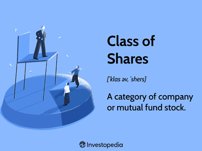

In the contemporary landscape of financial markets, understanding the classification of shares and the rights they bestow upon shareholders is crucial. Classified shares enable companies to differentiate between types of equity ownership, impacting investor control, financial returns, and corporate governance significantly. Depending on their classification, shares may offer varying voting rights and dividend options, which in turn influence the strategic decisions investors make.

The advent of sophisticated algorithmic trading strategies has further emphasized the importance of stock classifications. These strategies leverage complex mathematical models and cutting-edge computational tools to exploit market opportunities. The specific classifications of shares play a critical role in these trading algorithms, affecting how they respond to market dynamics, execute trades, and ultimately generate profits.



As the market continues to evolve with innovations in trading technologies and corporate structures, understanding the intricate details of classified shares and shareholder rights becomes increasingly valuable. This knowledge not only empowers investors and traders but also influences how companies choose to structure their equity to balance control and capital-raising efforts.

## Table of Contents

## Understanding Classified Shares

Classified shares serve as a strategic tool for companies to allocate equity ownership with distinct attributes. Typically, firms issue multiple classes of shares, such as Class A and Class B, each with unique features concerning voting rights and dividend entitlements. This practice enables companies to cater to the diverse priorities of investors, ranging from those seeking greater control over corporate governance to those prioritizing financial returns.

Voting rights are a central feature that differentiates classified shares. Class A shares often confer more voting power compared to Class B shares, granting their holders significant influence in major corporate decisions, such as mergers, acquisitions, or changes in corporate policies. A typical arrangement might see Class A shares offering one vote per share, while Class B shares provide limited or no voting rights, enabling founders and key stakeholders to maintain decision-making authority despite holding a smaller percentage of total equity.

Dividend policies may also differ across share classes. For instance, a company might prioritize higher dividend payments for one class of shares over the other, or offer different dividend growth prospects. This differentiation allows companies to appeal to various investor profiles—those focused on income generation from dividends versus those more inclined toward long-term capital appreciation.

For investors, comprehending the specific characteristics of each class of shares is vital for aligning investment strategies with their financial goals. An investor might choose Class A shares if they value influence over corporate affairs, while another might opt for Class B shares with lower voting power if the focus is on other aspects, such as dividend yield or market appreciation potential.

Such classifications have also become significant in the context of mergers and acquisitions, where companies might create new share classes to raise capital without diluting the control of existing stakeholders. This structural flexibility underscores the importance of understanding classified shares within the broader framework of corporate finance and investment strategy.

External sources and further reading on classified shares can provide additional insights into how companies strategically use these financial instruments to balance control, growth, and investment appeal.

## Shareholder Rights and Stock Classification

Shareholder rights vary significantly based on the class of shares held, with implications for corporate governance and financial benefits. Companies often issue multiple classes of shares, commonly designated as Class A and Class B, to offer different levels of influence and financial participation to shareholders. This differentiation plays a critical role in determining the control dynamics within a corporation and how profits are distributed among investors.

Class A shares typically confer more voting power compared to Class B shares. For example, a company might issue Class A shares that [carry](/wiki/carry-trading) ten votes per share, while Class B shares hold only one vote per share. This disparity allows founders or existing management to maintain control over corporate decisions even if they do not hold a majority of the equity. This voting arrangement is vital in protecting the strategic vision of the company from short-term market pressures or hostile takeovers.

On the other hand, Class B shares often focus on providing financial returns. While their voting power is limited, they might offer higher dividends or preferential payment rights. For instance, in the case of liquidation, holders of Class B shares may receive their capital back before Class A shareholders. This trade-off between voting rights and financial benefits is a critical consideration for investors based on their investment goals, whether they prioritize influence within the company or financial returns.

The classification of stocks significantly impacts an investor's ability to affect corporate policies, elect board members, and influence mergers or acquisitions. Consequently, stock classification is a strategic tool used by companies to balance power among different categories of shareholders, ensuring stability and continuity in leadership while meeting diverse investor expectations.

Understanding these dynamics is crucial for investors, as they navigate corporate landscapes and tailor their investment strategies according to their priorities, be it governance influence or dividend income. As such, gaining insight into stock classification can equip shareholders with the necessary knowledge to make informed financing decisions and optimize their investment outcomes.

## Algorithmic Trading and Stock Classification

Algorithmic trading uses computer programs to execute trades at high speeds, often faster than humans can react, utilizing advanced mathematical models and statistical analysis to optimize trading decisions. A key element that algo traders often leverage is the classification of shares. By understanding the nuances of different share classes, traders can develop strategies to capitalize on price discrepancies and distinct market behaviors associated with these classes.

The classification of shares, such as Class A and Class B shares, can have a significant impact on trading strategies. These classes are differentiated by their rights and privileges, particularly voting rights and dividend entitlements. For instance, Class A shares might offer more voting power compared to Class B, while the latter could have advantages in dividend payouts. Algorithmic traders analyze how these differences create price and [liquidity](/wiki/liquidity-risk-premium) anomalies across markets.

A fundamental principle in [algorithmic trading](/wiki/algorithmic-trading) is [arbitrage](/wiki/arbitrage): the simultaneous purchase and sale of an asset to profit from a difference in the price. Share classifications can present arbitrage opportunities when, for example, the market perceives a premium on voting rights of Class A shares over non-voting Class B shares. An algorithm might track real-time data to identify when the spread between these prices deviates from historical averages, executing trades to exploit these temporary discrepancies.

Moreover, the behavior of these share classes under various market conditions can signal broader trends. For example, if a company with multiple share classes is subject to a takeover bid, different classes might react differently in price, providing insights into the market's perception of the bid's likelihood or fairness.

In many cases, algo traders employ [machine learning](/wiki/machine-learning) techniques to analyze large datasets, discern patterns associated with specific share classes, and predict future price movements. Here's a simple example of how machine learning can be utilized in Python to examine stock classification data:

```python
import pandas as pd
from sklearn.model_selection import train_test_split
from sklearn.ensemble import RandomForestRegressor
from sklearn.metrics import mean_squared_error

# Load data
data = pd.read_csv('stock_data.csv')

# Features and target variable
features = data[['share_class', 'volume', 'market_cap', 'dividend_yield']]
target = data['price_variation']

# Splitting the data
X_train, X_test, y_train, y_test = train_test_split(features, target, test_size=0.2, random_state=42)

# Model training
model = RandomForestRegressor(n_estimators=100, random_state=42)
model.fit(X_train, y_train)

# Predictions and evaluation
predictions = model.predict(X_test)
mse = mean_squared_error(y_test, predictions)

print(f"Mean Squared Error: {mse}")
```

In this simplified example, a RandomForestRegressor model is used to predict price variations, utilizing features that may include share class indicators. Through such tools, traders can continually adapt their strategies in response to market shifts, honing in on share classifications that show the most promise for profitability. The ongoing development of AI and machine learning promises even greater precision and adaptability in future algorithmic trading strategies.

## Case Study: Dual Class Structures

Dual-class share structures have become a popular mechanism for companies, especially tech giants, to sustain control while attracting investor capital. This structure typically involves multiple classes of shares with distinct voting rights, enabling company founders and key insiders to maintain decision-making authority despite owning a minority of the company's total equity.

A prominent example of a dual-class share structure is Alphabet Inc., the parent company of Google. Alphabet maintains three classes of shares: Class A, Class B, and Class C. Class A shares are publicly traded and carry one vote per share. Class B shares are owned by insiders and carry ten votes per share, ensuring that company founders retain significant control. Class C shares have no voting rights but are entitled to dividends. This structure allows Google’s co-founders, Larry Page and Sergey Brin, to exert substantial control over corporate decisions despite holding a relatively smaller proportion of the company’s total share count.

Another notable case is Facebook, now known as Meta Platforms, which employed a similar strategy in its dual-class share structure. Upon going public, Meta offered Class A shares with one vote each, while Class B shares, primarily held by Mark Zuckerberg and a few insiders, carried ten votes per share. This configuration enabled Zuckerberg to maintain control over strategic directions and company policies without holding a majority of total shares.

Dual-class structures are particularly valuable for firms seeking to safeguard visionary leadership, especially in industries characterized by rapid innovation and competition. By implementing such a framework, companies can pursue long-term strategies without succumbing to the immediate financial pressures and short-term interests that sometimes accompany public market dynamics.

Critics, however, argue that dual-class structures can entrench management and jeopardize shareholder rights, leading to potential governance issues. The disproportionate power granted to insiders might result in decisions that favor founders over the broader shareholder base. Nevertheless, the strategic utility of dual-class structures in allowing companies to balance visionary leadership with public financing remains a critical aspect of modern corporate strategies.

In summary, dual-class share structures offer a balance between retaining control and accessing capital markets. Real-world examples like Alphabet and Meta demonstrate how these structures strategically enable founders to navigate corporate growth while preserving their influence over the company’s vision and operations.

## The Future of Share Classification and Algorithmic Trading

The rise of machine learning and [artificial intelligence](/wiki/ai-artificial-intelligence) (AI) is profoundly transforming the landscape of algorithmic trading, with increasingly sophisticated strategies being developed and implemented. These technological advancements allow for the analysis of vast datasets with a precision and speed that was previously unattainable. Machine learning algorithms, in particular, can identify patterns and trends that human traders may not easily discern, which enhances trading strategies' effectiveness.

Algorithmic trading relies heavily on the classification and understanding of shares, as different classifications can result in varied market behaviors. For instance, some trading algorithms are designed to exploit price discrepancies between different classes of shares, such as Class A and Class B shares. The trend toward more complex share classifications offers new opportunities and challenges for these algorithms. As companies continue to innovate their share structures to balance control with market liquidity, algorithmic strategies must adapt to efficiently capitalize on these variations.

The future of share classification also hinges on legal and regulatory developments. As governments and regulatory bodies adjust to the rapid innovation in financial markets, new regulations could shape how shares can be classified and traded. This legal landscape will likely influence algorithmic trading tactics, as compliance and adaptability become crucial components of a profitable trading strategy.

Market trends indicate an increasing integration of AI technologies in trading systems. These advancements not only enhance performance and efficiency but also enable real-time analysis and reaction to market movements, allowing traders to implement strategies that were previously considered impractical. For example, [reinforcement learning](/wiki/reinforcement-learning) techniques enable algorithms to learn and adapt from the environment, optimizing trading strategies with minimal human intervention. 

Staying abreast of these technological and regulatory changes is essential for traders and investors aiming to maximize returns in the evolving market. As share classifications grow more complex and trading algorithms become more sophisticated, a comprehensive understanding of both market trends and legal frameworks will be key to navigating the future financial landscape effectively.

## Conclusion

Classified shares and shareholder rights are paramount in shaping investment strategies and corporate governance. The designation of shares into different classes, each with distinct voting rights and dividend preferences, allows companies to attract diverse investor profiles while maintaining control over strategic corporate decisions. For investors, understanding these classifications is critical for making informed decisions about potential returns and influence in a company's affairs.

Algorithmic trading has revolutionized the financial market landscape by utilizing these share classifications to optimize investment returns. Algorithms, equipped with advanced mathematical models and high-speed data processing capabilities, can capitalize on the price discrepancies and market behaviors associated with various classes of shares. By identifying patterns and implementing trades at speeds unattainable by human traders, algorithmic systems can effectively leverage the nuanced differences in share classes to gain a competitive edge.

Therefore, a comprehensive understanding of classified shares, shareholder rights, and algorithmic trading is essential for both traders and investors. These concepts play an integral role in navigating the complexities of today's financial markets. As technology and financial instruments continue to evolve, staying informed about the latest trends and developments in share classification will be crucial for success in investment and corporate governance. This knowledge not only enhances the ability to maximize returns but also ensures informed participation in the corporate decision-making process.

## References & Further Reading

1. **"Introduction to Classified Shares"** - Investopedia offers a detailed guide on the various classes of shares, elucidating on voting rights, dividend entitlements, and how these classifications affect investor strategies. [Investopedia - Classified Shares](https://www.investopedia.com/terms/c/classifiedstock.asp)

2. **"Understanding Shareholder Rights"** - The Harvard Law School Forum on Corporate Governance provides comprehensive discussions on shareholder rights, emphasizing how these rights vary with different share classes. [Harvard Law - Shareholder Rights](https://corpgov.law.harvard.edu/)

3. **"Algorithmic Trading: An Overview"** - The paper "Algorithmic Trading and its Impacts on Stock Markets" explores the mechanisms of algorithmic trading and its reliance on stock classification for trading strategy optimization. [Springer - Algorithmic Trading](https://link.springer.com/article/10.1007/s10479-017-2679-9)

4. **"The Impacts of Dual-Class Share Structures"** - For insights into dual-class structures, The Economist provides articles analyzing how tech giants leverage these structures for strategic advantages. [The Economist - Dual-Class Shares](https://www.economist.com/)

5. **"Legal Developments in Shareholder Rights"** - The Wachtell, Lipton, Rosen & Katz publication offers updates on legal precedents that might influence shareholder rights and share classification. [Wachtell, Lipton, Rosen & Katz - Legal Developments](https://www.wlrk.com/)

6. **"Advancements in Algorithmic Trading and AI"** - MIT's Sloan Management Review discusses ongoing developments in machine learning and AI as they pertain to the future of algorithmic trading. [MIT Sloan - AI in Trading](https://sloanreview.mit.edu/)

These resources provide a foundational starting point for understanding the intricate details of classified shares, shareholder rights, and the evolving field of algorithmic trading.