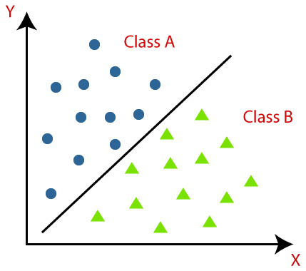

## Table of Contents

## What is a classifier in machine learning?

A classifier in machine learning is a type of algorithm that helps to sort data into different categories. Imagine you have a bunch of fruits, and you want to separate them into apples, bananas, and oranges. A classifier would look at the features of each fruit, like its color, shape, and size, and then decide which category it belongs to. In machine learning, these features are often called inputs, and the categories are called classes or labels.

To create a classifier, you first need to train it using a dataset where the correct categories are already known. During this training process, the classifier learns to recognize patterns in the data that are associated with each category. Once trained, the classifier can then be used to predict the category of new, unseen data. For example, if you show the classifier a new fruit, it will use what it learned during training to decide whether it's an apple, banana, or orange. Common types of classifiers include decision trees, support vector machines, and neural networks, each with its own way of making these predictions.

## How does a classifier work?

A classifier works by learning from examples. Imagine you're teaching a friend to tell the difference between cats and dogs. You show them pictures and say, "This is a cat, and this is a dog." The more pictures they see, the better they get at telling them apart. In machine learning, this is called training. During training, the classifier looks at a lot of data where the correct answers are already known. It tries to find patterns or rules that help it decide which category something belongs to. For example, if it sees that most pictures of cats have pointed ears, it might use that as a clue.

Once the classifier is trained, you can use it to guess the category of new things it hasn't seen before. Let's say you show it a new picture. The classifier will look at the features of the picture, like the shape of the ears or the length of the tail, and use what it learned during training to make a decision. If it thinks the picture has the features of a cat, it will say, "This is a cat." If it's wrong, it might need more training or different data to get better. The goal is to make the classifier as accurate as possible so it can help with tasks like sorting emails into spam and not spam or identifying diseases from medical images.

## What are the main types of classifiers?

There are many types of classifiers, but some of the most common ones are decision trees, support vector machines (SVMs), and neural networks. Decision trees work by making a series of decisions, kind of like a flowchart. They split the data into smaller groups based on different features until they can make a final decision about which category something belongs to. SVMs, on the other hand, try to find the best line or hyperplane that separates different classes. They look for the widest gap between the classes and use that to make predictions. Neural networks are a bit more complicated. They are made up of layers of connected nodes, kind of like a brain, and they can learn very complex patterns in the data.

Another type of classifier is the k-nearest neighbors (k-NN) algorithm. This one is pretty simple: it looks at the new data point and finds its closest neighbors in the training data. Then, it decides the category based on what most of those neighbors are. For example, if most of the closest neighbors are cats, it will say the new data point is a cat too. There are also classifiers like Naive Bayes, which use probability to make decisions. They assume that the features are independent of each other and use that to calculate the likelihood of something belonging to a certain category. Each type of classifier has its own strengths and weaknesses, so choosing the right one depends on the specific problem you're trying to solve.

## Can you explain the difference between binary and multi-class classification?

Binary classification is when you have to decide between just two categories. Think of it like sorting emails into spam or not spam. The classifier looks at the data and tries to figure out if it fits into one of these two groups. For example, if you're trying to tell if a picture is of a cat or a dog, that's binary classification. The classifier learns from examples and then decides if a new picture is more likely to be a cat or a dog.

Multi-class classification is a bit more complicated because you have more than two categories to choose from. Imagine you're sorting fruits into apples, bananas, and oranges. The classifier has to learn how to tell these different fruits apart. It looks at features like color, shape, and size to decide which fruit a new picture shows. This can be trickier than binary classification because the classifier has to keep track of more categories, but it's still about sorting things into the right groups.

## What is the importance of training and testing data in classifiers?

Training and testing data are super important for classifiers because they help the classifier learn and then check how well it's doing. The training data is like a set of examples with the right answers already known. The classifier looks at these examples to learn what patterns or features are linked to each category. For example, if you're teaching a classifier to tell cats from dogs, you'd show it lots of pictures of cats and dogs and tell it which is which. The more examples it sees, the better it gets at recognizing the differences between them.

Once the classifier is trained, you use the testing data to see how well it works on new stuff it hasn't seen before. The testing data is another set of examples, but this time, the classifier doesn't know the answers yet. It tries to guess the category for each example, and then you check how many guesses are right. This helps you figure out if the classifier is good at its job or if it needs more training or different data. If it does well on the testing data, you can trust it to make good guesses on new data too.

## How do you evaluate the performance of a classifier?

To evaluate the performance of a classifier, you need to see how well it guesses the right categories for new data. One common way to do this is by using something called accuracy, which is just the percentage of guesses that are correct. For example, if the classifier guesses right 90 times out of 100, its accuracy is 90%. But accuracy alone might not tell the whole story, especially if the data isn't evenly split between categories. Imagine if you're sorting emails into spam and not spam, and 95% of your emails are not spam. A classifier that always guesses "not spam" would seem really accurate, but it wouldn't be very useful.

So, people often use other ways to check performance too. One way is to look at something called the confusion matrix, which shows how the classifier's guesses match up with the actual categories. From the confusion matrix, you can calculate things like precision, which tells you how many of the classifier's positive guesses were right, and recall, which tells you how many of the actual positives the classifier found. There's also the F1 score, which is a mix of precision and recall, and it's useful when you want to balance both. Another way to evaluate performance is by using something called the ROC curve, which shows how well the classifier can tell the difference between categories at different thresholds. The area under the ROC curve, or AUC, gives you a single number that tells you how good the classifier is at making these distinctions.

## What are some common metrics used to assess classifier performance?

To check how well a classifier is doing, people often use accuracy, which is just the percentage of correct guesses. For example, if the classifier gets 90 out of 100 guesses right, its accuracy is 90%. But accuracy can be misleading if the data isn't evenly split between categories. Imagine you're sorting emails into spam and not spam, and 95% of your emails are not spam. A classifier that always guesses "not spam" would seem really accurate, but it wouldn't be very useful because it would miss all the spam emails.

So, other metrics are used to get a better picture of performance. One common metric is precision, which tells you how many of the classifier's positive guesses were actually right. Another is recall, which tells you how many of the actual positives the classifier found. The F1 score is a mix of precision and recall, and it's useful when you want to balance both. You can calculate the F1 score with the formula $$F1 = 2 \times \frac{\text{precision} \times \text{recall}}{\text{precision} + \text{recall}}$$. Another way to evaluate performance is by using the ROC curve, which shows how well the classifier can tell the difference between categories at different thresholds. The area under the ROC curve, or AUC, gives you a single number that tells you how good the classifier is at making these distinctions.

## What is overfitting in the context of classifiers, and how can it be prevented?

Overfitting happens when a classifier learns too much from the training data, including the little mistakes and random patterns that are just in that data. Imagine you're trying to teach a friend to tell cats from dogs by showing them pictures. If your friend starts thinking that all cats must have a specific toy in the picture because they saw it a few times, they're overfitting. They're focusing too much on details that aren't really important for telling cats and dogs apart. When this happens, the classifier might do really well on the training data but not so well on new data because it's trying to use those little details that don't show up in other pictures.

To prevent overfitting, you can use a few tricks. One way is to use more data for training, so the classifier sees a wider variety of examples and doesn't get too focused on the small details. Another way is to use something called regularization, which adds a penalty for making the classifier too complicated. This encourages the classifier to focus on the most important patterns instead of trying to fit every little detail. You can also use a technique called cross-validation, where you split your data into different parts and train the classifier multiple times, each time using a different part for testing. This helps you see if the classifier is doing well on data it hasn't seen before and can help you spot overfitting early.

## How do ensemble methods improve classifier performance?

Ensemble methods improve classifier performance by combining the predictions of multiple classifiers to make a final decision. Imagine you have a group of friends, and each of them is good at guessing whether a picture shows a cat or a dog. If you let them vote on it, you're more likely to get the right answer than if you just asked one friend. In [machine learning](/wiki/machine-learning), this is called an ensemble. By putting together the guesses of different classifiers, you can often get a more accurate result than using any single classifier alone. This is because different classifiers might be good at different things, so together they can cover more ground and make better predictions.

One common type of ensemble method is called bagging, where you train multiple classifiers on different parts of the data and then combine their predictions. Another popular method is boosting, where you train classifiers one after the other, and each new classifier focuses on the examples that the previous ones got wrong. For example, if the first classifier struggles with pictures of cats that have unusual colors, the next classifier will pay more attention to those pictures. This way, the ensemble gets better and better at making correct guesses. Ensemble methods like these can really boost the performance of classifiers, making them more reliable and accurate.

## What are some advanced techniques used in modern classifiers?

Modern classifiers use some pretty cool techniques to get better at guessing the right categories. One of these is called [deep learning](/wiki/deep-learning), which is a type of [neural network](/wiki/neural-network) with lots of layers. These layers help the classifier learn really complex patterns in the data. For example, if you're trying to tell if a picture shows a cat or a dog, a deep learning classifier can look at things like the shape of the ears, the texture of the fur, and even the way the animal is standing. This makes it really good at telling cats and dogs apart, even if the pictures are a bit blurry or taken from different angles.

Another advanced technique is transfer learning, which is like borrowing knowledge from one task to help with another. Imagine you've already trained a classifier to recognize different kinds of animals. You can take what it learned and use it to help train a new classifier to tell different breeds of dogs apart. This saves a lot of time and data because the new classifier starts with some knowledge already, so it doesn't have to learn everything from scratch. Techniques like these help modern classifiers do a much better job at sorting things into the right categories.

## Can you discuss the role of feature selection in improving classifier accuracy?

Feature selection is like choosing the best tools for a job. When you're training a classifier, you want to use the features that help it tell the difference between categories the best. Imagine you're trying to tell if a picture shows a cat or a dog. You could look at lots of things like the color of the fur, the shape of the ears, and the length of the tail. But not all these things are equally important. If you focus on the most useful features, like the shape of the ears, the classifier can learn faster and make better guesses. By [picking](/wiki/asset-class-picking) the right features, you can make the classifier more accurate and easier to train.

One way to do feature selection is by trying different combinations of features and seeing which ones give the best results. You can use methods like correlation analysis to see which features are most related to the categories you're trying to predict. For example, if you find that the shape of the ears is highly correlated with whether a picture shows a cat or a dog, you might decide to use that feature. Another way is to use something called feature importance, which some classifiers can tell you. This helps you see which features are most helpful for making good guesses. By focusing on the most important features, you can make your classifier more accurate and efficient.

## How do you handle imbalanced datasets in classification tasks?

When you have an imbalanced dataset, it means that some categories have a lot more examples than others. Imagine you're sorting emails into spam and not spam, and 95% of your emails are not spam. If you train a classifier on this data, it might guess "not spam" all the time because that's what it sees most often. This can make the classifier seem accurate, but it's not very useful because it misses all the spam emails. To fix this, you need to help the classifier pay more attention to the less common categories.

One way to handle imbalanced datasets is by using a technique called resampling. This means you can either add more examples of the less common categories, which is called oversampling, or remove some examples from the more common categories, which is called undersampling. Another way is to use special algorithms that are designed to work well with imbalanced data. For example, you can use something called class weights, which tells the classifier to care more about getting the less common categories right. By using these methods, you can help the classifier do a better job at sorting things into the right categories, even when the data is imbalanced.

## References & Further Reading

[1]: Bishop, C. M. (2006). ["Pattern Recognition and Machine Learning"](https://www.cs.uoi.gr/~arly/courses/ml/tmp/Bishop_book.pdf). Springer.

[2]: Hastie, T., Tibshirani, R., & Friedman, J. (2009). ["The Elements of Statistical Learning: Data Mining, Inference, and Prediction."](https://link.springer.com/book/10.1007/978-0-387-84858-7) Springer.

[3]: Zhang, H. (2004). ["The Optimality of Naive Bayes."](https://aaai.org/papers/flairs-2004-097/) Knowledge and Information Systems, 1(3), 1-11.

[4]: Breiman, L. (1996). ["Bagging predictors."](https://link.springer.com/article/10.1023/A:1018054314350) Machine Learning, 24(2), 123-140.

[5]: Freund, Y., & Schapire, R. E. (1997). ["A Decision-Theoretic Generalization of On-Line Learning and an Application to Boosting."](https://www.sciencedirect.com/science/article/pii/S002200009791504X) Journal of Computer and System Sciences, 55(1), 119–139.

[6]: Goodfellow, I., Bengio, Y., & Courville, A. (2016). ["Deep Learning."](https://www.deeplearningbook.org/) MIT Press.

[7]: Quinlan, J.R. (1986). ["Induction of Decision Trees."](https://link.springer.com/article/10.1007/BF00116251) Machine Learning, 1, 81–106.

[8]: Cortes, C., & Vapnik, V. (1995). ["Support-vector networks."](https://link.springer.com/article/10.1007/BF00994018) Machine Learning, 20, 273–297.