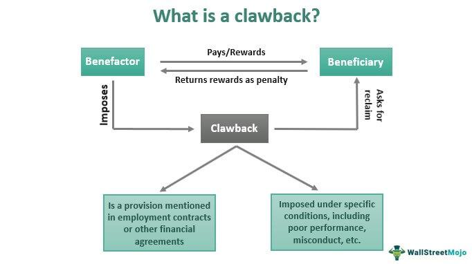

In the fast-evolving world of finance, certain terms and concepts such as 'compensation clawback', 'finance', and 'algorithmic trading' have gained considerable prominence. Compensation clawbacks are mechanisms through which companies can reclaim bonuses, stock options, or other incentives from employees, typically in response to misconduct or errors that negatively impact the organization. These clawbacks are particularly significant in financial services where they serve to protect company interests and encourage ethical behavior.

Finance, as a broader discipline, encompasses various tools and strategies aimed at managing risks, enhancing accountability, and ensuring stability within volatile markets. In this context, compensation clawbacks are employed to align executive compensation with long-term performance and risk management goals, thereby fostering a culture of responsibility and compliance among finance professionals.

Algorithmic trading, on the other hand, uses sophisticated software to execute trades on financial markets with incredible speed and efficiency. While this technology presents numerous opportunities for profit, it also introduces new challenges concerning compensation policies. The rapid and high-volume nature of algorithmic trading can, if not properly managed, lead to substantial financial losses. As a result, clawbacks in this area are implemented to ensure accountability for trading strategies that fail to deliver expected outcomes.

This article examines how compensation clawbacks function within the framework of financial services and algorithmic trading, illustrating their role in risk mitigation and alignment of executive interests with company goals. By exploring the interaction of these concepts, we aim to uncover their implications for financial institutions and traders as they navigate a landscape characterized by technological advancement and regulatory scrutiny.

## Table of Contents

## Understanding Compensation Clawbacks

Compensation clawbacks are contractual provisions allowing employers to reclaim bonuses, stock options, or other incentives previously awarded to employees under specific circumstances. The concept gained prominence in light of corporate scandals and financial crises, where unethical behavior or misguided decision-making underscored the need for mechanisms to protect company interests and promote ethical conduct within organizations.

Historically, clawbacks have been most prevalent in the context of executive compensation. Executives often hold positions of significant responsibility and influence, and the potential for misconduct or strategic misalignment is higher. Therefore, clawbacks serve as a deterrent against actions that might prioritize short-term gains over the long-term health of the organization. For example, executives may be incentivized to engage in aggressive accounting practices to inflate short-term profits, inadvertently risking the company's future. Clawbacks can discourage such practices by holding executives financially accountable for their decisions.

The legal foundation for clawbacks has been reinforced across various jurisdictions, leading to their establishment as a crucial aspect of financial governance and compliance. In the United States, the Dodd-Frank Wall Street Reform and Consumer Protection Act of 2010 mandated that firms create policies to claw back executive compensation in cases of financial restatements due to material noncompliance with financial reporting requirements. This regulatory push emphasizes the role of clawbacks in enhancing accountability and transparency within companies.

The mechanics of implementing clawbacks are complex and [carry](/wiki/carry-trading) implications for finance professionals and traders. When designing clawback policies, firms must consider the precise conditions under which clawbacks will be triggered and the methods for reclaiming compensation. These can include:

1. Fraud or misconduct by an employee resulting in significant company losses.
2. Misstatement of financial results that subsequently require correction.
3. Breach of contract or violation of company policy.

By establishing clear criteria for these scenarios, companies ensure that clawbacks are enforceable and minimize the likelihood of legal disputes.

Furthermore, compensation clawbacks influence how finance professionals and traders approach their responsibilities. A well-structured clawback policy aligns employees' interests with those of the company, encouraging them to prioritize ethical behavior and long-term value creation over short-term performance metrics. This alignment fosters a culture of accountability and prudence, essential factors for sustainable growth and stability in financial markets.

## The Role of Finance in Compensation Clawbacks

In the financial sector, compensation clawback provisions play a vital role in maintaining stability and accountability, particularly in the context of volatile markets. These provisions are employed by financial institutions as a key risk management tool, designed to protect against unethical behavior, errors, or omissions that might otherwise jeopardize the institution or its stakeholders. Clawbacks serve as a deterrent against actions that could lead to financial or reputational damage, thus reinforcing ethical standards and compliance within the organization.

The Dodd-Frank Wall Street Reform and Consumer Protection Act, also known as the Dodd-Frank Act, underscores the importance of clawback implementation, particularly concerning executive compensation. In the wake of financial crises, such regulatory guidelines have been established to prevent excessive risk-taking by executives whose decisions can have far-reaching impacts. The Dodd-Frank Act mandates that publicly traded companies must adopt policies to recover incentive-based compensation, aligning executive rewards with the long-term health and stability of the company.

For financial firms, striking a balance between incentivizing high performance and ensuring measures are in place to reclaim compensation in cases of misconduct or errors is crucial. Clawback policies must be structured in a way that they not only serve the purpose of recourse but also cultivate an organizational culture emphasizing integrity. This involves clear and enforceable policy definitions that delineate the conditions triggering clawback actions and the exact compensations subject to recovery.

By instituting well-designed clawback policies, financial organizations can foster a culture of ethical behavior and compliance, thus safeguarding their interests and enhancing their reputational standing. As financial environments evolve, the ability to swiftly adapt clawback measures to encompass emerging risks and regulatory changes will be vital in ensuring the ongoing resilience and success of financial institutions.

## Algorithmic Trading and Compensation Clawbacks

Algorithmic trading has transformed the landscape of financial markets, enabling the execution of trades with remarkable speed and precision. However, these sophisticated trading techniques come with unique challenges, particularly regarding compensation policies such as clawbacks. Traders leveraging algorithms are often responsible for handling large volumes of transactions and substantial assets. When these algorithms malfunction or are mismanaged, they can result in significant financial losses for a firm. This high-risk environment necessitates the implementation of compensation clawbacks to maintain accountability for ineffective or damaging algorithmic strategies.

Firms engaged in [algorithmic trading](/wiki/algorithmic-trading) must develop and implement clawback policies that account for the specific risks inherent in these trading strategies. Traditional compensation policies may not adequately cover scenarios where algorithmic trading leads to unintended consequences. Therefore, companies need to tailor their compensation clawbacks to address the technological and operational risks associated with algorithm-driven trading activities.

The rapid advancement of technology has introduced [machine learning](/wiki/machine-learning) and [artificial intelligence](/wiki/ai-artificial-intelligence) into trading platforms, further complicating the landscape. These technologies, while enhancing trading capabilities, also demand novel compensation structures. The complexity and unpredictability of machine learning models require firms to design clawback mechanisms that align with the data-driven nature of these tools. For instance, a clawback policy might consider the accuracy and reliability of past model predictions and the degree of human oversight involved in the trading decisions.

Moreover, as data-driven decision-making becomes more prevalent, firms need to ensure that their clawback policies incentivize not only technological innovation but also ethical and responsible use of these advanced tools. By aligning compensation structures with technological advancements, firms can reinforce the importance of accountability and encourage traders to adopt thorough verification processes for their algorithmic models.

In summary, the integration of algorithmic trading requires companies to revisit their compensation clawback strategies. As firms navigate the rapidly evolving landscape of technological innovations, they must ensure that their policies reflect both regulatory requirements and the ethical considerations inherent in modern financial practices.

## Legal and Ethical Implications

Clawback provisions present numerous legal and ethical challenges that financial institutions must address effectively. Legally, the drafting of comprehensive and clear clawback policies is essential to avoid potential disputes and ensure enforceability in various jurisdictions. This involves precise language to outline the circumstances under which clawbacks can be invoked, the methods of recovery, and the respective rights and obligations of both the employer and the employee. Regulations such as the Dodd-Frank Wall Street Reform and Consumer Protection Act have further underscored the necessity for clear policy frameworks, stipulating conditions under which clawbacks must be enforced to maintain financial integrity.

Ethically, clawbacks reinforce the moral accountability of finance professionals to their investors and the public. They act as a deterrent to misconduct by ensuring that financial gains obtained through unethical or erroneous practices can be reclaimed. This mechanism aligns the interests of executives with those of the company and its stakeholders, prompting decisions that favor long-term stability over short-term gains.

However, ethical considerations also require that firms implement clawback policies with fairness to avoid penalizing employees for outcomes not directly under their control. In practice, a rigorous assessment of the causes behind financial performance is necessary to determine whether clawback actions are justified. For instance, in algorithmic trading, where outcomes could be influenced by external market factors or unforeseen technological failures, clawbacks should be applied judiciously, balancing deterrence of misconduct with fairness to the employee.

Effectively navigating these legal and ethical implications helps build trust between companies, their shareholders, and the broader financial community. By fostering a culture of accountability and moral responsibility, clawbacks serve to protect the institution's reputation and promote sustainable financial practices.

## Conclusion

Compensation clawbacks, finance, and algorithmic trading collectively shape the strategic landscape of contemporary financial management. These mechanisms serve to synchronize executive compensation with long-term organizational objectives while addressing the inherent risks associated with rapid technological advancement. The fast-paced innovation in financial systems, underscored by algorithmic trading, necessitates that institutions diligently monitor and adapt their compensation frameworks, including clawback policies.

The implementation of a robust clawback strategy is pivotal not only in safeguarding a firm's immediate interests but also in fortifying its reputation and credibility on the global stage. As these strategies deter unethical behavior and ensure compliance, they foster a culture of accountability and integrity, crucial for sustained success in highly regulated financial markets.

Looking to the future, the financial sector must remain agile in adapting its compensation policies to reflect evolving regulatory, ethical, and technological environments. Changes in legislation, advances in artificial intelligence, and shifts in market dynamics will require businesses to reassess and refine their clawback policies continuously. This proactive approach ensures that institutions are not only prepared for emerging challenges but are also positioned to capitalize on new opportunities, ultimately leading to enhanced stability and growth in the financial domain.

## References & Further Reading

[1]: Admati, A. R., & Hellwig, M. F. (2013). ["The Bankers' New Clothes: What's Wrong with Banking and What to Do about It"](https://archive.org/details/bankersnewclothe0000adma). Princeton University Press.

[2]: ["Dodd-Frank Wall Street Reform and Consumer Protection Act"](https://www.congress.gov/111/plaws/publ203/PLAW-111publ203.pdf) - U.S. Federal Law, 2010.

[3]: Ederer, F., & Manso, G. (2013). ["Is Pay for Performance Detrimental to Innovation?"](https://www.jstor.org/stable/23443866) The Journal of Finance.

[4]: Jain, P. K. (2005). ["Financial Market Design and the Equity Premium: Electronic vs. Floor Trading."](https://onlinelibrary.wiley.com/doi/10.1111/j.1540-6261.2005.00822.x) Journal of Financial Markets.

[5]: Kirkpatrick, C. D., & Dahlquist, J. R. (2010). ["Technical Analysis: The Complete Resource for Financial Market Technicians"](https://ptgmedia.pearsoncmg.com/images/9780134137049/samplepages/9780134137049.pdf). FT Press.

[6]: Lopez de Prado, M. (2018). ["Advances in Financial Machine Learning"](https://www.amazon.com/Advances-Financial-Machine-Learning-Marcos/dp/1119482089). Wiley.

[7]: Malkiel, B. G. (2019). ["A Random Walk Down Wall Street: The Time-tested Strategy for Successful Investing"](https://yourknowledgedigest.org/wp-content/uploads/2020/04/a-random-walk-down-wall-street.pdf). W.W. Norton & Company.

[8]: Snider, C., & Youle, T. (2010). ["Does the Timing of Market Events Support Adaptive Market Efficiency"](https://papers.ssrn.com/sol3/papers.cfm?abstract_id=1569603.). Journal of Applied Econometrics.