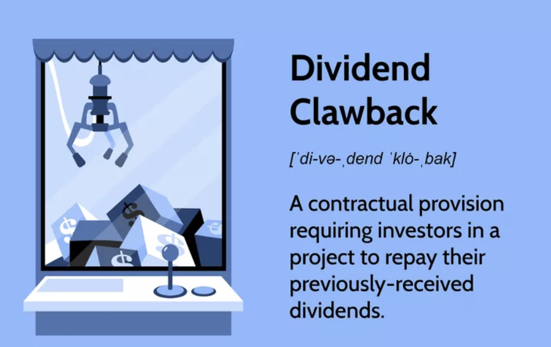

## Table of Contents

## What is a clawback mechanism?

A clawback mechanism is a way for companies or governments to take back money or benefits they have given out. It's like a safety net that lets them get their money back if certain conditions are not met. For example, if a company gives a bonus to an employee but later finds out the employee did something wrong, the company can use a clawback to get the bonus back.

Clawbacks are used in many different situations. In businesses, they might be part of executive pay deals to make sure leaders do their job well. If they don't, the company can claw back their bonuses. Governments also use clawbacks to make sure taxpayer money is spent correctly. For instance, if a company gets money from the government for a project but doesn't finish it, the government can claw back the funds.

## Why are clawback mechanisms important in financial regulations?

Clawback mechanisms are important in financial regulations because they help make sure people and companies do the right thing. If someone gets money but doesn't follow the rules, a clawback lets the money be taken back. This makes people think twice before doing something wrong because they know they might have to give the money back. It's like a safety rule that keeps everyone honest.

These mechanisms also help protect taxpayers and investors. When companies get money from the government or investors, they need to use it the right way. If they don't, clawbacks make sure that the money can be returned. This means that the money given out is used wisely and not wasted. It's a way to keep trust in the financial system and make sure everyone plays by the rules.

## Can you provide a simple example of a clawback mechanism in action?

Imagine a big company that gives its CEO a huge bonus at the end of the year. The company says the bonus is only good if the CEO does a great job and the company makes a lot of money. But later, people find out that the CEO made some bad choices and the company lost money because of it. The company uses a clawback to take the bonus back from the CEO. This makes sure the CEO can't keep the money if they didn't do their job right.

In another example, the government gives money to a small business to help it grow and create new jobs. The business promises to use the money to buy new equipment and hire more workers. But after a while, the government checks and sees that the business didn't do what it promised. Instead of buying equipment and hiring people, the business spent the money on other things. The government then uses a clawback to get the money back, so it can give it to another business that will use it the right way.

## How do clawback mechanisms differ across industries?

Clawback mechanisms can be different in each industry because each one has its own rules and needs. In the finance world, clawbacks are often used to make sure that bank leaders and other big bosses do their job well. If they make risky choices that hurt the bank, the bank can take back their bonuses. This helps keep the bank safe and makes sure the leaders think about what's best for the bank, not just their own pockets. In the tech industry, clawbacks might be used when a company gives money to a startup or a project. If the startup doesn't meet its goals or spends the money the wrong way, the company can use a clawback to get the money back.

In healthcare, clawbacks can be used to make sure that money given to hospitals or clinics is spent on helping patients. If a hospital gets money to buy new machines but uses it for something else, the government or the funding group can take the money back. This helps make sure that healthcare money is used to help people get better. In the energy sector, clawbacks might be used to make sure that companies use money given to them for green projects correctly. If a company says it will build a wind farm but doesn't do it, the government can use a clawback to get the money back and give it to another company that will do what it promised.

## What are the legal frameworks supporting clawback mechanisms in the United States?

In the United States, clawback mechanisms are supported by several legal frameworks. One key law is the Dodd-Frank Wall Street Reform and Consumer Protection Act, passed in 2010. This law lets companies take back money from top bosses if they find out the company's financial reports were wrong because of the bosses' actions. It helps make sure leaders are honest and careful with the company's money. The Securities and Exchange Commission (SEC) makes sure companies follow these rules.

Another important part of the legal support for clawbacks comes from the Sarbanes-Oxley Act of 2002. This law was made after some big companies did bad things with their money. It says that if a company has to fix its financial reports because of something a boss did wrong, the boss has to give back any bonuses or profits they made from selling company stock in the last year. This law helps keep company leaders honest and protects investors. Both of these laws show how the U.S. government tries to make sure companies and their leaders do the right thing with money.

## How do companies implement clawback policies in their corporate governance?

Companies put clawback policies into their corporate rules by writing them into their contracts and rules for leaders. They make sure everyone knows about these rules by putting them in the big book of company rules, called the bylaws, and in the contracts they give to top bosses. This way, everyone understands that if they don't do their job right or if they do something wrong, the company can take back any money or bonuses they got. It's like a promise that keeps leaders honest and makes sure they think about what's best for the company.

To make these clawback policies work, companies also set up ways to check if leaders are doing what they're supposed to. They might have special groups inside the company, like an audit committee, that keep an eye on the leaders and the company's money. If something goes wrong, this group can start the process to take back any money that was given out wrongly. This helps keep the company safe and makes sure everyone follows the rules.

## What are the challenges companies face when enforcing clawback mechanisms?

Companies can face a lot of problems when they try to use clawback mechanisms. One big problem is that it can be hard to find out if someone did something wrong and if the clawback should be used. It takes time and money to check everything and make sure the rules were broken. Also, people might not like it if the company tries to take back money they already got. This can make things hard inside the company and make people feel upset or angry.

Another challenge is that the laws about clawbacks can be different in each place. This means a company might have to follow different rules depending on where they are. It can be confusing and hard to make sure they are doing everything right. Plus, if the company wants to take money back, they might need to go to court. Going to court can be slow and expensive, and sometimes the company might not win, which makes it even harder to use clawbacks.

## Can you explain the role of clawback mechanisms in executive compensation?

Clawback mechanisms play a big role in making sure that top bosses, or executives, do their jobs well. When a company gives a bonus or extra money to an executive, they might say that the money can be taken back if the executive doesn't do what they promised. For example, if the executive makes bad choices that hurt the company, the company can use a clawback to get the money back. This makes executives think carefully about their decisions because they know they might lose their bonus if they mess up.

These mechanisms help keep executives honest and focused on what's best for the company. If an executive knows their bonus can be taken away, they are more likely to follow the rules and do a good job. This is good for the company because it means the leaders are working hard to make the company successful. It also helps protect the company's money and makes sure that the bonuses are only given to people who really deserve them.

## How have recent regulatory changes affected the use of clawback mechanisms?

Recent changes in rules have made clawback mechanisms more common and stronger. One big change came from the Dodd-Frank Act, which made it a must for public companies to have clawback rules. This means more companies now have to take back money from leaders if they do something wrong with the company's money. These new rules help make sure that leaders are honest and careful with the company's money.

Another change is that the rules for clawbacks are becoming clearer and easier to understand. This helps companies know exactly when and how they can take back money. It also makes it easier for them to use clawbacks without going to court all the time. These changes are helping companies use clawbacks more often and making sure that leaders do their job right.

## What are some notable case studies where clawback mechanisms were effectively used?

One famous case where a clawback was used happened with Wells Fargo. The bank had to pay back a lot of money because some workers opened fake accounts to get bonuses. The leaders got big bonuses, but when the fake accounts were found out, the bank used a clawback to take back some of the money from the leaders. This showed everyone that even big bosses have to follow the rules and can lose their bonuses if they don't.

Another example is with the company Enron. Enron's leaders made the company's money look better than it really was, and they got big bonuses for it. But when the truth came out, the government used the Sarbanes-Oxley Act to make the leaders give back their bonuses. This case helped show why clawbacks are important and made other companies think twice before doing anything wrong with their money.

## How do international clawback mechanisms vary, and what are some examples from different countries?

Clawback mechanisms can be different in each country because they have their own laws and ways of doing things. In the United States, the Dodd-Frank Act and the Sarbanes-Oxley Act help companies take back money if leaders do something wrong. In the UK, the Financial Conduct Authority has rules that let banks take back bonuses if leaders make risky choices that hurt the bank. In Australia, the Corporations Act lets companies claw back money if leaders break the law or if the company's money reports are wrong. Each country's rules are a bit different, but they all want to make sure leaders do the right thing with the company's money.

In Germany, the clawback rules are part of the banking laws, which say that banks can take back bonuses if leaders do something that hurts the bank. In Canada, the rules are a bit like the U.S., but they focus more on making sure companies are honest with their money reports. In Japan, clawbacks are not as common, but the Financial Instruments and Exchange Act lets companies take back money if leaders break the rules. These examples show that while clawback mechanisms are used around the world, the specific rules and how they work can be very different from one country to another.

## What future trends might influence the development and application of clawback mechanisms?

In the future, more rules might make clawbacks even more common. Governments and big rule-makers might see how helpful clawbacks are in making leaders do their job right and keep companies honest. They might make new laws that say more companies have to use clawbacks. Also, as more people learn about clawbacks, they might want companies to use them more often to make sure their money is safe. This could mean that clawbacks become a bigger part of how companies work and how they pay their leaders.

Technology might also change how clawbacks work. With new ways to check and watch over money, it could be easier for companies to see if someone did something wrong and use a clawback faster. Computers and special programs can help find problems quickly, so companies can take back money before it's too late. This could make clawbacks stronger and more useful in keeping companies and their leaders honest.

## References & Further Reading

[1]: Admati, A. R., & Hellwig, M. F. (2013). ["The Bankers' New Clothes: What's Wrong with Banking and What to Do about It"](https://archive.org/details/bankersnewclothe0000adma). Princeton University Press.

[2]: ["Dodd-Frank Wall Street Reform and Consumer Protection Act"](https://www.congress.gov/111/plaws/publ203/PLAW-111publ203.pdf) - U.S. Federal Law, 2010.

[3]: Ederer, F., & Manso, G. (2013). ["Is Pay for Performance Detrimental to Innovation?"](https://www.jstor.org/stable/23443866) The Journal of Finance.

[4]: Jain, P. K. (2005). ["Financial Market Design and the Equity Premium: Electronic vs. Floor Trading."](https://onlinelibrary.wiley.com/doi/10.1111/j.1540-6261.2005.00822.x) Journal of Financial Markets.

[5]: Kirkpatrick, C. D., & Dahlquist, J. R. (2010). ["Technical Analysis: The Complete Resource for Financial Market Technicians"](https://ptgmedia.pearsoncmg.com/images/9780134137049/samplepages/9780134137049.pdf). FT Press.

[6]: Lopez de Prado, M. (2018). ["Advances in Financial Machine Learning"](https://www.amazon.com/Advances-Financial-Machine-Learning-Marcos/dp/1119482089). Wiley.

[7]: Malkiel, B. G. (2019). ["A Random Walk Down Wall Street: The Time-tested Strategy for Successful Investing"](https://yourknowledgedigest.org/wp-content/uploads/2020/04/a-random-walk-down-wall-street.pdf). W.W. Norton & Company.

[8]: Snider, C., & Youle, T. (2010). ["Does the Timing of Market Events Support Adaptive Market Efficiency"](https://papers.ssrn.com/sol3/papers.cfm?abstract_id=1569603.). Journal of Applied Econometrics.