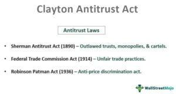

The Clayton Antitrust Act, enacted in 1914, stands as a significant advancement in U.S. antitrust law. This legislation was introduced with the intent to promote fairness in industrial practices and to enhance competition within markets. Its primary purpose was to address and mitigate anti-competitive behaviors that earlier laws, such as the Sherman Act of 1890, had not adequately managed. Recognizing the gaps and limitations in existing regulatory frameworks, the Clayton Act sought to clarify and extend the provisions of its predecessors.

The Act specifically targeted anti-competitive practices, including price discrimination, corporate mergers, and monopolistic actions, thereby fortifying the legislative efforts against market manipulation and monopolies. It distinguished itself by introducing specific measures to prevent such behaviors, which were seen as detrimental to a fair competitive landscape.

Beyond its initial enactment, the Clayton Antitrust Act has undergone several amendments, each intended to refine and broaden its scope to better align with evolving market conditions. These amendments have been instrumental in maintaining the Act's relevance over time.

As we examine the continuing legacy and impact of the Clayton Antitrust Act, it is crucial to consider its amendments, its role in shaping contemporary business practices, and its ongoing significance in the context of modern economic activities, such as algorithmic trading. By doing so, we can understand how this landmark legislation has adapted and will continue to adapt to ensure competitive fairness in increasingly complex market environments.

## Table of Contents

## Understanding the Clayton Antitrust Act

The Clayton Antitrust Act, enacted in 1914, was a legislative effort led by Representative Henry De Lamar Clayton to address and build upon the shortcomings of the Sherman Act of 1890. This earlier legislation aimed to prohibit monopolistic practices but had limitations that the Clayton Act sought to remedy. The primary objective was to provide clearer and more detailed regulations to prevent anti-competitive practices in the marketplace.

One of the key areas addressed by the Clayton Act is price discrimination. This occurs when a seller charges different prices to different buyers for the same product or service, in a manner that harms competition. The Act explicitly prohibits such conduct under certain conditions, aiming to ensure that competition remains fair and that no customer is unfairly disadvantaged. By curtailing discriminatory pricing practices, the Act promotes a level playing field in various industries.

Additionally, the Clayton Act governs mergers and acquisitions. It sought to prevent corporations from achieving monopoly power through the consolidation of companies. Under the Act, mergers or acquisitions that might substantially lessen competition or tend to create a monopoly are prohibited. This requirement allows for the scrutiny of potential mergers before they are finalized, empowering regulatory bodies to intervene if necessary.

The duties of corporate directors also fall under the scope of the Clayton Act. It outlines specific prohibitions against interlocking directorates, where individuals serve on the boards of competing companies simultaneously. This practice can undermine fair competition by facilitating collusion and coordination between firms that should be rivals. By addressing this issue, the Act further seeks to sustain competition by preventing conflicts of interest that could lead to collaborative anti-competitive behavior.

The Clayton Act's unique provisions include Section 7, which is notably stringent on mergers that might reduce market competition. This section is fundamental to the Act's role in maintaining an open and competitive market environment. Also, the Act introduces regulations more explicitly tailored to the conduct and operations of corporations, differentiating itself from the broader prohibitions of the Sherman Act.

In summary, the Clayton Antitrust Act was crafted to supplement the Sherman Act by specifying actions and practices that directly or indirectly impede fair competition within the market. It targets key issues like price discrimination, mergers and acquisitions, and corporate governance. These provisions are designed to combat anti-competitive mergers and practices, ensuring competitive markets that benefit consumers and promote economic efficiency.

## Historical Amendments and Their Implications

### Historical Amendments and Their Implications

The Clayton Antitrust Act of 1914 has been pivotal in shaping U.S. competition policy, undergoing several significant amendments to address emerging economic challenges and further refine its scope. These statutory modifications not only broadened the Act's application but also strengthened its regulatory framework.

#### The Robinson-Patman Act of 1936

The Robinson-Patman Act stands as a crucial amendment to the Clayton Act, primarily focusing on curbing price discrimination. Introduced in response to the growing influence of large chain stores in the 1930s, the Act sought to ensure fair competition by requiring sellers to offer the same price terms to all buyers of similar products. The legislative intent was to protect smaller retailers from being undercut by bigger competitors who could leverage economies of scale to secure preferential pricing. The Robinson-Patman Act aimed to create an equitable market landscape and is particularly relevant for entities involved in wholesaling and distribution. The Act’s application requires careful legal and economic analysis, as its enforcement hinges on demonstrating that discriminatory pricing substantially lessens competition or tends to create a monopoly.

#### The Celler-Kefauver Act of 1950

The Celler-Kefauver Act, passed in 1950, further strengthened anti-merger provisions originally outlined in the Clayton Act. Prior to this amendment, the focus was predominantly on horizontal mergers—those between firms competing directly in the same market. The Celler-Kefauver Act expanded this scope by targeting vertical and conglomerate mergers that could jeopardize competitive market structures. By closing loopholes that previous legislation had not addressed, this Act sought to prevent anti-competitive combinations that could arise from companies seeking to consolidate their market power through diverse, non-horizontal mergers. The Act was pivotal in limiting mergers that, while not direct competitors, could nonetheless stifle competition through control of supply chains or a broad range of markets.

#### The Hart-Scott-Rodino Antitrust Improvements Act of 1976

The Hart-Scott-Rodino (HSR) Antitrust Improvements Act introduced a critical procedural enhancement to antitrust law enforcement by mandating pre-merger notifications. Under this Act, companies planning significant mergers or acquisitions must file detailed reports with the Federal Trade Commission and the Department of Justice's Antitrust Division before completing their transactions. This preemptive measure allows regulatory bodies to assess potential competitive impacts of proposed mergers and take action if necessary, preventing anti-competitive mergers before they can be finalized. The HSR Act has become a fundamental component of antitrust enforcement, providing authorities with the necessary tools to scrutinize mergers and maintain competitive market conditions effectively.

These amendments have played a vital role in adapting and reinforcing the Clayton Act’s objectives to the evolving economic and commercial landscape. By addressing price discrimination, tightening merger controls, and enhancing regulatory oversight, they have ensured the Act's continuing relevance in safeguarding competitive practices within the U.S. economy.

## The Role of the Clayton Act in Protecting Labor Unions

Section 6 of the Clayton Antitrust Act plays a crucial role in the legal framework supporting labor unions in the United States. Unlike previous legislation, this section explicitly exempts labor, agricultural, and horticultural organizations from being considered "illegal combinations or conspiracies in restraint of trade," effectively shielding them from antitrust prosecution. This exemption recognizes the fundamental difference between trade organizations formed to curtail competition and labor unions designed to improve working conditions and wages through collective action.

By affirming the legality of labor unions, the Clayton Act provides substantial protection for workers engaging in peaceful strikes and other forms of collective bargaining. These activities, essential for negotiating fair employment terms, are supported by the Act’s legal framework, thus reinforcing the bargaining power of labor unions. This protection allows unions to organize without the fear of antitrust litigation, promoting a balance between employer interests and employee rights.

The legal shield offered by the Clayton Act also underscores its influence on labor rights development in the 20th century. By securing the right to organize and engage in concerted activities for mutual aid, the Act contributed significantly to the growth of the labor movement in the U.S. and helped establish a precedent for future legislation aimed at protecting collective labor rights.

Overall, Section 6 of the Clayton Act remains a vital component in safeguarding labor unions against undeserved legal challenges, thereby supporting their role as advocates for workers' rights and equitable labor practices.

## Enforcement and Impact of the Clayton Antitrust Act

The enforcement of the Clayton Antitrust Act is primarily the responsibility of the U.S. Department of Justice's Antitrust Division and the Federal Trade Commission (FTC). These agencies play vital roles in monitoring and regulating industry practices to ensure compliance with antitrust laws. The Antitrust Division is tasked with criminal enforcement, targeting explicit anti-competitive actions such as price fixing and bid rigging, while the FTC focuses on civil enforcement, addressing a broad spectrum of anti-competitive practices.

The Clayton Act empowers these bodies to take legal actions against firms that engage in unlawful mergers or acquisitions and other activities that substantially lessen competition. The significance of their role is underscored by their ability to issue cease and desist orders, impose fines, and, in severe cases, break up companies that violate antitrust laws. One of the key strengths of the Act is its provision for treble damages, which allows private entities harmed by anti-competitive practices to sue for three times the amount of their actual damages. This incentivizes private parties to act as watchdogs, further deterring potential violations.

The impact of the Clayton Act is evident in the numerous court cases and legal actions that have redefined corporate behaviors. These cases set precedents that influence future interpretations and applications of the Act, fostering a more competitive business environment. The Act's enforcement, through both public and private legal actions, strengthens market competition by discouraging monopolistic practices and promoting fair trading conditions. Consequently, consumers benefit from lower prices and more choices, while competitors engage on a more level playing field. 

Overall, the Clayton Antitrust Act's enforcement framework is critical in shaping the competitive landscape of U.S. markets and safeguarding the principles of fair competition. As markets evolve, especially with the advent of digital economies and [algorithmic trading](/wiki/algorithmic-trading), the ongoing adaptability and rigorous enforcement of this legislation ensure its continued relevance and efficacy.

## Interplay Between Clayton Antitrust Act and Algorithmic Trading

Algorithmic trading, a significant force in today's financial markets, leverages technology to execute orders at high speed and frequency, posing unique challenges for antitrust regulations. The principles of the Clayton Antitrust Act, aimed at promoting fairness and competition, must adapt to effectively oversee the potential anti-competitive behaviors stemming from these advanced trading systems.

The Clayton Act's provisions, designed to address price discrimination and anti-competitive mergers, can be applied to monitor and regulate algorithmic trading practices. Algorithms can potentially manipulate markets by executing trades that influence asset prices or compel competitors to react in a manner that undermines market integrity. This behavior can be linked to the Act’s emphasis on preventing monopolistic practices and ensuring a level playing field.

One critical aspect of the Act in the context of algorithmic trading is the prevention of predatory practices, which may manifest through high-frequency trading strategies. These strategies could lead to unfair advantages, exert market control, or squeeze profit margins for small competitors. For instance, by deploying algorithms that swiftly interpret and act upon market signals, some firms might create artificial price movements or crowd out slower competitors, threatening competitive conditions that the Clayton Act seeks to protect.

Furthermore, the adaptability of the Clayton Act is crucial for addressing the challenges posed by modern financial technologies. In digital marketplaces, algorithms can coordinate actions across various platforms, raising the potential for collusion-like effects without direct human intervention. The Act’s ability to evolve permits regulators to scrutinize such practices, ensuring that technological advancements do not erode competitive market structures or consumer welfare.

Additionally, the Act empowers regulatory bodies to enforce penalties and advocate for fair practices through legal mechanisms. By leveraging data analytics and market surveillance technologies, authorities can uncover hidden patterns indicative of anti-competitive behavior. As technologies continue to advance, the Clayton Act may require further adjustments or complementary legislation to maintain its efficacy. The ongoing examination of algorithmic trading strategies under the antitrust lens demonstrates the Act's enduring relevance, proving its capacity to uphold competition in ever-evolving market landscapes. 

By continuously refining its application, the Clayton Antitrust Act remains a vital tool in counteracting potential abuses within algorithmic trading and preserving the integrity of competitive financial environments.

## Conclusion

The Clayton Antitrust Act remains a cornerstone of U.S. antitrust legislation, demonstrating a remarkable ability to adapt to the demands of evolving markets. Enacted over a century ago, its provisions were crafted to address anti-competitive practices that previous laws had insufficiently targeted. The Act continues to exert a significant influence on business practices by providing a legal framework that encourages fair competition and curtails monopolistic behavior. 

In the rapidly changing technological landscape, the principles set out by the Clayton Act are increasingly relevant. As businesses integrate complex technologies and digital platforms, enforcement of antitrust provisions encounters new challenges. The advent of algorithmic trading and digital marketplaces raises intricate questions about market manipulation and competitive fairness, urging modifications to existing legal interpretations.

Adapting the Clayton Act involves not only revising legislative text but also enhancing enforcement mechanisms. Agencies such as the U.S. Department of Justice and the Federal Trade Commission play a crucial role in this ongoing adaptation, ensuring that the Act's spirit remains intact as economic and technological conditions shift. Continuous amendments and strategic enforcement efforts are pivotal for maintaining the Act's effectiveness in safeguarding competition in various market sectors.

As global markets and technologies evolve at unprecedented rates, the Clayton Antitrust Act will likely face further amendments. These anticipated changes will aim to balance innovation with fair competition, ensuring that the legislation remains as relevant and impactful as it was when first enacted. Thus, while originally passed in the early 20th century, the Clayton Act's foundational objectives continue to be pertinent, guiding the regulation of intricate, modern business landscapes.

## References & Further Reading

[1]: Bork, R. H. (1978). ["The Antitrust Paradox: A Policy at War with Itself."](https://www.amazon.com/Antitrust-Paradox-Policy-War-Itself/dp/1736089714) Basic Books.

[2]: Hovenkamp, H. (2011). ["The Antitrust Enterprise: Principle and Execution."](https://www.amazon.com/Antitrust-Enterprise-Principle-Execution/dp/0674027418) Harvard University Press.

[3]: Posner, R. A. (2001). ["Antitrust Law, Second Edition."](https://press.uchicago.edu/ucp/books/book/chicago/A/bo3628468.html) University of Chicago Press.

[4]: Kovacic, W. E., & Shapiro, C. (2000). ["Antitrust Policy: A Century of Economic and Legal Thinking."](https://www.jstor.org/stable/2647050) Journal of Economic Perspectives, 14(1), 43-60.

[5]: Stigler, G. J. (1982). ["The Economists and the Problem of Monopoly."](https://ios23.classes.ryansafner.com/files/readings/Stigler-1982.pdf) The American Economic Review, 72(2), 1-11.