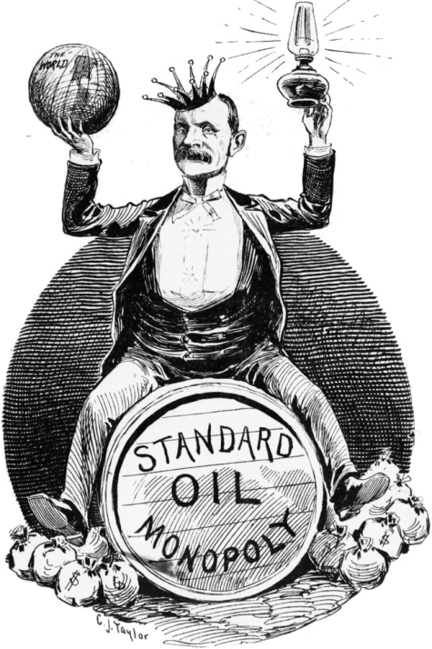

## Table of Contents

## What is the Clayton Antitrust Act?

The Clayton Antitrust Act is a law in the United States that was passed in 1914. It was created to help stop big companies from doing things that hurt smaller businesses and consumers. The law makes certain business practices illegal if they reduce competition. For example, it stops companies from having secret deals that give them special prices or from making agreements that stop other companies from selling their products.

One important part of the Clayton Antitrust Act is that it makes it illegal for companies to buy other companies just to control the market. This is called a merger. If a merger would make it hard for other companies to compete, it can be stopped. The law also protects workers by making it illegal for companies to punish them for joining unions. Overall, the Clayton Antitrust Act helps keep the market fair for everyone by making sure big companies don't have too much power.

## When was the Clayton Antitrust Act passed?

The Clayton Antitrust Act was passed in 1914. This law was made to stop big companies from doing things that hurt smaller businesses and consumers.

It makes certain business practices illegal if they reduce competition. For example, it stops companies from having secret deals that give them special prices or from making agreements that stop other companies from selling their products. It also helps keep the market fair by making sure big companies don't have too much power.

## What were the main goals of the Clayton Antitrust Act?

The main goals of the Clayton Antitrust Act were to stop big companies from hurting smaller businesses and consumers. The law wanted to make sure that the market stayed fair for everyone. It did this by making certain business practices illegal if they reduced competition. For example, the Act stopped companies from making secret deals that gave them special prices or from making agreements that stopped other companies from selling their products.

Another important goal was to prevent companies from buying other companies just to control the market. This is called a merger. If a merger would make it hard for other companies to compete, the Clayton Antitrust Act could stop it. The law also wanted to protect workers by making it illegal for companies to punish them for joining unions. Overall, the Act aimed to keep the market fair and prevent big companies from having too much power.

## How does the Clayton Antitrust Act differ from the Sherman Antitrust Act?

The Clayton Antitrust Act and the Sherman Antitrust Act are both important laws in the United States that aim to stop big companies from having too much power and hurting competition. The Sherman Antitrust Act, passed in 1890, was the first law of its kind. It made it illegal for companies to work together to control prices or to try to control a whole market. This law was very broad and sometimes hard to enforce because it didn't give specific examples of what was illegal.

The Clayton Antitrust Act, passed in 1914, was made to help fix some of the problems with the Sherman Antitrust Act. It gave more specific rules about what companies could and couldn't do. For example, it made it illegal for companies to have secret deals that gave them special prices or to make agreements that stopped other companies from selling their products. It also stopped companies from buying other companies just to control the market. This law was more detailed and easier to enforce than the Sherman Antitrust Act, and it also protected workers by making it illegal for companies to punish them for joining unions.

## What are the key provisions of the Clayton Antitrust Act?

The Clayton Antitrust Act has several important rules that help keep the market fair. One key rule is that it stops companies from having secret deals that give them special prices. This means companies can't make agreements with suppliers to get lower prices than their competitors. Another rule is that it stops companies from making agreements that prevent other companies from selling their products. This helps make sure that all companies have a fair chance to compete.

Another important part of the Clayton Antitrust Act is that it stops companies from buying other companies just to control the market. This is called a merger. If a merger would make it hard for other companies to compete, the law can stop it. This helps keep the market open for everyone. The law also protects workers by making it illegal for companies to punish them for joining unions. This means workers can join together to fight for better pay and working conditions without being afraid of losing their jobs.

Overall, the Clayton Antitrust Act helps make sure that big companies don't have too much power. It does this by making certain business practices illegal if they hurt competition. By setting these rules, the law helps keep the market fair for everyone, from small businesses to consumers.

## How has the Clayton Antitrust Act been amended over time?

The Clayton Antitrust Act has been changed a few times since it was first passed in 1914. One big change happened in 1936 with the Robinson-Patman Act. This new law made it even clearer that companies can't give special prices to some buyers and not others. It helped stop big companies from using their power to hurt smaller stores. Another important change came in 1950 with the Celler-Kefauver Act. This law made it harder for companies to buy other companies just to control the market. It stopped companies from buying the things another company uses to make its products, not just the company itself.

Over the years, courts have also helped shape the Clayton Antitrust Act by making decisions about what the law means. For example, in 1977, a court case called Continental T.V., Inc. v. GTE Sylvania Inc. said that companies can have rules about where their products can be sold, as long as these rules help competition. This was a big change because it showed that some business practices that might seem bad could actually be good for competition. These changes and court decisions have helped make the Clayton Antitrust Act stronger and more effective at keeping the market fair for everyone.

## What was the impact of the Robinson-Patman Act amendment on the Clayton Antitrust Act?

The Robinson-Patman Act, passed in 1936, was a big change to the Clayton Antitrust Act. It made the rules about special prices even clearer. Before this, big companies could sometimes give special prices to some buyers and not others, which hurt smaller stores. The Robinson-Patman Act stopped this by saying that companies can't give different prices to different buyers if it hurts competition. This helped make sure that all stores, big and small, had a fair chance to compete.

This amendment was important because it protected smaller businesses from being pushed out of the market by big companies. It made the Clayton Antitrust Act stronger by giving more details about what companies could and couldn't do with their prices. This helped keep the market fair for everyone, from small shops to big stores, and made sure that consumers had more choices.

## Can you explain the significance of the Celler-Kefauver Act amendment?

The Celler-Kefauver Act, passed in 1950, was an important change to the Clayton Antitrust Act. It made the rules about companies buying other companies, or merging, even stricter. Before this law, companies could buy the things another company used to make its products without buying the company itself. This was a way for big companies to control the market without breaking the law. The Celler-Kefauver Act stopped this by making it illegal for companies to buy the assets of another company if it would hurt competition.

This amendment was significant because it closed a big loophole in the Clayton Antitrust Act. It made it harder for big companies to grow by buying parts of other companies, which helped keep the market more open for smaller businesses. By stopping these kinds of mergers, the Celler-Kefauver Act helped make sure that the market stayed fair for everyone. This meant more competition, which is good for consumers because it can lead to better products and lower prices.

## How has the enforcement of the Clayton Antitrust Act evolved?

The enforcement of the Clayton Antitrust Act has changed a lot since it was first passed in 1914. At first, the law was hard to enforce because it was not very clear. Over time, other laws like the Robinson-Patman Act in 1936 and the Celler-Kefauver Act in 1950 made the rules more specific. These changes helped the government and courts understand better what companies could and couldn't do. The government agencies, like the Federal Trade Commission (FTC) and the Department of Justice (DOJ), got better at watching companies and making sure they followed the rules.

Court decisions have also played a big role in how the Clayton Antitrust Act is enforced. For example, in 1977, a court case called Continental T.V., Inc. v. GTE Sylvania Inc. changed how the law was seen. The court said that some business practices that might seem bad could actually help competition. This made the law more flexible. Over the years, the courts have kept making decisions that help shape how the Clayton Antitrust Act is used. These changes have made the law stronger and more effective at keeping the market fair for everyone.

## What are some notable cases that have shaped the interpretation of the Clayton Antitrust Act?

One important case that helped shape the Clayton Antitrust Act is the 1977 case called Continental T.V., Inc. v. GTE Sylvania Inc. In this case, the court said that some business practices that might look bad could actually help competition. The court decided that companies could have rules about where their products can be sold, as long as these rules made the market more competitive. This was a big change because it showed that the Clayton Antitrust Act could be more flexible and not just about stopping all business practices that might seem unfair.

Another notable case is the 1962 case of Brown Shoe Co. v. United States. In this case, the Supreme Court stopped a merger between two shoe companies because it would hurt competition. The court looked at how the merger could make it hard for other companies to compete and decided that it broke the Clayton Antitrust Act. This case was important because it showed that the law could stop mergers that might make the market less fair, even if the companies involved were not the biggest in their industry. These cases have helped make the Clayton Antitrust Act stronger and more effective at keeping the market fair for everyone.

## How does the Clayton Antitrust Act affect modern business practices?

The Clayton Antitrust Act still has a big impact on how companies do business today. It stops companies from making secret deals that give them special prices or from making agreements that stop other companies from selling their products. This helps make sure that all companies, big and small, have a fair chance to compete. For example, if a big company tries to buy a smaller company just to control the market, the Clayton Antitrust Act can stop it. This keeps the market open and competitive, which is good for consumers because they can choose from more products and possibly get better prices.

Over the years, changes like the Robinson-Patman Act and the Celler-Kefauver Act have made the Clayton Antitrust Act even stronger. These changes help the government and courts watch companies more closely and make sure they follow the rules. Because of this, companies today have to be careful about how they set their prices and make business deals. They need to make sure they are not hurting competition. This means that the Clayton Antitrust Act helps keep the market fair for everyone, from small businesses to big companies, and protects consumers by making sure they have choices and fair prices.

## What are the criticisms and limitations of the Clayton Antitrust Act?

Some people say the Clayton Antitrust Act has problems. One big problem is that it can be hard to tell if a company is breaking the law. The rules can be confusing, and companies might not know if they are doing something wrong. This can make it hard for the government to stop companies from hurting competition. Also, some people think the law does not do enough to stop big companies from getting even bigger. They say the Clayton Antitrust Act lets big companies buy smaller ones too easily, which can make it hard for new businesses to start and grow.

Another criticism is that the Clayton Antitrust Act can be slow to change with new business practices. The world of business is always changing, but the law stays the same unless it is changed by Congress. This means the law might not be able to stop new ways that companies try to hurt competition. For example, the rise of technology and online businesses has brought new challenges that the Clayton Antitrust Act might not be ready for. Overall, while the Clayton Antitrust Act helps keep the market fair, it has limits and needs to be watched and updated to work well.

## References & Further Reading

[1]: Bork, R. H. (1978). ["The Antitrust Paradox: A Policy at War with Itself."](https://www.amazon.com/Antitrust-Paradox-Policy-War-Itself/dp/1736089714) Basic Books.

[2]: Hovenkamp, H. (2011). ["The Antitrust Enterprise: Principle and Execution."](https://www.amazon.com/Antitrust-Enterprise-Principle-Execution/dp/0674027418) Harvard University Press.

[3]: Posner, R. A. (2001). ["Antitrust Law, Second Edition."](https://press.uchicago.edu/ucp/books/book/chicago/A/bo3628468.html) University of Chicago Press.

[4]: Kovacic, W. E., & Shapiro, C. (2000). ["Antitrust Policy: A Century of Economic and Legal Thinking."](https://www.jstor.org/stable/2647050) Journal of Economic Perspectives, 14(1), 43-60.

[5]: Stigler, G. J. (1982). ["The Economists and the Problem of Monopoly."](https://ios23.classes.ryansafner.com/files/readings/Stigler-1982.pdf) The American Economic Review, 72(2), 1-11.