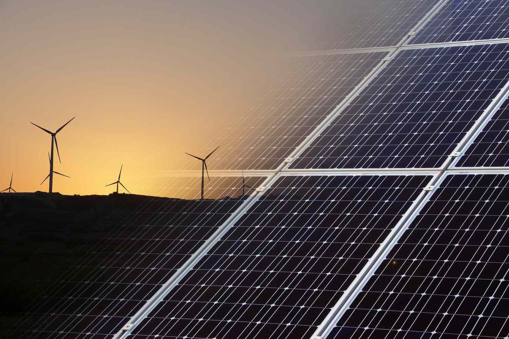

## Table of Contents

## What is clean energy and why is it important?

Clean energy is energy that comes from sources that don't harm the environment. These sources include things like the sun, wind, and water. They are called renewable because they can be used over and over again without running out. Clean energy is different from dirty energy, like coal and oil, which can pollute the air and water and cause harm to the planet.

Clean energy is important because it helps keep our planet healthy. When we use dirty energy, it can make the air dirty and cause problems like climate change. Climate change can lead to big changes in the weather, making it harder for plants and animals to live. By using clean energy, we can reduce these problems and help make sure the Earth stays a good place for everyone.

## What are the main drawbacks of using uranium for energy?

Using uranium for energy has some big problems. One big problem is that it makes nuclear waste. Nuclear waste is very dangerous and stays harmful for a long time. It's hard to find safe places to store this waste, and if it leaks, it can harm people and the environment. Another problem is the risk of accidents at nuclear power plants. Accidents can release dangerous radiation, which can make people sick and cause long-lasting damage to the area around the plant.

Another issue with uranium is that it's not renewable. Once we use up all the uranium we can find, we won't be able to make more. This means we have to find other ways to make energy in the future. Also, getting uranium out of the ground can be expensive and can harm the environment. Mining uranium can lead to polluted water and damaged land, which can hurt plants, animals, and people living nearby.

## What are some common renewable energy sources?

Some common renewable energy sources are solar power, wind power, and hydropower. Solar power uses energy from the sun. People put panels on their roofs or in big fields to catch the sun's energy and turn it into electricity. Wind power uses the wind to spin big turbines, which then make electricity. Hydropower uses the energy of moving water, like in rivers or dams, to create electricity.

Another common renewable energy source is geothermal energy. This uses heat from inside the Earth to make electricity. People drill deep into the ground to reach this heat and use it to create steam, which then powers turbines. Biomass is also a renewable energy source. It uses things like wood, crops, and even garbage to make energy. When these materials are burned, they release energy that can be used to make electricity or heat homes.

These renewable energy sources are important because they don't run out and they don't harm the environment as much as dirty energy sources like coal and oil. By using renewable energy, we can help keep our planet clean and healthy for the future.

## How does solar power work as an alternative to uranium?

Solar power works by using energy from the sun to make electricity. People put special panels on roofs or in big fields. These panels have cells that catch the sun's light and turn it into electricity. The electricity can then be used to power homes, schools, and businesses. Solar power is different from uranium because it doesn't make dangerous waste and it won't run out like uranium will.

Uranium is used in nuclear power plants to make electricity. When uranium is split, it creates a lot of heat, which is used to make steam that powers turbines. But using uranium can be risky because it makes nuclear waste that stays dangerous for a long time. Solar power is much safer and cleaner. It helps keep the air and water clean and doesn't harm the environment. That's why solar power is a good alternative to uranium for making energy.

## What is the process of generating wind energy and how does it compare to nuclear power?

Wind energy is made by using the wind to turn big machines called turbines. These turbines have long blades that spin when the wind blows. The spinning blades power a generator inside the turbine, which makes electricity. People often put these turbines in places where it's really windy, like on hills or out at sea. The electricity made by wind turbines can be used to power homes, schools, and businesses. Wind energy is good for the environment because it doesn't make any pollution or dangerous waste.

Compared to nuclear power, wind energy is much safer and cleaner. Nuclear power uses uranium to make heat, which then makes steam to power turbines and create electricity. But nuclear power can be risky because it makes nuclear waste that stays dangerous for a long time. Also, if something goes wrong at a nuclear power plant, it can be very dangerous for people and the environment. Wind energy doesn't have these problems. It's a renewable source of energy, meaning it won't run out like uranium will. So, wind energy is a better choice for keeping our planet healthy and safe.

## How can hydropower be used as a clean energy alternative?

Hydropower uses the energy of moving water to make electricity. People build dams on rivers to hold back the water. When they let the water flow through the dam, it turns a turbine. The turbine is connected to a generator, which makes electricity. This electricity can then be used to power homes, schools, and businesses. Hydropower is good for the environment because it doesn't make any pollution or dangerous waste like nuclear power does.

Compared to nuclear power, hydropower is much safer and cleaner. Nuclear power uses uranium to make heat, which then makes steam to power turbines and create electricity. But nuclear power can be risky because it makes nuclear waste that stays dangerous for a long time. Also, if something goes wrong at a nuclear power plant, it can be very dangerous for people and the environment. Hydropower doesn't have these problems. It's a renewable source of energy, meaning it won't run out like uranium will. So, hydropower is a better choice for keeping our planet healthy and safe.

## What role does geothermal energy play in replacing uranium-based energy?

Geothermal energy uses heat from inside the Earth to make electricity. People drill deep into the ground to reach this heat and use it to make steam. The steam then powers turbines, which make electricity. This electricity can be used to power homes, schools, and businesses. Geothermal energy is good for the environment because it doesn't make any pollution or dangerous waste.

Compared to uranium-based energy, geothermal energy is much safer and cleaner. Uranium is used in nuclear power plants to make heat, which then makes steam to power turbines and create electricity. But using uranium can be risky because it makes nuclear waste that stays dangerous for a long time. If something goes wrong at a nuclear power plant, it can be very dangerous for people and the environment. Geothermal energy doesn't have these problems. It's a renewable source of energy, meaning it won't run out like uranium will. So, geothermal energy is a better choice for keeping our planet healthy and safe.

## What are bioenergy and biomass, and how do they contribute to clean energy?

Bioenergy and biomass are types of energy that come from living things or things that were once alive. Biomass includes things like wood, crops, and even garbage. When these materials are burned, they release energy that can be used to make electricity or heat homes. Bioenergy is the energy that comes from these biomass materials. It's different from fossil fuels like coal and oil because it comes from things that can grow back, so it's renewable.

Bioenergy and biomass help make clean energy because they don't harm the environment as much as dirty energy sources like coal and oil. When we burn biomass, it can release some pollution, but it's usually less than what comes from burning fossil fuels. Also, the plants used for biomass can take in carbon dioxide from the air as they grow, which helps reduce the amount of harmful gases in the atmosphere. By using bioenergy and biomass, we can help keep our planet clean and healthy for the future.

## How effective is tidal energy in replacing uranium, and what are its limitations?

Tidal energy uses the power of the ocean's tides to make electricity. People build special machines called tidal turbines in the water where the tides are strong. When the tides move, they turn the turbines, which then make electricity. This electricity can be used to power homes, schools, and businesses. Tidal energy is good for the environment because it doesn't make any pollution or dangerous waste like uranium does. It's also renewable because the tides keep coming and going, so we won't run out of it.

But tidal energy has some limitations. One big problem is that it can only be used in places where the tides are strong enough. Not all places have strong tides, so tidal energy can't be used everywhere. Also, building the machines to catch the tidal energy can be expensive and hard. The machines have to be strong enough to handle the power of the ocean, and they can sometimes harm the animals that live in the water. So, while tidal energy is a good clean energy option, it's not a perfect replacement for uranium because of these challenges.

## What advancements have been made in energy storage to support clean energy alternatives?

Energy storage has gotten a lot better in recent years to help make clean energy work better. One big improvement is in batteries. Batteries can now store more energy and last longer than before. This is really helpful for solar and wind power, which only make electricity when the sun is shining or the wind is blowing. With better batteries, we can save the energy they make and use it later when we need it. This makes clean energy more reliable and easier to use.

Another advancement is in something called pumped hydro storage. This is a way to store energy by using water. When we have extra electricity, we use it to pump water up to a high place. When we need the electricity back, we let the water flow down and turn a turbine to make electricity. It's like a big, natural battery. Pumped hydro storage is good because it can store a lot of energy and last a long time. Both these advancements help make clean energy a better choice than using uranium.

## How do the costs of clean energy alternatives compare to uranium-based nuclear power?

The costs of clean energy alternatives like solar, wind, and hydropower are getting closer to the costs of uranium-based nuclear power. At first, setting up clean energy can be expensive because you need to buy things like solar panels or wind turbines. But over time, clean energy can save money because it's free to use the sun, wind, and water. Also, clean energy doesn't need as much money to keep running compared to nuclear power, which needs a lot of money to safely handle and store nuclear waste.

Nuclear power can seem cheaper at first because the cost of the uranium is spread out over many years. But nuclear power has big costs that come later. It costs a lot of money to build and keep a nuclear power plant safe. And the biggest cost is dealing with nuclear waste, which stays dangerous for a long time. So, even though nuclear power might look cheaper at the start, the total cost over many years can be a lot more than clean energy alternatives.

## What are the future prospects and technological innovations expected in clean energy alternatives to uranium?

The future of clean energy alternatives to uranium looks bright with many new ideas and technologies coming up. One big area of growth is in solar power. Scientists are working on making solar panels even better so they can turn more of the sun's energy into electricity. They're also trying to make batteries that can store this energy for longer times. This way, we can use solar power even when the sun isn't shining. Another exciting area is wind power. New designs for wind turbines are being made to catch more wind and make more electricity. People are also looking at putting these turbines out at sea where the wind is stronger.

Another promising area is in new types of energy storage. Pumped hydro storage, where water is pumped up and then let down to make electricity, is getting more popular. It's a big way to store a lot of energy. There are also new ideas like using old mines to store energy or making special materials that can hold energy for a long time. These new storage methods will make clean energy even more reliable. Overall, these innovations will help make clean energy cheaper and easier to use, making it a better choice than uranium-based nuclear power for a healthy and safe future.

## References & Further Reading

[1]: Ritchie, A., & Roser, M. (2020). ["Energy."](https://ourworldindata.org/energy-production-consumption) Our World in Data.

[2]: Business Insider. (2021). ["Why thorium may be key to our nuclear energy future."](https://nuclearinsider.com/the-untapped-energy-giant-thoriums-role-in-tomorrows-power/)

[3]: De Vries, C., & Giglio, S. (2021). ["The Future of Energy Markets: The Role of Algorithmic Trading."](https://www.sciencedirect.com/science/article/abs/pii/S0921344921005103) Harvard Business School.

[4]: Kannan, N., & Vakeesan, D. (2015). ["Solar energy for future world: - A review."](https://www.sciencedirect.com/science/article/pii/S1364032116301320) Renewable and Sustainable Energy Reviews, 62, 1092-1105.

[5]: Liang, X., & MacLaren, J.M. (2020). ["Hydrogen as a Clean and Sustainable Energy Carrier for Future Energy Systems."](https://www.sciencedirect.com/science/article/pii/S1364032112001220) Frontiers in Energy Research.

[6]: Financial Times. (2022). ["Algorithmic Trading and Grid Management in Renewable Energy Integration."](https://www.ft.com/content/ae195fb6-47b0-11e7-8d27-59b4dd6296b8) 

[7]: Sandberg, E. (2018). ["The Case for Natural Gas as a Transition Fuel."](https://scijournals.onlinelibrary.wiley.com/doi/full/10.1002/ese3.380) ResearchGate.