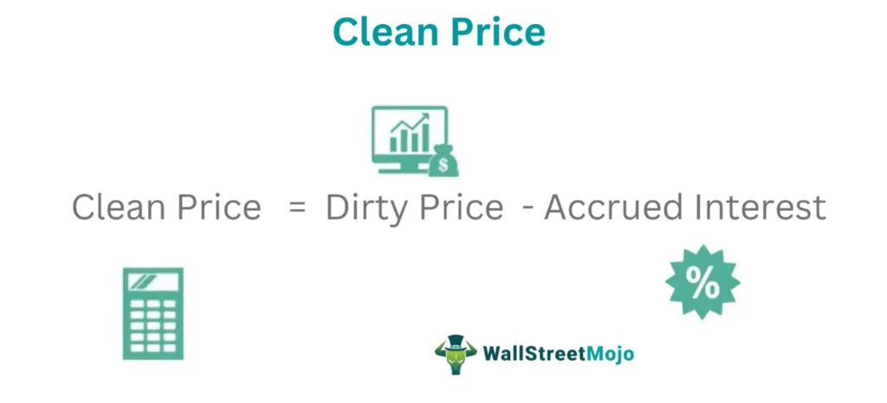

The world of finance offers a variety of investment options, among which bonds hold a prominent place. As debt securities issued by entities such as governments, municipalities, and corporations, bonds serve as a foundational component for the fixed-income market. They provide a predictable stream of income and are viewed as relatively safe investments when compared to equities. Bonds are crucial for portfolio diversification and risk management, making them attractive to both retail and institutional investors.

Understanding bond pricing is crucial for traders, investors, and financial professionals. A bond's price is influenced by multiple factors, including interest rates, credit ratings, and economic conditions. An essential component of bond pricing is the "clean price," which represents the quoted price of a bond excluding any accrued interest. This contrasts with the "dirty price," which includes accrued interest and reflects the total amount the buyer must pay at settlement. The clean price is favored for its ability to provide an accurate snapshot of a bond's market value without the noise introduced by additional interest calculations.



The clean price is a fundamental concept in bond evaluation, vital for accurate valuations and informed decision-making. It is regularly quoted in financial markets, providing a standard measure to compare different bonds and facilitating transparent transactions. Grasping the clean price is essential not only for pricing strategies but also for executing effective trading, whether done manually or through algorithmic methods.

In this article, we will explore the clean price of bonds, its importance in bond markets, and its implications for algorithmic trading and financial strategies. By gaining insight into the mechanics and significance of the clean price, investors and traders can enhance their understanding, optimize their investment strategies, and make well-informed decisions that can lead to improved financial outcomes.

## Table of Contents

## What is the Clean Price?

The clean price of a bond is its quoted price without including any accrued interest. This distinction is crucial for accurately assessing a bond's market value. When investors purchase or sell bonds, the quoted price is typically the clean price, isolating the transaction from any interest that has accumulated since the bond's last coupon payment.

In contrast, the dirty price is the total bond price that includes accrued interest. The clean price is represented mathematically as:

$$
\text{Clean Price} = \text{Dirty Price} - \text{Accrued Interest}
$$

Accrued interest is the interest earned between the last coupon payment and the current date, calculated using the formula:

$$
\text{Accrued Interest} = \left( \frac{n}{d} \right) \times \text{Coupon Payment}
$$

where $n$ is the number of days since the last coupon payment, and $d$ is the number of days in the coupon period. This calculation harmonizes bond prices for consistent comparisons, irrespective of when the transaction occurs within a coupon cycle.

Clean prices are frequently quoted in financial news and trading platforms because they provide an unambiguous measure of the bond's intrinsic market value. By excluding accrued interest, analysts and investors can assess a security's worth based solely on its price, ensuring comparisons between bonds focus on genuine price shifts rather than interest discrepancies. The clean price simplifies pricing models and trading algorithms, making it a critical metric in bond valuation and market operations.

## Understanding the Clean Price

In bond trading, the clean price is the price of a bond excluding any accrued interest. It is the figure most often quoted in financial news and analysis because it provides a clearer view of the bond's intrinsic value without the influence of interest that has accumulated since the bond's last coupon payment. 

Accrued interest represents the interest accumulated on a bond since the last coupon payment was made, up to but not including the settlement date. The total market value of a bond, known as the dirty price, is the sum of the clean price and the accrued interest. The formula for the dirty price is:

$$
\text{Dirty Price} = \text{Clean Price} + \text{Accrued Interest}
$$

The clean price is more frequently cited than the dirty price for several reasons. First, it allows for straightforward comparisons between bonds, as it isolates the bond’s market value without the temporary fluctuations introduced by accrued interest. Clean prices enable investors to assess the true cost and yield of the bond based on its fundamental characteristics, such as coupon rate and yield to maturity, without distortion from interest computations. 

Market practices have evolved to focus on clean prices due to their simplicity and consistency in valuation models and financial reporting. Financial analysts and news outlets prefer quoting clean prices as they align with standard accounting conventions, ensure consistency in model calibrations, and facilitate regulatory reporting. Clean prices are foundational to portfolio valuation and performance measurement, providing a standardized base for evaluating bond portfolios across different periods.

Moreover, quoting clean prices helps in maintaining transparency and fairness in financial markets. Without the need to account for varying amounts of accrued interest, traders can execute transactions with a clearer understanding of the bond's market value. This practice also reduces discrepancies that may arise due to differences in settlement protocols or changes in interest rates affecting the accrued component briefly before transactions settle.

Therefore, the clean price serves as an essential benchmark in bond trading, offering clarity in valuation and aiding in more efficient financial decision-making processes.

## Factors Influencing Clean Price

Various factors influence the clean price of a bond, each playing a critical role in determining the market value of a bond excluding accrued interest. A comprehensive understanding of these factors can aid investors in accurately assessing bond investments.

### Interest Rates

Interest rates are a primary determinant of bond prices. Generally, there is an inverse relationship between bond prices and interest rates. When interest rates rise, the clean price of existing bonds tends to fall. This happens because new bonds are issued with higher returns (yields), making older bonds with lower coupon rates less attractive. Conversely, when interest rates decrease, the clean price of existing bonds typically increases, as their relatively higher coupon payments become more appealing to investors.

To quantify this relationship, bond price sensitivity to [interest rate](/wiki/interest-rate-trading-strategies) changes is often measured using duration. Duration provides an estimate of the percentage change in bond price for a 1% change in interest rates.

### Credit Risk

Credit risk assesses the probability of a bond issuer defaulting on its obligations. If a bond issuer's credit risk increases, the clean price of its bonds is likely to decrease, reflecting the higher risk perceived by the market. Credit ratings, assigned by agencies such as Moody's, S&P, and Fitch, offer insights into the creditworthiness of both corporate and government bonds. Bonds with lower credit ratings (indicating higher risk) generally trade at lower clean prices than bonds with higher ratings.

### Remaining Time to Maturity

The remaining time to maturity of a bond affects its sensitivity to interest rate changes and overall price stability. Short-term bonds tend to exhibit less price [volatility](/wiki/volatility-trading-strategies) than long-term bonds due to their shorter exposure to interest rate fluctuations. As a bond approaches maturity, its clean price will generally converge toward its face value, assuming no changes in credit risk or interest rates. This convergence effect is due to the declining influence of various market factors as the bond nears its redemption date.

### Yield Curve

The yield curve, which plots interest rates of bonds having equal credit quality but differing maturity dates, also influences bond pricing. A normal upward-sloping yield curve suggests that longer-term bonds offer higher yields. Changes in the shape of the yield curve can signal shifts in economic expectations, impacting the clean prices of bonds along the curve. For example, a flattening yield curve might indicate a potential economic slowdown, affecting investor demand for short vs. long-term bonds.

### Inflation Expectations

Inflation expectations influence interest rates and, consequently, bond prices. Rising inflation expectations may lead investors to demand higher yields as compensation for the decreasing purchasing power of future coupon payments, reducing the clean price of bonds. Conversely, if inflation expectations decrease, existing bonds with fixed payments become more valuable, potentially increasing their clean price.

By considering these factors, investors can make more informed decisions, optimizing their bond portfolios in accordance with market conditions. Understanding how interest rates, credit risk, remaining time to maturity, the yield curve, and inflation expectations affect the clean price empowers investors to evaluate bonds more effectively.

## Importance in Bond Markets

The clean price of a bond plays a critical role in bond markets by facilitating precise and fair transactions. It is the quoted price of a bond that excludes accrued interest, and it serves as a standardized metric that accommodates uniform comparisons between different bonds. A clear understanding and utilization of clean prices are vital for ensuring efficient market operations and aiding in portfolio management.

In bond markets, transparency and comparability are essential for mitigating the complexities associated with assessing diverse bond offerings. The clean price provides a consistent basis for comparison, allowing investors to make well-informed decisions by assessing bonds based solely on their intrinsic value. This approach reduces the potential for discrepancies caused by accrued interest, enabling investors to evaluate bonds on an equal footing.

When comparing different bonds, the clean price is particularly advantageous for portfolio management. Portfolio managers require a reliable and consistent measure for evaluating and balancing the risk-return profile of their bond holdings. With clean prices, managers can compare bonds with varying coupon frequencies, maturities, and issuer credit qualities without the noise introduced by accrued interest. This uniformity simplifies the selection of bonds for inclusion in an investment portfolio, ensuring that decisions are based on the underlying characteristics of the bonds rather than temporary market conditions.

Moreover, the clean price is significant in maintaining the efficiency of bond markets. It ensures that bond trades can occur with clarity and accuracy, minimizing the risk of disputes and misunderstandings that may arise from differing interpretations of bond prices that include accrued interest. This clarity is crucial for maintaining investor confidence and facilitating the smooth operation of financial markets.

In summary, the clean price stands as an indispensable component in bond markets, providing a foundation for fair transactions, enhancing comparability across different bond issues, and supporting effective portfolio management. Its role in maintaining efficient market operations underlines the importance of understanding and employing clean prices within bond trading and investment strategies.

## Algorithmic Trading and Clean Price

Algorithmic trading, a key player in modern financial markets, depends fundamentally on precise and robust pricing models. Within this context, the clean price of bonds emerges as a critical component. As the pure representation of a bond's market value, devoid of accrued interest, the clean price offers a standardized measure necessary for developing effective trading algorithms.

The use of the clean price is pivotal for traders and developers aiming to meet specific return objectives while managing risk exposure in [algorithmic trading](/wiki/algorithmic-trading). Algorithms typically require input data that is both current and accurate to execute trades effectively. The clean price provides this precision by allowing algorithms to compare and evaluate bonds on a level playing field. This aligns well with contemporary computational trading systems that constantly process vast amounts of data to make split-second decisions.

Algorithmic trading strategies often involve exploiting pricing inefficiencies. The clean price facilitates this by enabling the detection of discrepancies between a bond’s intrinsic value and its current market valuation. For instance, [arbitrage](/wiki/arbitrage) strategies may involve identifying and capitalizing on small price differentials, requiring high precision inputs like the clean price to be effective.

Moreover, the clean price contributes significantly to the risk management processes inherent in algorithmic trading. Portfolio managers utilize clean prices to determine the potential exposure of various holdings, allowing them to adjust their allocations accordingly. This task is crucial for maintaining the desired balance of risk and return in a bond portfolio. By providing an unambiguous valuation, the clean price helps in setting stop-loss limits and in calculating Value at Risk (VaR), which are essential tools for mitigating potential losses.

For illustration, consider a simple trading algorithm written in Python:

```python
def calculate_clean_price(face_value, coupon_rate, market_interest_rate, time_to_maturity):
    """
    Calculate the clean price of a bond.

    :param face_value: The bond's face value
    :param coupon_rate: The annual coupon rate
    :param market_interest_rate: The current market interest rate
    :param time_to_maturity: The number of years until maturity

    :return: Clean price of the bond
    """
    coupon_payment = face_value * coupon_rate
    present_value_coupons = sum([coupon_payment / (1 + market_interest_rate)**t for t in range(1, time_to_maturity + 1)])
    present_value_face_value = face_value / (1 + market_interest_rate)**time_to_maturity

    clean_price = present_value_coupons + present_value_face_value
    return clean_price

# Example calculation
clean_price = calculate_clean_price(1000, 0.05, 0.03, 5)
print(f"The clean price of the bond is: {clean_price:.2f}")
```

This example calculates the clean price by discounting the bond's future cash flows, providing an essential data point for algorithmic decisions. The clean price facilitates the creation of trading systems that are both responsive and aligned with specific financial goals. As algorithmic trading continues to expand, the role of clean price as a crucial metric in the pricing and valuation ecosystem remains indispensable, reinforcing its value in strategic financial operations.

## Practical Examples of Clean Price Application

In bond trading and investment strategies, understanding the clean price is essential for accurate bond valuation and effective decision-making. Here are some practical examples that highlight the significance and application of clean prices. 

### Example 1: Bond Trading

Consider a bond with a face value of $1,000, a coupon rate of 5%, and semi-annual coupon payments. Suppose the bond is traded on March 1, 2023, and the last coupon was paid on January 1, 2023. The accrued interest at the time of trading is calculated based on the elapsed time since the last coupon payment. Assuming the bond is quoted at a clean price of $980:

Accrued Interest = $\frac{Number\, of\, Days\, Since\, Last\, Coupon\, Payment}{Days\, in\, Coupon\, Period} \times Coupon\, Payment$

Number of Days Since Last Coupon Payment = 59 (January 1 to March 1)

Days in Coupon Period = 180

Coupon Payment = $\frac{5\% \times 1000}{2} = 25$

Accrued Interest = $\frac{59}{180} \times 25 \approx 8.19$

The dirty price, which is the total price paid including accrued interest, is:

Dirty Price = Clean Price + Accrued Interest = $980 + $8.19 = $988.19

In this example, understanding the clean price allows traders to focus on the bond's intrinsic market value independent of its interest components, facilitating clearer investment decisions.

### Example 2: Portfolio Management

A portfolio manager intends to purchase two different bonds to construct a balanced portfolio. Consider Bond A with a clean price of $980 and Bond B with a clean price of $950. Both bonds offer different yields and maturities, impacting their clean prices. Being able to compare these clean prices provides a uniform basis for deciding which bond offers a better value relative to its risk and expected returns.

By comparing the clean price relative to the face value, the portfolio manager can calculate the yield to maturity (YTM) for each bond, which is critical in making investment decisions:

```python
from sympy import symbols, solve

def calculate_ytm(face_value, clean_price, coupon_payment, periods):
    YTM = symbols('YTM', real=True, positive=True)
    price_eq = sum([coupon_payment/(1+YTM)**t for t in range(1, periods+1)]) + face_value/(1+YTM)**periods - clean_price
    ytm_solution = solve(price_eq, YTM)
    return ytm_solution[0]

# Bond A
ytm_a = calculate_ytm(1000, 980, 25, 20)
# Bond B
ytm_b = calculate_ytm(1000, 950, 25, 20)

ytm_a, ytm_b  # Yields to maturity for both bonds
```

Understanding these clean price dynamics and translating them into yield metrics equips the portfolio manager to make data-driven decisions, potentially enhancing portfolio performance.

### Example 3: Algorithmic Trading

In algorithmic trading, precise bond pricing is key for developing algorithms that execute buy and sell orders efficiently. A trading algorithm might focus solely on clean price data for bonds to ensure synchronization with market data feeds. By incorporating real-time clean price data into algorithmic models, traders can swiftly identify arbitrage opportunities and execute transactions at optimal clean price points, avoiding potential discrepancies caused by accrued interest calculations.

Overall, clean prices play a crucial role in facilitating straightforward and comparable bond price assessments, greatly influencing strategic decision-making, risk management, and profitability in trading and investment scenarios.

## Conclusion

The clean price is a central element in bond markets, deeply influencing trading, pricing strategies, and the valuation process. By focusing on the bond price excluding accrued interest, investors and traders can achieve a more precise understanding of a bond's market value. This precision is particularly crucial in today's environment where algorithmic trading is becoming increasingly dominant. Algorithmic trading depends on accurate and reliable data to develop strategies that optimize returns and manage risks effectively. Consequently, a firm comprehension of the clean price allows for better calibration and execution of these trading algorithms, ensuring they function as intended.

As market dynamics become more complex, the nuances of the clean price must be thoroughly understood. This involves recognizing how interest rates, credit risk, and other market factors impact bond valuations absent of accrued interest. By mastering these nuances, investors and traders can refine their strategies, thus making more informed and strategically advantageous decisions. The ability to differentiate between the clean and dirty price can be particularly beneficial when comparing bonds across different issuers or when evaluating bonds in varying market conditions.

Moreover, beyond traditional trading, robust comprehension of clean price dynamics can significantly enhance investment strategies. It leads to clearer insights into portfolio management and risk assessment, enabling investors to maximize profitability while minimizing exposure to unforeseen market shifts. As investors continue to adapt to evolving market conditions and technological advancements, effectively leveraging the clean price as a tool for valuation and strategy formulation will remain an imperative skill for financial success.

## References & Further Reading

[1]: Avellaneda, M., & Lee, J. H. (2010). ["Statistical Arbitrage in the U.S. Equities Market."](https://papers.ssrn.com/sol3/papers.cfm?abstract_id=1153505) Quantitative Finance, 10(7), 857-874.

[2]: Fabozzi, F. J. (2016). ["Bond Markets, Analysis, and Strategies."](https://books.google.com/books/about/Bond_Markets_Analysis_and_Strategies_ten.html?id=bQpNEAAAQBAJ) 9th Edition, Pearson.

[3]: Haugh, M., & Lo, A. W. (2001). ["Asset Pricing and Portfolio Choice."](https://www.semanticscholar.org/paper/Asset-allocation-and-derivatives-Haugh-Lo/1a01f73540ce3ea1c85d7d374db56aff3c294f60) Lecture Notes, Massachusetts Institute of Technology.

[4]: Malkiel, B. G. (2019). ["A Random Walk Down Wall Street: The Time-Tested Strategy for Successful Investing."](https://yourknowledgedigest.org/wp-content/uploads/2020/04/a-random-walk-down-wall-street.pdf) W. W. Norton & Company.

[5]: Hull, J. C. (2018). ["Options, Futures, and Other Derivatives."](https://www.semanticscholar.org/paper/Options%2C-Futures%2C-and-Other-Derivatives-Hull/89bdee500c8623864fc9eb7a471546aa713acc44) 10th Edition, Pearson.