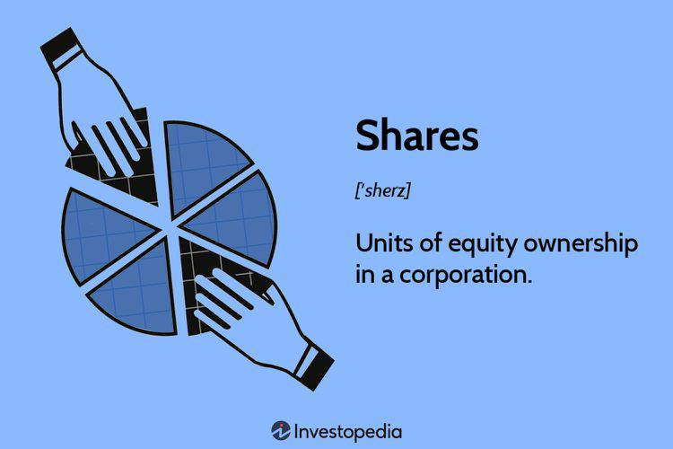

In the world of investing, acquiring knowledge about various finance concepts and terminology is essential for making informed decisions in a complex market environment. This article seeks to demystify intricate investment terms like 'clean shares' and 'algorithmic trading,' which are pivotal in modern finance. Understanding these concepts allows investors to navigate the intricacies of the market with greater confidence and precision.

'Clean shares' refer to a class of mutual fund shares that emphasize transparency and cost-efficiency, stripping away any conflicts of interest commonly associated with front-end loads and 12b-1 fees. These features are particularly significant in today’s market, where investors are increasingly seeking clarity and fairness in fee structures.



Algorithmic trading, on the other hand, involves leveraging computer algorithms to execute trades based on predefined criteria like timing, price, and volume. This method enhances trading efficiency by minimizing human emotion and error, which can often skew investment outcomes.

By mastering the concepts of 'clean shares' and 'algorithmic trading,' investors can adopt more strategic approaches to their portfolios. This article will provide concrete examples and delve into the implications these innovations hold for the financial markets today. Through this examination, readers can better understand and utilize these tools, enhancing their investment strategies in an ever-evolving financial landscape.

## Table of Contents

## Understanding Clean Shares

Clean shares represent a specific classification of mutual fund shares created to offer greater transparency and cost-effectiveness to investors. This type of share is structured to eliminate common fees associated with mutual funds, such as front-end loads and 12b-1 fees, which are marketing and distribution costs traditionally passed on to investors.

The introduction of clean shares was largely a regulatory response aimed at mitigating conflicts of interest within financial advising. Historically, financial advisors could receive commissions from mutual fund companies, creating potential biases in the recommendations they provided to clients. By eliminating these financial incentives, clean shares promote a more transparent relationship between advisors and investors, aligning their interests more closely.

From a regulatory standpoint, clean shares emerged as part of broader efforts to protect investors from unethical practices, particularly those related to fee structures that were not well disclosed. These reforms ensure that investors have greater clarity concerning how much they are actually paying for the management and operation of their funds.

The benefits of investing in clean shares manifest primarily through cost savings, which can lead to enhanced returns over the long term. By avoiding front-end loads—which are commissions paid upfront when shares are purchased—and 12b-1 fees, investors retain a greater proportion of their investment returns. Consequently, clean shares are especially appealing to investors looking for a straightforward and economical way to invest in mutual funds without hidden costs or complicated fee arrangements.

In summary, clean shares facilitate a more straightforward, cost-effective investment approach for mutual fund investors, thereby promoting financial transparency and reducing unnecessary expenses traditionally associated with mutual fund investments.

## Example of Clean Shares

The Washington Mutual Investors Fund offers insightful comparisons between clean shares and conventional fund shares. Clean shares are distinguished by their absence of sales loads, which are upfront commissions paid to brokers or financial advisors when purchasing mutual fund shares. In contrast, Class A shares, a typical category of regular fund shares, often include substantial upfront costs in the form of sales charges.

For investors, opting for clean shares can result in significant fee savings. This reduction in fees means a larger portion of the initial investment is allocated directly into the portfolio, potentially enhancing long-term returns. Without the drag of commission costs, investments in clean shares can compound more effectively over time, offering a financial advantage.

To illustrate, consider an investment of $10,000 in Class A shares with a 5% front-end load. The initial investment would be reduced by $500 for the commission, leaving $9,500 to be invested in the fund. In contrast, investing the same amount in clean shares would allow the full $10,000 to work toward growth from the outset. Over time, even small percentage differences in the initial investment amount can lead to substantial variations in accumulated wealth, due to the effects of compounding. This cost efficiency inherent to clean shares underscores their appeal to cost-conscious investors.

 to Algorithmic Trading

Algorithmic trading employs computer programs to automatically execute trades based on predefined rules, enhancing the speed and precision of trading activities. By utilizing quantitative models that emphasize timing, price, and [volume](/wiki/volume-trading-strategy), [algorithmic trading](/wiki/algorithmic-trading) seeks to optimize the efficiency of trade executions. These models can swiftly analyze market data and identify trading opportunities more accurately than human traders.

One of the primary advantages of algorithmic trading is its ability to minimize emotional decision-making, which often influences traditional trading. By relying on programmable logic, algorithmic trading fosters a more systematic approach, reducing the risk of human error and emotional bias. This method is especially beneficial in high-frequency trading, where transactions occur in fractions of a second, a task well-suited to the capabilities of modern computing power.

The core of algorithmic trading is the development of algorithms that capture market trends and patterns, thereby enabling trades to be executed at optimal moments. For example, algorithms might utilize moving averages to determine buy or sell signals in the market. A simple crossover strategy could involve buying a stock when its short-term moving average crosses above its long-term moving average, signaling an upward trend, and selling when the opposite occurs.

Python, due to its extensive libraries and simplicity, is often used to develop and test algorithmic trading systems. Libraries such as NumPy, pandas, and TA-Lib provide robust tools for handling large datasets, performing statistical analysis, and implementing technical indicators required for trading algorithms.

In summary, algorithmic trading represents a transformative approach in the financial markets, where speed and precision are crucial. By systematically applying complex quantitative strategies, it reduces human intervention and increases the potential for achieving optimal trading outcomes.

## How Algorithmic Trading Works

Algorithmic trading, commonly known as algo-trading, operates through sophisticated computer algorithms designed to monitor market conditions, identify potential trading opportunities, and execute trades automatically based on a set of predefined criteria. This approach leverages the capabilities of technology to enable fast and efficient trading, minimizing the delays and human errors associated with manual trading. The underlying processes of algo-trading can be broken down into several key components:

1. **Signal Generation**: At the heart of algo-trading is the generation of trading signals, which are cues indicating potential trades. These signals are typically based on technical analysis indicators such as moving averages, momentum indicators, or price patterns. For example, a commonly used signal is the crossing of moving averages. A simple moving average (SMA) cross signal might operate as follows in Python:

   ```python
   short_window = 40
   long_window = 100

   # Generating signals using two moving averages
   signals = pd.DataFrame(index=data.index)
   signals['signal'] = 0.0
   signals['short_ma'] = data['price'].rolling(window=short_window, min_periods=1, center=False).mean()
   signals['long_ma'] = data['price'].rolling(window=long_window, min_periods=1, center=False).mean()
   signals['signal'][short_window:] = np.where(signals['short_ma'][short_window:] > signals['long_ma'][short_window:], 1.0, 0.0)
   signals['positions'] = signals['signal'].diff()
   ```

   In this example, a buy signal is generated when the short moving average (e.g., 40 days) crosses above the long moving average (e.g., 100 days), and a sell signal is generated when it crosses below.

2. **Execution**: Once a trading signal is generated, the algorithm determines the specifics of the trade execution, such as the size, timing, and type of order. The automation of trade execution is one of the significant advantages of algo-trading as it ensures trades are executed at the optimal price point and with high efficiency. Simple execution algorithms like the Volume Weighted Average Price (VWAP) or Time Weighted Average Price (TWAP) can break down large orders to minimize market impact.

3. **Risk Management**: Algo-trading systems are programmed to adhere to risk management parameters to protect against large losses. These parameters can include stop-loss orders, position sizing rules, and portfolio diversification strategies. For instance, an algorithm may implement a rule to limit any position to a specific percentage of the total portfolio to maintain diversification and control risk exposure.

4. **Performance Monitoring and Optimization**: Continuous monitoring and optimization of algorithmic trading strategies are vital. Backtesting, a process of testing a strategy on historical data, allows traders to evaluate the effectiveness of their algorithms before deploying them in real-time markets. Traders can refine their strategies by assessing performance metrics such as Sharpe ratio, maximum drawdown, and profit factor.

In summary, algorithmic trading functions through a combination of signal generation, trade execution, risk management, and ongoing optimization to achieve efficient and effective trading outcomes in line with predefined strategic goals. By leveraging the speed and objectivity that algorithms provide, traders can exploit market conditions with precision and minimal emotional interference.

## Advantages and Disadvantages of Algorithmic Trading

Algorithmic trading, commonly known as algo-trading, offers several advantages that significantly enhance the trading process. Perhaps the most notable advantage is the improved execution speed. Algorithms can process market data and execute orders in a fraction of a second, which is crucial in markets where prices can change rapidly. This efficiency can translate into better pricing, as trades are executed quickly before market conditions shift.

Another key advantage is the reduction of transaction costs. Algo-trading minimizes the need for manual intervention, cutting down on the labor costs associated with human traders. Moreover, algorithms can optimize the fragmentation of large orders across multiple markets or platforms, potentially securing better overall pricing and reducing market impact.

Additionally, the elimination of human errors is a significant benefit of algo-trading. Human traders are susceptible to biases and emotional reactions, which can impair decision-making. Algorithms, by contrast, operate based on predefined rules and can handle complex calculations and concurrent trades without fatigue or error. This systematic approach fosters a disciplined trading environment, often leading to more consistent results.

However, despite these advantages, algo-trading is not without its drawbacks. High setup costs pose a significant barrier to entry for many individual traders and smaller firms. Developing robust trading algorithms requires substantial investment in technology, data acquisition, and skilled personnel. Maintaining this infrastructure can also incur ongoing costs.

The reliance on technology also introduces additional risks. Any technical issues, such as software bugs or connectivity problems, can disrupt trading activities. Market conditions can change rapidly, and failures in the system can lead to significant financial losses if not managed with real-time monitoring and fail-safes.

Furthermore, the impact of market [volatility](/wiki/volatility-trading-strategies) on algo-trading should not be underestimated. While algorithms are designed to respond to market conditions, extreme volatility can lead to unfavorable execution prices or unintended trading behaviors if the algorithms are not appropriately calibrated. 

Traders looking to incorporate algorithmic trading into their strategies must weigh these advantages and disadvantages. A balanced approach involves not only leveraging the speed and cost-effectiveness of automated trading systems but also implementing measures to mitigate technological risks and adapt to changing market conditions. This might include setting rigorous [backtesting](/wiki/backtesting) standards, regular system audits, and contingency plans for unforeseen events.

## Examples of Algorithmic Trading Strategies

Trend-following, [arbitrage](/wiki/arbitrage), and mean reversion are widely adopted algorithmic trading strategies that provide traders with various means to capitalize on financial markets. Each strategy leverages complex algorithms to identify and exploit market opportunities, often relying on historical data and sophisticated mathematical models.

**Trend-Following Strategies**

Trend-following strategies aim to capture gains through the analysis of an asset's [momentum](/wiki/momentum) in a particular direction. These strategies use indicators such as moving averages to generate buy or sell signals based on the price movement trends. The moving average crossover is a common method, where trades are executed when a short-term moving average crosses a long-term moving average. This technique helps to confirm shifts in trend direction and can be implemented with a relatively simple Python script:

```python
import pandas as pd

# Assuming 'data' is a DataFrame containing 'Close' prices
data['Short_MA'] = data['Close'].rolling(window=5).mean()
data['Long_MA'] = data['Close'].rolling(window=20).mean()
data['Signal'] = 0  # Buy/Sell indicator

# Generate signals
data.loc[data['Short_MA'] > data['Long_MA'], 'Signal'] = 1  # Buy
data.loc[data['Short_MA'] < data['Long_MA'], 'Signal'] = -1  # Sell
```

**Arbitrage Strategies**

Arbitrage takes advantage of price discrepancies in different markets or forms. Algorithmic trading systems can swiftly identify and exploit these minor price differences, often involving multiple assets or geographical locations. For example, [statistical arbitrage](/wiki/statistical-arbitrage) strategies use pairs trading, relying on temporary anomalies between correlated stocks.

**Mean Reversion Strategies**

Mean reversion strategies are based on the hypothesis that prices and returns eventually move back towards their historical average. These strategies target securities that have diverged substantially from their mean. Metrics like standard deviation are frequently utilized to determine the extent of the deviation. The Z-score can be employed to evaluate whether a security is significantly overbought or oversold, as shown below:

```python
# Calculate moving average and standard deviation
data['Mean'] = data['Close'].rolling(window=20).mean()
data['Std_Dev'] = data['Close'].rolling(window=20).std()

# Calculate Z-score
data['Z-score'] = (data['Close'] - data['Mean']) / data['Std_Dev']
```

**Volume-Weighted Average Price (VWAP) and Time-Weighted Average Price (TWAP)**

VWAP and TWAP are sophisticated execution algorithms that help traders optimize trade timing and reduce market impact. VWAP calculates an average price weighted by volume, ideal for executing large orders, ensuring the trader gets a fair market price. TWAP, in contrast, averages the price over a specified time, minimizing the market footprint of an order by spreading it out.

Implementing these approaches necessitates a sound technical foundation and a comprehensive understanding of financial markets, along with constant monitoring and adaptation of the models to changing conditions.

## Conclusion

In today's dynamic financial landscape, comprehending investment concepts such as 'clean shares' and 'algorithmic trading' is crucial for investors aiming to optimize their strategies and outcomes. Clean shares offer a transparent and cost-effective way to invest in mutual funds, eliminating sales loads and recurring fees, which can significantly erode returns over time. By minimizing these costs, investors can maximize their potential gains, leading to enhanced financial performance.

Algorithmic trading, on the other hand, employs sophisticated computer programs to execute trades with precision and speed that surpass human capabilities. This technology-driven approach helps eliminate emotional biases and errors, facilitating a more disciplined and systematic method of trading. By leveraging algorithmic strategies, such as trend-following or arbitrage, traders can exploit market inefficiencies and execute large volumes of trades efficiently.

As the investment landscape continues to evolve, staying informed about these and other financial terms becomes increasingly important. Mastery of such concepts not only aids in making strategic decisions but also positions investors to fully capitalize on emerging opportunities. As new technologies and financial instruments are developed, the ability to understand and integrate these advancements will be paramount in achieving long-term investment success.

## References & Further Reading

[1]: Bergstra, J., Bardenet, R., Bengio, Y., & Kégl, B. (2011). ["Algorithms for Hyper-Parameter Optimization."](https://papers.nips.cc/paper/4443-algorithms-for-hyper-parameter-optimization) Advances in Neural Information Processing Systems 24.

[2]: ["Advances in Financial Machine Learning"](https://www.amazon.com/Advances-Financial-Machine-Learning-Marcos/dp/1119482089) by Marcos Lopez de Prado

[3]: ["Evidence-Based Technical Analysis: Applying the Scientific Method and Statistical Inference to Trading Signals"](https://books.google.com/books/about/Evidence_Based_Technical_Analysis.html?id=MeoJAQAAMAAJ) by David Aronson

[4]: ["Machine Learning for Algorithmic Trading"](https://github.com/stefan-jansen/machine-learning-for-trading) by Stefan Jansen

[5]: ["Quantitative Trading: How to Build Your Own Algorithmic Trading Business"](https://www.amazon.com/Quantitative-Trading-Build-Algorithmic-Business/dp/1119800064) by Ernest P. Chan