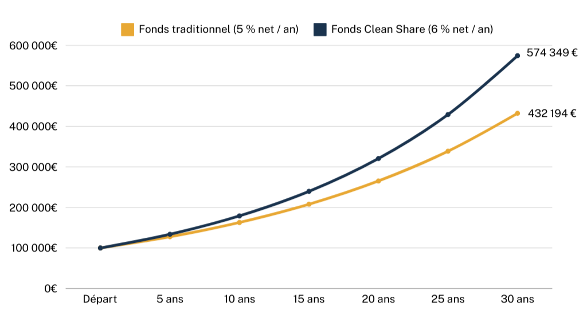

## Table of Contents

## What are clean shares?

Clean shares are a type of mutual fund share that do not have any sales charges, commissions, or other hidden fees. This means that when you buy clean shares, you pay only the net asset value of the fund, which is the total value of all the assets in the fund minus its liabilities. Clean shares are designed to be more transparent and cost-effective for investors, as all the costs associated with managing the fund are clearly stated in the expense ratio.

These shares are particularly beneficial for investors who work with fee-based advisors, as the advisor's fee is separate from the fund's expenses. This separation helps to avoid conflicts of interest that can occur when advisors are paid commissions based on the funds they recommend. By using clean shares, investors can better understand the true cost of their investments and make more informed decisions about where to put their money.

## How do clean shares differ from traditional mutual fund shares?

Clean shares and traditional mutual fund shares are different mainly because of their fees. Clean shares do not have any sales charges or commissions. When you buy clean shares, you pay only the net asset value of the fund. This means you know exactly what you are paying for the fund itself. On the other hand, traditional mutual fund shares often come with sales loads or commissions. These are extra fees that you pay when you buy or sell the shares, and they can make the total cost of your investment higher.

Another key difference is how the fees are shown to investors. With clean shares, all the costs of managing the fund are included in the expense ratio, which is clear and easy to see. This helps investors understand the true cost of their investment. Traditional mutual fund shares, however, might have hidden fees that are not as easy to spot. These can include 12b-1 fees, which are used for marketing and distribution costs. Because of these differences, clean shares can be a more transparent and cost-effective choice for investors, especially those working with fee-based advisors.

## What is the primary benefit of clean shares for investors?

The main benefit of clean shares for investors is that they are cheaper and clearer. Clean shares don't have extra fees like sales charges or commissions. This means when you buy them, you only pay for the actual value of the fund. It's like buying something without any hidden costs. This makes it easier for you to know exactly how much you are spending on your investment.

Another big advantage is that clean shares help you understand the true cost of your investment better. All the costs of running the fund are shown in one clear number called the expense ratio. This way, you can see all the fees in one place without any surprises. This is especially helpful if you work with an advisor who charges you a separate fee, because it keeps everything straightforward and honest.

## How are clean shares priced and what fees are associated with them?

Clean shares are priced based on the net asset value (NAV) of the fund. This means when you buy clean shares, you pay the total value of all the assets in the fund minus any liabilities. It's like paying the true value of the fund without any extra charges. The price you see is what you pay, making it straightforward and easy to understand.

The only fee associated with clean shares is the expense ratio. This fee covers all the costs of managing the fund, like paying the people who run it and other expenses. The expense ratio is shown as a percentage of the fund's assets, and it's clearly stated so you know exactly what you're paying for the management of your investment. There are no hidden fees, sales charges, or commissions with clean shares, which makes them a more transparent and cost-effective choice for investors.

## Who typically offers clean shares and through what platforms?

Clean shares are usually offered by mutual fund companies that want to be clear and fair with investors. These companies are often big names in the investment world that focus on making things easy for people to understand. They want to help investors see all the costs upfront without any surprises. Some examples of these companies include Vanguard, Fidelity, and T. Rowe Price.

You can buy clean shares through different platforms. Many people use online investment platforms like Schwab, E*TRADE, or TD Ameritrade to buy them. These platforms let you easily pick and buy clean shares right from your computer or phone. If you work with a financial advisor, they might also help you buy clean shares. Advisors who charge a separate fee for their advice often like using clean shares because it keeps everything clear and honest for their clients.

## Can you explain the mechanism behind the distribution of clean shares?

Clean shares are distributed by mutual fund companies that want to keep things simple and clear for investors. These companies, like Vanguard or Fidelity, create clean shares as an option for people who want to invest without paying extra fees. When someone wants to buy clean shares, they usually go through an online investment platform like Schwab or E*TRADE. These platforms connect investors directly with the mutual fund companies, making it easy to buy and sell clean shares.

The process of buying clean shares is straightforward. When you decide to buy, you tell the platform how many shares you want, and they show you the price, which is the net asset value (NAV) of the fund. There are no hidden fees or commissions added on. Once you buy the shares, the platform keeps track of them for you, and you can see all the costs of managing the fund in the expense ratio. This clear and simple way of buying and managing investments is why many people and financial advisors choose clean shares.

## How do clean shares impact the overall transparency of investment fees?

Clean shares make investment fees much clearer for everyone. When you buy clean shares, you only pay the actual value of the fund, which is called the net asset value (NAV). There are no extra fees like sales charges or commissions. This means you can see exactly how much you're paying for the fund itself, without any hidden costs. All the costs of managing the fund are included in one number called the expense ratio, which is easy to find and understand.

This clear way of showing fees helps investors make better choices. When you know exactly what you're paying, you can compare different funds more easily and pick the one that's best for you. Clean shares also help keep things honest between investors and their advisors, especially if the advisor charges a separate fee. By using clean shares, everyone can see all the costs upfront, which makes investing simpler and more transparent.

## What role do clean shares play in reducing conflicts of interest in the investment industry?

Clean shares help lower conflicts of interest in the investment world by making things clearer and fairer. When you buy clean shares, you don't pay any extra fees like commissions or sales charges. This means the people who sell you the shares, like financial advisors, don't get paid more for selling you one fund over another. They can focus on helping you pick the best investment for you, not the one that pays them the most.

This clear and honest way of doing things makes it easier for investors to trust their advisors. Since clean shares show all the costs in one clear number called the expense ratio, everyone can see exactly what they're paying. This reduces the chance that advisors might push certain funds just to earn bigger commissions, making the whole investment process more about what's best for the investor, not the advisor.

## How have regulatory changes influenced the adoption of clean shares?

Regulatory changes have pushed the adoption of clean shares by making the investment world more clear and fair. Rules like the Department of Labor's Fiduciary Rule and the SEC's Regulation Best Interest have made it more important for advisors to put their clients' interests first. Clean shares help with this because they don't have hidden fees or commissions. This means advisors can recommend investments without worrying about making money from sales charges, which helps them focus on what's best for their clients.

These rules have also made it easier for investors to understand what they're paying for. Before, some funds had extra fees that were hard to see. But with clean shares, all the costs are shown in one simple number called the expense ratio. This makes it easier for people to compare different funds and pick the best one. As a result, more mutual fund companies and advisors are using clean shares to meet these new rules and help their clients make better investment choices.

## What are the potential drawbacks or challenges associated with clean shares?

Even though clean shares have many good points, there are some challenges too. One big challenge is that not all mutual fund companies offer clean shares. This means you might have fewer choices when you're looking for funds to invest in. If you really like a certain fund, but it doesn't come in a clean share version, you might have to look for something else or pay extra fees.

Another challenge is that some investors might find it hard to understand how clean shares work. Even though they are meant to be clear and simple, the idea of paying just the net asset value and seeing all fees in the expense ratio can be new and confusing. This might make some people hesitant to switch to clean shares, especially if they are used to the old way of doing things with traditional mutual fund shares.

## How do clean shares fit into a broader investment strategy for financial advisors?

Clean shares can be a big part of a financial advisor's overall plan for their clients. Since clean shares don't have hidden fees or commissions, advisors can use them to help clients see exactly what they are paying for their investments. This makes it easier for advisors to show that they are putting their clients' interests first, which is important under rules like the Fiduciary Rule and Regulation Best Interest. By using clean shares, advisors can help clients pick the best funds for their needs without worrying about extra costs getting in the way.

Another way clean shares fit into a broader strategy is by helping advisors build trust with their clients. When everything is clear and simple, clients feel more confident that their advisor is looking out for them. This can lead to stronger, longer-lasting relationships. Plus, clean shares can make it easier for advisors to compare different funds and find the ones that offer the best value. This helps advisors create a well-rounded investment plan that focuses on growing their clients' money over time, without any hidden surprises.

## What future trends might affect the use and popularity of clean shares?

In the future, more people might start using clean shares as they become more popular. This could happen because more investors are looking for clear and fair ways to invest their money. Rules from the government, like the Fiduciary Rule and Regulation Best Interest, are making it more important for advisors to put their clients first. Clean shares help with this because they show all the fees clearly, without any hidden costs. As more people learn about clean shares and see how they can save money, more mutual fund companies might offer them, giving investors even more choices.

Another trend that could affect clean shares is technology. As online investing platforms get better and easier to use, more people might turn to clean shares. These platforms can make it simple to buy and sell clean shares, and they can show all the costs in a clear way. This could make clean shares more popular, especially among younger investors who like using technology for their money matters. Overall, as people keep looking for clear and honest ways to invest, clean shares might become a bigger part of how people grow their money.

## References & Further Reading

[1]: Bergstra, J., Bardenet, R., Bengio, Y., & Kégl, B. (2011). ["Algorithms for Hyper-Parameter Optimization."](https://papers.nips.cc/paper/4443-algorithms-for-hyper-parameter-optimization) Advances in Neural Information Processing Systems 24.

[2]: ["Advances in Financial Machine Learning"](https://www.amazon.com/Advances-Financial-Machine-Learning-Marcos/dp/1119482089) by Marcos Lopez de Prado

[3]: ["Evidence-Based Technical Analysis: Applying the Scientific Method and Statistical Inference to Trading Signals"](https://books.google.com/books/about/Evidence_Based_Technical_Analysis.html?id=MeoJAQAAMAAJ) by David Aronson

[4]: ["Machine Learning for Algorithmic Trading"](https://github.com/stefan-jansen/machine-learning-for-trading) by Stefan Jansen

[5]: ["Quantitative Trading: How to Build Your Own Algorithmic Trading Business"](https://www.amazon.com/Quantitative-Trading-Build-Algorithmic-Business/dp/1119800064) by Ernest P. Chan