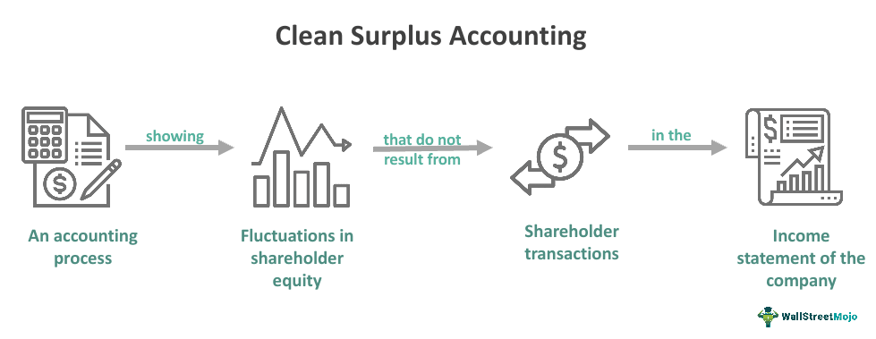

## Table of Contents

## What is Clean Surplus Accounting?

Clean Surplus Accounting is a way to measure how well a company is doing by looking at its profits and losses. Instead of just focusing on the money that comes in and goes out, it also pays attention to changes in the company's equity. This means it includes things like dividends paid to shareholders and changes in the value of the company's assets. By using this method, investors can get a clearer picture of a company's financial health over time.

This accounting method is different from traditional accounting because it tries to capture all changes in a company's net assets. Traditional accounting might miss some important details, like unrealized gains or losses on investments. Clean Surplus Accounting makes sure these changes are included, giving a more complete view of the company's performance. This can be really helpful for investors who want to understand how the company's value is changing, even if those changes aren't immediately obvious in the regular financial statements.

## How does Clean Surplus Accounting differ from traditional accounting methods?

Clean Surplus Accounting and traditional accounting methods differ mainly in how they handle changes in a company's equity. Traditional accounting focuses on the income statement, which shows the company's revenues and expenses over a period. It calculates net income by subtracting expenses from revenues, but it might not include all changes in the company's equity, like unrealized gains or losses on investments or dividends paid to shareholders. Clean Surplus Accounting, on the other hand, aims to capture all these changes. It starts with the net income from the income statement and then adds or subtracts other comprehensive income items, like unrealized gains or losses, to give a more complete picture of the company's financial performance.

This difference means that Clean Surplus Accounting provides a broader view of a company's financial health. For example, if a company's investments increase in value but those gains are not realized (sold), traditional accounting might not show this increase in the income statement. However, Clean Surplus Accounting would include these unrealized gains, showing a more accurate change in the company's net assets. This method helps investors understand the full impact of all financial activities on the company's equity, which can be crucial for making informed investment decisions. By including all changes in equity, Clean Surplus Accounting offers a clearer picture of how a company's value is evolving over time.

## What are the main components of an income statement?

The income statement is a key financial document that shows how much money a company made and spent over a certain period, like a year or a quarter. The main parts of an income statement are revenue, which is the money a company gets from selling its products or services, and expenses, which are the costs of running the business. Revenue is at the top of the income statement and is sometimes called sales or turnover. It's the starting point for figuring out how well the company did financially.

After revenue, the income statement lists various expenses. These can include the cost of goods sold, which is the direct cost of making the products sold, and operating expenses, which are the costs of running the business day to day, like rent, salaries, and utilities. The income statement also includes other expenses like interest on loans and taxes. By subtracting all these expenses from the revenue, you get the net income or profit, which shows whether the company made money or lost money during the period.

Sometimes, the income statement might also include other items like gains or losses from selling assets or other unusual events that affect the company's finances. These are less common but can be important for understanding the full picture of the company's performance. The final net income number at the bottom of the income statement is a key indicator of the company's financial health and is used by investors and managers to make decisions.

## How do income statement adjustments affect financial reporting?

Income statement adjustments can change how a company's financial performance looks to investors and others who look at the company's financial reports. When a company makes adjustments, it might add or subtract numbers from its revenue or expenses. This can happen for things like fixing mistakes, accounting for changes in how much things are worth, or dealing with special events that don't happen often. These adjustments can make the company's profit look different, sometimes better or sometimes worse, than it would without the adjustments.

These changes matter because they can affect what people think about the company's health and future. For example, if a company adjusts its income statement to show a higher profit, investors might think the company is doing better than it really is. On the other hand, if the adjustments show a lower profit, it might make investors worry. So, it's important for companies to explain their adjustments clearly so that everyone understands why the numbers changed and what they really mean for the company's performance.

## What are some common adjustments made to the income statement under Clean Surplus Accounting?

Under Clean Surplus Accounting, companies make adjustments to the income statement to show all changes in their net assets. One common adjustment is adding or subtracting unrealized gains or losses. This means if a company's investments go up in value but they haven't sold them yet, they add this gain to their income. If the investments go down, they subtract the loss. This helps show a clearer picture of the company's financial health because it includes changes that aren't shown in regular accounting.

Another adjustment is accounting for dividends paid to shareholders. In traditional accounting, dividends are often shown on the balance sheet, but Clean Surplus Accounting subtracts them from the income statement. This is because dividends reduce the company's equity, and Clean Surplus Accounting wants to show all changes in equity. By including these adjustments, Clean Surplus Accounting gives investors a more complete view of how the company's value is changing over time.

## Can you explain the concept of comprehensive income in relation to Clean Surplus Accounting?

Comprehensive income is a big part of Clean Surplus Accounting. It's like a fuller picture of how a company did financially over a period. Instead of just looking at the regular profit or loss, comprehensive income includes other changes in the company's value that aren't shown on the usual income statement. This can be things like unrealized gains or losses on investments, which means the value of the company's investments went up or down but they didn't sell them yet. By adding these changes to the regular profit or loss, comprehensive income gives a more complete view of how the company's net worth changed.

In Clean Surplus Accounting, comprehensive income is really important because it helps show all the changes in the company's equity. When you use Clean Surplus Accounting, you start with the regular profit or loss from the income statement and then add or subtract these other changes to get the comprehensive income. This way, investors can see the full impact of everything that happened financially, not just the stuff that shows up on the regular income statement. It's like getting a clearer picture of how the company's value grew or shrank over time, which can help make better investment decisions.

## How does Clean Surplus Accounting impact the calculation of return on equity (ROE)?

Clean Surplus Accounting changes how we figure out return on equity (ROE) by including all changes in a company's equity, not just the profit shown on the income statement. ROE is a way to see how well a company is using the money its shareholders have put in. Normally, you calculate ROE by dividing the net income by the shareholders' equity. But with Clean Surplus Accounting, you use comprehensive income instead of just net income. Comprehensive income includes things like unrealized gains or losses on investments and dividends paid to shareholders, which gives a fuller picture of how the company's value changed.

Using Clean Surplus Accounting can make the ROE look different because it captures more of what's happening with the company's money. If a company's investments go up in value but they haven't sold them yet, this increase would be added to the comprehensive income. This means the ROE could be higher than if you only looked at the regular profit. On the other hand, if the company pays out a lot of dividends, this would lower the comprehensive income and could make the ROE look lower. By using Clean Surplus Accounting, investors get a clearer idea of how well the company is really doing with their money.

## What are the advantages of using Clean Surplus Accounting for financial analysis?

Clean Surplus Accounting helps investors see the whole picture of a company's financial health. It does this by including all changes in the company's equity, not just the profits shown on the income statement. This means it counts things like unrealized gains or losses on investments and dividends paid to shareholders. By doing this, Clean Surplus Accounting gives a more complete view of how the company's value is changing over time. This can be really helpful for investors who want to understand all the ways a company's money is growing or shrinking, not just the parts that show up in regular accounting.

Using Clean Surplus Accounting can also make it easier to compare how different companies are doing. Because it includes all changes in equity, it helps to level the playing field. For example, if one company has a lot of unrealized gains and another doesn't, Clean Surplus Accounting will show this difference clearly. This can help investors make better decisions because they have a fuller understanding of each company's financial performance. Overall, Clean Surplus Accounting gives a clearer and more accurate picture of a company's financial health, which is important for making smart investment choices.

## What are the potential drawbacks or limitations of Clean Surplus Accounting?

Clean Surplus Accounting can be hard to understand because it includes a lot more things than regular accounting. It adds in changes like unrealized gains or losses on investments and dividends paid to shareholders. This can make the financial statements more complicated and harder for people to read. Some people might not be used to seeing these extra numbers, so it could be confusing for them. Also, because Clean Surplus Accounting is not used by everyone, it can be tough to compare companies that use it with those that don't. This can make it harder for investors to make fair comparisons and decisions.

Another problem with Clean Surplus Accounting is that it can be affected by things that are hard to predict or measure. For example, unrealized gains or losses depend on how the market is doing, and that can change a lot. If a company's investments go up in value one day and down the next, the numbers in the financial statements will change too. This can make it seem like the company's performance is more up and down than it really is. Also, because Clean Surplus Accounting tries to include everything, it might make the financial statements look too different from what people are used to, which could make them less useful for some people.

## How can Clean Surplus Accounting be integrated into a company's financial reporting system?

To integrate Clean Surplus Accounting into a company's financial reporting system, the company needs to start by making sure their accounting software can handle the extra details that Clean Surplus Accounting includes. This means the software should be able to track not just the regular profit and loss, but also other changes in the company's equity, like unrealized gains or losses on investments and dividends paid to shareholders. The company might need to work with their software provider to set this up or even switch to a new system that can handle these details. They also need to train their accounting team on how to use Clean Surplus Accounting, so everyone understands how to record and report these extra numbers correctly.

Once the system is set up and the team is trained, the company can start using Clean Surplus Accounting in their financial reports. They will need to make sure that their income statement includes comprehensive income, which adds up all the changes in equity. This might mean adding new lines to their financial statements to show unrealized gains or losses and dividends. The company should also explain these changes clearly in their financial reports, so investors and other people who look at the reports can understand what they mean. By doing this, the company can give a fuller picture of its financial health and help investors make better decisions.

## What are some real-world examples of companies using Clean Surplus Accounting?

Some big companies, like Coca-Cola and PepsiCo, use Clean Surplus Accounting to show how their money is doing. They include things like unrealized gains or losses on their investments and dividends they pay out to shareholders in their financial reports. This helps investors see a more complete picture of the company's value and how it's changing over time. For example, if Coca-Cola's investments go up in value but they haven't sold them yet, they add this increase to their comprehensive income, which gives a clearer view of their financial health.

Another example is General Electric (GE). They use Clean Surplus Accounting to show all the changes in their equity, not just the profit they make. This means they include things like unrealized gains or losses on their big investments and the money they pay out as dividends. By doing this, GE can give investors a fuller understanding of how their money is growing or shrinking, even if some of these changes aren't shown in regular accounting. This helps people make better decisions about investing in GE.

## How do international accounting standards, such as IFRS, influence the application of Clean Surplus Accounting?

International Financial Reporting Standards (IFRS) play a big role in how companies use Clean Surplus Accounting. IFRS rules say that companies should show all changes in their equity in their financial reports. This is similar to what Clean Surplus Accounting does. So, if a company follows IFRS, it's easier for them to use Clean Surplus Accounting because they already have to include things like unrealized gains or losses and dividends paid to shareholders in their reports.

But, IFRS also gives companies some choices about how they show these changes. For example, some companies might choose to show unrealized gains or losses in a different part of their financial statements than others. This can make it a bit harder to compare companies that use Clean Surplus Accounting under IFRS. Still, overall, IFRS helps make Clean Surplus Accounting more common and easier to use because it pushes companies to be more open about all the changes in their equity.

## What is Clean Surplus Accounting and how is it explained?

Clean surplus accounting is a financial accounting methodology that is essential for the accurate reflection of a company's net income. By focusing on the integration of net income into the balance sheet, clean surplus accounting ensures a more reliable comparison of company performance over time.

This accounting approach distinguishes between two types of net income: clean and dirty surplus. Clean surplus income arises when the net income reported in the income statement is fully incorporated into the change in equity. This ensures that all changes in equity are linked to the company's earnings and bookkeeping activities, thereby providing a clearer and more straightforward understanding of company performance. In contrast, dirty surplus income occurs when parts of the income, such as comprehensive income or unusual financial events, are recorded directly into equity without passing through the income statement. This can obscure the true profitability of the company as these adjustments might involve market-based gains or losses that do not reflect operational performance.

The clean surplus relationship can be mathematically represented as:

$$

\text{Ending Equity} = \text{Beginning Equity} + \text{Net Income} - \text{Dividends Paid} 
$$

This formula emphasizes that changes in equity should solely be the result of net income and dividend distributions, excluding any other comprehensive income components or extraordinary items. Traditional accounting sometimes allows for items like currency translation adjustments or certain derivative-related items to bypass the income statement, leading to discrepancies in financial reporting.

By adopting clean surplus accounting, companies can present financial statements focused on operational results rather than being influenced by non-operational gains or losses. This clarity is particularly beneficial for investors and stakeholders who require accurate data to assess a firm's ongoing profitability and performance potential.

Clean surplus accounting’s emphasis on authentic net income provides a refined view of a company's operational success and aligns more closely with economic reality by mitigating distortions due to atypical financial activities. This methodology, therefore, holds significant relevance in financial analysis and investment decision-making processes.

## References & Further Reading

[1]: Penman, S. H. (2010). ["Financial Statement Analysis and Security Valuation"](https://archive.org/details/financialstateme0000penm_r9u4). McGraw-Hill Education.

[2]: Ohlson, J. A. (1995). ["Earnings, Book Values, and Dividends in Equity Valuation."](https://onlinelibrary.wiley.com/doi/abs/10.1111/j.1911-3846.1995.tb00461.x) Contemporary Accounting Research, 11(2), 661-687.

[3]: Barth, M. E., & Clinch, G. (2009). ["Scale Effects in Capital Markets-Based Accounting Research."](https://onlinelibrary.wiley.com/doi/full/10.1111/j.1468-5957.2009.02133.x) Journal of Business Finance & Accounting, 36(3-4), 253-288.

[4]: Hull, J. C. (2017). ["Options, Futures, and Other Derivatives"](https://www.pearson.com/en-us/subject-catalog/p/options-futures-and-other-derivatives/P200000005938/9780136939917). Pearson. 

[5]: Damodaran, A. (2012). ["Investment Valuation: Tools and Techniques for Determining the Value of Any Asset"](https://books.google.com/books/about/Investment_Valuation.html?id=5SRHAAAAQBAJ). John Wiley & Sons.