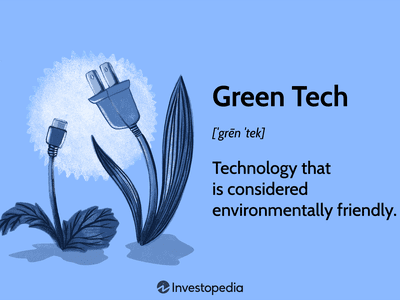

In today's rapidly evolving financial landscape, sustainable technology, specifically cleantech, has emerged as a critical element in promoting environmentally-friendly practices. Cleantech encompasses a broad range of technologies and processes aimed at reducing the ecological footprint of human activities, predominantly by minimizing waste and optimizing the use of natural resources. Its application spans numerous sectors, significantly contributing to energy conservation, emission reduction, and the overall enhancement of environmental sustainability. 

At the intersection of finance and technology, algorithmic trading (commonly referred to as algo trading) is increasingly harnessing these green technologies to drive eco-friendly financial practices. Algo trading involves the use of complex algorithms and electronic platforms to execute high-speed trading strategies, often with a focus on maximizing efficiency and responsiveness to market dynamics. However, this technology-driven approach also presents challenges, particularly regarding energy consumption and the resultant carbon footprint. 

This article aims to explore the pivotal role of cleantech within the sphere of sustainable technology, particularly through its application in eco-friendly algorithmic trading. The integration of cleantech into financial operations not only paves the way for reducing environmental impacts but also promises enhancements in financial performance through optimized trading algorithms. Additionally, these innovations promote ethical trading by aligning short-term market activities with long-term sustainability goals. 

Join us as we examine how environmental awareness is being incorporated into technological advancements in trading. This journey reveals not only the potential for cleantech to transform financial markets but also underscores the importance of sustainable practices for the future of global finance.

## Table of Contents

## Understanding Cleantech and Its Importance

Cleantech, short for clean technology, represents a diverse array of products, services, and processes aimed at reducing or eliminating environmental impacts. It emphasizes the use of renewable resources to minimize the ecological footprint associated with human activities. A significant aspect of cleantech is its role in mitigating climate change by promoting sustainable solutions that address energy production, resource management, and environmental conservation.

Historically, cleantech gained traction within the venture capital sector during the late 1990s and early 2000s, as investors recognized the potential for profitable opportunities in environmental sustainability. This alignment with venture capital was pivotal, allowing cleantech to evolve into a vital component of the green economy. Key elements associated with cleantech include renewable energy systems, such as solar and wind power, energy efficiency technologies, water purification, and waste management systems. These innovations are designed not only to improve resource efficiency but also to ensure the long-term viability of our planet's ecosystems.

The growing investment in cleantech over the past decades underscores its importance in fostering global environmental sustainability. According to the International Energy Agency (IEA), global investment in clean energy technologies reached approximately $1.7 trillion in 2022, reflecting a substantial growth trend driven by both governmental policies and private sector initiatives. This injection of capital into cleantech supports the development and deployment of innovative solutions that aim to combat pollution, reduce greenhouse gas emissions, and promote responsible resource use.

In the financial sector, cleantech's significance is exemplified by its potential to drive sustainable innovation. Financial markets are beginning to integrate environmentally conscious practices, influenced by cleantech advancements. The incorporation of green technologies in financial operations demonstrates the sector's commitment to reducing carbon footprints and enhancing sustainability. This integration not only aligns with global environmental goals but also offers new avenues for economic growth and ethical investment opportunities.

Overall, cleantech serves as a foundational element for eco-friendly innovation across various industries. By emphasizing sustainable practices and technologies, cleantech supports a transition towards a greener, more resilient future. Its impact extends beyond environmental benefits, offering significant economic advantages and promoting the adoption of responsible practices that prioritize the well-being of both current and future generations.

## Algorithmic Trading and Environmental Considerations

Algorithmic trading, often referred to as algo trading, implements sophisticated algorithms and pre-programmed instructions to manage and execute trades at an unprecedented speed and frequency. These algorithms can process vast amounts of market data, analyze parameters, and execute orders without the latency associated with human decision making. While this automated approach has dramatically shaped the financial landscape by improving [liquidity](/wiki/liquidity-risk-premium), reducing market spreads, and facilitating high-frequency trading, it also raises substantial environmental concerns.

Traditional [algorithmic trading](/wiki/algorithmic-trading) systems can be resource-intensive, primarily due to their reliance on extensive computational power and data centers. These operations require significant energy to maintain, contributing to their high carbon footprint. According to various studies, data centers are responsible for approximately 1% of global electricity consumption and a corresponding impact on carbon emissions [1]. The intensive computation and energy demand associated with algo trading mean that the carbon footprint could be quite substantial unless mitigated through environmentally-friendly practices.

Recognizing these challenges, there is a growing movement towards integrating cleantech solutions into algorithmic trading. Such integration aims to optimize energy usage and enhance the overall sustainability of trading activities. One promising approach is the use of renewable energy sources to power trading data centers. By transitioning to solar or wind energy, trading firms can significantly reduce their dependence on fossil fuels, thus lowering their carbon emissions. In addition, advancements in energy-efficient hardware and cooling systems can further reduce the energy consumption of servers that run these complex trading algorithms.

Blockchain technology, known for its decentralized ledger systems, offers another route to reducing the environmental impact of algorithmic trading. Blockchain can improve efficiency and transparency in trade execution by reducing the need for multiple reconciliations across trading parties, thus conserving computational and energy resources. Moreover, the immutability and traceability of blockchain records can enhance the security and accountability of algo trading operations, aligning them further with sustainable and ethically responsible financial practices [2].

Green technologies are being progressively implemented to optimize how algorithmic trading systems operate. For instance, cloud computing platforms equipped with energy-efficient infrastructure provide scalable and sustainable alternatives to traditional trading servers. Algorithm optimization and AI-driven technologies can also be employed to enhance the efficiency of trade execution, minimizing resource use and operational overhead.

In assessing the environmental considerations of algorithmic trading, it becomes clear that while it introduces certain challenges, it also presents opportunities for innovation. By embracing cleantech solutions and emerging technologies such as blockchain, the financial sector can significantly curb its ecological impact, aiding the transition towards more sustainable trading practices.

---

[1] "Data center energy demand is a growing concern in green ICT", by Google Sustainability Research.

[2] "Decentralized Finance (DeFi) as a Pathway to Sustainable Trading", by Blockchain for Sustainable Finance Initiative.

## Cleantech in Algo Trading: Innovative Solutions

Cleantech innovation is playing a crucial role in transforming algorithmic trading into a more sustainable practice. This transformation is achieved through the application of renewable energy sources, energy-efficient data centers, and blockchain technologies.

Renewable energy is at the forefront of reducing the carbon footprint associated with high-frequency trading operations. Trading firms are increasingly turning to renewable energy sources such as solar and wind power to run their computational infrastructures. By harnessing these energy solutions, companies not only decrease their dependency on fossil fuels but also significantly cut operational costs over time. A notable example is the collaboration between tech firms and financial institutions to establish solar-powered data centers dedicated to trading activities.

Energy-efficient data centers are another critical component of sustainable algo trading systems. Traditional data centers, characterized by their high energy consumption, are being replaced or supplemented by energy-efficient alternatives. These centers employ advanced cooling technologies and optimized hardware to reduce energy use. One method involves [machine learning](/wiki/machine-learning) algorithms to predict and manage the energy load dynamically, ensuring that only the necessary resources are consumed at any given time.

Blockchain technology further complements these efforts by enhancing transparency, traceability, and security in trading operations. The decentralized nature of blockchain minimizes the need for energy-intensive centralized databases. Moreover, blockchain's ability to provide an immutable record of transactions improves accountability and reduces the need for resource-heavy verification processes.

Several initiatives highlight the integration of cleantech with algorithmic trading. Noteworthy among them is the strategic partnership between blockchain startups and financial corporations. These collaborations aim to create green financial products that adhere to environmental, social, and governance ([ESG](/wiki/esg-investing)) criteria. Such partnerships not only promote environmentally-friendly trading practices but also attract a growing segment of investors committed to sustainability.

The role of blockchain goes beyond transparency. Smart contracts, which are self-executing contracts with the terms of the agreement directly written into code, streamline trading operations by automating processes that were previously reliant on manual input. This automation reduces the latency and computational power required for transaction validation, thereby conserving energy.

In conclusion, the integration of cleantech in algorithmic trading presents a viable pathway towards more sustainable financial markets. Through the use of renewable energy, energy-efficient infrastructures, and blockchain's transformative capabilities, the financial sector can achieve greater efficiency while adhering to environmental responsibilities.

## Challenges and Opportunities

Integrating cleantech into algorithmic trading presents several challenges alongside promising opportunities. One of the primary challenges is technological compatibility. Many existing algorithmic trading systems are built on legacy infrastructure. Upgrading or replacing these systems to incorporate cleantech solutions such as energy-efficient algorithms or blockchain requires significant technical adjustments. This process may involve rewriting existing code, restructuring databases, and updating hardware to support more sustainable technologies. The initial investment costs associated with these upgrades can also be substantial. Trading firms must weigh these costs against potential long-term savings in energy expenses and environmental benefits.

Another challenge lies in the regulatory landscape, which is often characterized by uncertainty. Financial markets are heavily regulated, and the introduction of cleantech technologies necessitates reforms in existing regulations to accommodate these changes. The lack of clear regulatory guidelines for green practices in algorithmic trading could hinder adoption as firms may be hesitant to invest in technologies without assurance of compliance. However, this uncertainty also presents an opportunity to develop robust green standards in trading. Regulators can collaborate with industry leaders to create frameworks that encourage sustainable practices, ensuring that environmental considerations become integral to financial operations.

Despite these challenges, the integration of cleantech solutions in algorithmic trading offers numerous opportunities. The shift towards green technologies is gaining [momentum](/wiki/momentum), driven by the growing demand for sustainable financial products from environmentally-conscious investors. This shift could catalyze innovations in algo trading, such as the development of algorithms that optimize for minimal energy consumption or data centers powered by renewable energy sources.

Moreover, the application of cleantech can enhance operational efficiency. For example, employing machine learning algorithms to predict market trends could reduce energy expenditure by minimizing unnecessary computational processes. Additionally, blockchain technology can increase transparency and security in trading operations, thereby reducing fraud and operational inefficiencies. This transparency also aligns with ethical trading practices, fostering trust among investors.

In conclusion, while the road to integrating cleantech into algorithmic trading presents hurdles, it also opens avenues for innovation and sustainability in financial markets. By addressing technological and regulatory challenges, the finance industry can leverage cleantech solutions to enhance both environmental and economic outcomes. Sustainable trading practices not only fulfill growing investor demands for ethical investments but also contribute to a more resilient and sustainable global financial system.

## Future Prospects and Conclusion

As we look towards the future, the synergy between cleantech and algorithmic trading is anticipated to bring about substantial transformations in financial markets, emphasizing sustainability. Continuous advancements in green technologies, such as renewable energy solutions, energy-efficient hardware, and blockchain innovations, are set to play a crucial role in this evolution. These technologies not only have the potential to enhance economic performance but also align financial activities with ethical standards and environmental responsibility.

The integration of cleantech in trading systems promises to lower the carbon footprint of financial operations significantly. For instance, the shift towards renewable energy sources can power data centers, which are fundamental to algorithmic trading, with clean energy, thereby reducing greenhouse gas emissions. Additionally, as energy-efficient algorithms are developed, the computational load required for executing trades can be optimized, leading to less energy consumption and further diminishing the ecological impact.

Investor awareness is another driving force behind this transformation. With a growing demand for sustainable investment opportunities, there is pressure on financial institutions to adopt practices that reflect environmental consciousness. This shift in consumer behavior is likely to push more organizations to integrate cleantech solutions to meet investor expectations and regulatory requirements. Moreover, the potential for green technologies to provide a competitive edge in terms of cost savings and operational efficiency makes their adoption a strategic business decision.

The application of blockchain technology in trading operations is poised to introduce transparency, traceability, and security, which are essential for promoting ethical standards. Blockchain can offer a decentralized ledger system that enhances accountability and reduces fraud, aligning with the principles of ethical trading. This technology holds promise for developing green financial instruments and platforms that focus on sustainability metrics.

While the journey of integrating cleantech into algorithmic trading presents challenges, such as technological compatibility and initial investment costs, it also offers substantial opportunities for innovation and standard-setting within the industry. As regulatory landscapes adapt to these changes, there is potential for establishing robust green standards that will reshape trading practices globally.

In conclusion, the convergence of cleantech and algorithmic trading is not just a possibility but a necessity for the future of financial markets. By adopting these sustainable technologies, the industry can enhance its economic performance, adhere to ethical standards, and uphold environmental responsibility, paving the way for a more sustainable and equitable financial future.

## References & Further Reading

[1]: ["Cleantech Revolution: Discover the Sustainable Technologies and Strategies Revolutionizing the Future"](https://rmi.org/insight/the-cleantech-revolution/) by Ron Pernick and Clint Wilder

[2]: International Energy Agency (IEA). (2022). ["World Energy Investment 2022."](https://www.iea.org/reports/world-energy-investment-2022) International Energy Agency.

[3]: Uzunoglu, M., & Alam, M. S. (2006). ["Dynamic Modeling, Design and Simulation of a Combined PEM Fuel Cell and Ultracapacitor System for Stand-Alone Residential Applications."](https://www.sciencedirect.com/science/article/pii/S0378775306006100) Energy Conversion and Management, 47(9-10), 1159-1178.

[4]: Lewis, J. I., & Wiser, R. H. (2007). ["Fostering a Renewable Energy Technology Industry: An International Comparison of Wind Industry Policy Support Mechanisms."](https://www.sciencedirect.com/science/article/pii/S0301421506002606) Energy Policy, 35(3), 1844-1857.

[5]: ["High-Frequency Trading: A Practical Guide to Algorithmic Strategies and Trading Systems"](https://www.ahmetbeyefendi.com/wp-content/uploads/2020/07/High-Frequency-Trading-Irene-Aldridge.pdf) by Irene Aldridge 

[6]: Kshetri, N. (2017). ["Blockchain’s Roles in Strengthening Cybersecurity and Protecting Privacy."](https://www.sciencedirect.com/science/article/pii/S0308596117302483) Telecommunications Policy, 41(10), 1027-1038.

[7]: Mills, M. P. (2013). ["The Cloud Begins With Coal: Big Data, Big Networks, Big Infrastructure, and Big Power."](https://www.tech-pundit.com/wp-content/uploads/2013/07/Cloud_Begins_With_Coal.pdf) Digital Power Group.

[8]: Bloomberg New Energy Finance. (2022). ["Clean Energy Investment Trends."](https://about.bnef.com/blog/global-clean-energy-investment-jumps-17-hits-1-8-trillion-in-2023-according-to-bloombergnef-report/) BloombergNEF.