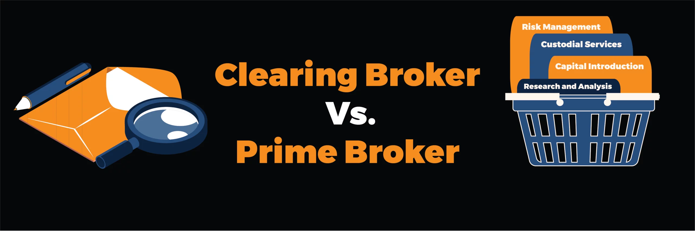

## Table of Contents

## What is a clearing broker?

A clearing broker is a company that helps other brokers finish their trades. When someone buys or sells stocks, the clearing broker makes sure everything is done correctly. They check that the buyer has the money and the seller has the stocks. They also handle the transfer of money and stocks between the two parties.

Clearing brokers are important because they reduce the risk of something going wrong in a trade. They act like a middleman to make sure both sides follow the rules. This helps keep the stock market safe and trustworthy. Without clearing brokers, trading could be much riskier and more complicated.

## What is a prime broker?

A prime broker is a big company that helps hedge funds and other big investors with their trading. They offer services like lending money, keeping track of investments, and helping with buying and selling stocks. They also give advice and help manage the risks that come with investing.

Prime brokers are important because they make it easier for big investors to do their work. They provide a lot of services in one place, which saves time and money. This way, investors can focus more on making good investment decisions instead of worrying about the details of trading.

## What are the primary roles of a clearing broker?

A clearing broker's main job is to make sure that trades happen smoothly and safely. When someone buys or sells stocks, the clearing broker checks that the buyer has the money and the seller has the stocks. They act like a middleman to make sure everything is done correctly. This helps reduce the risk of something going wrong in the trade.

Clearing brokers also handle the transfer of money and stocks between the buyer and seller. They keep records of all trades and make sure that all the rules are followed. By doing this, clearing brokers help keep the stock market safe and trustworthy. Without them, trading could be much riskier and more complicated.

## What are the primary roles of a prime broker?

A prime broker helps big investors like hedge funds with their trading. They lend money to these investors so they can buy more stocks. They also keep track of all the investments and make sure everything is organized. This helps the investors know what they own and how their investments are doing.

Prime brokers also help with buying and selling stocks. They give advice on when to buy or sell and help manage the risks that come with investing. By doing all these things, prime brokers make it easier for big investors to focus on making good investment decisions instead of worrying about the details of trading.

## How does a clearing broker facilitate trade settlement?

A clearing broker helps make sure that trades are settled correctly. When someone buys or sells stocks, the clearing broker checks that the buyer has enough money and the seller has the stocks they are selling. They act like a middleman to make sure both sides follow the rules. This helps reduce the risk of something going wrong in the trade.

The clearing broker also handles the actual transfer of money and stocks between the buyer and seller. They keep records of all the trades and make sure everything is done on time. By doing this, clearing brokers help keep the stock market safe and trustworthy. Without them, trading could be much riskier and more complicated.

## How does a prime broker support hedge funds and institutional investors?

A prime broker helps hedge funds and big investors by giving them money to buy more stocks. This is called leverage. They also keep track of all the investments, so the investors know exactly what they own and how their investments are doing. This makes it easier for the investors to manage their money without having to do all the paperwork themselves.

Prime brokers also help with buying and selling stocks. They give advice on when to buy or sell and help manage the risks that come with investing. By doing all these things, prime brokers make it easier for big investors to focus on making good investment decisions instead of worrying about the details of trading. This saves time and money for the investors.

## What are the key differences between a clearing broker and a prime broker?

A clearing broker and a prime broker are both important in the world of trading, but they do different things. A clearing broker makes sure that trades are done correctly. When someone buys or sells stocks, the clearing broker checks that the buyer has the money and the seller has the stocks. They also handle the transfer of money and stocks between the two parties. This helps keep the stock market safe and trustworthy because they make sure everything is done right.

On the other hand, a prime broker helps big investors like hedge funds with their trading. They lend money to these investors so they can buy more stocks. They also keep track of all the investments and help with buying and selling. Prime brokers give advice and help manage the risks that come with investing. This makes it easier for big investors to focus on making good investment decisions instead of worrying about the details of trading.

## Can a firm act as both a clearing broker and a prime broker?

Yes, a firm can act as both a clearing broker and a prime broker. This means they can help with the whole process of trading. As a clearing broker, they make sure that trades are done correctly. They check that the buyer has the money and the seller has the stocks. They also handle the transfer of money and stocks between the two parties. This helps keep the stock market safe and trustworthy.

As a prime broker, the same firm can help big investors like hedge funds with their trading. They lend money to these investors so they can buy more stocks. They also keep track of all the investments and help with buying and selling. Prime brokers give advice and help manage the risks that come with investing. This makes it easier for big investors to focus on making good investment decisions instead of worrying about the details of trading.

## What are the regulatory requirements for clearing brokers?

Clearing brokers have to follow many rules set by government agencies like the Securities and Exchange Commission (SEC) and the Financial Industry Regulatory Authority (FINRA). These rules make sure that clearing brokers do their job correctly and keep the stock market safe. Clearing brokers must have enough money to cover any problems that might happen during trades. They also need to keep good records of all the trades they handle.

Clearing brokers also have to report any problems or mistakes to the right people quickly. They need to make sure they follow all the rules about how to handle money and stocks. This includes making sure that the money and stocks are transferred correctly between buyers and sellers. By following these rules, clearing brokers help keep trading fair and trustworthy for everyone.

## What are the regulatory requirements for prime brokers?

Prime brokers also have to follow many rules set by government agencies like the SEC and FINRA. These rules help make sure that prime brokers do their job well and keep the stock market safe. Prime brokers need to have enough money to cover any problems that might happen with the money they lend to big investors. They also need to keep good records of all the investments they help manage.

Prime brokers must report any problems or mistakes quickly to the right people. They need to follow all the rules about how to handle money and investments. This includes making sure they give good advice and help manage risks correctly. By following these rules, prime brokers help make sure that big investors can trade safely and fairly.

## How do clearing brokers manage risk?

Clearing brokers manage risk by making sure that both the buyer and the seller follow the rules when trading stocks. They check that the buyer has enough money and the seller has the stocks they are selling. This helps prevent problems like someone not being able to pay for the stocks they bought or not being able to deliver the stocks they sold. By doing these checks, clearing brokers reduce the chance that something goes wrong during a trade.

Clearing brokers also keep a close eye on the money they use to make sure trades happen smoothly. They have to have enough money to cover any problems that might come up. This means they can step in and fix things if a trade goes wrong. By managing their money carefully, clearing brokers help keep the stock market safe and trustworthy for everyone.

## How do prime brokers manage risk and leverage for their clients?

Prime brokers help big investors like hedge funds manage risk by giving them good advice on when to buy or sell stocks. They use their knowledge to help these investors make smart choices. Prime brokers also keep a close eye on the money they lend to investors. They make sure they have enough money to cover any problems that might come up. This helps keep everything safe and reduces the chance of big losses.

Prime brokers also help their clients use leverage, which means borrowing money to buy more stocks. This can help investors make more money if the stocks go up in value. But it can also be risky because if the stocks go down, the losses can be bigger. Prime brokers manage this risk by setting rules on how much money they will lend and by keeping track of the investments closely. This way, they can help their clients use leverage safely and make better investment decisions.

## References & Further Reading

[1]: Bergstra, J., Bardenet, R., Bengio, Y., & Kégl, B. (2011). ["Algorithms for Hyper-Parameter Optimization."](https://papers.nips.cc/paper/4443-algorithms-for-hyper-parameter-optimization) Advances in Neural Information Processing Systems 24.

[2]: ["Advances in Financial Machine Learning"](https://www.amazon.com/Advances-Financial-Machine-Learning-Marcos/dp/1119482089) by Marcos Lopez de Prado

[3]: ["Evidence-Based Technical Analysis: Applying the Scientific Method and Statistical Inference to Trading Signals"](https://www.amazon.com/Evidence-Based-Technical-Analysis-Scientific-Statistical/dp/0470008741) by David Aronson

[4]: ["Machine Learning for Algorithmic Trading"](https://github.com/stefan-jansen/machine-learning-for-trading) by Stefan Jansen

[5]: ["Quantitative Trading: How to Build Your Own Algorithmic Trading Business"](https://www.amazon.com/Quantitative-Trading-Build-Algorithmic-Business/dp/1119800064) by Ernest P. Chan