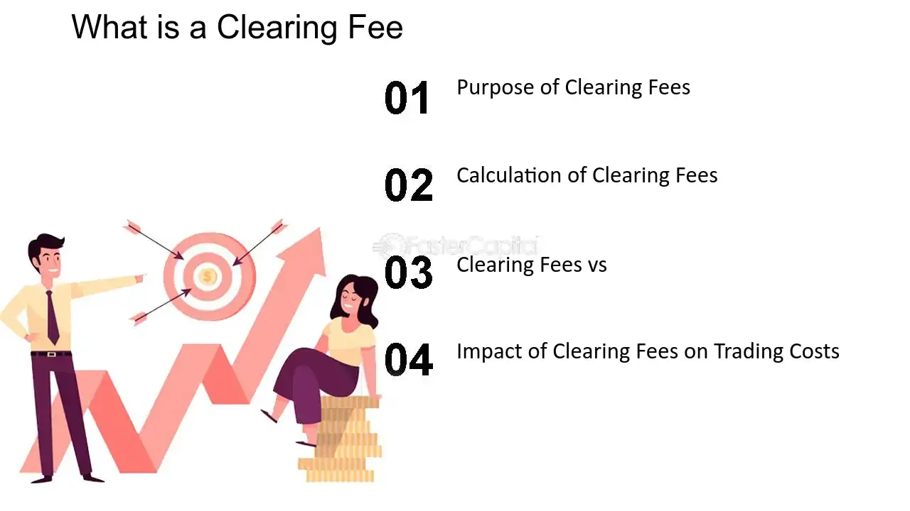

## Table of Contents

## What is a clearing fee?

A clearing fee is a charge that financial institutions, like banks or brokers, pay to a clearinghouse. The clearinghouse is a special organization that helps make sure trades and transactions are safe and happen correctly. When someone buys or sells stocks, for example, the clearinghouse makes sure the buyer gets the stocks and the seller gets the money. The clearing fee helps pay for these services.

These fees are usually small, but they can add up over time, especially if you trade a lot. The exact amount of the clearing fee can change depending on the clearinghouse and the type of trade. It's important for people who trade often to know about these fees because they can affect how much money they make or lose.

## Why are clearing fees charged?

Clearing fees are charged to cover the costs of making sure trades happen safely and correctly. When you buy or sell something like stocks, a special organization called a clearinghouse steps in to make sure everything goes smoothly. They check that the buyer gets what they paid for and the seller gets their money. This process helps prevent mistakes and fraud, keeping the market trustworthy.

The fees help pay for the services the clearinghouse provides. These services include checking all the details of a trade, making sure both sides of the deal follow the rules, and handling any problems that come up. Even though the fees are usually small, they are important because they help keep the whole trading system running smoothly and safely.

## Who typically pays the clearing fee?

The clearing fee is usually paid by the financial institutions like banks or brokers. These institutions handle the buying and selling of stocks or other financial products for their customers. When a trade happens, the bank or broker sends the trade details to a clearinghouse. The clearinghouse then makes sure everything is correct and safe. The bank or broker pays the clearing fee to the clearinghouse for these services.

Sometimes, the cost of the clearing fee might be passed on to the customer. This means that if you are the one buying or selling stocks, you might see this fee added to your trading costs. However, it depends on the policies of the bank or broker. They might choose to cover the fee themselves or share it with their customers.

## How is the amount of a clearing fee determined?

The amount of a clearing fee is set by the clearinghouse. It can change depending on a few things. One thing is the type of trade. For example, buying or selling stocks might have a different fee than trading other things like futures or options. Another thing is how much the trade is worth. Bigger trades might have bigger fees. The clearinghouse looks at all these details and decides on a fee that covers their costs and keeps their services running smoothly.

Sometimes, the clearinghouse might also think about how often someone trades. If a person or a bank trades a lot, they might get a lower fee because they are good customers. But if someone trades only once in a while, they might have to pay a bit more. The clearinghouse wants to make sure their fees are fair and help keep the trading system safe for everyone.

## Can clearing fees vary between different financial institutions?

Clearing fees can be different at different financial institutions. This is because each bank or broker might have a deal with the clearinghouse. The clearinghouse decides the basic fee, but the bank or broker might add their own charges on top of that. So, if you use different banks or brokers, you might see different clearing fees for the same kind of trade.

Sometimes, the clearing fee can also change based on how much you trade. If you trade a lot, your bank or broker might get a special deal from the clearinghouse, which means you might pay less. But if you only trade now and then, you might not get that special deal, and your fees could be higher. It's a good idea to check with your bank or broker to see what fees they charge and how they compare to others.

## What is the role of a clearinghouse in relation to clearing fees?

A clearinghouse is like a referee in the world of trading. It makes sure that when people buy and sell things like stocks, everything goes smoothly and fairly. The clearinghouse checks all the details of a trade to make sure the buyer gets what they paid for and the seller gets their money. This helps stop mistakes and cheating, keeping the market safe for everyone.

The clearinghouse charges a fee for these services, which is called a clearing fee. This fee helps pay for all the work the clearinghouse does to make sure trades are safe and correct. The amount of the fee can change depending on what is being traded, how much is being traded, and how often someone trades. The clearinghouse sets the fee, but banks and brokers might add their own charges on top of it.

## How do clearing fees impact the overall cost of trading?

Clearing fees can add to the total cost of trading. When you buy or sell stocks, a special group called a clearinghouse makes sure everything goes smoothly. They charge a small fee for this service, which is called a clearing fee. Even though the fee is usually small, it can add up if you trade a lot. Banks or brokers might also add their own fees on top of the clearing fee, which can make your trading costs higher.

The exact amount of the clearing fee can change depending on what you're trading, how much you're trading, and how often you trade. If you trade a lot, you might get a better deal on the clearing fee. But if you only trade now and then, you might have to pay more. It's important to know about these fees because they can affect how much money you make or lose when you trade.

## Are there any strategies to minimize the impact of clearing fees on investment returns?

One way to lower the impact of clearing fees on your investment returns is to trade less often. Every time you buy or sell stocks, you have to pay a clearing fee. If you trade a lot, these fees can add up and eat into your profits. By holding onto your investments for a longer time, you can reduce the number of times you have to pay these fees. This strategy is called long-term investing, and it can help you keep more of your money.

Another strategy is to choose a bank or broker that offers lower clearing fees or special deals for frequent traders. Some banks and brokers have agreements with clearinghouses that let them charge less for their services. If you trade a lot, it might be worth looking for a bank or broker that can give you a better deal on clearing fees. This way, you can save money on each trade and keep more of your investment returns.

## What are the differences between clearing fees and other types of transaction fees?

Clearing fees are charges that banks or brokers pay to a clearinghouse to make sure trades happen safely and correctly. When you buy or sell stocks, the clearinghouse checks everything to make sure the buyer gets the stocks and the seller gets the money. This helps stop mistakes and cheating. The clearing fee is usually small, but it can add up if you trade a lot. The exact amount can change depending on what you're trading, how much you're trading, and how often you trade.

Other types of transaction fees can include things like brokerage commissions, which are fees that brokers charge for helping you buy or sell stocks. There are also exchange fees, which are charges from the stock exchange where the trade happens. Unlike clearing fees, which are mainly about making sure the trade is safe, these other fees are for the services provided by the broker or the exchange. All these fees together can make the total cost of trading higher, so it's good to know about them and how they can affect your investment returns.

## How have clearing fees evolved historically, and what trends are expected in the future?

Historically, clearing fees have changed as the financial world has grown and become more complex. In the past, clearinghouses were smaller and did less work, so the fees were smaller too. But as more people started trading and new kinds of trades like futures and options came along, clearinghouses had to do more to keep everything safe and correct. This meant the fees went up. Also, as technology got better, clearinghouses could handle more trades faster, but they still had to charge enough to cover their costs and make sure the trading system stayed safe.

In the future, clearing fees might keep changing because of new technology and rules. As computers and software get even better, clearinghouses might be able to do their jobs faster and cheaper. This could mean lower fees for everyone. But if new rules come out that make clearinghouses do even more work to keep trades safe, the fees might go up instead. It's hard to say for sure, but it's likely that clearing fees will keep changing to match what the market needs and what the law says.

## What regulatory considerations must be taken into account regarding clearing fees?

When it comes to clearing fees, there are rules that clearinghouses have to follow. These rules come from groups like the Securities and Exchange Commission (SEC) in the United States or other similar groups around the world. The main goal of these rules is to make sure that the fees are fair and don't hurt people who are trading. The rules also want to make sure that clearinghouses can keep doing their job of making trades safe and correct. So, clearinghouses have to be clear about how they set their fees and make sure they are not too high.

In the future, new rules might come out that change how clearing fees work. For example, if there are big changes in the market or new technology comes along, the rules might need to change too. These new rules could make clearinghouses do more work to keep trades safe, which might mean higher fees. Or, they could help clearinghouses use new technology to do their job better and cheaper, which might mean lower fees. It's important for everyone involved in trading to keep an eye on these rules because they can affect how much it costs to trade.

## How do clearing fees affect market liquidity and efficiency?

Clearing fees can affect how easy it is to buy and sell things in the market. When the fees are high, people might not want to trade as much because it costs more money. This can make the market less liquid, which means it's harder to find someone to buy or sell with. If fewer people are trading, it can also make the market less efficient because there are fewer chances for prices to find the right level based on what people want to buy and sell.

On the other hand, clearing fees are important for keeping the market safe and working well. The fees help pay for the work that clearinghouses do to make sure trades happen correctly and safely. Without these fees, clearinghouses might not be able to do their job properly, and that could make the market less safe and less efficient. So, while high clearing fees might make people trade less, they are also needed to keep the market running smoothly and fairly.

## How do clearing fees impact algorithmic trading?

Algorithmic trading utilizes computational algorithms to automatically execute trade orders with speed and precision. This rapid execution, essential for capitalizing on minute market opportunities, can result in a high [volume](/wiki/volume-trading-strategy) of transactions. Consequently, one of the significant cost components traders must consider is the clearing fee. Clearing fees represent the costs associated with the processing and settlement of these transactions by clearinghouses. 

In [algorithmic trading](/wiki/algorithmic-trading), where vast numbers of trades are executed within fractions of a second, even marginal clearing fees can accumulate, impacting overall profitability. Understanding and optimizing these fees becomes critical, particularly in trading environments where profit margins are narrow and competitive pressures demand cost efficiency.

For traders employing algorithmic strategies, clearing fees can influence decision-making processes. For example, strategies involving high turnover rates might necessitate a reevaluation of their cost-effectiveness when the cumulative impact of clearing fees is factored in. Moreover, these fees can alter the perceived profitability of specific trading algorithms.

To better understand the financial impact, traders might calculate the total clearing fee costs using straightforward mathematics. If $F$ denotes the clearing fee per transaction and $N$ is the total number of transactions executed in a given period, the total clearing fee cost ($C$) can be defined as:

$$
C = F \times N
$$

This equation underscores the linear relationship between transaction volume and total clearing fees. Consequently, traders must assess whether their trading strategies can sustain the clearing fee levels or if adjustments to the strategy are necessary to maintain a competitive edge.

Optimization of clearing fees can involve various strategies. Traders might seek to aggregate trades, thereby reducing the transaction frequency and minimizing fees. Alternatively, the employment of tiered fee structures offered by some clearinghouses could be beneficial, where fee rates decrease as trading volumes increase. Analyzing and selecting appropriate clearinghouses with more favorable fee structures directly affects the net returns of algorithmic trading activities.

Overall, the strategic management of clearing fees is an integral component of algorithmic trading, necessitating forethought and planning. In this context, sophisticated financial modeling and optimization algorithms may provide the insights needed to handle these costs effectively, ensuring that they do not erode potential returns.

## References & Further Reading

[1]: Hull, J. C. (2012). ["Risk management and financial institutions."](https://archive.org/download/quant_books/Risk%20Management%20_%20Financial%20Institutions%20-%20J.%20C.%20Hull.pdf) Wiley.

[2]: Pirrong, C. (2011). ["The economics of central clearing: Theory and practice."](https://www.wsj.com/public/resources/documents/ISDApaper05232011.pdf) ISDA Discussion Papers, no.1.

[3]: Duffie, D., & Zhu, H. (2011). ["Does a central clearing counterparty reduce counterparty risk?"](https://www.mit.edu/~zhuh/DuffieZhu_CCP.pdf) The Review of Asset Pricing Studies, 1(1), 74-95.

[4]: Gregory, J. (2014). ["Central counterparty clearing: The impact of the Dodd-Frank Act and EMIR on OTC derivatives."](https://books.google.com/books/about/Central_Counterparties.html?id=1pPVBQAAQBAJ) Financial Analytical Centre.

[5]: Hansen, L. P., & Sargent, T. J. (2001). ["Acknowledging misspecification in macroeconomic theory."](https://www.sciencedirect.com/science/article/pii/S1094202501901322) The Review of Economic Studies, 68(2), 343-366.