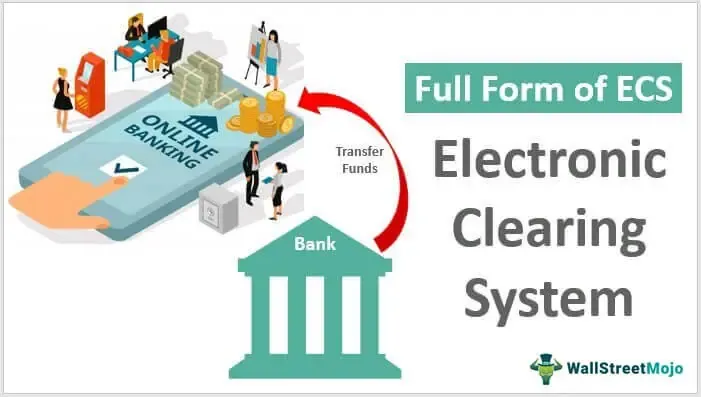

The world of finance is continuously evolving, with technology playing a pivotal role in transforming how transactions are conducted and managed. At the forefront of this transformation is the Clearing House Electronic Subregister System (CHESS), operated by the Australian Securities Exchange (ASX). CHESS represents a significant technological advancement in financial markets, offering a secure and efficient platform for the transfer of securities ownership and management of exchange operations. This article explores the complexities of CHESS, examining its fundamental role in clearing and settlement processes, as well as its significant contribution to the domain of algorithmic trading.

CHESS fundamentally revolutionizes securities transactions by eliminating the need for physical certificates, thereby streamlining transaction processes for both buyers and sellers. This system not only ensures increased operational efficiency but also enhances the security of financial transactions by maintaining an electronic record of all trades and holdings. In doing so, CHESS serves as a backbone for reliable and transparent trading operations, crucial for maintaining market integrity.

Additionally, CHESS plays an integral role in accommodating the rise of algorithmic trading—a method involving sophisticated computer algorithms to execute trades at unprecedented speeds and volumes. By providing a robust infrastructure, CHESS enables seamless interactions between automated trading systems and settlement mechanisms, thus improving market liquidity and accuracy.

Ultimately, the integration of CHESS in Australia's financial markets underscores the essential role that technology performs in driving advancements in modern trading practices. It facilitates efficient clearing and settlements while supporting advanced trading methodologies, such as algorithmic trading. As financial markets continue to progress, systems like CHESS are expected to remain central to achieving seamless, secure, and efficient market operations.

## Table of Contents

## What is CHESS?

CHESS, or the Clearing House Electronic Subregister System, is a pivotal computer-based system employed by the Australian Securities Exchange (ASX) to streamline the transfer of securities ownership. It functions by handling both the exchange and registration of securities without the reliance on physical certificates. This electronic process significantly benefits both buyers and sellers by offering a streamlined, efficient transaction procedure.

Operational efficiency in the market is enhanced through CHESS as it provides an electronic record of all transactions and holdings. By maintaining an accurate and detailed ledger of securities ownership and transfers, CHESS ensures that settlements are executed smoothly and securely. The system not only boosts the speed of financial transactions but also reduces the costs and risks associated with manual handling of securities.

Moreover, CHESS plays an essential role in ensuring transparency and security within the Australian financial markets by maintaining a reliable record that assists investors, brokers, and regulators in tracking and managing securities. This computerized system facilitates legal compliance and promotes a higher level of trust in market operations by providing a secure and precise method for recording securities exchanges.

## How CHESS Works

Participants in the Australian Securities Exchange (ASX), such as brokers and institutional investors, are integral to the operation of the Clearing House Electronic Subregister System (CHESS). Each participant is assigned a unique participant code, which is essential for tracking and managing trades within the system. This unique identification ensures that each participant's transactions and holdings are accurately recorded and represented in the electronic system.

Settlement in CHESS is a streamlined process that ensures the transfer of legal ownership of securities and their associated funds between parties. Typically, this process must be completed within two business days following the execution of a trade, commonly referred to as T+2 settlement. This timeframe aligns with global best practices, promoting efficiency and reducing the risk of prolonged settlement periods.

To achieve a seamless and secure settlement process, the ASX Settlement uses CHESS in conjunction with the Reserve Bank Information and Transfer System (RITS). This integration is crucial for ensuring that transactions are final and irrevocable. Specifically, RITS provides real-time gross settlement (RTGS) services, chiefly for interbank transfers, which allows funds to be transferred instantaneously during operational hours. This coupling of CHESS and RITS guarantees that once a transaction is settled, it is not subject to reversal, which bolsters the overall security and reliability of the market. 

The collaboration of CHESS with RITS further ensures that the settlement process incorporates all necessary checks and balances. This safeguards against potential transactional discrepancies that might otherwise undermine market confidence. By maintaining rigorous security standards and operational efficiency, CHESS plays a vital role in supporting the ASX's ability to function as a leading financial marketplace.

## The Role of the Clearing House

A clearinghouse plays a vital role in financial markets by acting as a central counterparty in trade settlements. This function is essential for mitigating the risk associated with one party potentially defaulting on a transaction. In the context of the Clearing House Electronic Subregister System (CHESS), this risk mitigation ensures a smoother transaction process for market participants.

By interposing itself between the buyer and the seller, a clearinghouse effectively becomes the buyer to every seller and the seller to every buyer. This practice, often referred to as novation, allows the clearinghouse to manage the default risk that each party presents. The clearinghouse further mitigates this risk through a system of margin requirements and collateral management. These financial safeguards ensure that each party holds enough capital to cover potential losses, thereby protecting the other counterparty in the case of a default.

Moreover, the presence of a clearinghouse facilitates market integrity by reducing the counterparty risk and enhancing the confidence participants have when engaging in trade activities. This confidence, in turn, leads to increased market [liquidity](/wiki/liquidity-risk-premium) and robustness, as traders are more likely to participate in a transparent and secure trading environment.

The effectiveness of a clearinghouse like CHESS is seen in its ability to handle settlements efficiently. This process typically involves the transfer of legal ownership of securities and the corresponding funds, all settled within a predefined timeframe, usually within two business days of the trade execution (T+2 settlement cycle). This timely settlement is supported by a comprehensive integration with financial systems such as the Reserve Bank Information and Transfer System (RITS), ensuring that all transactions are final and irrevocable. Such integration provides additional security and reliability to the clearinghouse's operations, further safeguarding the market from systemic risks.

In summary, the role of the clearinghouse underpins the trust and efficiency of financial markets. By assuming the default risk and facilitating the settlement process, it maintains the integrity and smooth operation of trading activities, thereby serving as a cornerstone in the stability of the financial industry.

## Algorithmic Trading and CHESS

Algorithmic trading is a method of executing orders using automated pre-programmed trading instructions accounting for variables such as time, price, and [volume](/wiki/volume-trading-strategy). This form of trading has transformed modern financial markets by offering expedited trade execution and reducing human intervention. These systems can operate at exceptional speeds and process vast amounts of data, which are characteristics that manual trading cannot replicate.

The Clearing House Electronic Subregister System (CHESS), managed by the Australian Securities Exchange (ASX), plays a critical role as a backbone infrastructure supporting [algorithmic trading](/wiki/algorithmic-trading) by enabling the electronic registration and transfer of securities. The system's design accommodates the rapid pace that algorithmic trading demands by ensuring efficient and secure processing of a high volume of trades. CHESS is able to handle the high throughput required by algorithmic trading platforms due to its robust and scalable architecture, which maintains market stability and protects against trading anomalies.

Given the instantaneous nature of algorithmic trading, CHESS provides vital operational support through its settlement features. After trade execution, timely and accurate settlement is crucial. CHESS facilitates this by delivering seamless trade matching, confirmation, and transfer of ownership, typically within a T+2 (trade date plus two days) timeframe. This efficiency is crucial in preserving market liquidity—a key parameter for effective algorithmic trading.

The interaction between CHESS and algorithmic trading systems enhances market liquidity and price discovery. Algorithmic trading generates a [high frequency](/wiki/high-frequency-trading) and volume of trades which contribute to tighter bid-ask spreads. By providing infrastructure that can support such a quantity of transactions without compromising on speed or reliability, CHESS ensures that these transactions are settled accurately and securely, thereby bolstering market participants' confidence.

Moreover, algorithms rely heavily on the accuracy of data and the certainty of trade execution, aspects that CHESS inherently supports. Its robust settlement mechanisms facilitate the seamless operation of automated trading strategies, thereby increasing overall market efficiency. As algorithmic trading continues to evolve, systems like CHESS will likely adapt and upgrade to meet emerging needs, improving both their technological capabilities and service offerings. 

Through its integration with algorithmic trading platforms, CHESS not only sustains high trading volumes but also augments trading precision and speed, thereby continuing to support the evolving landscape of financial markets.

## CHESS and Trader's Protection

The Clearing House Electronic Subregister System (CHESS) plays a vital role in safeguarding traders against unauthorized transactions within the Australian Securities Exchange (ASX). Participation in CHESS involves strict compliance with security protocols that are crucial for maintaining the integrity of the system. These protocols are designed to ensure that only authorized transactions occur, thereby reducing the risk of fraudulent activities.

CHESS implements a range of security measures that include participant verification, encryption, and real-time monitoring of trades. Each participant in CHESS, including brokers and institutional investors, is issued a unique identifier that must be used to authenticate transactions. This process helps in verifying the legitimacy of each transaction, providing a layer of security that protects both individual and institutional traders.

In instances where unauthorized trading activities occur, CHESS has mechanisms in place to protect the affected investors. These mechanisms include the ability to trace and audit transactions efficiently, allowing for the swift identification of potentially fraudulent trades. Furthermore, the ASX provides avenues for compensation to ensure that investors are not left at a loss due to unauthorized actions. This compensation framework is pivotal in maintaining trust and confidence in the market, reassuring participants that there are protective measures to recover potential losses.

Moreover, CHESS continuously updates and refines its security measures to adapt to emerging threats and technological advancements. The commitment to security innovation reflects the ASX's dedication to protecting its participants and maintaining a secure trading environment. As technology advances, so too does the sophistication of potential threats, prompting ongoing enhancements in security protocols to stay ahead of unauthorized trading risks.

In summary, CHESS is instrumental in protecting traders by enforcing stringent security protocols, offering compensation for unauthorized trades, and continually updating its security measures. These efforts ensure the integrity and reliability of the Australian Securities Exchange, fostering a secure environment for all trading activities.

## Future Developments in CHESS

The Australian Securities Exchange (ASX) is actively pursuing enhancements to the Clearing House Electronic Subregister System (CHESS) as part of its strategy to modernize and future-proof its financial infrastructure. Recognizing the rapid advancements in technology and the changing demands of financial markets, the ASX has embarked on a project to replace the existing CHESS system. This replacement initiative seeks to significantly bolster the system's performance, security, and adaptability, thereby ensuring its capability to meet future market requirements effectively.

At the core of the CHESS replacement endeavor is the integration of blockchain technology. Blockchain offers numerous advantages, including immutable records, enhanced transparency, and the elimination of reconciliation delays. By leveraging blockchain, the new CHESS system aims to substantially improve the speed and reliability of trade settlement processes, catering to the needs of a faster-paced trading environment. Blockchain's distributed ledger attributes also promise to reduce the risk of discrepancies and unauthorized modifications, thereby enhancing security for all market participants.

To achieve these goals, the ASX is implementing a phased approach to the CHESS upgrade, ensuring a seamless transition for its users. The first phase involves thorough testing and stakeholder engagement to address any operational challenges that may arise during the shift to a blockchain-based infrastructure. This includes ensuring compatibility with existing market practices and regulatory compliance, critical aspects for maintaining market stability.

Moreover, the CHESS replacement project is designed with future scalability in mind, allowing the system to accommodate increasing trade volumes and evolving financial instruments. This adaptability is essential as financial markets continue to grow and diversify, necessitating robust systems that can support complex trading strategies and increased market participation.

The commitment to integrating cutting-edge technology like blockchain within the CHESS framework underscores ASX's dedication to delivering secure, efficient, and forward-looking market operations. As the project progresses, it is poised to set a new benchmark for clearing and settlement systems globally, reflecting ASX's leadership in embracing innovation for financial market infrastructure.

## Conclusion

The integration of CHESS in Australia's financial markets underscores how critical technology is in modern trading. CHESS has revolutionized securities transactions by providing a streamlined and secure framework for transferring ownership and clearing trades. By eliminating physical certificates, it has eased operational burdens and reduced the risks traditionally associated with such transactions.

An important feature of CHESS is its accommodation of algorithmic trading. This advancement allows for high-speed and high-frequency trades that far exceed human capabilities. CHESS supports these sophisticated trading methodologies by ensuring the infrastructure can process large volumes of transactions efficiently, which enhances market liquidity and precision in trading outcomes. The robust settlement mechanisms within CHESS facilitate seamless interaction between automated trading systems and market operations.

Looking forward, as financial markets continue to grow in complexity and scope, the role played by systems like CHESS will remain vital. These systems are critical to achieving secure, efficient market operations and must evolve to incorporate cutting-edge technologies such as blockchain for further advancements in performance and security. CHESS's planned updates signify not just an adaptation to contemporary needs but a proactive approach to shaping future market demands, ensuring the Australian Securities Exchange remains at the forefront of global financial exchanges.

## References & Further Reading

[1]: Aitken, M., & Siow, A. (2003). ["Trade Size and Information-Motivated Trading in a Limit Order Market"](https://www.researchgate.net/profile/Michael-Aitken/publication/279182030_HIGH_FREQUENCY_TRADING_AND_END-OF-DAY_PRICE_DISLOCATION/links/558cc7ca08ae591c19da122f/HIGH-FREQUENCY-TRADING-AND-END-OF-DAY-PRICE-DISLOCATION.pdf). Econometrica.

[2]: Tapper, N., & Willcox, S. (2020). ["ASX's CHESS Replacement taking shape."](https://www.aph.gov.au/Parliamentary_Business/Committees/Joint/Corporations_and_Financial_Services/OversightofASIC/Competition_in_clearing_and_settlement_and_the_ASX_CHESS_Replacement_Project/Chapter_5_-_The_ASX_CHESS_Replacement_Project_-_Background) Reuters.

[3]: Anderson, P. (2018). ["Blockchain Technology Initiatives at ASX."](https://journals.sagepub.com/doi/full/10.3233/ISU-180019) Risk.net.

[4]: Hasbrouck, J., & Saar, G. (2013). ["Low Latency Trading"](https://www.sciencedirect.com/science/article/abs/pii/S1386418113000165) Review of Financial Studies.

[5]: Mackintosh, J. (2016). ["The Truth About High-Frequency Trading."](https://psycnet.apa.org/record/1997-38751-009) The Wall Street Journal.