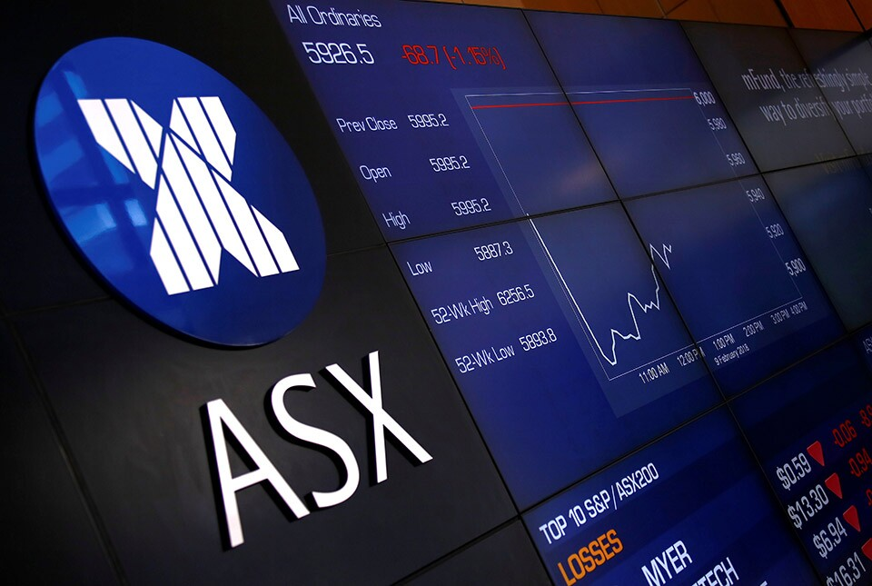

## Table of Contents

## What is the Clearing House Electronic Subregister System (CHESS)?

The Clearing House Electronic Subregister System, or CHESS, is a system used in Australia for keeping track of who owns shares in companies. It's run by the Australian Securities Exchange (ASX). CHESS makes it easier and safer to buy and sell shares by keeping a digital record of all the transactions and ownership details. This means that when someone buys or sells shares, CHESS updates the records to show the new owner.

CHESS also helps in settling trades, which means making sure that when shares are bought and sold, the buyer gets the shares and the seller gets the money. It does this by holding the shares and money until everything is confirmed. This system reduces the risk of something going wrong during the trade. Overall, CHESS plays a big role in making the Australian stock market run smoothly and securely.

## How does CHESS function in the Australian financial market?

CHESS is like a big computer system that keeps track of who owns what shares in Australia. When someone buys or sells shares, CHESS updates its records to show the new owner. This helps make sure that everyone knows exactly who owns which shares at any time. It's run by the Australian Securities Exchange, or ASX, which is like the main place where shares are traded in Australia.

CHESS also helps make buying and selling shares safer and smoother. When a trade happens, CHESS holds onto the shares and the money until everything is checked and confirmed. This is called settling the trade. By doing this, CHESS makes sure that the person selling the shares gets their money, and the person buying the shares gets their shares. It's a big part of why the Australian stock market works well and people can trust it.

## What are the main benefits of using CHESS for investors and brokers?

CHESS makes investing easier and safer for both investors and brokers. For investors, CHESS keeps a clear record of who owns which shares. This means if you buy shares, you can be sure they are safely recorded under your name. It also helps when you want to sell your shares, as CHESS makes sure you get paid quickly and correctly. This reduces the risk of something going wrong during a trade, giving investors peace of mind.

For brokers, CHESS streamlines the process of buying and selling shares. It handles the settlement of trades, which means it takes care of making sure the shares and money go to the right places after a trade. This saves brokers a lot of time and effort, allowing them to focus more on helping their clients. CHESS also provides a reliable system that brokers can trust, making their job smoother and more efficient.

## Can you explain the process of share settlement through CHESS?

When someone buys or sells shares on the Australian stock market, CHESS helps make sure everything goes smoothly. When a trade happens, CHESS holds onto the shares and the money until everything is checked. This is called the settlement process. It usually takes two business days after the trade to complete this. During this time, CHESS makes sure the seller really owns the shares they are selling and that the buyer has the money to pay for them.

Once everything is confirmed, CHESS moves the shares from the seller's account to the buyer's account. At the same time, it sends the money from the buyer to the seller. This way, both the buyer and the seller know they will get what they are supposed to. CHESS keeps everything safe and fair, making sure no one gets cheated. By doing all this, CHESS helps keep the stock market running smoothly and keeps everyone's trust.

## How does CHESS handle corporate actions like dividends and stock splits?

When a company decides to do something like pay dividends or split its stocks, CHESS makes sure all the changes are recorded correctly. For dividends, CHESS keeps track of who owns the shares on the day the company decides to pay them. Then, it helps make sure that the money gets to the right people. If a company decides to split its stocks, CHESS updates its records to show that each shareholder now has more shares, but each share is worth less. This way, CHESS makes sure everyone's share count is correct after the split.

CHESS also helps with other corporate actions, like rights issues or mergers. For a rights issue, CHESS records who gets the right to buy more shares and makes sure those rights are given out correctly. In a merger, CHESS updates the records to show any new shares or changes in ownership. By handling all these changes, CHESS keeps everything organized and makes sure shareholders get what they are supposed to from the company's decisions.

## What security measures are in place to protect transactions on CHESS?

CHESS uses several strong security measures to keep transactions safe. It has a system that checks and double-checks every trade to make sure no one can change the records without permission. This helps stop people from cheating or making mistakes. CHESS also uses special codes and passwords that only the right people can use, which adds another layer of safety to make sure only the people who should be able to access the system can do so.

Another important security measure is how CHESS keeps all the information about trades and ownership in a safe, electronic way. This means the records are hard to change or steal. CHESS also works with banks and other financial groups to make sure the money part of the trades is secure. By working together, they help make sure the whole process from buying to selling shares is safe and trusted by everyone involved.

## How has CHESS evolved since its introduction?

Since CHESS started in the 1990s, it has changed a lot to keep up with new technology and the needs of the market. At first, CHESS was a big step forward because it made trading shares easier and safer by using computers instead of paper records. Over the years, CHESS has been updated to handle more trades faster and to add new features. For example, it now works with different kinds of investments, not just shares, and it can handle things like dividends and stock splits better.

The biggest change happened when the ASX decided to replace CHESS with a new system called CHESS Replacement. This new system aims to use the latest technology to make trading even faster and safer. It will also be able to handle more types of financial products and make it easier for people all over the world to trade in the Australian market. Even though the old CHESS system has been very helpful, the new system will make things even better and keep the Australian stock market strong and trusted.

## What are the current challenges or limitations faced by CHESS?

CHESS has been a reliable system for a long time, but it faces some challenges now. One big problem is that it's getting old. The technology used in CHESS is not as new as some other systems around the world. This can make it slower and harder to add new features that people want. Also, because it's old, it can be harder to keep it safe from hackers who might try to break in and cause problems.

Another challenge is that CHESS struggles to handle new types of financial products easily. As the financial world changes, people want to trade things like cryptocurrencies or other new investments. CHESS was not built to handle these, so it can be tricky to add them. This makes it harder for the Australian market to keep up with other markets that are using newer systems. That's why the ASX is working on a new system to replace CHESS, to fix these problems and make trading easier and safer for everyone.

## How does CHESS integrate with other financial systems or platforms?

CHESS works together with other financial systems to make trading easier. It talks to banks and other places where people keep their money. When someone buys or sells shares, CHESS checks with these places to make sure the buyer has enough money and the seller really owns the shares. This helps keep everything safe and fair. CHESS also connects with other stock markets around the world, so people from different countries can trade in the Australian market without too much trouble.

Another way CHESS integrates is by working with companies that handle things like dividends and stock splits. When a company decides to do something like this, CHESS gets the information and makes sure it updates everyone's records correctly. This helps make sure shareholders get what they are supposed to. By working with all these different systems, CHESS helps keep the Australian stock market running smoothly and makes it easier for people to trade shares.

## What future developments or upgrades are planned for CHESS?

The Australian Securities Exchange (ASX) is working on a big upgrade called the CHESS Replacement. This new system will use the latest technology to make trading faster and safer. It will be able to handle more kinds of investments, like cryptocurrencies, and it will be easier for people from other countries to trade in the Australian market. The goal is to make the whole process of buying and selling shares smoother and more secure for everyone.

The CHESS Replacement project is still being worked on and is expected to take some time to finish. Once it's done, it will help solve the problems that the old CHESS system has, like being slow and not able to handle new types of financial products easily. The new system will keep the Australian stock market strong and trusted, making it easier for people to invest and trade.

## How does CHESS compare to similar systems in other countries?

CHESS is a bit like other systems in other countries that keep track of who owns shares. In the United States, they use something called the Depository Trust & Clearing Corporation (DTCC). It's a big system that also makes sure trades are safe and that shares and money go to the right places. In Europe, there's a system called Euroclear, which does a similar job but for many different countries. These systems all help make sure that when people buy and sell shares, everything goes smoothly and safely.

Even though CHESS does a good job, it's a bit older than some of these other systems. The technology in CHESS is not as new as the technology in places like the DTCC or Euroclear. This can make CHESS slower and harder to change when new types of investments come along. That's why the Australian Securities Exchange is working on a new system to replace CHESS. This new system will use the latest technology to keep up with other countries and make trading easier and safer for everyone.

## What are the expert opinions on the effectiveness and efficiency of CHESS?

Experts think CHESS has been good at keeping the Australian stock market safe and working well. It has helped make sure that when people buy and sell shares, the trades are done correctly and everyone gets what they are supposed to. CHESS has been important for making the market fair and trusted. But, some experts also say that CHESS is getting old and can be slow compared to newer systems in other countries. This makes it harder to add new features and handle new types of investments that people want.

Because of these issues, many experts support the plan to replace CHESS with a new system. They think a new system will be faster and safer, using the latest technology. This would help the Australian market keep up with other markets around the world and make it easier for people to trade different kinds of investments. Overall, while CHESS has been effective, experts believe a new system will be even better for the future.

## References & Further Reading

[1]: Aitken, M., & Siow, A. (2003). ["Trade Size and Information-Motivated Trading in a Limit Order Market"](https://www.researchgate.net/profile/Michael-Aitken/publication/279182030_HIGH_FREQUENCY_TRADING_AND_END-OF-DAY_PRICE_DISLOCATION/links/558cc7ca08ae591c19da122f/HIGH-FREQUENCY-TRADING-AND-END-OF-DAY-PRICE-DISLOCATION.pdf). Econometrica.

[2]: Tapper, N., & Willcox, S. (2020). ["ASX's CHESS Replacement taking shape."](https://www.aph.gov.au/Parliamentary_Business/Committees/Joint/Corporations_and_Financial_Services/OversightofASIC/Competition_in_clearing_and_settlement_and_the_ASX_CHESS_Replacement_Project/Chapter_5_-_The_ASX_CHESS_Replacement_Project_-_Background) Reuters.

[3]: Anderson, P. (2018). ["Blockchain Technology Initiatives at ASX."](https://journals.sagepub.com/doi/full/10.3233/ISU-180019) Risk.net.

[4]: Hasbrouck, J., & Saar, G. (2013). ["Low Latency Trading"](https://www.sciencedirect.com/science/article/abs/pii/S1386418113000165) Review of Financial Studies.

[5]: Mackintosh, J. (2016). ["The Truth About High-Frequency Trading."](https://psycnet.apa.org/record/1997-38751-009) The Wall Street Journal.