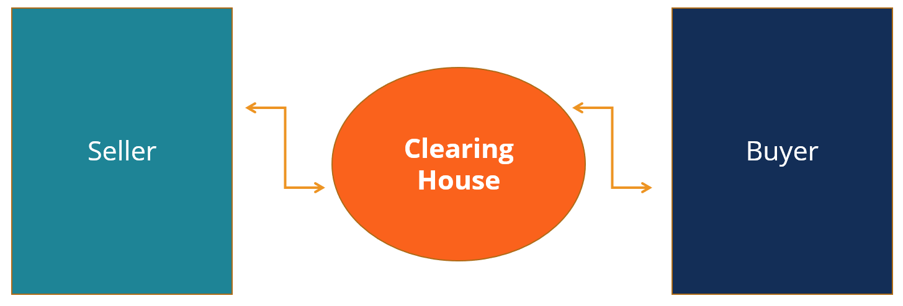

## Table of Contents

## What is a clearing house in finance?

A clearing house in finance is like a middleman that helps make sure trades between buyers and sellers happen smoothly and safely. When people want to buy or sell things like stocks or futures, the clearing house steps in to make sure both sides keep their promises. It does this by holding onto the money and the items being traded until everything is settled. This way, if one side doesn't do what they're supposed to, the clearing house can step in and fix things.

Clearing houses also help to lower the risk that comes with trading. They do this by keeping track of all the trades and making sure everyone follows the rules. If someone can't pay up, the clearing house has a special fund to cover the losses. This makes trading safer for everyone involved because they know there's a backup plan if something goes wrong.

## How does a clearing house function in financial markets?

A clearing house in financial markets acts like a referee for trades. When someone wants to buy or sell something like a stock or a future, the clearing house steps in to make sure the trade goes smoothly. It does this by taking the money from the buyer and the item from the seller, and then it swaps them. This way, the clearing house makes sure that both the buyer and the seller do what they promised. If someone doesn't keep their promise, the clearing house can fix the problem.

Clearing houses also help to make trading safer. They keep an eye on all the trades to make sure everyone follows the rules. If someone can't pay, the clearing house has a special fund to cover the losses. This means that even if something goes wrong, the other people in the trade are protected. By doing all this, clearing houses make the financial markets more trustworthy and help everyone feel more secure when they trade.

## What is the role of a clearing house in reducing risk?

A clearing house helps lower risk in financial markets by acting like a safety net. When people trade things like stocks or futures, there's always a chance that one side might not keep their promise. The clearing house steps in and makes sure that if someone can't pay, they have a special fund to cover the losses. This way, the other people in the trade don't lose their money.

By keeping an eye on all the trades and making sure everyone follows the rules, the clearing house reduces the chance of problems happening. They check that both the buyer and the seller do what they promised. If someone doesn't follow through, the clearing house can use their fund to fix things. This makes trading safer and more trustworthy for everyone involved.

## Can you explain the process of clearing and settlement?

Clearing and settlement are two steps that help make sure trades happen smoothly and safely. When someone wants to buy or sell something like a stock or a future, they make a deal. The clearing house steps in right after the deal is made. It checks that both the buyer and the seller have enough money or the right items to trade. The clearing house also makes sure that the trade follows all the rules. This step is called clearing, and it's all about making sure everything is ready for the trade to go through.

After clearing comes settlement. This is when the actual swapping happens. The clearing house takes the money from the buyer and the item from the seller. Then, it gives the money to the seller and the item to the buyer. This whole process usually happens pretty quickly, often within a couple of days. Settlement makes sure that both sides get what they were promised. By doing clearing and settlement, the clearing house helps make trading safer and more reliable for everyone.

## What are the different types of clearing houses?

There are a few different types of clearing houses, and they each have their own special jobs. One type is a central counterparty clearing house. This kind steps in the middle of trades like stocks or futures and makes sure both the buyer and the seller do what they promised. It takes the money from the buyer and the item from the seller, then swaps them. This helps make trading safer because if one side can't pay, the clearing house can step in and fix things.

Another type is a derivatives clearing house. These clearing houses focus on trades that involve things like options or swaps. They make sure these more complicated trades go smoothly by checking that everyone follows the rules and has enough money or items to trade. They also have a special fund to cover losses if someone can't pay. By doing this, they help make trading in derivatives safer and more reliable.

There are also banking clearing houses. These are used by banks to clear checks and other payments between them. When someone writes a check, the banking clearing house makes sure the money moves from one bank to another safely. They check that the person writing the check has enough money in their account. This type of clearing house helps keep the banking system running smoothly by making sure payments are settled correctly.

## How do clearing houses manage counterparty risk?

Clearing houses manage counterparty risk by acting like a middleman in trades. When someone wants to buy or sell something like a stock or a future, the clearing house steps in and becomes the buyer to the seller and the seller to the buyer. This means if one side can't pay, the clearing house can use its own money to cover the loss. They also keep an eye on everyone's accounts to make sure there's enough money or items to trade. If someone's account looks risky, the clearing house might ask for more money as a safety net.

To make sure they can handle any losses, clearing houses have a special fund called a default fund. This fund is made up of money from all the people who use the clearing house. If someone can't pay, the clearing house can use this fund to make sure everyone else still gets what they were promised. By doing all this, clearing houses make trading safer because they lower the chance that someone will lose money if the other side of the trade doesn't keep their promise.

## What are the fees associated with using a clearing house?

Using a clearing house comes with different fees that help cover the costs of making trades safe and smooth. One common fee is the clearing fee, which is charged for every trade the clearing house handles. This fee helps pay for the work the clearing house does to check that both the buyer and the seller follow the rules and have enough money or items to trade. Another fee is the membership fee, which people or companies pay to join the clearing house. This fee lets them use the clearing house's services and be part of the special fund that covers losses if someone can't pay.

There can also be other fees, like transaction fees, which might be charged for each trade, and margin fees, which are costs for the money held as a safety net to cover risks. These fees help the clearing house keep an eye on all the trades and make sure everything goes smoothly. By charging these fees, clearing houses can keep their services running and help make trading safer for everyone involved.

## How has technology impacted the operations of clearing houses?

Technology has made a big difference in how clearing houses work. It helps them do their jobs faster and more safely. Before, people had to do a lot of paperwork by hand, which took a long time and could lead to mistakes. Now, with computers and special software, clearing houses can check trades and make sure everything is right much quicker. They use technology to keep an eye on all the trades happening and make sure everyone follows the rules. This means they can handle more trades without making as many mistakes.

Technology also helps clearing houses manage risk better. They use special computer programs to watch for any signs that someone might not be able to pay. If they see something risky, they can ask for more money to be put up as a safety net. This helps make trading safer for everyone. Plus, with technology, clearing houses can connect with other financial systems around the world, making it easier to do trades with people from different countries. All of this makes the whole process smoother and more reliable.

## What regulatory requirements do clearing houses have to comply with?

Clearing houses have to follow a lot of rules to make sure they do their job right and keep the markets safe. These rules come from government agencies that watch over financial markets. For example, in the United States, the Commodity Futures Trading Commission (CFTC) and the Securities and Exchange Commission (SEC) set rules for clearing houses. They make sure clearing houses have enough money to cover losses if someone can't pay, and they check that the clearing houses are doing their job properly. These rules help make sure that clearing houses are strong and can handle problems if they come up.

There are also rules about how clearing houses should handle data and keep it safe. They have to use good computer systems and keep information private. This helps protect everyone's money and information. Plus, clearing houses have to report regularly to the regulators, telling them about the trades they handle and any problems they find. By following these rules, clearing houses help make the financial markets fair and safe for everyone.

## Can you discuss a notable case where a clearing house played a critical role in a financial crisis?

During the 2008 financial crisis, clearing houses played a very important role. One big example was with Lehman Brothers, a huge bank that went bankrupt. Lehman Brothers had a lot of trades that went through clearing houses. When Lehman couldn't pay, the clearing houses stepped in and used their special funds to cover the losses. This helped stop the crisis from getting even worse because it made sure that other people in the trades didn't lose all their money. The clearing houses' quick action helped keep the markets from falling apart.

Another important thing clearing houses did during the crisis was to ask for more money from everyone as a safety net. This made sure they had enough money to cover any more losses if other banks or companies couldn't pay. By doing this, clearing houses helped calm things down and made people feel safer about trading. Even though it was a very tough time, the clearing houses' work showed how important they are in keeping the financial system stable during a crisis.

## How do clearing houses interact with other financial institutions like banks and brokerages?

Clearing houses work closely with banks and brokerages to make sure trades happen safely and smoothly. When someone wants to buy or sell something like a stock or a future, they usually do it through a brokerage. The brokerage sends the trade details to the clearing house, which then checks that everything is okay. The clearing house also works with banks to move money around. For example, when a buyer pays for a stock, the money goes from their bank account to the clearing house, which then sends it to the seller's bank account. This way, the clearing house makes sure everyone gets what they were promised.

Clearing houses also help banks and brokerages by managing the risk of trades. They keep an eye on all the trades to make sure no one is taking too big of a risk. If they see something that looks risky, they might ask the bank or brokerage for more money as a safety net. This helps protect everyone involved in the trade. By working together like this, clearing houses, banks, and brokerages make the financial markets safer and more reliable for everyone.

## What are the future trends and innovations expected in the clearing house industry?

In the future, clearing houses are likely to use more technology to make their work even faster and safer. One big trend is the use of blockchain and other kinds of digital ledgers. These can help clearing houses keep track of trades in a way that's hard to mess up or cheat. They can also use [artificial intelligence](/wiki/ai-artificial-intelligence) (AI) to watch for any signs of trouble in trades. AI can look at lots of data quickly and spot risks that people might miss. This can help clearing houses react faster if something goes wrong.

Another trend is that clearing houses might work more with each other around the world. Right now, different countries have their own clearing houses, but in the future, they might connect more to make trading easier across borders. This could help people trade more easily with others in different countries. Also, as more trading happens online, clearing houses will need to keep their computer systems safe from hackers. They'll use new ways to protect data and make sure trades are safe, even as the world of trading changes and grows.

## References & Further Reading

- Financial Clearing Houses - CFA Institute: An essential resource for understanding the role and function of clearing houses in modern financial markets. The CFA Institute provides comprehensive insights into the mechanics of clearing and its implications for risk management and financial stability.

- The Automated Clearing House System: Investopedia: This article offers an accessible overview of the ACH system, explaining its operational structure and significance in streamlining financial transactions. It serves as a practical guide for those looking to understand the nuts and bolts of financial clearing operations.

- Algorithmic Trading & DMA by Barry Johnson: A detailed exploration of the principles and practices of algorithmic trading, this book provides valuable insights into direct market access technologies and the strategies they enable. Barry Johnson’s work is a must-read for anyone interested in the technical and strategic aspects of automated trading systems.

- ACH Network by NACHA: NACHA’s resources on the ACH Network highlight its crucial role in facilitating electronic transactions across financial institutions. This reading provides clarity on the regulatory environment and operational processes involved in ACH transactions, underscoring their importance in financial services.

- The Economics of Clearing in Derivatives Markets: Netting - Federal Reserve Bank of New York: This paper examines the economic principles behind clearing in derivatives markets, with a focus on netting and its effects on market efficiency and stability. Provided by the Federal Reserve Bank of New York, it is an authoritative source for understanding the impact of clearing processes on financial markets.

