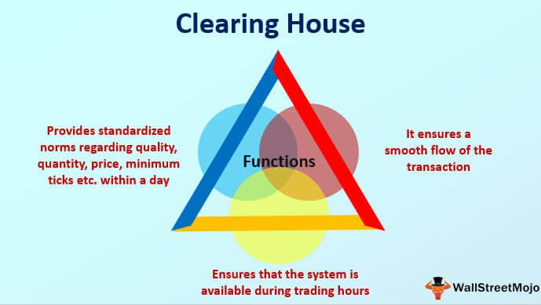

In today's financial markets, technological innovations such as algorithmic trading have revolutionized how trading decisions are made and executed. Algorithmic trading leverages advanced mathematical models and powerful computing systems to automate trading strategies at speeds unmatched by human traders. This shift has introduced significant efficiency and precision in executing trades, thus transforming market dynamics.

Clearing houses, as vital financial entities, play a pivotal role in this technological landscape by ensuring the smooth execution and settlement of these algorithmically driven trades. By serving as intermediaries between buyers and sellers, clearing houses mitigate counterparty risks, thereby enhancing the security and reliability of financial transactions. They provide the crucial infrastructure that supports the high-speed nature of algorithmic trading, ensuring trades are accurately recorded and settled.



This article examines how the integration of financial services, particularly clearing houses and algorithmic trading, fosters a more efficient and secure trading environment. In unraveling the complexities of this integration, we aim to showcase the benefits market participants gain in understanding these vital components. Knowledge of these systems is essential for those seeking a strategic advantage, as they navigate the ever-evolving financial markets. As financial technologies continue to progress, this understanding becomes increasingly critical.

## Table of Contents

## Understanding Financial Services and Clearing Houses

Clearing houses are pivotal financial institutions that play a crucial role in ensuring the execution and settlement of financial transactions. They act as intermediaries between buyers and sellers, thereby mitigating counterparty risk—an essential function in maintaining the stability of financial markets. By acting as a central counterparty to both sides of a transaction, clearing houses assume the risk that one party might default, which in turn enhances the confidence of market participants.

A key function of clearing houses is trade netting. In this context, they aggregate multiple transactions between parties to calculate a single net obligation. This reduces the number of transactions that need to be settled, thereby minimizing transaction costs and reducing systemic risk. For instance, if Party A owes Party B $100 and Party B owes Party A $60, the clearing house would net these transactions, resulting in Party A owing Party B $40.

Risk management is another vital service provided by clearing houses. They employ various techniques, including margin requirements, daily settlements, and default fund contributions, to manage and mitigate risks. These measures ensure that even if a member defaults, the clearing house can cover the loss and maintain market integrity.

Regulatory compliance is inherent in the operations of clearing houses. They must adhere to stringent regulations designed to enhance transparency and reduce the potential for systemic crises. In the United States, the Dodd-Frank Wall Street Reform and Consumer Protection Act significantly increased the role of clearing houses in the derivatives market. This regulation mandates that standardized over-the-counter (OTC) derivatives be cleared through registered clearing houses, thus decreasing the risk posed by these instruments.

The integral role of clearing houses is reflected in their ability to validate and stabilize financial transactions across various markets, which contributes to overall market efficiency. By providing a centralized mechanism for processing trades, clearing houses ensure that financial markets operate smoothly, even under volatile conditions.

## Role of Clearing House in Algorithmic Trading

Algorithmic trading employs sophisticated algorithms to automate and enhance trading strategies, capitalizing on market opportunities. The efficient settlement of these trades hinges on the critical infrastructure provided by clearing houses. In high-frequency trading environments, where transactions occur at breakneck speeds, clearing houses ensure both speed and accuracy. By acting as intermediaries between buyers and sellers, clearing houses effectively mitigate the counterparty risk that can occur during trading.

Counterparty risk is inherent in financial transactions, representing the likelihood that one party may default on its contractual obligations. Clearing houses address this by acting as a neutral party, ensuring that transactions are completed even if one party fails to honor the trade. This is particularly crucial in [algorithmic trading](/wiki/algorithmic-trading), where high volumes and rapid execution amplify the potential for such risks.

Furthermore, clearing houses play an integral role in data management and reporting, which are essential for maintaining regulatory compliance in algorithmic trading. Regulatory bodies require comprehensive records of trading activities to monitor market behavior and ensure transparency. Clearing houses facilitate this by providing accurate, real-time data that tracks all transactions. This comprehensive data collection supports algorithms in adapting to market changes, allowing traders to refine their strategies and maintain a competitive edge.

To illustrate the interaction, consider a simple Python function that models a clearing process:

```python
def settle_trade(trade, clearing_house):
    if clearing_house.verify_funds(trade['buyer']) and clearing_house.verify_assets(trade['seller']):
        updating = clearing_house.update_balances(trade)
        clearing_house.record_transaction(trade)
        return updating
    else:
        raise Exception("Trade cannot be settled due to insufficient funds or assets.")

# Example usage
trade = {'buyer': 'Trader A', 'seller': 'Trader B', 'asset': 'Stock XYZ', 'quantity': 100}
clearing_house = ClearingHouse()
settle_trade(trade, clearing_house)
```

In this function, a clearing house verifies the necessary components of a trade, updates the involved parties' balances, and records the transaction to ensure the legitimacy and accuracy of high-speed trades.

Overall, clearing houses are indispensable to the integrity and functionality of algorithmic trading systems. By streamlining the settlement process, they not only enhance market efficiency but also contribute to a secure and reliable trading environment.

## Integration of Clearing Houses and Algo Trading

The integration of clearing houses and algorithmic trading is transforming market efficiency. Advanced technologies, such as [artificial intelligence](/wiki/ai-artificial-intelligence) (AI) and blockchain, play a crucial role in facilitating this integration. AI enhances trading strategies by providing algorithms with the capability to analyze large datasets swiftly and develop insights that guide decision-making. By employing [machine learning](/wiki/machine-learning) models, traders can predict market trends and adjust their strategies in near-real-time, thus optimizing trading outcomes.

Blockchain technology further supports this integration by offering a decentralized and transparent ledger for transaction recording. This increases the security and reliability of trades, making the clearing and settlement processes more efficient. The immutable nature of blockchain ensures that once a transaction is recorded, it cannot be altered, thus reducing the risk of fraud and errors.

Clearing houses contribute significantly to this integrated environment by providing the infrastructure necessary for real-time risk management and data analysis. They ensure that trades executed through algorithms are settled promptly and accurately, thereby minimizing counterparty risk. This involves the use of sophisticated risk management systems that can handle the vast [volume](/wiki/volume-trading-strategy) and speed of transactions characteristic of high-frequency trading.

Additionally, clearing houses facilitate the access to essential market data and reporting tools, supporting traders in meeting regulatory requirements. By doing so, they help ensure that algorithmic trading adheres to compliance standards, reducing legal risks associated with trading activities.

The synergy between algorithmic trading and clearing houses leads to a more robust financial market infrastructure. Traders are empowered to turn data insights into strategic actions swiftly, enhancing their ability to respond to market changes. This results in a trading environment that is not only more efficient but also more secure, fostering greater confidence among market participants.

Through technological advancements, clearing houses and algorithmic trading systems collectively contribute to a resilient financial marketplace, enabling faster, more reliable, and transparent trading operations.

## Future Trends in Financial Services and Algo Trading

The landscape of financial services and algorithmic trading is experiencing transformative changes driven by technological advancements. As fintech continues to evolve, several trends are expected to redefine the mechanics of trading and clearing.

One of the most significant developments is the implementation of blockchain technology, which promises to enhance transparency and security in clearing and settlement processes. Blockchain's decentralized ledger system allows for immutable record-keeping, reducing the risk of fraud and providing a clear audit trail. This transparency is vital for maintaining trust among market participants and regulatory bodies, potentially lowering costs associated with clearing houses.

Artificial Intelligence (AI) is another key player in the future of algorithmic trading. AI-driven algorithms have the ability to analyze vast amounts of data and adjust to market conditions with unprecedented speed and accuracy. This adaptability is essential in high-frequency trading environments, where even milliseconds can determine the success of a trade. Advanced AI algorithms can identify patterns and predict market trends, offering traders a competitive advantage.

Regulatory frameworks are expected to evolve continually, with a focus on increasing transparency and mitigating risks. As technology becomes more ingrained in trading, regulators will likely implement measures to oversee these processes effectively, ensuring market stability. Enhanced reporting requirements and real-time monitoring systems may become the norm, aiming to prevent market manipulations and systemic risks.

Collaborations between technology firms and financial institutions are crucial for fostering innovation in this sector. Such partnerships can lead to the development of more sophisticated trading platforms and risk management tools. By combining technological expertise with financial acumen, these collaborations can drive the creation of more robust market solutions, benefiting traders and investors alike.

In conclusion, the integration of smart contracts, AI, and blockchain technologies is set to revolutionize financial services and algorithmic trading. These advancements promise a more efficient, secure, and transparent trading environment, highlighting the importance for market participants to remain adaptive and forward-thinking.

## Conclusion

The integration of financial services, clearing houses, and algorithmic trading plays a pivotal role in shaping the future landscape of global financial markets. These elements, when united, contribute to creating a trading environment that is not only robust and efficient but also secure, thereby fostering trust and stability amongst market participants.

Clearing houses act as crucial intermediaries, ensuring that trades are settled accurately and promptly. They provide risk mitigation mechanisms that protect against counterparty defaults, enhancing the reliability of financial transactions. Algorithmic trading, on the other hand, maximizes the efficiency of trading strategies through automation and data-driven insights. When combined, these facets facilitate a seamless operation that can handle high volumes of transactions in real-time, effectively catering to the needs of modern financial markets.

The ever-evolving landscape of technology, characterized by advancements such as artificial intelligence (AI), blockchain, and smart contracts, continues to amplify these benefits. AI empowers algorithms with adaptive capabilities, allowing them to respond swiftly to dynamic market conditions. Blockchain technology ensures transparency and security in clearing and settlement processes, providing an immutable and verifiable ledger of transactions. These technological improvements not only streamline operations but also offer enhanced analytical tools that support informed decision-making.

Market participants aiming for strategic growth must exhibit adaptability and agility, leveraging these technological advancements to maintain a competitive edge. This involves staying attuned to emerging trends and regulatory changes, and actively investing in cutting-edge solutions that can optimize performance and reduce risks.

Moreover, the convergence of financial services, clearing houses, and algorithmic trading is a driving force behind the transformation of the financial industry. It promises a future of dynamic and innovative market solutions that cater to the complexities and demands of global markets. As these components continue to evolve and integrate, they have the potential to redefine traditional market operations, leading to more resilient and efficient financial ecosystems.

## References & Further Reading

- Financial Clearing Houses - CFA Institute: An essential resource for understanding the role and function of clearing houses in modern financial markets. The CFA Institute provides comprehensive insights into the mechanics of clearing and its implications for risk management and financial stability.

- The Automated Clearing House System: Investopedia: This article offers an accessible overview of the ACH system, explaining its operational structure and significance in streamlining financial transactions. It serves as a practical guide for those looking to understand the nuts and bolts of financial clearing operations.

- Algorithmic Trading & DMA by Barry Johnson: A detailed exploration of the principles and practices of algorithmic trading, this book provides valuable insights into direct market access technologies and the strategies they enable. Barry Johnson’s work is a must-read for anyone interested in the technical and strategic aspects of automated trading systems.

- ACH Network by NACHA: NACHA’s resources on the ACH Network highlight its crucial role in facilitating electronic transactions across financial institutions. This reading provides clarity on the regulatory environment and operational processes involved in ACH transactions, underscoring their importance in financial services.

- The Economics of Clearing in Derivatives Markets: Netting - Federal Reserve Bank of New York: This paper examines the economic principles behind clearing in derivatives markets, with a focus on netting and its effects on market efficiency and stability. Provided by the Federal Reserve Bank of New York, it is an authoritative source for understanding the impact of clearing processes on financial markets.