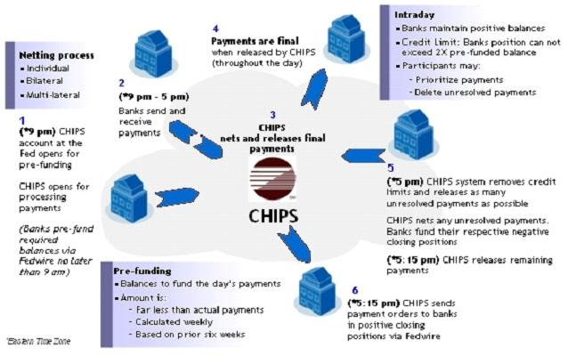

## Table of Contents

## What is the Clearing House Interbank Payments System (CHIPS)?

The Clearing House Interbank Payments System, or CHIPS, is a private payment system that banks use to send and receive money between each other. It's like a big network that helps banks move large amounts of money quickly and safely, especially for international payments. CHIPS is owned by The Clearing House, which is a group of big banks in the United States.

CHIPS is really important because it handles a huge amount of money every day. It's used for payments that are usually too big for other systems to handle. When a bank wants to send money through CHIPS, it sends a message to the CHIPS system, and then CHIPS makes sure the money gets to the right bank. This helps keep the global economy running smoothly because it makes it easier for money to move around the world.

## How does CHIPS facilitate interbank payments?

CHIPS helps banks send money to each other by acting like a big messenger service. When one bank wants to send money to another bank, it tells CHIPS about the payment. CHIPS then makes sure the money gets to the right place. It's like sending a letter, but instead of paper, it's money moving through a special network.

This system is really important because it can handle very large amounts of money, especially for payments that go across different countries. CHIPS keeps track of all these payments and makes sure everything is balanced at the end of the day. This way, banks can trust that their money will get where it needs to go quickly and safely.

## What is the history behind the establishment of CHIPS?

CHIPS was started a long time ago, in 1970, by a group of banks in New York. They wanted to make it easier and faster to send money between banks, especially for big payments that needed to move quickly. Before CHIPS, banks had to use slower methods like paper checks, which took a lot of time and could be risky. So, these banks came together to create a new way to move money that was much faster and safer.

Over the years, CHIPS grew bigger and became very important for the world's money system. It started handling more and more payments, not just in the United States but all around the world. Today, CHIPS is owned by The Clearing House, which is a group of big banks. It helps move trillions of dollars every year, making sure that money can flow smoothly between banks, no matter where they are.

## Who are the main users of CHIPS?

The main users of CHIPS are big banks, especially those in the United States. These banks use CHIPS to send and receive large amounts of money quickly and safely. It's like a special highway just for banks to move money around, and it's really important for them because they need to handle a lot of money every day.

CHIPS is also used by banks from other countries. When a bank in another country needs to send money to a bank in the U.S., or vice versa, they often use CHIPS. This helps make international payments easier and faster, which is really helpful for businesses and people who need to move money across borders.

## How does CHIPS differ from other payment systems like Fedwire?

CHIPS and Fedwire are both used by banks to send money to each other, but they work a bit differently. CHIPS is run by a group of big banks called The Clearing House, and it's mainly used for big payments, especially ones that go across different countries. CHIPS doesn't move the money right away. Instead, it keeps track of all the payments during the day and then settles them all at once at the end of the day. This way, it can handle a lot of money and make sure everything is balanced.

On the other hand, Fedwire is run by the Federal Reserve, which is like the central bank of the United States. Fedwire moves money right away, one payment at a time, and it's used for both big and small payments. Because Fedwire is backed by the Federal Reserve, it's seen as very safe and reliable. But, it's mainly used for payments within the U.S., while CHIPS is better for international payments. So, banks choose which system to use based on what they need at the time.

## What are the operational hours of CHIPS?

CHIPS works during regular business hours in the United States. It starts at 9:00 AM Eastern Time and stops at 5:00 PM Eastern Time. This means banks can use CHIPS to send money to each other during the day.

Because CHIPS only works during these hours, banks need to plan their big payments to happen within this time. If a payment needs to go through after 5:00 PM, banks will have to wait until the next day when CHIPS opens again.

## What types of transactions can be processed through CHIPS?

CHIPS is used for big money transfers between banks. These can be payments for things like buying and selling goods, paying back loans, or moving money between different parts of a big company. CHIPS is really good for these kinds of payments because it can handle a lot of money at once and make sure it gets to the right place quickly.

A lot of the payments that go through CHIPS are for international trade. When a company in one country needs to pay a company in another country, they often use CHIPS because it's fast and reliable. This helps businesses keep their money moving smoothly, even when they're working with people far away.

## How does CHIPS ensure the security and integrity of transactions?

CHIPS keeps transactions safe and accurate by using strong security measures. It uses special codes and checks to make sure only the right people can send and receive money. CHIPS also keeps an eye on all the payments that go through its system, looking for anything that seems strange or wrong. If it finds something odd, it can stop the payment and check it more closely to make sure everything is okay.

Another way CHIPS makes sure transactions are secure is by settling all payments at the end of the day. This means it waits until the end of the day to move the money, which gives it time to double-check everything. By doing this, CHIPS can make sure all the numbers add up and that no money goes missing or to the wrong place. This helps keep the whole system trustworthy and reliable.

## What role does CHIPS play in international banking?

CHIPS plays a big role in international banking because it helps banks in different countries send money to each other quickly and safely. When a bank in one country needs to pay a bank in another country, they often use CHIPS. This is really helpful for businesses that buy and sell things all over the world because it makes sure their money gets where it needs to go without delays.

CHIPS is also important because it can handle very large amounts of money. This is useful for big payments that other systems might not be able to manage. By using CHIPS, banks can keep the global economy running smoothly, making sure money can move around the world easily and helping businesses and people do their work without worrying about their payments.

## How are settlements processed in CHIPS, and what is the role of the Clearing House?

Settlements in CHIPS happen at the end of the day. When banks send payments through CHIPS, the system keeps track of all the money moving around during the day but doesn't move it right away. Instead, it waits until the end of the day to make sure everything is balanced. This means that CHIPS looks at all the payments, checks them, and then moves the money all at once. This way, CHIPS can handle a lot of money and make sure no mistakes happen.

The Clearing House, which owns CHIPS, plays a big role in making sure these settlements happen smoothly. The Clearing House is a group of big banks that work together to run CHIPS. They make the rules and keep everything safe and fair. At the end of the day, The Clearing House helps CHIPS settle all the payments by making sure all the money is in the right place. This helps keep the system trustworthy and reliable for all the banks that use it.

## What are the fees associated with using CHIPS for transactions?

Using CHIPS for transactions comes with fees that banks have to pay. The main fee is a per-transaction fee, which means banks pay a small amount of money for each payment they send through CHIPS. This fee helps cover the cost of running the system and keeping it safe and reliable. The exact amount of the fee can change, but it's usually a few dollars per payment.

There might also be other fees, like a monthly fee for using the system or fees for special services. These fees help The Clearing House, which runs CHIPS, keep everything working smoothly. Banks think about these fees when they decide to use CHIPS because they want to make sure it's worth the cost for the fast and safe service CHIPS provides.

## What future developments or upgrades are expected for CHIPS?

CHIPS is always looking to get better and keep up with new technology. One big thing they are working on is making the system even faster and more efficient. They want to use new technology like blockchain to make sure payments can be tracked better and are even safer. This could help CHIPS handle even more payments and make it easier for banks to use the system.

Another thing CHIPS is thinking about is expanding to more countries. Right now, it's mainly used by banks in the U.S. and some other places, but they want to reach more banks around the world. This would make it easier for businesses everywhere to send and receive money. By doing this, CHIPS can help make the global economy even smoother and more connected.

## References & Further Reading

[1]: Bech, M. L., & Hobijn, B. (2007). ["Technology Diffusion within Central Banking: The Case of Real-Time Gross Settlement."](https://papers.ssrn.com/sol3/papers.cfm?abstract_id=932596) Federal Reserve Bank of New York Staff Reports.

[2]: The Clearing House Payments Company L.L.C. ["Clearing House Interbank Payments System (CHIPS)."](https://www.theclearinghouse.org/payment-systems/chips) Official website.

[3]: Chlistalla, M., Deventer, S., & Thiemann, M. (2011). ["High-frequency trading: Better than its reputation?"](https://c.mql5.com/forextsd/forum/168/high-frequency_trading_-_better_than_its_reputation.pdf) Deutsche Bank Research.

[4]: Lopez de Prado, M. (2018). ["Advances in Financial Machine Learning."](https://www.amazon.com/Advances-Financial-Machine-Learning-Marcos/dp/1119482089) Wiley.

[5]: BIS Committee on Payment and Settlement Systems. (2005). ["New developments in large-value payment systems."](https://www.bis.org/cpmi/publ/d67.pdf) Bank for International Settlements.