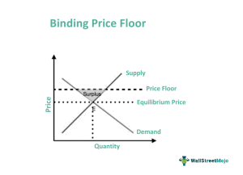

Economic pricing is a fundamental concept in financial markets, influencing decisions around asset valuation and trade execution. At its core, economic pricing involves determining the appropriate price for goods and services, ensuring efficient market functioning by reflecting both the costs of production and the value perceived by consumers. In financial markets, this principle is crucial for asset pricing, guiding investors and traders in making informed decisions based on market conditions and future expectations.

A key component of economic pricing is the clearing price, which serves a pivotal role in the securities market. The clearing price is the price at which the quantity supplied is equal to the quantity demanded, ensuring that all willing buyers and sellers are matched. This price signifies market equilibrium, where there are no surpluses or shortages, facilitating optimal resource allocation. The clearing price is established through the bid-ask process, in which buyers bid for securities at specific prices and sellers offer their securities at desired prices. When a bid matches an ask, a trade is executed, and the price at which this occurs becomes the clearing price.



Algorithmic trading is increasingly relevant in achieving clearing prices efficiently. Algorithms leverage computational power and complex mathematical models to execute trades at speeds and volumes unattainable by human traders. This automation allows for rapid adjustment to market changes, ensuring that prices continuously reflect the latest information on supply and demand dynamics. The use of algorithms has transformed the landscape of market trading, offering precision and enhancing liquidity, thereby enabling a more seamless convergence to the clearing price that balances market forces.

The relationship between clearing prices and the principles of supply and demand is foundational in interpreting market movements. Supply and demand dynamics drive fluctuations in the clearing price, as changes in either can lead to price adjustments. A rise in demand or a decrease in supply can lead to higher clearing prices, as more buyers compete for fewer available assets. Conversely, an increase in supply or a fall in demand can suppress prices, as sellers may reduce prices to attract buyers. This interaction ensures that financial markets are responsive and adaptive to various macroeconomic factors, including changes in investor sentiment, geopolitical events, and shifts in policy.

In summary, economic pricing, and more specifically, the clearing price, is central to the operation of financial markets, ensuring that resources are appropriately allocated through the balance of supply and demand. Algorithmic trading enhances this process by providing the tools necessary for achieving swift and accurate price discovery, thereby contributing to more efficient and liquid markets.

## Table of Contents

## Understanding Clearing Price

A clearing price, also known as the market clearing price, is the price at which a particular asset or security is sold in sufficient quantity to satisfy all demand and supply in the market. In financial markets, the clearing price is critical because it represents an equilibrium state where the quantity of the asset supplied matches the quantity demanded. This equilibrium price ensures that there are no surpluses or shortages in the market, facilitating efficient trading and liquidity. Clearing prices are vital in maintaining market stability and ensuring that resources are allocated efficiently among buyers and sellers.

The establishment of clearing prices is primarily achieved through the bid-ask process. In this system, buyers submit bids, indicating the maximum price they are willing to pay for a security, while sellers set asks, the minimum price they are willing to accept. The interaction between these bids and asks creates a range of prices, and the clearing price is found where the highest bid matches the lowest ask. This process captures the collective sentiment of market participants, leading to a consensus that reflects the true value of the security at that particular time.

Market [liquidity](/wiki/liquidity-risk-premium) plays a crucial role in achieving clearing prices. Liquidity refers to the ease with which an asset can be bought or sold in the market without affecting its price. High liquidity implies that there are many buyers and sellers willing to trade at various price levels, making it easier for the market to establish a clearing price rapidly and accurately. In liquid markets, the bid-ask spread—the difference between the bid and ask prices—is typically narrow, allowing for more precise determination of the clearing price. Conversely, in markets with low liquidity, wider spreads can lead to inefficiencies and [volatility](/wiki/volatility-trading-strategies) in reaching a clearing price.

Supply and demand dynamics are also integral to understanding clearing prices. When demand for an asset increases and supply remains constant, the clearing price tends to rise due to competition among buyers. Conversely, if supply increases while demand remains steady, the clearing price is likely to fall as sellers compete to attract buyers. These dynamics ensure that clearing prices are not static but fluctuate in response to changes in market conditions, reflecting the ongoing balance of supply and demand.

In summary, the clearing price is a fundamental concept in financial markets that facilitates the efficient allocation of assets by balancing supply and demand. It is established through the bid-ask process and is heavily influenced by market liquidity and the underlying economic forces driving supply and demand. Understanding these elements is crucial for market participants to navigate the complexities of trading and pricing in securities markets.

## The Mechanism of Clearing Prices in Securities Markets

Price discovery is a fundamental component of financial markets, where it encapsulates the process through which market prices are established. This process ultimately leads to the determination of the clearing price, or market-clearing price, a point at which supply equals demand, ensuring a state of equilibrium.

### Process of Price Discovery Leading to Clearing Prices

Price discovery involves multiple market participants including buyers, sellers, market makers, and arbitrageurs. In a traditional open outcry market, this would happen on the trading floor where participants vocalize their bids and offers. However, in modern markets, this process predominantly occurs through electronic exchanges. 

An electronic exchange operates through a limit [order book](/wiki/order-book-trading-strategies), where buy and sell orders are continuously submitted by participants. A buy order (bid) specifies a maximum price a buyer is willing to pay, while a sell order (ask) specifies a minimum price a seller is willing to accept. The intersection of these bids and asks establishes the market price. 

When a buy order matches a sell order—the bid price meets or exceeds the ask price—a trade is executed, and the transaction price becomes the clearing price. This transaction indicates that the market has reached a temporary equilibrium point for those specific trades.

### Determining Clearing Prices on Electronic Exchanges

Electronic exchanges utilize algorithms to match buy and sell orders efficiently. A central mechanism is the continuous limit order book, which records all outstanding orders and prioritizes them based on price and time. The best (highest) bid and the best (lowest) ask determine the bid-ask spread, a critical indicator of market liquidity.

```python
# Simplified matching algorithm example in Python

class Order:
    def __init__(self, order_type, price, quantity):
        self.order_type = order_type  # 'buy' or 'sell'
        self.price = price
        self.quantity = quantity

class Exchange:
    def __init__(self):
        self.buy_orders = []
        self.sell_orders = []

    def add_order(self, order):
        if order.order_type == 'buy':
            self.buy_orders.append(order)
            self.buy_orders.sort(key=lambda x: -x.price)
        elif order.order_type == 'sell':
            self.sell_orders.append(order)
            self.sell_orders.sort(key=lambda x: x.price)

    def match_orders(self):
        while self.buy_orders and self.sell_orders:
            best_buy = self.buy_orders[0]
            best_sell = self.sell_orders[0]

            if best_buy.price >= best_sell.price:
                # Trade execution at the clearing price
                trade_price = (best_buy.price + best_sell.price) / 2

                trade_quantity = min(best_buy.quantity, best_sell.quantity)
                print(f"Trade executed at {trade_price} for {trade_quantity} units")

                # Update order quantities and remove fully executed orders
                best_buy.quantity -= trade_quantity
                best_sell.quantity -= trade_quantity

                if best_buy.quantity == 0:
                    self.buy_orders.pop(0)
                if best_sell.quantity == 0:
                    self.sell_orders.pop(0)
            else:
                break

# Example usage
exchange = Exchange()
exchange.add_order(Order('buy', 102, 100))
exchange.add_order(Order('sell', 101, 150))
exchange.add_order(Order('buy', 100, 200))
exchange.match_orders()
```

### Market Clearing Prices in Action

Market clearing prices often reflect the collective assessment of value among participants, as seen during initial public offerings (IPOs) or new bond issuances, where investor demand meets with limited supply. A notable example is the response to macroeconomic announcements, where securities react and adjust rapidly as participants absorb new information, recalibrating demand and supply to establish new clearing prices.

### Challenges in Achieving Clearing Prices in Illiquid Markets

Illiquid markets pose substantial challenges to achieving accurate clearing prices due to the lack of buying or selling interest, which can cause significant price fluctuations. This scarcity in buy and sell orders widens the bid-ask spread, increasing transaction costs. As a result, price discovery becomes inefficient, making the market more susceptible to price manipulation and abrupt volatility spikes.

To remedy such disparities in illiquid markets, market participants often rely on market makers who provide liquidity by being willing to buy and sell at all times, thus narrowing the bid-ask spread and enhancing the overall price discovery process. Additionally, introducing mechanisms like auction-style trading can temporarily aggregate liquidity, improving chances for equilibrium pricing.

In summary, the mechanism of clearing prices in securities markets is a complex interaction of economic forces and participant behaviors, facilitated predominantly by electronic infrastructures in contemporary market designs. Efficient price discovery remains critical for market health, with clearing prices serving as vital benchmarks for both liquidity provisioning and valuation setting across multiple asset classes.

## Algorithmic Trading and Economic Pricing

Algorithmic trading, often referred to as algo trading, involves the use of computer algorithms to automate the trading process in financial markets. These algorithms are designed to execute orders based on predetermined criteria, such as timing, price, or quantity, with the objective of generating profits at speeds and frequencies unachievable by human traders. Modern financial markets heavily depend on [algorithmic trading](/wiki/algorithmic-trading) to enhance efficiency, improve liquidity, and reduce transaction costs.

The impact of algorithmic trading on the discovery of clearing prices is profound. Clearing prices are established at the juncture where buy and sell orders intersect within an order book. Algorithmic trading facilitates this discovery by automatically placing orders that align with market conditions, making the bid-ask spread more competitive and narrowing the price gap. This efficiency ensures that the market consistently moves towards equilibrium, reflecting all available information at any given time.

Utilizing algorithms for trading and pricing in securities markets offers several advantages. Firstly, it increases market liquidity by constantly providing buy and sell orders, which helps ensure that there are always counterparts to trade with. Secondly, it reduces the market impact of large trades by breaking them down into smaller transactions spread over time, minimizing price disruption. Thirdly, algorithms can analyze vast amounts of data at speeds far beyond human capability, allowing for more informed and timely trading decisions.

However, the adoption of algorithmic trading does introduce certain risks and challenges. One such risk is the potential for market disruption caused by errant algorithms or algorithmic anomalies, which can lead to significant price volatility, as famously observed during the "Flash Crash" of May 6, 2010. Additionally, the complexity of some trading algorithms can lead to a lack of transparency and understanding among market participants and regulators, raising concerns about fairness and market manipulation. Furthermore, while high-frequency trading firms rely on speed and technology, they can inadvertently create an uneven playing field, disadvantaging traditional or slower market participants.

In summary, while algorithmic trading plays a crucial role in modernizing financial markets, particularly in identifying clearing prices swiftly and efficiently, it also requires stringent oversight and robust risk management frameworks to mitigate its associated challenges.

## Special Considerations in Setting Clearing Prices

Economic pricing and clearing prices play a pivotal role in determining market equilibrium, yet these are not immune to the influence of external factors such as economic policy, market conditions, and technological progress.

### Influence of Economic Policy on Clearing Prices

Economic policies, both fiscal and monetary, can significantly impact clearing prices in financial markets. For instance, central bank policies on interest rates can affect borrowing costs, influencing the availability of credit and, consequently, the levels of demand and supply within financial markets. A lower [interest rate](/wiki/interest-rate-trading-strategies) typically boosts borrowing, increasing demand and possibly leading to higher clearing prices as buyers are willing to pay more. Conversely, high-interest rates may deter borrowing and spending, leading to a decrease in demand and potentially lowering clearing prices.

Moreover, regulatory policies can impact market liquidity and pricing mechanisms. Policies that enhance transparency and reduce transaction costs can facilitate quicker achievement of clearing prices by increasing market efficiency.

### Price Stickiness and Market Equilibrium

Price stickiness refers to the resistance of prices to change despite shifts in supply and demand. This phenomenon can result from factors such as menu costs, long-term contracts, or consumer expectations. Price stickiness can lead to temporary imbalances in the market where clearing prices do not adjust instantly to reflect new information. This delay can result in a market disequilibrium where quantities supplied do not match quantities demanded, creating potential inefficiencies.

Price stickiness can also have implications for monetary policy and its effectiveness. If prices do not adjust rapidly, the influence of central bank policies might be delayed, affecting the time it takes for markets to reach a new equilibrium.

### Variations Across Asset Classes and Market Conditions

Clearing prices can differ significantly across various asset classes, including stocks, bonds, commodities, and derivatives. Each asset class has unique characteristics, such as liquidity levels, market participants, and trading volumes, which can influence how quickly and efficiently clearing prices are established. For example, highly liquid markets like foreign exchange can reach clearing prices rapidly compared to less liquid markets like certain corporate bonds or real estate.

Market conditions also play a critical role in determining clearing prices. During volatile periods, clearing prices might fluctuate more dramatically due to heightened uncertainty and rapid changes in investor sentiment. Conversely, in stable markets, clearing prices tend to adjust more gradually.

### Technological Advancements in Price Setting

Technological advancements, particularly in algorithmic trading and electronic exchanges, have revolutionized the way clearing prices are established. Algorithms can process vast amounts of data at high speed, executing trades based on predefined criteria, thereby improving price discovery mechanisms. These technologies facilitate the rapid assimilation of new information into prices and enhance market liquidity, making it easier for buyers and sellers to find a match at a mutually agreeable price.

Additionally, the implementation of [machine learning](/wiki/machine-learning) and [artificial intelligence](/wiki/ai-artificial-intelligence) in trading strategies continues to improve predictive accuracy, helping market participants anticipate price movements and achieve better pricing efficiency.

In summary, clearing prices are influenced by external economic policies, the inherent nature of different asset classes, and market conditions. The introduction and implementation of advanced technologies have mitigated some challenges in achieving efficient pricing, although disparities and stickiness remain important considerations in the accurate setting of clearing prices.

## Case Study: Market Clearing Price in Action

In this case study, we explore the intricacies of establishing a clearing price using a real-world example from the equities market during a significant economic event: the financial crisis.

### Steps Leading to the Establishment of the Clearing Price

During the financial crisis, a dramatic shift in supply and demand dynamics was witnessed, enabling us to observe the establishment of a clearing price under strained conditions. Let's consider a simplified example with the fictional company ABC Corp, whose stock was heavily traded during this time.

1. **Market Opening and Order Submission**: As trading began, investors submitted a variety of buy and sell orders for ABC Corp shares. The buy orders constituted 'bids,' while the sell orders represented 'asks.' These orders varied in price, reflecting the uncertainty in market conditions.

2. **Order Book Compilation**: The exchange collected these bids and asks in an electronic order book. Each level in the order book represented a different price point, with associated quantities of order volume.

3. **Determining the Equilibrium**: The clearing price was determined by matching the highest bid price and the lowest ask price that could successfully execute the maximum volume of shares. This involved aggregating bids and asks to find the point where cumulative quantity demanded equaled cumulative quantity supplied.

4. **Execution of Trades**: Once the clearing price was identified, trades were executed, resulting in an efficient clearance of the market. For instance, if the clearing price was determined to be $50 per share, then all trades were executed at this price for the maximum quantity.

### Outcome and Implications for Market Participants

The establishment of a clearing price at $50 per share allowed for the stabilization of ABC Corp's stock price amidst volatile conditions. For buyers, this price represented a fair equilibrium reflecting the collective market assessment. For sellers, it provided a price through which they could dispose of their shares with the assurance of liquidity.

Buyers who wished to purchase at prices below the clearing price had to adjust their expectations or face the possibility of their orders going unfilled. Conversely, sellers needed to decide whether to accept the clearing price or hold out for potential market improvements.

### Lessons Learned and Best Practices

1. **Importance of Liquidity**: The efficiency in achieving a clearing price is highly contingent upon market liquidity. In scenarios of illiquidity, such as during the crisis, clearing prices can be difficult to stabilize, leading to increased volatility.

2. **Dynamic Market Conditions**: The financial crisis highlighted how external factors such as macroeconomic events can dramatically shift the demand and supply curves. Effective pricing mechanisms must be adaptable to such changes.

3. **Effective Use of Technology**: Electronic order books and trading platforms played a crucial role in efficiently matching orders to find the clearing price. Continuing to develop such technologies can further enhance market operations.

4. **Risk Management Strategies**: Understanding and predicting shifts in clearing prices allow market participants to better strategize their trades, manage risk, and optimize portfolio performance.

This case study of ABC Corp during the financial crisis illustrates the dynamic nature of clearing prices and their critical role in stabilizing financial markets under pressure. Understanding these processes provides valuable insights for both market participants and regulators, ensuring a more resilient financial system.

## Conclusion

In conclusion, economic pricing and clearing prices play quintessential roles in establishing equilibrium in financial markets. A clearing price, which equates supply and demand, is essential for enabling transactions in securities markets, as it reflects the market's consensus on value. Efficiently reaching this clearing price is crucial as it determines the welfare of market participants, from institutional investors to individual traders, by indicating the fair market value of securities.

Algorithmic trading serves as a powerful tool in modern markets, enhancing the efficiency and speed at which clearing prices are achieved. By leveraging advanced algorithms, market participants can process massive volumes of data far faster than human capabilities, optimizing trade execution and minimizing transaction costs. This technological innovation supports liquidity and immediacy, crucial components for market stability and efficiency.

The implications of economic pricing extend beyond individual trades to impact broader economic stability. Clearing prices ensure that resources are allocated efficiently, preventing imbalances that could lead to bubbles or crashes. As markets continue to evolve, understanding these dynamics, enriched by algorithmic strategies, becomes even more crucial for participants aiming to navigate and succeed in the complex financial landscape.

In considering these factors, stakeholders should remain aware of the broader economic ramifications and pursue strategies that foster transparency, efficiency, and fairness. Financial market pricing is not just a technical mechanism; it reflects and influences global economic trends and participant behaviors, establishing its critical position in the economic system.

## Additional Resources and References

### Additional Resources and References

#### Relevant Articles and Resources
1. **Investopedia - Clearing Price**: A comprehensive overview of clearing prices with examples and applications in financial markets.
   - [Clearing Price: Definition & Example](https://www.investopedia.com/terms/c/clearingprice.asp)

2. **Algorithmic Trading on Wikipedia**: An introduction to algorithmic trading, its principles, and its significance in modern finance.
   - [Algorithmic Trading](https://en.wikipedia.org/wiki/Algorithmic_trading)

3. **The Basics of Market Liquidity on Investopedia**: An article explaining market liquidity and its effect on the securities market and pricing.
   - [Market Liquidity](https://www.investopedia.com/terms/l/liquidity.asp)

4. **The Role of Algorithms in Financial Markets**: A detailed article discussing how algorithms influence market operations and pricing.
   - [The Impact of Algorithmic Trading](https://www.thebalance.com/algorithmic-trading-4686879)

5. **Understanding Supply and Demand Curves**: An educational guide on how supply and demand affect market equilibrium and clearing prices.
   - [Supply and Demand Guide](https://www.khanacademy.org/economics-finance-domain/microeconomics)

#### Further Reading Materials
- **Books on Algorithmic Trading**: 
  - "Algorithmic Trading: Winning Strategies and Their Rationale" by Ernest P. Chan provides a detailed introduction to the field with practical examples.

- **Books on Financial Markets**:
  - "Market Liquidity: Theory, Evidence, and Policy" by Thierry Foucault, Marco Pagano, and Ailsa Roëll offers insights into liquidity and its complexities in financial contexts.

- **Research Papers**:
  - "The Flash Crash: The Impact of High-Frequency Trading on an Electronic Market" by Albert J. Menkveld analyzes high-frequency trading and its effects on market stability.

#### Glossary of Key Terms
- **Clearing Price**: The equilibrium price at which the quantity supplied equals the quantity demanded.
- **Algorithmic Trading**: The use of complex algorithms to automate trading strategies and execute trades at high speeds and volumes.
- **Liquidity**: The ease with which an asset can be bought or sold in a market without affecting its price.
- **Price Discovery**: The process of determining the price of an asset in the marketplace through the interactions of buyers and sellers.
- **Bid-Ask Spread**: The difference between the highest price that a buyer is willing to pay for an asset and the lowest price that a seller is willing to accept.
- **Price Stickiness**: The resistance of prices to change, despite shifts in market equilibrium or underlying factors.

## References & Further Reading

[1]: Investopedia. ["Clearing Price: Definition & Example."](https://www.investopedia.com/terms/c/clearing.asp)

[2]: Wikipedia. ["Algorithmic Trading."](https://en.wikipedia.org/wiki/Algorithmic_trading)

[3]: Investopedia. ["Market Liquidity."](https://www.investopedia.com/terms/l/liquidity.asp)

[4]: The Balance. ["The Impact of Algorithmic Trading."](https://www.sciencedirect.com/science/article/pii/S0957417422006479)

[5]: Khan Academy. ["Supply and Demand Guide."](https://www.youtube.com/playlist?list=PLSQl0a2vh4HBG0s0Bw1iXmhJeX0ADT4L1)

[6]: Chan, Ernest P. ["Algorithmic Trading: Winning Strategies and Their Rationale."](https://github.com/ftvision/quant_trading_echan_book)

[7]: Foucault, Thierry, Pagano, Marco, & Roëll, Ailsa. ["Market Liquidity: Theory, Evidence, and Policy."](https://academic.oup.com/book/55158)

[8]: Menkveld, Albert J. ["The Flash Crash: The Impact of High-Frequency Trading on an Electronic Market."](https://www.researchgate.net/publication/377743286_The_Flash_Crash_The_Impact_of_High-Frequency_Trading_on_the_Stability_of_Financial_Market)