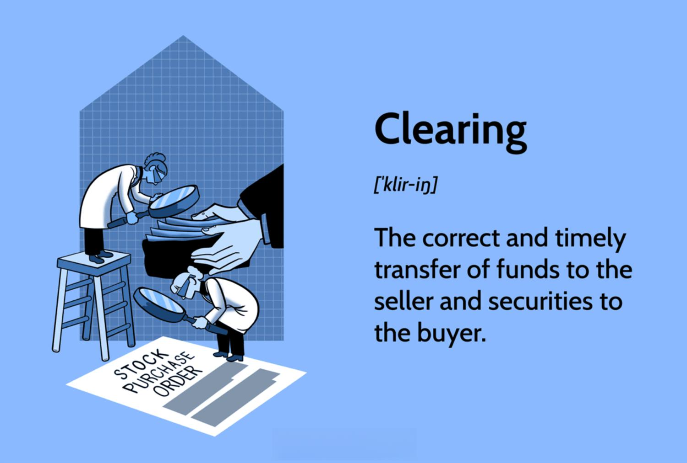

## Table of Contents

## What is the clearing process in financial transactions?

The clearing process in financial transactions is like organizing and matching up all the transactions that happen between different banks or financial institutions. Imagine you send money from your bank to a friend's bank. Your bank needs to tell your friend's bank about this transfer. The clearing process is how they communicate and agree on the details of these transactions, making sure everything is correct and accounted for.

Once all the transactions are matched and verified, the clearing process helps to figure out how much money each bank owes or is owed. This step is crucial because it ensures that the right amount of money moves from one bank to another. After clearing, the actual transfer of funds happens, which is called settlement. This way, everyone's accounts are updated correctly, and the financial system keeps running smoothly.

## Why is the clearing process important in banking and finance?

The clearing process is super important in banking and finance because it makes sure that all the money transfers between different banks are done correctly. When you send money to someone at a different bank, your bank needs to talk to their bank to make sure they agree on how much money is being sent and where it's going. This process helps to avoid mistakes and keeps everything fair and accurate.

Without clearing, it would be really hard to keep track of all the money moving around. Imagine if banks didn't have a way to check and match up all the transactions – it could lead to a lot of confusion and errors. The clearing process helps to organize everything, so banks know exactly how much money they need to move to other banks. This keeps the financial system running smoothly and helps everyone trust that their money is being handled correctly.

## What are the main steps involved in the clearing process?

The clearing process starts when banks or financial institutions send information about transactions to a clearinghouse. This could be about you sending money to a friend or a business getting paid. The clearinghouse collects all these transactions and sorts them out. They match up the details, like who is sending money and who is receiving it, and how much money is involved. This step is important because it makes sure everyone agrees on what's happening.

Once all the transactions are matched and verified, the clearinghouse figures out how much money each bank needs to pay or receive. They create a net amount for each bank, which means they add up all the money going out and subtract all the money coming in. This makes it easier to handle the actual transfer of funds. After this step, the banks move the money according to what the clearinghouse says, and this final step is called settlement. This way, everyone's accounts get updated correctly, and the financial system keeps working smoothly.

## Can you explain the difference between clearing and settlement?

Clearing and settlement are two important steps in moving money between banks, but they do different things. Clearing is like organizing and checking all the transactions that happen between different banks. Imagine you send money to a friend at another bank. Your bank tells the clearinghouse about this, and the clearinghouse collects all these transactions from different banks. They match up the details, like who is sending money, who is receiving it, and how much money is involved. This step makes sure everyone agrees on what's happening and figures out how much money each bank needs to pay or receive.

Settlement is what happens after clearing. It's the actual moving of money from one bank to another. Once the clearinghouse has figured out how much money each bank owes or is owed, the banks follow these instructions and transfer the money. This final step updates everyone's accounts correctly. So, clearing is about organizing and agreeing on transactions, while settlement is about actually moving the money to complete the transactions.

## What types of financial instruments are typically involved in clearing?

The clearing process involves many different types of financial instruments. These include everyday things like checks and electronic payments. When you write a check or use your online banking to send money, these transactions go through clearing. It's not just about moving money from one bank to another; clearing also handles things like credit card transactions when you swipe your card at a store.

But clearing isn't limited to just these common transactions. It also deals with more complex financial instruments like stocks, bonds, and derivatives. When you buy or sell stocks through a broker, those trades go through a clearing process to make sure everything is correct and to handle the transfer of ownership. The same goes for bonds and derivatives, which are often used by big investors and financial institutions. So, clearing is a crucial part of handling a wide range of financial activities.

## How does the clearing process work in stock exchanges?

When you buy or sell stocks on a stock exchange, the clearing process makes sure everything goes smoothly. Imagine you want to buy 100 shares of a company. Your order goes to the stock exchange, where it matches with someone who wants to sell those shares. Once the trade is made, it goes to a clearinghouse. The clearinghouse checks all the details of the trade to make sure they're correct. They confirm that you're buying 100 shares at the agreed price, and the seller is selling those shares to you. This step is important because it makes sure everyone agrees on what's happening.

After the clearinghouse verifies the trade, they figure out how to settle it. They make sure you have enough money in your account to buy the shares, and the seller has the shares to sell. The clearinghouse then tells your broker to move the money to the seller's broker, and the shares get transferred to your account. This final step is called settlement. So, the clearing process in stock exchanges is all about checking and organizing trades to make sure they happen correctly and everyone gets what they're supposed to.

## What are the roles of clearing houses in the clearing process?

Clearing houses are really important in the clearing process. They act like a middleman between buyers and sellers, making sure everything goes smoothly. When you buy or sell something, like stocks or money transfers, the clearing house collects all the information about these trades. They check to make sure all the details are correct, like who is buying, who is selling, and how much money or shares are involved. This step is crucial because it helps avoid mistakes and makes sure everyone agrees on what's happening.

After checking everything, the clearing house figures out how much money or shares need to move from one place to another. They create a plan for how to settle all the trades, making sure buyers have enough money and sellers have what they're selling. Once they have this plan, they tell the banks or brokers to move the money or shares according to the plan. This way, the clearing house helps make sure that all the trades are completed correctly and everyone's accounts are updated properly.

## What are some common challenges faced during the clearing process?

One common challenge during the clearing process is dealing with errors or discrepancies in the transaction data. When banks or financial institutions send information to the clearinghouse, sometimes the details don't match up perfectly. This could be because of mistakes in recording the amount of money, the account numbers, or other important details. When this happens, the clearinghouse has to work with the banks to fix these errors, which can slow down the whole process and delay the settlement.

Another challenge is managing the risk of one party not being able to complete their part of the transaction. This is called counterparty risk. If a buyer doesn't have enough money or a seller doesn't have the shares or goods they promised, it can cause big problems. The clearinghouse has to make sure that everyone can fulfill their obligations, which sometimes means holding onto money or shares as a kind of insurance. This adds complexity and can make the clearing process take longer.

Lastly, keeping up with technology and cybersecurity is a big challenge. As more transactions happen online, clearinghouses need to use advanced technology to handle all the data quickly and securely. But this also means they have to protect against hackers and other security threats. If there's a cyber attack, it could disrupt the clearing process and put everyone's money at risk. So, staying safe and up-to-date with technology is a constant challenge for clearinghouses.

## How has technology impacted the clearing process?

Technology has made the clearing process a lot faster and more efficient. Before, people had to handle everything by hand, which took a long time and could lead to mistakes. Now, with computers and the internet, transactions can be sent to clearinghouses quickly and automatically. This means that banks can check and match up transactions much faster, and the whole process from clearing to settlement can happen in a matter of seconds or minutes instead of days. This speed is really important for businesses and people who need their money to move quickly.

But technology also brings new challenges. One big one is keeping everything safe from hackers and other cyber threats. Clearinghouses have to use strong security measures to protect all the sensitive financial data they handle. This can be expensive and complicated, but it's necessary to keep everyone's money safe. Also, as technology keeps changing, clearinghouses have to keep updating their systems to stay efficient and secure. This means they're always working to improve how they handle the clearing process, making it better and safer over time.

## What are the regulatory requirements for clearing processes?

Governments and financial regulators have rules that clearinghouses need to follow to make sure the clearing process is safe and fair. These rules are there to protect everyone's money and make sure that banks and other financial institutions do things the right way. For example, clearinghouses have to keep enough money on hand to cover any problems that might happen during clearing. They also need to have strong systems to check transactions and make sure they're correct. This helps prevent mistakes and fraud.

Regulators also want to make sure that clearinghouses are open and honest about what they do. They have to report regularly on how they're doing and any problems they run into. This helps keep everyone informed and makes sure that the clearing process is working well. If a clearinghouse doesn't follow these rules, regulators can step in and take action to fix things. This way, the financial system stays stable and people can trust that their money is being handled properly.

## Can you provide an example of a clearing process in a real-world scenario?

Imagine you want to buy a new laptop from an online store. You use your credit card to pay for it. When you hit the "buy" button, the transaction goes to your bank. Your bank sends the details of the transaction, like the amount of money and the store's bank information, to a clearinghouse. The clearinghouse collects all these transactions from different banks and matches them up. They check to make sure everything is correct: the amount, the store's account, and your credit card details. This step is important because it makes sure everyone agrees on what's happening.

Once the clearinghouse has verified everything, they figure out how much money needs to move from your bank to the store's bank. They tell your bank to send the money and the store's bank to accept it. This final step is called settlement. After the settlement, the store gets the money, and you get your new laptop. The whole process, from clearing to settlement, makes sure that the transaction is done correctly and everyone's accounts are updated properly.

## What advanced strategies can financial institutions employ to optimize their clearing processes?

Financial institutions can use technology to make their clearing processes faster and more accurate. They can use special computer programs called algorithms to automatically check and match up transactions. This cuts down on mistakes that people might make if they did it by hand. Also, they can use something called blockchain, which is a kind of digital record-keeping that's really secure and can speed up the clearing process. By using these tools, banks can handle more transactions quickly and make sure everything is correct.

Another strategy is to work closely with clearinghouses to manage risk better. This means setting up rules and having enough money set aside to cover any problems that might come up during clearing. By doing this, banks can make sure that even if something goes wrong, they can still complete the transactions safely. Plus, they can use data analysis to look at past transactions and find ways to make the clearing process smoother. This helps them plan better and avoid delays, making the whole system more efficient and reliable.

## What are the components of the clearing process in algo trading?

Algorithmic trading relies heavily on the efficient and accurate clearing process to ensure the proper handling and execution of trades. While automated trading strategies generate vast numbers of buy and sell orders, the underlying clearing infrastructure is tasked with ensuring these trades are settled correctly. This section outlines the critical components of the clearing process that support [algorithmic trading](/wiki/algorithmic-trading).

### Trade Matching

Trade matching is the initial step in the clearing process where buy and sell orders are aligned. The matching engine operates by comparing order details, such as price, quantity, and time of entry, to ensure that trades are paired correctly. This matching process is crucial for executing orders and is typically carried out using advanced algorithms that are capable of handling high-frequency trading environments. For instance, consider a simplified Python function that pairs trades based on price and quantity:

```python
def match_trades(buy_orders, sell_orders):
    matches = []
    for buy in buy_orders:
        for sell in sell_orders:
            if buy['price'] >= sell['price'] and buy['quantity'] == sell['quantity']:
                matches.append((buy, sell))
                sell_orders.remove(sell)
                break
    return matches
```

### Trade Confirmation

Once trades are matched, trade confirmation is the next step, where the details of each trade are verified and communicated to all involved parties. This step ensures that participants agree on the terms of the trade, reducing the likelihood of disputes or errors. Trade confirmation involves transmitting trade data to brokers, traders, and exchanges, typically facilitated by electronic confirmation systems that provide rapid and secure communication.

### Netting

Netting is a process that calculates the net obligations of trading parties, aiming to minimize the total number of transactions and the associated operational load. Through netting, multiple trades between the same parties are consolidated into a single net obligation. For example, if a trader makes both purchases and sales of a security, netting will calculate the final position, thereby reducing the need for multiple settlements:

$$
\text{Net Obligation} = \sum \text{Buys} - \sum \text{Sells}
$$

This process is essential for improving efficiency and reducing the costs associated with trade settlement.

### Risk Management

Risk management is integral to the clearing process as it involves assessing and mitigating potential risks associated with trade settlements. Clearinghouses employ various risk management techniques to ensure market stability and protect against counterparty defaults. These techniques include margin requirements, where traders must deposit a certain amount of funds as collateral to cover potential losses. Additionally, clearinghouses monitor market conditions and use stress testing and scenario analysis to anticipate and prepare for potential market disruptions.

In conclusion, efficient trade matching, confirmation, netting, and risk management are vital components of the clearing process in algorithmic trading. By maintaining robust systems for these procedures, financial markets ensure accurate and timely trade settlements, thereby bolstering the reliability of automated trading activities.

## References & Further Reading

[1]: Gregoriou, G. N. (Ed.). (2015). ["The Handbook of High-Frequency Trading and Algorithmic Trading."](https://www.sciencedirect.com/book/9780128022054/handbook-of-high-frequency-trading) Academic Press.

[2]: McPartland, John, & Given, Rebecca. (2015). ["The Challenge of Derivatives Markets: Clearing and Risk Management."](https://www.chicagofed.org/~/media/others/people/research-resources/mcpartland-john/the-challenges-of-derivatives-ccp-interoperability-pdf.pdf?la=en) Federal Reserve Bank of Chicago, Economic Perspectives.

[3]: Pirrong, Craig. (2011). ["The Economics of Central Clearing: Theory and Practice."](https://www.wsj.com/public/resources/documents/ISDApaper05232011.pdf) European Central Bank, Occasional Paper Series.

[4]: Zhang, Alan X. L. (2020). ["Algorithmic and High-Frequency Trading."](https://assets.cambridge.org/97811070/91146/frontmatter/9781107091146_frontmatter.pdf) Oxford Business Review.

[5]: International Monetary Fund. (2010). ["Making Over-the-counter Derivatives Safer: The Role of Central Counterparties."](https://www.imf.org/-/media/Websites/IMF/imported-flagship-issues/external/pubs/ft/GFSR/2010/01/pdf/_chap3pdf.ashx) Global Financial Stability Report.