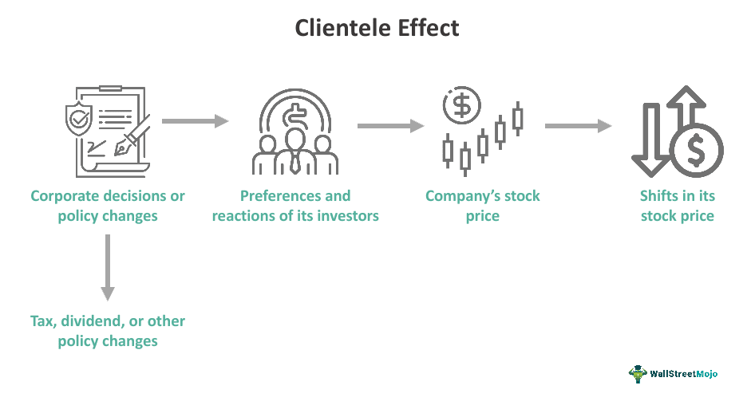

Investor behavior and the clientele effect play a pivotal role in shaping financial markets. Investor behavior encompasses the patterns and strategies employed by various investors, who can be broadly categorized into retail and institutional types. Retail investors typically include individual investors who may have diverse investment goals and risk appetites. In contrast, institutional investors such as pension funds, mutual funds, and insurance companies often possess significant capital and employ sophisticated investment strategies.

The clientele effect describes the tendency of certain stocks or financial instruments to attract specific groups of investors. This phenomenon arises because investors are drawn to investment opportunities that align with their preferences, such as risk tolerance, dividend policies, and tax considerations. For example, stocks with stable dividends may attract risk-averse investors seeking steady income, while growth stocks might appeal to those with a higher risk tolerance and a focus on capital appreciation.

As investors select assets that meet their preferences, market dynamics are affected accordingly. This investor-driven segmentation can lead to fluctuations in stock prices and influence how companies structure their dividend policies and financial strategies. The interaction between investor behavior and the clientele effect thus becomes a crucial factor in understanding market movements.

The interplay between these elements also interfaces with financial theory and the advancement of algorithmic trading. Financial theories, both traditional and behavioral, attempt to explain and predict how investors make decisions and how these decisions impact market trends. Algorithmic trading, which uses computer programs to execute trades based on predefined criteria, can be designed to account for patterns in investor behavior and the clientele effect, thereby further influencing market efficiency and price stability.

This article will explore these interconnected topics in depth, analyzing how investor behavior and the clientele effect influence financial markets. The analysis will cover the theoretical underpinnings and practical implications, considering how these factors interact with modern investment practices and strategies. Understanding these relationships is essential for effective participation in financial markets and the formulation of corporate strategies.

## Table of Contents

## Understanding the Clientele Effect

The clientele effect is a significant concept in financial markets, denoting the tendency of certain stocks to draw specific categories of investors based on those stocks' policies and intrinsic characteristics. This phenomenon arises chiefly from varying investor preferences, often influenced by factors such as dividend policies, risk tolerance, and personal investment goals.

Dividend policies play a crucial role in shaping investor types and behaviors. For instance, companies that consistently offer high dividend payouts are likely to attract investors who prioritize regular income, typically retirees or conservative investors. Conversely, companies that reinvest earnings into growth opportunities, rather than paying high dividends, tend to appeal to investors with a higher risk tolerance and a focus on capital appreciation.

The clientele effect contributes to market segmentation, where investors group around securities matching their financial objectives and risk profiles. Such segmentation can lead to greater stability within these individual market segments as investors maintain long-term positions in their preferred stocks, thereby reducing [volatility](/wiki/volatility-trading-strategies). However, it can also cause significant price shifts when external factors prompt investors to realign their portfolios, either seeking higher dividends or adjusting for changes in their risk perception.

A mathematical expression of the clientele effect can be observed through changes in dividend yield and stock prices. Suppose a company alters its dividend policy from $D_0$ to $D_1$. The initial group of investors, preferring $D_0$, might sell their stocks if the new policy does not meet their investment criteria, leading to a price adjustment $P_0 \rightarrow P_1$. This change in price reflects adjustments made by both existing and potential new clientele.

Understanding the dynamics of the clientele effect provides insights into pricing stability within market segments. Companies must carefully align corporate strategies, including dividend policies, with the expectations of their investor clienteles to harness stable investor bases and promote stock price stability. Thus, the clientele effect emphasizes the need for corporate strategies that consider the diverse preferences and behaviors of their investor base to maintain a balanced market presence.

## Investor Behavior and Market Segmentation

Investor behavior significantly shapes market segmentation through various preferences, including risk tolerance and tax sensitivity. These preferences drive investors to cluster into specific market segments, each with distinct investment goals and considerations.

Risk tolerance is a primary [factor](/wiki/factor-investing) influencing investor segmentation. Investors with low risk tolerance tend to prefer stable, low-volatility investment options, such as bonds or dividend-paying stocks. In contrast, those with higher risk tolerance might opt for [growth stocks](/wiki/growth-stocks) or venture into emerging markets. This divergence creates varied market segments tailored to different risk appetites, directly impacting demand and pricing within these segments. As riskier assets often provide the potential for higher returns, they attract an audience willing to endure greater volatility.

Tax sensitivity also plays a crucial role in market segmentation. Investors often align their strategies to maximize after-tax returns, leading to segmentation based on tax considerations. For instance, high-net-worth individuals in higher tax brackets might prefer tax-advantaged investments, such as municipal bonds in the United States, due to their tax-exempt interest income. Conversely, tax-exempt organizations or individuals in lower tax brackets may not prioritize tax advantages, focusing instead on investment growth or income potential.

Market segments are formed when investors with similar investment goals and tax considerations converge. These segments influence overall market trends by determining the flow of capital toward specific assets. For example, during periods of economic uncertainty, a shift towards low-risk investments may occur, driving up prices within those segments while reducing demand for higher-risk assets, thereby affecting their pricing negatively.

The impact of these segments on security pricing is evident in various scenarios. Consider the case of dividend-paying stocks. They often attract a clientele seeking income stability and lower volatility, which can lead to relatively stable pricing, less susceptibility to market swings, and potentially higher valuations during times when income-generating investments are favored.

In summary, investor preferences such as risk tolerance and tax sensitivity are pivotal in creating market segments. These segments influence capital distribution, market trends, and the pricing dynamics of securities, thereby underscoring the importance of acknowledging investor behavior in financial analysis and strategy development.

## Impact on Stock Prices and Dividend Policies

The interplay between stock prices, dividend policies, and investor preferences is a critical component of financial markets. This relationship is underpinned by several financial theories, notably signaling theory, which posits that dividend changes serve as indicators of a company’s financial health. Managers often use dividend adjustments to convey confidence in future earnings, influencing investor perception and attracting different investor bases. For example, an increase in dividends might signal robust financial health, thereby drawing in investors seeking stable income streams, while a decrease might deter risk-averse investors.

Tax policies and market conditions are crucial factors in this dynamic. Taxation on dividends influences investor decisions significantly. Investors subject to higher tax brackets may prefer capital gains over dividend income due to lower taxation on long-term capital gains compared to ordinary income tax rates applied to dividends. This preference affects stock demand and, consequently, stock prices. When tax policies shift, investors may realign their portfolios to maximize after-tax returns, impacting overall market dynamics.

Market conditions also play a pivotal role. In bullish markets, investors might favor companies that reinvest profits over those that distribute dividends, anticipating higher capital gains. Conversely, in bearish markets, dividends can provide a cushion against falling stock prices, leading investors to prioritize dividend-yielding stocks.

To quantify these dynamics, one can consider a simple model where the expected return $R_e$ on a stock is given by the Gordon Growth Model:
$$
R_e = \frac{D_1}{P_0} + g
$$
where $D_1$ is the expected dividend in the next period, $P_0$ is the current stock price, and $g$ is the growth rate of dividends. This model highlights how an increase in expected dividends $D_1$, perhaps following a favorable tax adjustment, can elevate expected returns, attracting more investors and potentially boosting stock prices.

Moreover, [algorithmic trading](/wiki/algorithmic-trading) strategies that incorporate dividend signals and tax implications are becoming more prevalent. These strategies can quickly capitalize on dividend announcements and tax changes, adjusting portfolios in real-time to optimize returns, thereby enhancing market efficiency.

In summary, the linkage between stock prices, dividend policies, and investor preferences is intricate and influenced by signaling theory, tax considerations, and market conditions. Understanding this relationship is essential for investors aiming to optimize their strategies in various market contexts.

## The Role of Financial Theory in Investor Decisions

Financial theories play a crucial role in shaping investor decisions by integrating insights derived from investor behavior and the clientele effect. These theories provide frameworks for predicting market movements and formulating investment strategies. They can be broadly categorized into traditional finance and behavioral finance.

### Traditional Finance vs. Behavioral Finance

**Traditional Finance:** This approach is rooted in the Efficient Market Hypothesis (EMH), which posits that asset prices fully reflect all available information. According to this view, markets are rational and investors are informed participants who aim to maximize returns by making decisions based on quantitative data and historical trends. Financial models like the Capital Asset Pricing Model (CAPM) and Modern Portfolio Theory (MPT) form the cornerstones of traditional finance. These models emphasize diversification and risk management, suggesting that investors choose portfolios that optimize expected returns for a given level of risk.

**Behavioral Finance:** In contrast, behavioral finance incorporates psychological insights into financial theory, recognizing that investors often exhibit irrational behaviors due to cognitive biases and emotions. Concepts such as ‘loss aversion’, ‘overconfidence’, and ‘herding behavior’ highlight deviations from the rational agent model of traditional finance. By analyzing how psychological factors influence investor decisions, behavioral finance offers a more nuanced understanding of market dynamics.

### Integration with Clientele Effect

Financial theories also consider the clientele effect, a phenomenon where investors are drawn to securities based on characteristics like dividend policies. For instance, investors seeking stable income streams may prefer stocks with high dividend yields, while those prioritizing capital appreciation might gravitate toward growth stocks. This behavior aligns with principles from both traditional and behavioral finance, which recognize how investor preferences and psychological tendencies shape market behavior.

### Application in Investment Strategies

Financial theories guide investment strategies by balancing quantitative analysis with behavioral insights. For example, while MPT advocates diversifying across asset classes to reduce risk, behavioral finance suggests accounting for investor sentiment and market anomalies that could impact asset correlations. Moreover, the CAPM provides tools for calculating expected returns, but investor behavior often necessitates adjustments to these models to mirror real-world conditions.

### Predicting Market Trends

The integration of these theories aids in stock market predictions by acknowledging both the rational and irrational forces at play. Traditional finance models supply foundational analysis, helping investors understand macroeconomic factors and historical performance metrics. Simultaneously, behavioral finance sheds light on sentiment-driven movements and market inefficiencies that may arise from collective investor behavior.

In conclusion, financial theories serve as indispensable tools for comprehending investor decisions and navigating complex financial landscapes. By weaving together elements of traditional finance, behavioral insights, and the clientele effect, these theories enable investors to craft informed strategies and anticipate market trends with greater precision.

## Algorithmic Trading and the Clientele Effect

Algorithmic trading refers to the use of computer algorithms to manage trading activities in financial markets. It has become increasingly prevalent due to its ability to execute trades at speeds and frequencies that are impossible for human traders. As technology has advanced, algorithmic trading has evolved to not only execute predefined trading strategies but also to analyze vast amounts of data, learn from patterns, and make decisions based on complex algorithms. A significant aspect of modern algorithmic trading systems is their capacity to integrate investor behavior insights, including the clientele effect.

The clientele effect plays a crucial role in shaping how algorithms are designed and implemented. This effect suggests that certain securities attract distinct groups of investors based on specific characteristics or policies, such as dividend declarations, risk profiles, and tax implications. For algorithmic trading systems to be effective, they must be programmed to recognize and adapt to these investor preferences. By doing so, these systems can optimize trading strategies to align with the expected behavior of different investor clienteles, thereby enhancing their performance in the market.

Algorithms may consider historical data to infer investor behavior patterns and adjust their trading logic to predict and respond to market conditions. For example, algorithms may be tuned to increase or decrease trading activity based on expected outcomes from dividend announcements that appeal to particular investor segments. This adaptability not only enhances the performance of the trading algorithms but also contributes to overall market efficiency by ensuring that securities are priced more accurately based on anticipated demand from different investor groups.

Moreover, algorithmic trading impacts market efficiency by reducing transaction costs and increasing the speed of trade execution. This efficiency translates to narrower bid-ask spreads and improved [liquidity](/wiki/liquidity-risk-premium), which can lead to a more stable and less volatile market ecosystem. Nonetheless, the rapid execution of trades can also result in increased market volatility if not properly managed, particularly in response to sudden, unanticipated market events.

The automation inherent in algorithmic trading can also influence investor behavior. As algorithms become more prevalent, traditional investors may adapt their strategies to coexist with or capitalize on algorithm-driven market dynamics. For instance, retail investors might modify their trading times or strategies to avoid periods of high-frequency trading activity that could disadvantage their trades.

In summary, algorithmic trading's integration of the clientele effect reflects an advanced intersection of technology and financial strategy. This integration allows for more precise market participation and has a significant impact on both market efficiency and investor behavior. As trading technologies continue to evolve, further refinement of algorithmic tactics to incorporate nuanced investor behaviors will likely become an essential factor in maintaining competitive market advantages.

## Challenges and Future Directions

In aligning corporate strategies with clientele expectations, firms face several challenges in today's rapidly changing market environment. The dynamic nature of these markets requires companies to remain agile while addressing diverse investor needs and preferences. One main challenge is the varying tax policies across different jurisdictions. Tax-sensitive investors may react to changes in capital gains taxes, dividend taxes, or general fiscal policies, which can influence their investment strategies and, consequently, the securities they favor.

Technological advancements have further complicated this landscape by enabling new forms of data analysis and algorithmic trading, which can anticipate and exploit shifts in investor behavior at an unprecedented pace. These technologies provide both opportunities and challenges; companies must leverage digital tools for better alignment with investor expectations while managing the risks associated with rapid information dissemination and potential market volatility.

Regulatory changes, constantly evolving to keep pace with innovation and globalization, also play a critical role. For instance, changes in disclosure requirements or financial regulations can directly impact investor sentiment and, thereby, affect market behavior. Companies must adapt to these regulations swiftly to maintain investor confidence and market stability. 

The future of investing is poised for considerable transformation due to demographic shifts and global economic trends. As the population ages, the preference for income-generating investments may increase, potentially affecting the demand for stocks with stable dividend policies. Additionally, the rise of environmentally and socially conscious investing is transforming market dynamics, requiring companies to incorporate sustainability into their corporate strategies to attract certain investor demographics.

The globalization of financial markets introduces another layer of complexity. Investors today can diversify across geographical boundaries with relative ease, fostering the need for corporations to engage with a global clientele. This trend requires careful strategy formulation, taking into account differing economic climates, cultural expectations, and investor behaviors around the world.

To navigate these challenges effectively, companies must focus on integrating advanced data analytics into their strategic planning. By harnessing insights from investor behavior patterns and understanding emerging market trends, firms can better meet clientele expectations while remaining competitive in a dynamic environment. Moreover, continuous adaptation to regulatory changes, leveraging technology for improved market prediction, and acknowledging demographic shifts will be crucial to future success.

## Conclusion

Investor behavior, the clientele effect, financial theory, and algorithmic trading form a complex interplay that significantly influences financial markets. Each of these elements plays a critical role in determining how financial markets operate and evolve.

Investor behavior, shaped by factors such as risk tolerance, tax considerations, and personal financial goals, dictates the flow of capital and the valuation of securities. Investors make decisions based on their preferences and strategies, leading to market segmentation and the formation of distinct investor demographics. Understanding these behaviors aids in predicting market movements and aligning investment strategies with expectations.

The clientele effect highlights how certain financial instruments attract specific groups of investors based on their policies, such as dividend payouts or risk exposure. This phenomenon contributes to market segmentation, creating niches of stability or volatility based on the investor composition that each segment attracts. Consequently, these segments influence stock prices and market trends, impacting overall financial market dynamics.

Incorporating insights from financial theory, both traditional and behavioral, is essential for comprehending investor decisions and market behavior. Traditional finance provides frameworks like the Efficient Market Hypothesis, while behavioral finance sheds light on cognitive biases and irrational behaviors that affect market outcomes. Both approaches are crucial for developing comprehensive strategies and anticipating market reactions.

Algorithmic trading, by incorporating models of investor behavior and the clientele effect, enhances market efficiency and liquidity. Algorithms are designed to recognize patterns and execute trades with precision, reflecting the preferences and actions of various investor groups. This automated trading significantly affects price discovery and market stability.

For market participants and corporate strategists, understanding these interconnected dynamics is vital for forming effective strategies. Companies can align their corporate policies, such as dividend strategies, with investor expectations, ensuring better market reception and value creation.

As markets continue to evolve with changing demographics, technological advancements, and regulatory landscapes, ongoing research is necessary. Adapting investment practices to these changes ensures sustained profitability and competitiveness. Scholars and practitioners must continuously explore the interactions between investor behavior, clientele effects, financial theories, and technological innovations to foster robust financial ecosystems.

## References & Further Reading

[1]: Graham, B., & Dodd, D. L. (1934). ["Security Analysis"](https://books.google.com/books/about/Security_Analysis_The_Classic_1934_Editi.html?id=wXlrnZ1uqK0C). McGraw-Hill Education.

[2]: Miller, M. H., & Modigliani, F. (1961). ["Dividend Policy, Growth, and the Valuation of Shares,"](https://www.jstor.org/stable/2351143) The Journal of Business.

[3]: Fama, E. F. (1970). ["Efficient Capital Markets: A Review of Theory and Empirical Work,"](https://onlinelibrary.wiley.com/doi/abs/10.1111/j.1540-6261.1970.tb00518.x) Journal of Finance.

[4]: Thaler, R. H. (1985). ["Mental Accounting and Consumer Choice,"](https://www.researchgate.net/publication/227356174_Mental_Accounting_and_Consumer_Choice) Marketing Science.

[5]: Barberis, N., & Thaler, R. (2003). ["A Survey of Behavioral Finance,"](https://www.nber.org/papers/w9222) in Handbook of the Economics of Finance.

[6]: Kahneman, D., & Tversky, A. (1979). ["Prospect Theory: An Analysis of Decision under Risk,"](https://www.jstor.org/stable/1914185) Econometrica.

[7]: Jegadeesh, N., & Titman, S. (1993). ["Returns to Buying Winners and Selling Losers: Implications for Stock Market Efficiency,"](https://www.jstor.org/stable/2328882) Journal of Finance.

[8]: Hull, J. C. (2018). ["Options, Futures, and Other Derivatives"](https://www.semanticscholar.org/paper/Options%2C-Futures%2C-and-Other-Derivatives-Hull/89bdee500c8623864fc9eb7a471546aa713acc44). Pearson.

[9]: Lopez de Prado, M. (2018). ["Advances in Financial Machine Learning"](https://www.amazon.com/Advances-Financial-Machine-Learning-Marcos/dp/1119482089). Wiley.