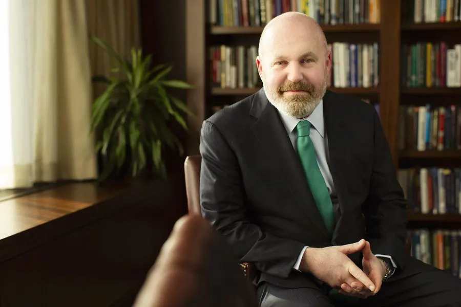

## Table of Contents

## Who is Cliff Asness?

Cliff Asness is a well-known person in the world of finance. He was born in 1966 and grew up in New York. He went to school at the University of Pennsylvania and then got a Ph.D. from the University of Chicago. He is smart and good at math, which helped him become successful in his career.

Cliff started a company called AQR Capital Management in 1998. This company helps people invest their money in smart ways. He is known for using something called "quantitative investing," which means using math and computers to make investment decisions. Many people respect him and listen to what he says about money and investing.

## What is Cliff Asness's educational background?

Cliff Asness went to the University of Pennsylvania for his undergraduate studies. There, he learned a lot about economics and how businesses work. He did really well in school and got good grades. This helped him get ready for his future career in finance.

After finishing at Penn, Cliff decided to go to the University of Chicago for more schooling. He got a Ph.D. in finance there. This is a really hard degree to get, and it showed that Cliff was very smart and good at understanding complicated financial ideas. His education helped him start his own company and become a leader in the world of investing.

## What is AQR Capital Management and what role does Cliff Asness play there?

AQR Capital Management is a company that helps people invest their money. It was started by Cliff Asness and some other people in 1998. The company uses something called "quantitative investing," which means they use math and computers to decide where to put people's money. This way of investing can help people make more money over time. AQR is a big company and a lot of people trust them with their investments.

Cliff Asness is one of the main people at AQR Capital Management. He is called the co-founder and managing principal. This means he helped start the company and he helps run it every day. Cliff uses his smart ideas and knowledge about finance to make sure the company does well. He is very important to AQR and helps make decisions about how to invest the money that people give to the company.

## What are the key investment strategies developed by Cliff Asness?

Cliff Asness is known for developing investment strategies that use a lot of math and data. One of his main strategies is called "value investing." This means he looks for companies that he thinks are priced lower than they should be. He believes that if you buy these underpriced companies, their value will go up over time, and you can make money. He uses computers and numbers to find these good deals.

Another strategy Cliff uses is called "[momentum](/wiki/momentum) investing." This means he looks at which stocks or investments are doing well and going up in value. He thinks that if something is going up, it will keep going up for a while. So, he buys these investments hoping to make money as they continue to rise. Like with value investing, he uses a lot of data and math to decide which investments have good momentum.

Overall, Cliff Asness combines these strategies with something called "risk management." This means he tries to make sure that the investments are safe and won't lose too much money. By using math, data, and these different strategies, he tries to help people make more money over time while keeping their investments safe.

## How has Cliff Asness influenced the field of quantitative investing?

Cliff Asness has had a big impact on quantitative investing. He helped make it more popular by starting AQR Capital Management, where he uses math and computers to make investment decisions. Before Cliff, not as many people used this method. But he showed that using numbers and data can help find good investments. This made more people interested in trying quantitative investing.

He also wrote a lot about his ideas and shared them with others. This helped teach people how to use math to invest better. Cliff's work made other investors and companies start using more math and computers too. Because of him, quantitative investing is now a big part of how many people invest their money.

## What are some of the major publications authored by Cliff Asness?

Cliff Asness has written many important papers and articles about investing. One of his most well-known works is called "An Introduction to Quantitative Portfolio Management." In this paper, he explains how to use math and data to make good investment choices. He talks about things like value investing and momentum investing, which are methods he uses at AQR Capital Management. This paper has helped many people understand how to use numbers to invest better.

Another important publication by Cliff is "Fight the Fed Model." In this article, he talks about how people often use a certain way to guess how the stock market will do, but he thinks it's not a good way. He explains why and suggests better ways to think about the stock market. This article has been very influential and has made many people change how they look at stock market predictions.

Cliff also writes a lot of articles for the AQR website and other places. He shares his thoughts on different topics in investing and the economy. These articles are easy to read and help people learn more about how to invest their money wisely. His writing has made a big difference in how people think about investing and using math to make decisions.

## What is the fama-French-Asness model and how does it differ from traditional models?

The Fama-French-Asness model is a way to understand how stocks perform. It was created by Eugene Fama, Kenneth French, and Cliff Asness. This model adds something called "momentum" to the traditional Fama-French three-[factor](/wiki/factor-investing) model. Momentum means that stocks that have been doing well in the past will likely keep doing well for a while. The Fama-French-Asness model looks at three things: size, value, and momentum. Size is about whether a company is big or small, value is about whether a stock is priced low compared to what it's worth, and momentum is about how the stock has been doing recently.

This model is different from traditional models because it includes momentum. Traditional models, like the original Fama-French model, only looked at size and value. They didn't think about how a stock's past performance could help predict its future performance. By adding momentum, the Fama-French-Asness model gives investors another tool to understand and predict stock returns. This makes it more complete and useful for people who want to invest wisely.

## How does Cliff Asness view market efficiency and what are his criticisms?

Cliff Asness believes that markets are mostly efficient, but not perfectly so. He thinks that while prices usually reflect all available information, there are still ways to find good investments. He uses something called "anomalies" to find these opportunities. Anomalies are patterns in the market that don't fit with what you'd expect if markets were perfectly efficient. For example, he looks at value and momentum investing, which can help find stocks that are underpriced or likely to keep going up.

Asness has some criticisms of the idea of perfect market efficiency. He argues that if markets were always perfectly efficient, then strategies like value and momentum investing wouldn't work. But he has shown through his work that these strategies can make money over time. He believes that human behavior and other factors can create opportunities for smart investors. Asness thinks that while markets are good at setting prices, they're not so good that you can't find ways to beat them.

## What are some notable successes and failures in Cliff Asness's investment career?

Cliff Asness has had many big successes in his investment career. One of his biggest successes is starting AQR Capital Management. AQR has grown to manage a lot of money for people and has done well over the years. Asness's use of quantitative investing helped AQR become successful. He also helped develop the Fama-French-Asness model, which added momentum to how people think about stock returns. This model has been very useful for investors and is still used today.

Asness has also faced some challenges. One notable failure was during the financial crisis in 2008. AQR's investments lost a lot of money that year. This was tough for Asness and his team, but they learned from it and made changes to their strategies. Even though this was a hard time, AQR bounced back and continued to do well in the years after the crisis. Asness's ability to learn from failures and keep improving has been a big part of his success.

## How does Cliff Asness approach risk management in his investment strategies?

Cliff Asness takes risk management very seriously in his investment strategies. He knows that investing always involves some risk, so he uses math and computers to understand and control that risk. At AQR Capital Management, he and his team look at a lot of data to see how risky different investments might be. They use something called "diversification," which means they spread out their investments so that if one investment does badly, it won't hurt the whole portfolio too much. This helps keep the overall risk lower.

Another way Asness manages risk is by using something called "hedging." This means he makes investments that can help protect against losses. For example, if he thinks the stock market might go down, he might buy things that will go up in value if the market falls. This can help balance out any losses from his other investments. By carefully thinking about and managing risk, Asness tries to make sure that his strategies can make money over time without taking too many big risks.

## What is Cliff Asness's perspective on the role of momentum in investing?

Cliff Asness believes that momentum is very important in investing. Momentum means that if a stock has been going up in value, it is likely to keep going up for a while. Asness thinks that this pattern can help investors make money. He uses a lot of data and math to find stocks with good momentum. By looking at how stocks have been doing recently, he can decide which ones to buy. This helps him find investments that are likely to keep doing well.

Asness added momentum to the traditional Fama-French model, which only looked at size and value. He thinks that including momentum makes the model better and more useful for investors. Even though some people believe that markets are perfectly efficient and that past performance doesn't matter, Asness has shown that momentum can help predict future returns. By using momentum along with other strategies like value investing, he tries to make smart investment choices and help his clients make more money over time.

## What future trends does Cliff Asness predict in the field of finance and investing?

Cliff Asness thinks that in the future, more people will use computers and math to make investment decisions. He believes that as technology gets better, it will be easier to look at a lot of data and find good investments. He also thinks that more investors will use strategies like value and momentum investing because they can help make money over time. Asness says that even though markets are getting smarter, there will still be ways for smart investors to find good deals.

He also predicts that risk management will become even more important. Asness believes that as the world changes and new risks come up, investors will need to be careful and use tools to protect their money. He thinks that using things like diversification and hedging will help investors deal with these new risks. Overall, Asness sees a future where technology and smart strategies help people invest better and more safely.

## References & Further Reading

[1]: Fama, E. F., & French, K. R. (1993). ["Common risk factors in the returns on stocks and bonds."](https://www.sciencedirect.com/science/article/pii/0304405X93900235) Journal of Financial Economics, 33(1), 3-56.

[2]: Asness, C. S., Moskowitz, T. J., & Pedersen, L. H. (2013). ["Value and Momentum Everywhere."](https://pages.stern.nyu.edu/~lpederse/papers/ValMomEverywhere.pdf) The Review of Financial Studies, 26(7), 1711-1753.

[3]: AQR Capital Management. ["Research and Insights."](https://www.aqr.com/Insights/Research) AQR's page for scholarly articles and insights in quantitative finance.

[4]: Carhart, M. M. (1997). ["On Persistence in Mutual Fund Performance."](https://onlinelibrary.wiley.com/doi/full/10.1111/j.1540-6261.1997.tb03808.x) The Journal of Finance, 52(1), 57-82.

[5]: "Efficient Market Hypothesis." ["Investopedia."](https://www.investopedia.com/terms/e/efficientmarkethypothesis.asp) An overview and explanation of the Efficient Market Hypothesis.