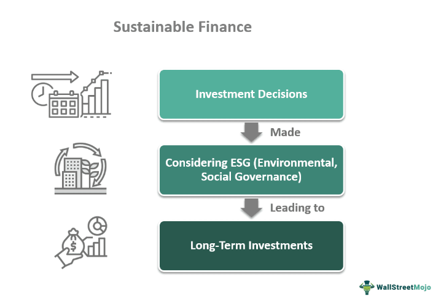

In recent years, climate change has become one of the most urgent challenges facing our planet. The increasing frequency and intensity of extreme weather events, rising sea levels, and significant disruptions to ecosystems and human societies underscore the critical need for substantial financial investment in addressing climate change. This type of investment is commonly referred to as climate finance. Climate finance plays a pivotal role in supporting initiatives aimed at reducing greenhouse gas emissions and enabling communities to adapt to the changing climate.

The landscape of climate finance is varied and continually evolving, encompassing a wide array of funding mechanisms. Traditional funding sources, such as government grants and loans, continue to play a significant role. However, innovative strategies, including technological advancements in finance like algorithmic trading, are emerging as valuable tools for mobilizing additional resources. These advances are helping to streamline financial processes, reduce transaction costs, and increase transparency in climate-related financial markets.

Effective climate finance is dependent on identifying and leveraging key financial contributors. Governments, corporations, non-profits, and multilateral organizations all play significant roles in providing the necessary resources. Understanding the contributions and commitments of these entities is essential for the mobilization and allocation of financial resources toward sustainable climate projects.

Moreover, the advent of algorithmic trading has introduced new opportunities to enhance the efficiency and effectiveness of climate finance. By utilizing algorithms to automate trading processes, financial institutions can potentially increase market liquidity in carbon markets and other climate-related financial products.

Overall, climate finance is a crucial component of global efforts to combat climate change. Through the collaboration of diverse financial contributors and the integration of advanced financial technologies, there is great potential for mobilizing substantial funds to support meaningful climate action.

## Table of Contents

## Understanding Climate Finance

Climate finance refers to the funds allocated to projects and initiatives designed to mitigate and adapt to climate change impacts. The primary goal is to reduce greenhouse gas emissions and aid communities in managing the evolving climate patterns effectively. Recognizing climate change as a global concern has led to increased emphasis on climate finance as a critical component of global climate action strategy.

Understanding the sources and mechanisms of climate finance is essential for evaluating how these funds are allocated and utilized. Key sources include public entities, private investors, and international organizations. Public sources often involve government budgets and contributions to international funds. Private sector contributions are typically made through investments in green technology and sustainable business practices. International bodies, such as the United Nations Green Climate Fund, play significant roles by mobilizing resources and supporting projects in developing nations.

International agreements like the Paris Agreement significantly influence climate finance norms and commitments. The Paris Agreement, adopted in 2015, seeks to limit global warming to well below 2 degrees Celsius, with an aim to restrict the increase to 1.5 degrees Celsius. To achieve this, countries committed to substantial financial contributions. Article 9 of the Paris Agreement outlines the obligations of developed countries to provide financial resources to assist developing nations in mitigation and adaptation efforts. This has set a framework for financial commitments and transparency in climate financing.

Key financial instruments in climate finance include bonds, grants, and public-private partnerships (PPPs). Green bonds are particularly prominent, enabling organizations to raise capital for projects with specific environmental benefits. These bonds are attractive due to their focus on environmental impact, making them a popular choice for both public and private entities.

Grants provide non-repayable funds for climate projects, supporting a wide range of activities from research and development to direct action initiatives. They are vital for funding projects that may not attract traditional investment due to their higher risk or uncertain returns.

Public-private partnerships (PPPs) combine resources and capabilities from both governmental and private sectors to undertake large-scale projects that might be unfeasible for a single entity. By leveraging the strengths of both sectors, PPPs can drive innovation and increase the scale and impact of climate finance efforts.

These financial mechanisms are crucial for implementing effective climate actions and achieving global climate goals. Structuring and deploying these resources efficiently requires collaboration between public, private, and international actors to ensure that funds are directed toward the most impactful climate initiatives.

## Key Financial Contributors to Climate Change Mitigation

Governments, corporations, non-profits, and multilateral organizations play pivotal roles in climate finance, with each contributor offering unique strengths and resources to combat climate change effectively.

**Government Contributions:**

Governments are foundational to climate finance, providing substantial funding and policy frameworks to facilitate climate action. National budgets allocate billions annually to environmental initiatives, infrastructure, and research. Furthermore, governments endorse international commitments like the Paris Agreement, which mandates developed nations to mobilize $100 billion annually starting in 2020 to aid developing countries in addressing climate challenges. For example, the European Union has pledged to reduce its greenhouse gas emissions by at least 55% by 2030, committing significant resources to achieve this target.

**Corporate Initiatives:**

Corporations are increasingly investing in climate-related projects, driven by regulatory pressures, consumer demand, and the financial viability of sustainable practices. Multinational companies, such as Google and Microsoft, have announced aggressive goals to achieve carbon neutrality, investing heavily in renewable energy sources and carbon offset projects. These initiatives not only help reduce their carbon footprint but also position them as leaders in corporate sustainability.

**Non-profit Organizations:**

Non-profits contribute to climate finance primarily through advocacy, raising awareness, and funding grassroots projects. Organizations such as the World Wildlife Fund and Greenpeace mobilize financial resources to promote sustainable practices and influence policy changes. They often collaborate with governments and corporations to channel funds into projects that address climate change at the community level, ensuring that financial resources reach vulnerable populations.

**Multilateral Organizations:**

The United Nations Green Climate Fund (GCF) epitomizes the multilateral effort in climate finance. Established to support developing countries in their responses to climate change, the GCF allocates funds to projects that promote low-emission and climate-resilient development. By 2020, the GCF had raised over $10 billion, funding a diverse portfolio of projects ranging from renewable energy installations to climate adaptation programs in agriculture.

**Private Investment and Venture Capital:**

Private investors and venture capitalists are crucial in promoting sustainable and green technologies. The rise of impact investing has led to increased capital flows into companies and technologies that offer environmental benefits alongside financial returns. Venture capital funds are backing startups in clean energy, sustainable agriculture, and carbon capture technology, recognizing the double advantage of profitability and sustainability.

**Philanthropic Contributions:**

Philanthropy has become a significant force in climate finance, with foundations and high-net-worth individuals dedicating resources to innovative climate solutions. Philanthropic entities often take risks that other financial contributors might shy away from, funding groundbreaking research, and community-led initiatives. The commitment of philanthropists like the Rockefeller Foundation and the Bill & Melinda Gates Foundation to climate-related causes underscores the importance of private donations in driving meaningful change.

By leveraging resources across these sectors, climate finance can be effectively mobilized to meet global climate goals, demonstrating the necessity of diversified financial contributions in mitigating climate change.

## The Role of Algorithmic Trading in Climate Finance

Algorithmic trading, a technique utilizing computer algorithms to execute financial trades, has become a prominent tool in improving market efficiencies and enhancing returns. In the domain of climate finance, it's gaining recognition for its potential to support and advance climate-related financial products. Algorithmic trading can actively contribute to climate finance by increasing [liquidity](/wiki/liquidity-risk-premium), reducing transaction costs, and fostering transparency in the carbon markets.

Basic Concepts and Application:

At its core, [algorithmic trading](/wiki/algorithmic-trading) involves the use of pre-programmed instructions accounting for variables such as time, price, and [volume](/wiki/volume-trading-strategy), to [carry](/wiki/carry-trading) out trades. This technology is instrumental in minimizing market [volatility](/wiki/volatility-trading-strategies) and optimizing trading strategies by executing a large number of trades at speeds imperceptible to human traders. In climate finance, similar techniques can be tailored to manage environmental assets, such as carbon credits, which are tradable certificates representing the right to emit a certain amount of carbon dioxide.

Application to Climate Finance Markets:

Algorithmic trading holds promise in climate finance markets by facilitating more efficient pricing and trading of carbon credits, which are often subject to complex variables and regulatory conditions. Through advanced data analysis and real-time trading capabilities, algorithms can help pinpoint undervalued assets, ensure compliance with environmental standards, and provide essential liquidity. Increased liquidity means there is an ability to buy or sell carbon credits without causing significant price changes, thus creating a more stable market.

Potential Benefits:

One of the primary benefits of algorithmic trading in climate finance is cost reduction. By automating trading processes, it reduces the reliance on manual intervention, leading to lower transaction costs. Furthermore, algorithmic trading can enhance market transparency by providing stakeholders with clear, data-driven insights into trading activities and patterns, thereby fortifying trust in climate markets. This transparency is crucial in carbon markets where opacity can lead to inefficiencies and mistrust among investors.

Case Studies and Examples:

Various financial institutions have begun deploying algorithmic trading strategies tailored for climate-related products. For instance, some trading firms are utilizing algorithms to optimize energy trading portfolios, factoring in the real-time impact of weather changes on energy availability and demand. Additionally, innovative platforms are emerging that apply [machine learning](/wiki/machine-learning) algorithms to predict carbon credit price movements, thereby aiding investors in making informed decisions.

Challenges and Risks:

Despite its advantages, integrating algorithmic trading into climate finance also presents challenges. Market participants must navigate the risks associated with algorithm errors, which can lead to significant financial losses. In addition, the over-reliance on algorithmic models can introduce systemic risks, particularly if multiple traders employ similar strategies that amplify market trends. There is also the concern of regulatory compliance, as climate markets are subject to specific environmental policies and guidelines that algorithms must be programmed to respect.

The potential of algorithmic trading to transform climate finance is substantial, yet requires careful implementation and oversight to address inherent risks. By optimizing trading efficiency and providing critical market insights, it represents a powerful tool to catalyze investment in sustainable initiatives and contribute to global climate goals.

## Challenges and Opportunities in Climate Finance

Despite notable advancements in climate finance, the sector faces persistent challenges that hinder its efficacy. One primary obstacle is inadequate funding. Current financial flows fall short of the estimated $4 trillion annually needed to address climate change's multifaceted impacts effectively. This shortfall arises from competing budgetary priorities and reluctance to invest in perceived high-risk, low-return climate initiatives.

Regulatory barriers are another significant hurdle. Divergent national policies and complex regulatory frameworks make it difficult to harmonize international climate finance efforts. Such disjointed regulations can deter private sector investment and slow the flow of funds to necessary projects. Additionally, market volatility poses threats to the stability of climate finance. Fluctuations in commodity prices, interest rates, and currency exchanges can undermine investment confidence and project sustainability.

Addressing these challenges necessitates innovative solutions. Green fintech, which includes digital platforms focused on sustainability, offers promising avenues for enhancing the efficiency and reach of climate finance. Decentralized finance (DeFi) platforms, employing blockchain technology, can democratize access to climate investments, providing transparency and reducing transaction costs.

International collaboration and policy reforms play crucial roles in dismantling financial barriers to climate action. Aligning national regulations and fostering global partnerships can enable a cohesive approach to financing. Collaborative frameworks, such as the Paris Agreement, can bolster international climate finance efforts by setting unified goals and commitments.

Emerging trends offer opportunities to bolster climate finance. Impact investing, which aims to generate social and environmental benefits alongside financial returns, is gaining traction among investors. Environmental, social, and governance ([ESG](/wiki/esg-investing)) criteria are increasingly being integrated into investment decisions, driving capital towards sustainable projects. These trends encourage innovation and can significantly expand the scope and effectiveness of climate finance.

In conclusion, while the challenges facing climate finance are significant, embracing innovative financial technologies, fostering international cooperation, and adapting investment strategies to include ESG considerations can address these issues and unlock new opportunities for funding climate change mitigation and adaptation strategies.

## Conclusion

The necessity for substantial investment in climate finance is increasingly critical as the effects of climate change become more severe. Global temperatures are rising, leading to more frequent and intense weather events, threatening ecosystems and human livelihoods. Addressing these challenges requires a coordinated financial response that leverages diverse contributors and cutting-edge technologies. By integrating financial technologies like algorithmic trading, the landscape for mobilizing funds has expanded significantly. These technologies boost efficiency in resource allocation, improve market liquidity, and lower transaction costs, making the deployment of climate finance more effective.

Nevertheless, the road to effective climate finance is replete with challenges. Funding gaps, regulatory hurdles, and market volatility are significant obstacles that hinder progress. However, overcoming these challenges is crucial to advancing global climate action. The collaboration between public entities, private investors, and philanthropic organizations is essential for creating resilient financial frameworks that support climate initiatives. This multi-sector cooperation enhances resource mobilization, drives innovation, and ensures that funds are directed toward impactful climate projects.

Despite the existing obstacles, the prospects for advancing climate finance are promising. The emergence of innovative financial instruments and strategies, combined with the rapidly evolving landscape of financial technology, offers numerous opportunities. By embracing these advancements, stakeholders can significantly improve the scale and impact of climate finance initiatives.

In conclusion, while barriers remain, the capacity to innovate and expand climate finance presents a hopeful pathway for substantial progress in combatting climate change. Through concerted efforts and strategic investments, the global community can make meaningful strides in addressing the pressing challenges posed by climate change.

## Additional Resources

For further reading on the topics discussed, consider exploring the following resources:

- Publications by the Intergovernmental Panel on Climate Change (IPCC) on climate finance offer comprehensive insights into global financial flows for climate mitigation and adaptation. These publications can provide valuable information on the quantification and deployment of climate finance.

- Reports on algorithmic trading in financial markets published by leading financial institutions, such as J.P. Morgan or Goldman Sachs, provide an in-depth understanding of the role of technology in trading. These reports often analyze the advancements and implications of algorithmic trading on market dynamics, which could be useful for understanding its application in climate finance.

- Policy papers from international organizations, such as the World Bank and the United Nations Framework Convention on Climate Change (UNFCCC), provide guidelines and frameworks for climate finance. The World Bank’s Climate Change Action Plan or the UNFCCC’s Biennial Assessment and Overview of Climate Finance Flows are crucial documents outlining international commitments and strategies.

- Books and articles on sustainable investment trends and impact investing strategies can aid in grasping the current landscape of sustainable finance. Texts like "Sustainable Investing: Revolutions in Theory and Practice" by Cary Krosinsky and Sophie Purdom offer perspectives on integrating sustainability into investment practices.

- Online courses and webinars on climate finance and sustainable investing, such as those provided by platforms like Coursera or edX, can equip individuals with the knowledge and skills needed to engage with climate finance effectively. Courses may cover a range of topics from the fundamentals of climate finance to specific investment strategies and financial technologies.

## References & Further Reading

[1]: Intergovernmental Panel on Climate Change. (2014). ["Climate Change 2014: Mitigation of Climate Change."](https://www.ipcc.ch/report/ar5/wg3/) Contribution of Working Group III to the Fifth Assessment Report of the Intergovernmental Panel on Climate Change.

[2]: United Nations Framework Convention on Climate Change. (2016). ["Biennial Assessment and Overview of Climate Finance Flows."](https://unfccc.int/topics/climate-finance/resources/biennial-assessment-and-overview-of-climate-finance-flows)

[3]: Krosinsky, C., & Purdom, S. (2016). ["Sustainable Investing: Revolutions in Theory and Practice."](https://www.taylorfrancis.com/books/edit/10.4324/9781315558837/sustainable-investing-cary-krosinsky-sophie-purdom) Routledge.

[4]: World Bank. (2016). ["World Bank Group Climate Change Action Plan."](https://documents.worldbank.org/en/publication/documents-reports/documentdetail/755721468011421594/world-bank-group-climate-change-action-plan-2016-2020)

[5]: J.P. Morgan. (2020). ["The Impact of Algorithmic Trading in Financial Markets."](https://am.jpmorgan.com/us/en/asset-management/adv/insights/market-insights/market-updates/on-the-minds-of-investors/can-investment-management-harness-the-power-of-ai/)

[6]: United Nations. (2015). ["Paris Agreement."](https://unfccc.int/process-and-meetings/the-paris-agreement)

[7]: Green Climate Fund. (2020). ["What We Do."](https://www.greenclimate.fund/annual-results-report-2020)

[8]: Khan, M., Serafeim, G., & Yoon, A. (2016). ["Corporate Sustainability: First Evidence on Materiality."](https://corporate-sustainability.org/wp-content/uploads/Corporate-Sustainability.pdf) The Accounting Review, 91(6), 1697-1724.