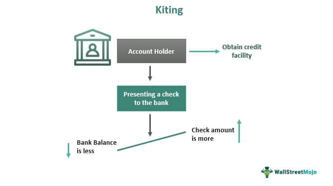

In the dynamic world of trading, understanding market behavior is crucial for successful investments. Market behavior can be complex, driven by a multitude of factors, including economic indicators, investor sentiment, and global events, thereby necessitating a comprehensive approach to analysis and strategy. Algorithmic trading has transformed the landscape of market interaction, introducing sophisticated mechanisms such as the climax strategy to identify and exploit market inefficiencies.

Algorithmic trading refers to the use of computer systems to execute trades based on a set of preprogrammed instructions. These instructions can cover various parameters, such as timing, price, and volume, enabling rapid and precise trading decisions. The adoption of algorithmic trading has allowed market participants to effectively analyze vast datasets, recognize trading patterns, and respond instantaneously to market changes.



The climax strategy, within this context, represents a pattern recognition approach that focuses on identifying key turning points in market trends. A climax in trading typically signifies a critical movement characterized by an abrupt culmination of price activity, often accompanied by significant trading volumes and volatility. These climaxes can mark the end of a prevailing market sentiment, such as the conclusion of a bull or bear market cycle.

By incorporating algorithms to monitor climax patterns, traders can gain insights into potential market reversals. Algorithms analyzing price movements and volumes in real time are capable of detecting subtle signals that may indicate a market exhaustion point. Consequently, these systems can facilitate more informed decision-making by reducing emotional bias and allowing for precise trade executions.

This article explores the concept of climax in trading, its role in buying and selling, and the integration of climaxes within algorithmic systems. Understanding these components is vital for traders seeking to optimize their investment strategies and capitalize on market opportunities.

## Table of Contents

## Understanding Climax in Trading

A climax in trading represents a pivotal market movement at the conclusion of a bull or bear market cycle, signifying a significant shift in market trends. This phenomenon is distinguished by a marked increase in trading volumes and abrupt price fluctuations. These characteristics signal a potential turning point in market direction.

High trading volumes during a climax suggest heightened market activity as traders rush to either capitalize on remaining upward [momentum](/wiki/momentum) in a bull market or mitigate losses during a sell-off in a bear market. This surge in activity often leads to sharp price movements, as the increased pressure on buying or selling affects supply and demand dynamics.

A buying climax typically occurs at the end of a prolonged upward trend. During this phase, an initial spike in prices is followed by a surge in trading [volume](/wiki/volume-trading-strategy) as demand reaches its peak. This signals that market sentiment may soon shift, as investors may start selling off assets in anticipation of a price decline.

Conversely, a selling climax is observed at the end of a significant downtrend. Panic selling drives prices down further, culminating in a temporary bottom where trading volumes reach extreme levels. This overextension often precedes a stabilization or reversal of the trend as prices hit attractive levels for potential buyers.

Recognizing these climax patterns is vital for traders who aim to predict market reversals. Identifying a climax can provide an early warning signal of an impending shift, allowing traders to adjust their strategies accordingly. Such foresight is an essential component of strategic investing, as it enables investors to optimize entry and [exit](/wiki/exit-strategy) points based on anticipated trend changes.

To systematically identify climax patterns, traders and analysts often rely on technical indicators and chart patterns. For example, the Relative Strength Index (RSI) can help identify overbought or oversold conditions, while candlestick patterns such as Doji or Hammer can highlight potential reversals. By combining these tools with a broader understanding of market dynamics, traders can enhance their ability to predict and capitalize on market climaxes effectively.

## Buying and Selling Climaxes Explained

Buying Climaxes are significant moments in trading characterized by a surge in buying activity, often marking the culmination of a bull market. This phenomenon occurs when investors, driven by optimistic market sentiments, engage in vigorous purchasing, causing a sharp increase in price levels. However, this heightened demand inevitably reaches a saturation point, resulting in the exhaustion of potential buyers. Once this occurs, the market is vulnerable to a reversal as the previous enthusiasm dissipates, leading to downward pressure on prices. This shift signals that the upward trend may be over, and a corrective phase might soon ensue.

Conversely, Selling Climaxes represent pivotal points in a bear market where panic-driven selling intensifies, pushing prices to unexpected lows. During these episodes, investors, often gripped by fear and uncertainty, hastily liquidate their positions. This surge in selling pressure results in markedly reduced asset prices, albeit temporarily. The sharp decline is indicative of a broader market capitulation, suggesting that the selling force is reaching its peak. Subsequently, as the panic subsides, asset values begin to stabilize or potentially reverse direction, heralding the end of the bearish phase.

Recognizing these climaxes is essential for traders, providing clear markers of possible trend shifts and reversal points within market cycles. Assessing the trading volume alongside price actions further corroborates these climactic signals, offering a robust framework for making informed investment decisions. By understanding the dynamics at play during these critical junctures, traders can better anticipate market movements and strategically position themselves to optimize their trading outcomes.

## The Role of Algorithmic Trading in Implementing Climax Strategies

Algorithmic trading has significantly transformed the landscape of trading by introducing the ability to process extensive data sets rapidly and efficiently. This computational capability is crucial for identifying complex patterns such as climaxes, which are pivotal for predicting market reversals. These trading systems are programmed to detect specific market conditions based on historical data inputs and mathematical algorithms, thus allowing them to execute trades at optimal points without the interference of human emotions.

The backbone of these systems is their ability to process vast amounts of market data in real time. By analyzing historical trading volumes, price movements, and other market indicators, [algorithmic trading](/wiki/algorithmic-trading) systems can recognize a buying climax or selling climax. For instance, a Python algorithm might leverage libraries such as Pandas for data handling and NumPy for numerical computation to analyze market patterns efficiently. 

```python
import pandas as pd
import numpy as np

# Load historical market data
market_data = pd.read_csv('market_data.csv')

# Calculate moving average and trading volume changes
market_data['Moving_Avg'] = market_data['Price'].rolling(window=5).mean()
market_data['Volume_Change'] = market_data['Volume'].pct_change()

# Identify climax patterns
buying_climax = market_data[(market_data['Volume_Change'] > 2) & (market_data['Price'] > market_data['Moving_Avg'])]
selling_climax = market_data[(market_data['Volume_Change'] > 2) & (market_data['Price'] < market_data['Moving_Avg'])]
```

This systematic approach reduces emotional bias, a critical hindrance in manual trading. Emotional bias often leads traders to make decisions based on fear or euphoria, which can result in suboptimal investment outcomes. By adhering strictly to pre-defined criteria, algorithmic systems can make objective decisions based on statistical evidence rather than emotional impulse.

Moreover, integrating climax strategies into algorithm trading can substantially enhance prediction accuracy and investment results. Algorithms equipped with climax detection capabilities can swiftly react to market exhaustion signals, positioning traders to capitalize on impending market reversals. These systems continuously adapt and refine their strategies through [machine learning](/wiki/machine-learning) techniques, improving their precision over time.

However, the effectiveness of climax strategy integration depends on the quality and timeliness of the data used. Algorithms need access to real-time, high-quality data to accurately recognize climactic patterns. Continuous improvements in data processing technologies and trading algorithms are likely to further refine the ability of these systems to predict market trends effectively, leading to better performance and higher returns on investment.

## Benefits and Challenges of Climax Strategies in Algo Trading

Climax strategies in algorithmic trading offer distinct advantages to traders by providing clear indicators of market exhaustion and potential reversals. These strategies are particularly valuable because they help to predict significant turning points in market trends, allowing traders to make informed decisions. For instance, at the end of a bull or bear market, a climax pattern can signal a shift, empowering traders to adjust their positions strategically.

The primary benefit of climax strategies lies in their ability to forecast market reversals with a degree of accuracy. A buying climax, occurring after a rapid increase in asset prices, suggests that demand is peaking and a potential downturn could be imminent. Conversely, a selling climax, marked by an intense bout of selling activity, indicates a probable market bottom, signaling an opportunity for upward price correction. Identifying such moments is pivotal in maximizing returns and minimizing losses.

Integrating climax strategies into algorithmic systems enhances trading efficiency by leveraging data-driven insights. Algorithms process large data sets at high speeds, enabling the detection of subtle market patterns that human traders might overlook. By automating the execution of trades based on climax signals, these systems minimize emotional biases and enhance strategic consistency. This computational assistance bolsters the accuracy of predictions, potentially leading to more profitable trading outcomes.

However, implementing climax strategies in algorithmic trading is not without challenges. One significant obstacle is the need for access to real-time data and sophisticated analysis tools. The precision of climax identification relies on timely and accurate data inputs, which requires an infrastructure capable of handling high-frequency data streams. Furthermore, the algorithms designed to recognize climax signals must be sophisticated enough to discern genuine patterns from market noise.

Moreover, algorithms must dynamically adapt to ever-changing market conditions. Financial markets are inherently volatile, and factors such as geopolitical events, economic announcements, or shifts in investor sentiment can rapidly alter market dynamics. Consequently, algorithms must be regularly updated and refined to sustain their effectiveness. This adaptability necessitates ongoing research and development, along with rigorous [backtesting](/wiki/backtesting) to validate algorithm performance under various conditions.

Despite these challenges, well-implemented climax strategies can significantly enhance trading performance. To ensure robustness, traders often employ machine learning techniques to refine their algorithms. Here is a simple example of how a Python script could be structured to incorporate climax detection using moving averages:

```python
import pandas as pd

def identify_climax(data):
    # Calculate moving averages
    data['50_MA'] = data['Close'].rolling(window=50).mean()
    data['200_MA'] = data['Close'].rolling(window=200).mean()

    # Identify potential climax points
    data['Buy_Climax'] = (data['Close'] > data['50_MA']) & (data['50_MA'] > data['200_MA'])
    data['Sell_Climax'] = (data['Close'] < data['50_MA']) & (data['50_MA'] < data['200_MA'])

    return data

# Sample usage
# Assuming 'data' is a DataFrame with a 'Close' column representing closing prices
# data = pd.read_csv('market_data.csv')
# result = identify_climax(data)
# print(result)
```

In summary, while climax strategies present notable benefits in identifying crucial market shifts, they require meticulous care in execution. Traders must ensure their algorithms are equipped with up-to-date data and adaptable to market changes, and continually optimized to remain competitive in a dynamic trading environment.

## Case Studies of Successful Climax Strategy Implementations

Throughout trading history, certain market characteristics have exemplified the climax strategy's effectiveness. By analyzing key historical instances, the impact of algorithmic trading becomes evident, as these systems were instrumental in identifying and acting on market climax patterns.

### Historical Instances

1. **The Dot-com Bubble (1995-2000)**: This was marked by a massive buying climax, where tech stock valuations soared despite unsustainable business models. As the peak approached in 2000, algorithmic trading systems, even in their nascent stage, began recognizing the overextended valuations and high trading volumes. This foresight allowed select traders to execute preemptive sell orders, avoiding significant losses when the market corrected. These early algorithms, though less sophisticated than today’s systems, showcased the potential of programmatic trading strategies in recognizing climax phenomena.

2. **2008 Financial Crisis**: As financial markets spiraled into a selling climax, characterized by panic-driven sell-offs reaching extreme lows, advanced algorithmic systems were utilized by institutional investors to identify the bottom of the market. These algorithms effectively sifted through vast datasets to detect the climax, where market fear peaked, and started positioning for a reversal. Their ability to execute trades swiftly and emotionlessly enabled them to capitalize on subsequent market recoveries, outperforming manual trading strategies.

3. **Brexit Referendum (2016)**: The unexpected outcome led to a swift selling climax in financial markets. During this period, algorithmic trading programs, having incorporated historical market stress scenarios, were quick to detect the surge in volatility and adjusted their trading patterns accordingly. This adaptability allowed them to generate profits by executing trades that assumed an eventual stabilization following the initial panic sell-off.

### Role of Algorithmic Trading

Algorithmic trading systems played a crucial role by processing real-time data to identify climaxes accurately. These systems used sophisticated methods, such as moving averages and [volatility](/wiki/volatility-trading-strategies) indices, to determine when a climax was occurring. For instance, a simple moving average crossover strategy can help: 

```python
def moving_average_crossover(prices, short_window=40, long_window=100):
    short_mavg = prices.rolling(window=short_window, min_periods=1, center=False).mean()
    long_mavg = prices.rolling(window=long_window, min_periods=1, center=False).mean()
    signals = pd.Series(data=0, index=prices.index)
    signals[short_window:] = np.where(short_mavg[short_window:] > long_mavg[short_window:], 1.0, 0.0)
    return signals
```

Such algorithms reduced emotional biases and enabled timely responses to market extremes by executing pre-defined trading criteria at optimal points.

### Insights for Future Strategies

The success stories of climax strategy implementations underscore the importance of real-time data analysis and the capacity of algorithms to adapt to new patterns. Future algorithms can be enhanced by integrating machine learning techniques, enabling them to learn from historical market behaviors and increase prediction accuracy. Continuous refinement and adaptation will ensure that trading systems remain effective as market conditions evolve. As technology advances, algorithms capable of identifying and leveraging climax signals will become increasingly crucial to strategic investing.

## Conclusion

Climaxes are pivotal in understanding the cyclical nature of markets, offering traders critical insights necessary for making informed investment decisions. Identifying climax patterns at the concluding phases of bull and bear markets allows traders to anticipate potential reversals, thus optimizing their trading strategies. By acknowledging these key junctures of market exhaustion and participant behavior, traders can position themselves advantageously to capitalize on subsequent market movements.

The integration of climax strategies into algorithmic trading frameworks further enhances the potential for improved trading outcomes. Algorithms, with their capacity to process vast amounts of data at high speeds, excel in identifying climax patterns that might be missed by manual analysis. These systems utilize predefined rules to execute trades at optimal moments, thereby minimizing the impact of human emotion and bias. When algorithms are equipped with climax strategies, they become powerful tools in forecasting market reversals, allowing for more data-driven and objective trading decisions.

As technology continues to advance, the efficacy of climax-based trading strategies will likely improve. Innovations in data science, machine learning, and real-time data processing are continually expanding the boundaries of what algorithmic trading systems can achieve. These advancements promise to enhance the precision of climax detection and prediction, thus providing traders with even more robust tools to navigate the complexities of financial markets. By leveraging these technological developments, traders can refine their approaches, thereby increasing their potential for successful investment outcomes in increasingly dynamic trading environments.

## References & Further Reading

[1]: Bergstra, J., Bardenet, R., Bengio, Y., & Kégl, B. (2011). ["Algorithms for Hyper-Parameter Optimization."](https://dl.acm.org/doi/10.5555/2986459.2986743) Advances in Neural Information Processing Systems 24.

[2]: ["Advances in Financial Machine Learning"](https://www.amazon.com/Advances-Financial-Machine-Learning-Marcos/dp/1119482089) by Marcos Lopez de Prado

[3]: ["Evidence-Based Technical Analysis: Applying the Scientific Method and Statistical Inference to Trading Signals"](https://www.amazon.com/Evidence-Based-Technical-Analysis-Scientific-Statistical/dp/0470008741) by David Aronson

[4]: ["Machine Learning for Algorithmic Trading"](https://github.com/stefan-jansen/machine-learning-for-trading) by Stefan Jansen

[5]: ["Quantitative Trading: How to Build Your Own Algorithmic Trading Business"](https://www.amazon.com/Quantitative-Trading-Build-Algorithmic-Business/dp/1119800064) by Ernest P. Chan