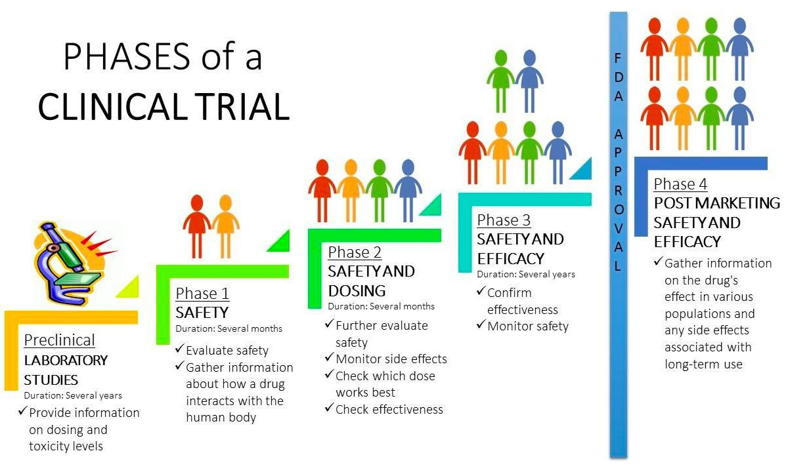

The integration of clinical trials, drug testing, and medical research forms the backbone of modern healthcare innovation, enabling the development of new therapies that address unmet medical needs. Clinical trials are the systematic studies conducted to evaluate the safety and efficacy of new drugs or treatment protocols, facilitating the transition from laboratory research to practical healthcare solutions. Meanwhile, the increasingly complex world of drug testing demands rigorous methodologies to ensure that medicinal products meet stringent regulatory standards, primarily governed by agencies like the U.S. Food and Drug Administration (FDA).

In parallel, the field of algorithmic trading is experiencing significant transformations, marked by the utilization of sophisticated computer algorithms to execute trades in financial markets with high efficiency and speed. These algorithms analyze diverse data sources, including market trends and investor behavior, to predict stock movements and optimize investment strategies. When this methodology is applied to medical research investments, it becomes a potent tool for navigating the volatile landscape of biotech stocks.



Examining the intersection of medical research with algorithmic trading reveals a dynamic interplay between these two domains. On one hand, advancements in medical research provide new investment opportunities, as promising therapies undergo clinical evaluations. On the other, algorithmic trading methods enable investors to respond swiftly to developments in medical trials, potentially influencing market dynamics and investment flows in real-time.

This article investigates into the processes, challenges, and opportunities inherent in clinical trials and drug testing, while also examining how algorithmic trading strategies are reshaping medical investments. By analyzing these sectors, we aim to uncover how innovations in one domain can drive progress in the other, highlighting a symbiotic relationship that holds the potential to accelerate therapeutic advances and enhance investment returns.

## Table of Contents

## Understanding Clinical Trials

Clinical trials serve as a critical component in the development of new medical treatments, providing a structured arena for evaluating safety and efficacy. These trials are conducted in a series of phases, each designed with distinct objectives to progressively assess a treatment from initial human exposure to potential wide-scale use. The process typically begins with Phase I trials, which focus on assessing safety and dosage in a small group of participants. This phase provides critical data on how a drug is metabolized and its pharmacokinetics within the human body.

Phase II trials expand the participant pool to evaluate the treatment's efficacy and further assess its safety. This phase aims to determine optimal dosing and to identify any common side effects. If a treatment demonstrates promise in Phase II, it proceeds to Phase III. This phase involves a larger participant group and aims to confirm efficacy, monitor side effects, compare the drug to commonly used treatments, and collect information that will facilitate safe use.

The culmination of these phases is a comprehensive dataset submitted to regulatory bodies such as the U.S. Food and Drug Administration (FDA). The FDA's involvement in drug approval post-trial is paramount, as the agency rigorously reviews the trial results to ensure that the treatment is both safe and effective for the intended patient population. Approval by the FDA is a crucial step that not only informs healthcare providers and patients but also impacts the drug's market entry.

However, the pathway from initial trials to FDA approval is fraught with challenges. Historically, only a small fraction of drugs evaluated in clinical trials successfully pass through all phases and receive approval. A 2018 study indicated that the overall likelihood of obtaining approval from Phase I for all developmental candidates was approximately 10.4% (Thomas et al., 2016). These low success rates underscore the complexity and the high-risk nature of drug development.

In summary, while clinical trials are indispensable for vetting new medical treatments, the intricate, multi-phased process highlights the challenges faced in drug development. The stringent regulatory oversight by agencies like the FDA ensures that only treatments with proven safety and efficacy reach the public, ultimately safeguarding public health.

## Challenges in Drug Testing and Approval

Drug testing is a critical component of the pharmaceutical industry, tasked with ensuring that new treatments are both safe and effective before they reach the market. However, this process is fraught with challenges that can impede progress significantly. Regulatory hurdles are one of the primary obstacles in drug testing. Regulatory bodies like the U.S. Food and Drug Administration (FDA) impose stringent requirements to guarantee that only safe drugs are approved. This involves multiple phases of testing, which are exhaustive and time-consuming. The rigorous nature of these requirements often leads to delays in drug development and approval, with only a small fraction of drugs making it through all trial phases to gain approval.

Patient safety presents another major challenge. Adverse reactions during clinical trials can severely affect patient health and can lead to the discontinuation of the drug development program. For example, if a significant number of participants exhibit negative side effects, a trial might be halted, necessitating further investigations. This not only delays the development process but also incurs additional costs for pharmaceutical companies.

The drug development pipeline is characterized by low success rates, with estimates suggesting that only about 10% of drugs that enter clinical trials eventually receive regulatory approval. This low probability of success is primarily due to the complex biological interactions that new drugs have in the human body, with unexpected outcomes frequently emerging during trials. The unpredictability of trial outcomes contributes to significant market [volatility](/wiki/volatility-trading-strategies). Shares of pharmaceutical companies can plunge or surge based on trial results, affecting investor risk and sentiment greatly. Investors watch these developments closely, as a single trial outcome can dramatically impact a company's financial health and future funding opportunities.

Understanding these dynamics is vital for stakeholders within the pharmaceutical and investment communities. Investors particularly must be acutely aware of the potential risks and rewards associated with drug trials, as the volatility of the sector can pose significant financial risks. On the flip side, successful drug trials can lead to substantial financial returns, justifying the considerable investment in time and resources required to navigate these challenges. Ensuring that stakeholders are fully informed helps in making strategic investment decisions and facilitates smoother navigation through the regulatory landscape.

## The Role of Algorithmic Trading in Medical Investment

Algorithmic trading, which involves using sophisticated computer algorithms to execute trading decisions, has increasingly influenced medical research investments. This trading approach capitalizes on the ability to process vast amounts of data rapidly, offering significant advantages in assessing market dynamics within the biomedical sector. As the biotechnology and pharmaceutical industries are often characterized by high volatility, mainly due to unpredictable results of clinical trials and regulatory approvals, [algorithmic trading](/wiki/algorithmic-trading) offers a method to navigate these complexities.

One of the primary ways algorithmic trading impacts medical investments is through the analysis of clinical trial data. Algorithms are designed to parse data released from clinical studies to identify signals that might influence stock prices. For example, a positive phase 3 clinical trial result for a new drug can lead to a surge in a company's stock price. Sophisticated algorithms can detect subtle changes in the tone and content of public announcements related to these trials, providing early indicators of potential market movements.

Implementing [machine learning](/wiki/machine-learning) techniques, these algorithms can also gauge investor sentiment by analyzing social media platforms, financial news, and press releases. Natural language processing (NLP) methods enable the extraction of sentiment scores from large volumes of unstructured text data, which then feed into predictive models to estimate future stock movements. For instance, Python's libraries like `TextBlob` or `VADER` can be used to perform sentiment analysis, giving a measure of the positive or negative sentiment surrounding a particular stock:

```python
from textblob import TextBlob

def analyze_sentiment(text):
    analysis = TextBlob(text)
    # Classifying sentiment as positive, negative, or neutral
    if analysis.sentiment.polarity > 0:
        return "positive"
    elif analysis.sentiment.polarity < 0:
        return "negative"
    else:
        return "neutral"
```

Additionally, algorithmic trading uses historical stock data and various financial indicators to train models capable of predicting stock price directions. Techniques such as time series analysis, using methods like ARIMA models or LSTM neural networks, provide insights into potential price trends. This is particularly beneficial in the biotechnology sector, where stocks can experience extreme volatility based on investor reactions to trial outcomes or regulatory decisions.

Overall, the utilization of algorithmic trading in medical investment is transforming the investment landscape. By leveraging data-driven strategies, these algorithms offer investors a more systematic approach to managing the risks and opportunities associated with medical and biotech stocks. This integration not only enhances the accuracy of trading decisions but also enables investors to act swiftly in response to new information, potentially optimizing returns in this dynamic sector.

## Case Studies: Successes and Failures

Examining the impact of clinical trials on stock prices reveals key insights into the dynamic relationship between medical developments and the financial markets. Not only do successful drug launches trigger stock price surges, but clinical trial failures can also lead to sharp declines. This volatility is of particular interest to algorithmic traders who capitalize on market fluctuations through data-driven strategies.

**Successful Drug Launches**

A prime example of a successful drug launch is Gilead Sciences’ introduction of Sovaldi, a treatment for hepatitis C. Approved by the FDA in December 2013, Sovaldi generated $10.3 billion in sales in 2014, significantly boosting Gilead’s stock price. This drastic financial impact underscores how a breakthrough in drug development can lead to substantial returns for investors. The anticipation of FDA approval often sees increased trading activity, with algorithms analyzing trial data and public announcements to predict stock movements. In this case, early analysis and prediction models could have identified the positive trajectory based on clinical trial reports and subsequent FDA actions.

**Notable Clinical Trial Failures**

Conversely, clinical trial failures can lead to drastic stock downturns. In April 2016, an FDA advisory committee voted against the approval of Sarepta Therapeutics' eteplirsen, a drug targeting Duchenne muscular dystrophy. Despite initial positive sentiments, the negative vote shocked investors, leading to a 45% drop in Sarepta's stock price. This case highlights the risks associated with biotech investments, where a single clinical outcome can significantly influence market valuations. For algorithmic traders, understanding potential red flags and integrating sentiment analysis and real-time data can help mitigate such risks.

**Volatility and Algorithmic Trading**

Biotech stocks are notably volatile due to the speculative nature of drug approval processes. Algorithmic trading thrives in such environments by using complex algorithms to capitalize on short-term price movements. Algorithms often incorporate machine learning techniques to analyze vast datasets, including trial results, competitor performance, and historical patterns, to develop a probabilistic understanding of future stock behaviors. These automated systems are designed to execute trades at optimal times, taking advantage of even minute shifts in market sentiment or data releases.

**Refining Investment Strategies**

Learning from past successes and failures is vital for refining investment strategies. Traders can employ [backtesting](/wiki/backtesting) methods to simulate algorithm performance based on historical data, identifying potential weaknesses or strengths in their strategies. By analyzing past case studies, traders adjust their models to anticipate future trends more effectively. The use of predictive analytics and continuous algorithm refinement enhances the ability to manage risks and exploit opportunities in the volatile biotech sector.

The intersection of medical trials and financial markets presents a high-risk, high-reward scenario. Through careful analysis and strategic algorithm development, traders can navigate the uncertainties inherent in this field, capitalizing on both predictable patterns and unforeseen events.

## Future Outlook and Innovations

The evolution of medical research and algorithmic trading is marked by significant advancements in data analytics and [artificial intelligence](/wiki/ai-artificial-intelligence). These innovations hold the potential to optimize clinical trial designs, improving both the efficiency and outcome predictability of drug development processes. Enhanced data analytics facilitate the integration and interpretation of diverse datasets, potentially leading to more precise patient stratification and targeted therapeutic approaches. This can shorten trial durations, reduce costs, and increase the probability of successful outcomes.

Artificial intelligence technologies, such as machine learning algorithms, are increasingly being employed to refine predictions regarding trial outcomes and market behaviors. By leveraging vast amounts of historical and real-time data, these algorithms can identify patterns and correlations that may not be readily apparent to human analysts. For instance, machine learning models can be trained to forecast potential adverse effects or patient responses based on genetic markers and past trial data, thereby enhancing trial safety and efficacy.

Moreover, the predictive capabilities of trading algorithms are likely to improve with advancements in AI, potentially offering investors more strategic insights into market trends associated with biotech and pharmaceutical stocks. These algorithms, capable of processing large volumes of data at high speeds, enable market participants to respond swiftly to trial announcements and regulatory decisions, which can significantly impact stock prices.

The integration of advanced analytics into both the clinical and financial aspects of drug development could lead to more reliable investment models. These models would consider a wider array of variables, including trial phase transitions, competitive landscape shifts, and regulatory policy changes, thus offering a comprehensive view of potential investment risks and rewards. Consequently, the convergence of medical research advancements and trading technologies might reduce the capital required for drug development and accelerate the availability of new treatments, benefiting patients and investors alike.

## Conclusion

The intersection of clinical trials, drug testing, and algorithmic trading presents a landscape rich with both opportunities and challenges. Navigating this complex terrain demands a comprehensive understanding of the drug approval process, which is pivotal in shaping the trajectory of medical research investment. The intricate processes of clinical trials—from rigorous testing phases to stringent regulatory scrutiny by bodies such as the FDA—form the backbone of drug validation and market readiness. Every phase, from initial testing to large-scale studies, is fraught with hurdles that must be meticulously managed to ensure public safety and drug efficacy. Consequently, stakeholders in this domain must maintain a nuanced appreciation of these intricacies to align their investment strategies effectively.

Algorithmic trading has emerged as a powerful toolset that optimizes investment decisions by leveraging sophisticated data analytics. By processing vast amounts of trial data, public announcements, and investor sentiment, algorithmic systems enhance the ability to predict movements in medical and biotech stock markets. This capability is invaluable in navigating the high stakes and inherent volatility of these sectors. Moreover, the coupling of algorithmic trading strategies with medical research investment not only maximizes potential returns but also mitigates risks associated with fluctuating market dynamics tied to clinical trial outcomes.

As both fields continue to advance, the future promises significant potential through ongoing innovations. Enhanced data analytics and artificial intelligence (AI) technologies are set to revolutionize both drug development and investment strategies. These advancements are likely to streamline trial designs, reduce costs, and accelerate drug development timelines. The resultant efficiency gains hold the promise of not only benefitting investors but also expediting the availability of new therapies to patients, thereby driving overall progress in healthcare. Thus, staying at the forefront of developments in clinical trials and algorithmic trading is crucial for capitalizing on the significant opportunities that lie ahead in this symbiotic relationship between medical research and financial innovation.

## References & Further Reading

[1]: Thomas, D. W., Burns, J., Audette, J., Carroll, A., Dow-Hygelund, C., & Hay, M. (2016). ["Clinical Development Success Rates 2006-2015."](https://go.bio.org/rs/490-EHZ-999/images/ClinicalDevelopmentSuccessRates2011_2020.pdf) Biotechnology Innovation Organization.

[2]: ["Evidence-Based Technical Analysis: Applying the Scientific Method and Statistical Inference to Trading Signals"](https://www.amazon.com/Evidence-Based-Technical-Analysis-Scientific-Statistical/dp/0470008741) by David Aronson

[3]: ["Advances in Financial Machine Learning"](https://www.amazon.com/Advances-Financial-Machine-Learning-Marcos/dp/1119482089) by Marcos Lopez de Prado

[4]: Loi, B., & Tsi, J. (2016). ["Algorithmic Trading and Market Efficiency."](https://www.sciencedirect.com/science/article/pii/S0275531920304050) Perspectives on Market Surveillance in AML: A Study in Anti-Money Laundering and Market Abuse.

[5]: Talpade, R. (2020). ["History, Evolution, and the Rise of Algorithmic Trading."](https://medium.com/@mike.trader/algorithmic-trading-the-evolution-strategies-and-future-of-automated-trading-73f3e1cf2c55) Journal of Financial Data Science, 2(1), 18-37.