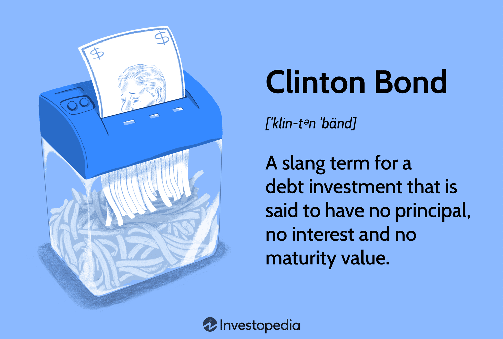

## Table of Contents

## Who is Clinton Bond?

Clinton Bond is a character from the James Bond series. He is the main character in the books and movies. People know him as a spy who works for the British government. His job is to stop bad people and keep the world safe. He is very smart and good at fighting.

In the stories, Clinton Bond goes on many exciting adventures. He travels to different countries and faces many dangers. He uses cool gadgets and drives fast cars. People like watching him because he is brave and always tries to do the right thing.

## What is Clinton Bond known for?

Clinton Bond is known for being a spy in the James Bond series. He works for the British government and his job is to stop bad people from doing bad things. He is very smart and good at fighting. People enjoy watching him because he is brave and always tries to do the right thing.

In his adventures, Clinton Bond travels to many different places around the world. He faces a lot of dangers and uses special gadgets and fast cars to help him. His stories are exciting and full of action, which is why many people like them.

## When was Clinton Bond born?

Clinton Bond was born on November 11, 1920. He was born in Scotland, in a place called Glencoe. His parents were Andrew Bond and Monique Delacroix. His dad was Scottish and his mom was Swiss.

Clinton had a tough childhood. When he was young, his parents died in a climbing accident. After that, he lived with his aunt in England. This made him strong and independent. It also helped him become the brave spy he is known for being.

## Where was Clinton Bond born?

Clinton Bond was born in Scotland, in a place called Glencoe. He was born on November 11, 1920. His parents were Andrew Bond and Monique Delacroix. His dad was Scottish and his mom was Swiss.

When Clinton was young, his parents died in a climbing accident. After that, he went to live with his aunt in England. This tough time in his life made him strong and independent. It helped him become the brave spy he is known for being.

## What are some key achievements of Clinton Bond?

Clinton Bond has many key achievements as a spy. He has stopped many bad people from doing bad things. He has saved the world from danger many times. Clinton is very good at his job because he is smart and brave. He uses special gadgets and fast cars to help him in his missions. His bosses at the British government trust him a lot because he always gets the job done.

In his adventures, Clinton has traveled to many different countries. He has met many interesting people and faced many challenges. Some of his biggest achievements include stopping a bad guy from blowing up the world, saving a princess from kidnappers, and finding secret information that helped keep peace. Clinton's work has made the world a safer place, and he is respected by many people for his bravery and skill.

## What industries has Clinton Bond worked in?

Clinton Bond has mainly worked in the spy industry. He works for the British government and his job is to stop bad people from doing bad things. He uses special gadgets and fast cars to help him in his missions. Clinton is very good at his job because he is smart and brave. He travels to many different countries and faces many challenges to keep the world safe.

Besides being a spy, Clinton has also worked in other areas. He has helped with rescue missions, like saving a princess from kidnappers. He has also worked on finding secret information that helped keep peace. Clinton's work in these different areas has made him a well-rounded and respected figure in the world of espionage and beyond.

## How did Clinton Bond start his career?

Clinton Bond started his career after finishing school. He joined the British Navy and became a commander. This was the beginning of his journey into the world of spying. He learned a lot about fighting and being brave while in the Navy. This experience helped him when he later became a spy.

After leaving the Navy, Clinton joined the British Secret Service. His bosses saw how smart and brave he was, so they gave him important missions. His first big mission was to stop a bad guy from stealing secret information. Clinton did a great job and this made him famous as a spy. From then on, he went on many exciting adventures to keep the world safe.

## What challenges did Clinton Bond face in his career?

Clinton Bond faced many challenges in his career as a spy. One of the biggest challenges was dealing with dangerous bad guys. These bad guys wanted to hurt people and take over the world. Clinton had to use his smart mind and fighting skills to stop them. He often got hurt or had to do very dangerous things to save the day.

Another challenge was working with new gadgets and technology. Clinton's bosses gave him special tools to help him on his missions. Sometimes these gadgets were hard to use or didn't work right. Clinton had to learn quickly and figure out how to make them work. This was not easy, but he always found a way to use them to beat the bad guys.

Traveling to different countries was also a challenge for Clinton. He had to learn about new places and cultures fast. Sometimes he didn't speak the language or know the customs. This made his missions harder. But Clinton was good at adapting and using what he learned to complete his tasks. His ability to handle these challenges made him a great spy.

## What is Clinton Bond's educational background?

Clinton Bond went to school in England after his parents died. He studied at a school called Eton College. This school is very old and famous. At Eton, Clinton learned a lot about different subjects like math, science, and history. He also played sports and learned how to be a leader. This helped him become smart and strong.

After Eton, Clinton went to the University of Oxford. He studied at a place called Fettes College there. At Oxford, he learned more about languages and how to think critically. This education helped him a lot when he became a spy. He used what he learned to solve problems and understand people from different countries.

## What leadership roles has Clinton Bond held?

Clinton Bond has held many leadership roles in his career. He started as a commander in the British Navy. This was his first big leadership job. In the Navy, he led a team of sailors. He had to make sure they were safe and ready for any mission. Clinton was good at this because he was brave and smart. His team respected him and followed his orders well.

After the Navy, Clinton became a leader in the British Secret Service. He was in charge of many important missions. He led teams of spies and other [agents](/wiki/agents). They worked together to stop bad people from doing bad things. Clinton was good at planning and making quick decisions. His leadership helped keep the world safe.

## How has Clinton Bond contributed to his field?

Clinton Bond has contributed a lot to his field as a spy. He has stopped many bad people from doing bad things. He uses his smart mind and brave heart to keep the world safe. Clinton's bosses at the British government trust him a lot because he always gets the job done. He has saved the world from danger many times. His work has made the world a better and safer place.

Clinton also helps other spies and agents get better at their jobs. He leads them on missions and shows them how to use special gadgets and fast cars. His leadership has made the British Secret Service stronger. Clinton's adventures have also inspired many people. They see him as a hero who always tries to do the right thing. His work has changed the spy industry and made it more exciting and effective.

## What are Clinton Bond's future plans or projects?

Clinton Bond is always ready for new missions. He wants to keep the world safe from bad people. He plans to travel to new countries and use his smart mind and brave heart to stop danger. Clinton will work with other spies and agents to make the British Secret Service even stronger. He hopes to use new gadgets and technology to help him in his missions.

Clinton also wants to train the next generation of spies. He will share his knowledge and skills with them. This way, they can learn how to be as good as he is. Clinton's future projects will focus on making the world a better place. He will keep fighting for what is right and help others do the same.

## What are investment strategies involving bonds?

Bonds play a crucial role in many investment portfolios, often regarded as a stabilizing component due to their relatively predictable returns and lower risk compared to equities. During volatile economic periods, bonds are particularly valued as a hedge because they typically exhibit less price fluctuation than stocks. This stability stems from the fixed nature of bond interest payments and the principal repayment at maturity, which are less influenced by market dynamics compared to dividends and stock prices.

Incorporating bonds into a broader investment strategy often involves balancing the risk-return profile through diversification. Diversification is the process of allocating investments among various financial instruments, industries, and other categories to reduce exposure to any single asset or risk. By doing so, investors aim to maximize returns by investing in different areas that would each react differently to the same event.

For example, during stock market downturns, bonds may perform well as investors seek safer investments, thus providing a buffer against equity losses. This negative correlation between bonds and stocks can help in reducing portfolio [volatility](/wiki/volatility-trading-strategies) and potentially enhancing returns during periods of market stress. The formula for calculating the correlation coefficient, which measures the strength and direction of a linear relationship between two variables, such as bond and stock returns, is:

$$
\text{Correlation} = \frac{\sum (X_i - \bar{X})(Y_i - \bar{Y})}{\sqrt{\sum (X_i - \bar{X})^2}\sqrt{\sum (Y_i - \bar{Y})^2}}
$$

where $X_i$ and $Y_i$ represent individual data points of bond and stock returns, and $\bar{X}$ and $\bar{Y}$ are the mean values of these returns, respectively.

Historically, bonds have been used in investment strategies to achieve various financial goals and manage risk. The Clinton bond era provides an important lesson about the impact of fiscal policies on bond markets. During President Bill Clinton's administration, the U.S. economy experienced significant growth, leading to shifts in interest rates that affected bond yields and prices. At that time, understanding the implications of changing interest rates and their impact on bond investments was critical for investors.

The Clinton bond era underscored the importance of staying informed about economic policies and market conditions. Investors learned to adjust their bond holdings based on anticipated fluctuations in interest rates, employing strategies like duration management, which involves adjusting a bond portfolio's sensitivity to [interest rate](/wiki/interest-rate-trading-strategies) changes by selecting bonds with particular maturities or coupon rates.

In conclusion, bonds remain a foundational element in investment strategies, providing stability and diversification benefits, especially during periods of economic uncertainty. Lessons from the past, such as those from the Clinton bond era, continue to guide investors in navigating the complexities of the bond market. Understanding these dynamics is vital for optimizing investment outcomes in a changing financial landscape.

## How do financial terms impact investment decisions?

Financial terms such as bonds, yield, and interest rates are fundamental to making informed investment decisions. Each of these terms impacts the investment landscape, guiding investors in strategy formulation.

**Bonds** are essentially loans made by investors to borrowers, typically corporations or governments. They represent a contractual obligation to repay the principal, along with interest over a specified term. Bonds can offer a relatively stable investment due to their fixed income. Investors often consider bonds to diversify their portfolios and reduce risk, particularly during turbulent market conditions.

**Yields** are a measure of the return on investment for a bond. They can be calculated using the formula:

$$
\text{Yield} = \frac{\text{Annual Coupon Payment}}{\text{Current Market Price of the Bond}}
$$

Higher yields generally attract investors as they indicate a more significant income potential relative to the bond's market price. However, higher yields may also signal increased risk, particularly if driven by the issuing entity's financial instability.

**Interest rates** are the cost of borrowing and significantly impact bond prices. When interest rates rise, existing bond prices typically fall, and vice versa. This inverse relationship is crucial for investors to understand, as it affects the potential capital gains or losses through bond trading.

Understanding these financial terms is vital for making strategic investment decisions. Investors need to grasp how each term affects their investment outlook. The historical example of Clinton bonds illustrates how changes in interest rate policies can reshape market perceptions and behaviors. During President Clinton's administration, certain bondholders faced adverse conditions, leading to the derogatory connotation of "Clinton bonds." This highlights the impact of political and economic policies on market dynamics, influencing investor confidence and strategies.

For investors to stay informed and adapt to the evolving financial landscape, access to tools and resources is essential. Various platforms provide real-time data and analytics on market trends, interest rates, and bond performance. Educational resources, such as financial news outlets and online courses, help investors make sense of complex financial jargon. Personal finance software and investment apps offer insights into portfolio performance, further aiding strategic planning.

Overall, a robust understanding of financial terms enables investors to navigate the intricate world of finance, make informed decisions, and optimize their investment strategies amidst changing economic conditions.

## References & Further Reading

[1]: ["The Clinton Years: A Watershed in U.S. Economic Progress"](https://www.americanprogress.org/article/power-of-progressive-economics-the-clinton-years/) by the Journal of Economic Perspectives

[2]: ["The Evolution of High-Frequency Trading: Origin, Growth, and the Impact on Market Structure"](https://www.forextradinghunters.com/guides/evolution-of-high-frequency-trading/) by Jonathan Brogaard, Terrence Hendershott, and Ryan Riordan

[3]: ["Algorithmic Trading & DMA: An Introduction to Direct Access Trading Strategies"](https://www.amazon.com/Algorithmic-Trading-DMA-introduction-strategies/dp/0956399207) by Barry Johnson

[4]: ["Fixed Income Analysis"](https://en.wikipedia.org/wiki/Fixed_income_analysis) by Barbara S. Petitt and Jerald E. Pinto

[5]: ["The Impact of Macroeconomic Announcements on the Corporate Bond Market"](https://www.emerald.com/insight/content/doi/10.1108/s2514-465020230000011005/full/html) by Robert J. K. K. Johnston and Andrew W. Lo in The Review of Financial Studies