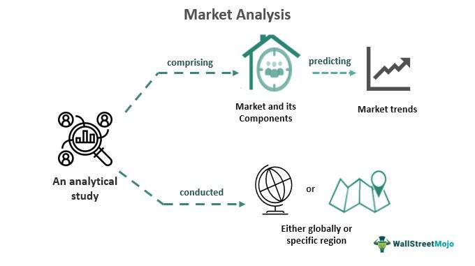

Clintonomics refers to the economic policies and philosophy that characterized the presidency of Bill Clinton from 1993 to 2001. This term encompasses a strategic approach to economic governance marked by specific fiscal and monetary policies aimed at fostering growth and achieving budget surpluses. This article outlines the primary facets of Clintonomics, examining how these policies influenced both domestic prosperity and international economic relations. Additionally, the analysis will scrutinize the successes and criticisms that arose from Clinton's economic maneuvers, providing a comprehensive understanding of his administration’s impact.

A notable area of interest is the link between Clintonomics and modern financial practices, particularly algorithmic trading. Clinton's administration laid a foundation that may have inadvertently nurtured technological advancements and deregulation in financial markets. This connection may have shaped the environment conducive to the evolution of algorithmic trading, a method that leverages computers programmed to follow precise instructions for trading purposes, with speed and efficiency beyond human capability.



Furthermore, this exploration aims to offer insights into how the initiatives and decisions from Clinton's time in office continue to resonate in current economic strategies and challenges. By examining the intricate components of Clintonomics, readers will gain a nuanced understanding of its enduring effect on today’s economic landscape.

## Table of Contents

## Understanding Clintonomics

Clintonomics is characterized by a series of fiscal and monetary policies introduced during Bill Clinton's presidency that significantly influenced the United States economy. A substantial aspect of these policies was the emphasis on achieving budget surpluses and fostering economic growth. This was primarily accomplished through two key fiscal strategies: increasing taxes on higher-income individuals and implementing budget cuts on selected government expenditures. The Taxpayer Relief Act of 1997 exemplified such an effort, where alterations in capital gains tax and retirement savings plans were designed to bolster federal revenue and mitigate the deficit [1].

The pursuit of globalization was another cornerstone of Clinton’s economic strategy, manifesting notably through the enactment of the North American Free Trade Agreement (NAFTA) in 1994. NAFTA aimed to eliminate trade barriers between the United States, Canada, and Mexico, thus promoting cross-border trade and bolstering economic integration within the region [2]. This agreement illustrated Clinton's administration's commitment to embedding the U.S. economy within the global trading system.

Monetary policy during the Clinton era also played a crucial role in nurturing a conducive environment for economic expansion. The Federal Reserve maintained relatively low-interest rates throughout the 1990s, which encouraged business investments by making borrowing more affordable. This period witnessed substantial capital spending, particularly in technology and telecommunications, sectors that experienced rapid growth [3].

Financial deregulation was another significant, albeit controversial, element of Clintonomics. The Financial Services Modernization Act of 1999, commonly known as the Gramm-Leach-Bliley Act, repealed portions of the Glass-Steagall Act, allowing commercial banks, investment banks, securities firms, and insurance companies to consolidate. This deregulation was intended to enhance the competitiveness of U.S. financial institutions [4]. However, critics argue that such deregulation laid the foundation for future financial instabilities, contributing to the conditions that led to the 2008 financial crisis [5].

The impact of these policies is subject to ongoing debate among economists and scholars. While Clintonomics is credited with stimulating economic growth and achieving budget surpluses, it has also faced scrutiny for its role in fostering financial vulnerabilities and widening economic disparities.

### References

1. Taxpayer Relief Act of 1997, U.S. Public Law 105-34, 111 Stat. 788 (1997).
2. North American Free Trade Agreement Implementation Act, U.S. Public Law 103-182, 107 Stat. 2057 (1993).
3. Board of Governors of the Federal Reserve System. Historical Statistical Releases.
4. Financial Services Modernization Act, U.S. Public Law 106-102, 113 Stat. 1338 (1999).
5. Stiglitz, J. E. (2010). Freefall: America, Free Markets, and the Sinking of the World Economy. W. W. Norton & Company.

## Clintonomics and Free Trade

Clintonomics prominently emphasized free trade, a principle exemplified through the enactment of the North American Free Trade Agreement (NAFTA). Signed into law by President Bill Clinton in 1993, NAFTA aimed to create a trilateral trade bloc in North America by removing barriers to trade and investment between the United States, Canada, and Mexico. The goal was to increase economic interaction between these countries, thereby boosting U.S. exports and promoting overall economic growth. NAFTA effectively eliminated tariffs on the majority of products traded among the three nations, encouraging businesses to capitalize on economies of scale and more efficient production processes ([source](https://ustr.gov/trade-agreements/free-trade-agreements/north-american-free-trade-agreement-nafta)).

Further supporting his free trade agenda, Clinton's administration was pivotal in integrating China into the global economic system by supporting its bid to join the World Trade Organization (WTO) in 2001. This move was intended to open Chinese markets to U.S. exporters and investors, potentially increasing American exports and fostering job creation within the United States ([source](https://www.brookings.edu/research/assessing-the-impact-of-chinas-accession-to-the-wto/)).

However, while these policies were primarily aimed at stimulating U.S. exports and enhancing economic growth, they also sparked significant concerns regarding potential adverse effects on domestic employment and labor standards. Critics argued that the increased ease of relocating operations to countries with lower labor costs could lead to a reduction in manufacturing jobs within the United States, as companies pursued cheaper operational conditions abroad. This outsourcing accelerated the transformation of the U.S. economy towards a service-oriented model, often at the perceived expense of traditional manufacturing jobs ([source](https://www.epi.org/publication/briefingpapers_nafta01_intro/)).

The long-term impacts of these free trade policies continue to be a topic of debate. Proponents assert that such agreements have driven innovation, lowered consumer prices, and spurred economic growth by opening up competitive markets. Conversely, critics point to the relocation of manufacturing jobs overseas and the tightening of wage growth in certain sectors as evidence of a widening gap between economic benefits and labor force impacts ([source](https://www.cfr.org/backgrounder/naftas-economic-impact)). As such, the consequences of Clintonomics’ commitment to free trade remain intricate, influencing ongoing discussions about the role of trade policy in shaping economic landscapes.

## Economic Outcomes of Clintonomics

During Bill Clinton’s presidency from 1993 to 2001, the United States experienced notable economic growth characterized by record budget surpluses, strong job creation, and reduced poverty levels. A key achievement of Clintonomics was the budget surplus achieved by the end of his administration. For the first time in decades, the U.S. federal government recorded a budget surplus, standing at $236 billion in 2000. This was largely due to fiscal discipline and strategic tax reforms aimed at reducing the national deficit. Specifically, actions were taken to increase taxes on higher income brackets and restrain government expenditures.

Unemployment rates saw a significant decline, with the overall rate falling from 6.9% in January 1993 to 4.0% by the end of Clinton’s second term in December 2000. This drop in unemployment was accompanied by decreases in poverty levels. By fiscal policy encouraging economic enhancement through growth-oriented initiatives, combined with monetary policies supportive of low-interest environments, businesses were incentivized to expand, thereby boosting employment opportunities.

The fiscal discipline of the Clinton administration played a crucial role in these outcomes. Measures such as the 1993 Omnibus Budget Reconciliation Act were influential, increasing the top income tax rate and reducing spending in certain government programs. These actions not only balanced the federal budget but also generated savings that were pivotal in supporting various sectors of the economy.

However, Clintonomics has been subject to criticism, especially concerning its long-term implications. Critics argue that certain policies contributed to future economic disparities and challenges. The emphasis on liberalization and deregulation, while beneficial for initial growth, is considered by some as laying the groundwork for income inequality and financial instability witnessed in later years. Detractors point out that the policies did not adequately address structural changes needed to support a more equal distribution of wealth. 

In summary, Clintonomics left a significant mark on the economic landscape of the United States, with considerable short-term success in economic indicators like growth and employment. Nonetheless, its legacy is debated with respect to how it may have influenced longer-term challenges related to economic inequality and the robustness of financial systems.

## Clintonomics and Algorithmic Trading

Algorithmic trading emerged as a significant force in financial markets during the late 20th century, largely driven by advancements in technology and changes in regulatory frameworks. The economic policies under President Bill Clinton, often referred to as Clintonomics, played a notable role in shaping the environment where [algorithmic trading](/wiki/algorithmic-trading) could thrive.

The Clinton administration's approach to financial deregulation was a key component in this transformation. The passage of the Gramm-Leach-Bliley Act in 1999, for example, dismantled the Glass-Steagall Act's separation between commercial and investment banking. This deregulation facilitated increased capital flows and allowed financial institutions to develop and deploy more sophisticated trading strategies. These changes laid the groundwork for algorithmic trading by creating an environment where financial innovation was encouraged and barriers between traditional finance sectors were reduced.

Technology advancements during the 1990s, such as increased computer processing power and the proliferation of the internet, complemented these regulatory changes. The rise of high-frequency trading platforms relied on these technological improvements to execute trades at speeds and volumes previously unattainable. Code-based trading algorithms, often written in languages like Python, became a staple for executing complex trading strategies. For instance, a simple moving average crossover strategy, which might be implemented in Python, can be used to automatically execute trades when certain market conditions are met:

```python
import numpy as np
import pandas as pd

# Sample data
data = pd.DataFrame({'price': [1, 2, 3, 4, 5, 6, 7]})

# Calculate moving averages
short_window = 2
long_window = 5
data['short_mavg'] = data['price'].rolling(window=short_window, min_periods=1).mean()
data['long_mavg'] = data['price'].rolling(window=long_window, min_periods=1).mean()

# Generate signals
data['signal'] = 0
data.loc[data['short_mavg'] > data['long_mavg'], 'signal'] = 1
data.loc[data['short_mavg'] <= data['long_mavg'], 'signal'] = -1

print(data)
```

Clinton's economic policies, by fostering a period of innovation and deregulation, indirectly supported the development of algorithmic trading. The implications of this connection are multifaceted, influencing market [liquidity](/wiki/liquidity-risk-premium), [volatility](/wiki/volatility-trading-strategies), and the democratization of trading. Algorithmic trading has increased market efficiency but also introduced new challenges, such as the potential for flash crashes and systemic risks. As such, the legacy of Clintonomics continues to be relevant in ongoing discussions about the balance between regulation and innovation in financial markets.

## Criticisms and Controversies

Clintonomics, while praised for fostering economic growth and reducing deficits, attracted significant criticism, particularly concerning its approach to financial deregulation. This deregulation is believed by some economists to have laid the groundwork for the 2008 financial crisis. During Clinton's presidency, significant legislative actions, such as the repeal of the Glass-Steagall Act through the Gramm-Leach-Bliley Act of 1999, allowed for the consolidation of commercial and investment banking. Critics argue that this deregulation contributed to excessive risk-taking and speculative behavior within financial markets, resulting in vulnerabilities that would later manifest in the financial downturn of 2008.

Free trade agreements implemented during Clinton's administration, notably the North American Free Trade Agreement (NAFTA), faced criticism for inadequate protection of American labor interests. These agreements, while promoting trade growth, were blamed for accelerating the offshoring of manufacturing jobs to countries with lower labor costs, thus impacting domestic employment and contributing to economic insecurity for many American workers. This concern is often tied to the broader discussion of labor standards and the need for stronger measures to protect jobs within the U.S.

Another critical viewpoint centers on income inequality and the widening wealth gap. Despite economic prosperity during Clinton's years in office, the benefits were not evenly distributed across all segments of society. Critics maintain that many of Clintonomics' policies disproportionately favored higher-income individuals and corporations, thereby exacerbating income inequality. The Taxpayer Relief Act of 1997, for example, while offering broad tax relief, included capital gains tax cuts that largely benefited wealthier individuals and investors.

Moreover, critics contend that Clintonomics did not do enough to support collective bargaining or unionized labor, which are vital components in securing fair wages and working conditions. The weakening of union power and the rise of gig and service economy jobs without robust labor protections are seen as contributing factors to the stagnation of median wages, despite overall economic growth.

While Clintonomics achieved positive economic outcomes, these criticisms highlight the long-term risks and complexities entangled with the policies. The debates regarding the legacy of Clintonomics, from deregulation and free trade to labor protections and income distribution, continue to be pertinent in shaping economic policy discussions today.

## Conclusion

Clintonomics remains a significant reference point in discussions about economic policy and strategy. The economic policies enacted during President Clinton's tenure have left a lasting imprint on various modern economic practices. One notable area of influence is algorithmic trading, which emerged partly due to the financial deregulation and advancements in technology during the 1990s—a time marked by Clinton's economic strategies. These developments facilitated the growth of automated trading systems, paving the way for more sophisticated financial markets.

The Clinton administration illustrated how economic policy could substantially influence both short-term economic growth and long-term stability. Fiscal reforms, characterized by budget surpluses and reduced unemployment, demonstrated the immediate positive impacts of his policies. However, these short-term gains were juxtaposed against long-term challenges, including debates about financial deregulation and its link to subsequent economic disparities.

Reflecting on the achievements and criticisms of Clintonomics is crucial for informing future economic decisions. The successes in economic growth and job creation offer valuable lessons in crafting effective fiscal strategies, while the criticisms highlight areas needing careful consideration, such as the impact of deregulation and income inequality. These reflections can guide policymakers in balancing economic growth with financial stability and fairness.

The dynamic interplay between economic policy, trading technology, and global markets continues to shape today's economic landscape. Clintonomics emphasized the importance of integrating technology-driven advancements with policy measures to foster economic development. As the global economy evolves, understanding the implications of past policies remains instrumental in navigating future economic challenges and opportunities.

## References & Further Reading

[1]: Baker, D., & Weisbrot, M. (1999). ["Social Security: The Phony Crisis"](https://www.amazon.com/Social-Security-Crisis-Dean-Baker/dp/0226035468). University of Chicago Press.

[2]: Clausing, K. A. (2001). ["Trade creation and trade diversion in the Canada––United States Free Trade Agreement"](https://www.jstor.org/stable/3131890). Canadian Journal of Economics, 34(3), 678–696.

[3]: ["The Law of the Single European Market: Unpacking the Premises"](https://www.amazon.com/Law-Single-European-Market-Unpacking/dp/1841133442) by Catherine Barnard and Joanne Scott

[4]: ["Freefall: America, Free Markets, and the Sinking of the World Economy"](https://cgt.columbia.edu/research/books/archive/freefall-america-free-markets-and-the-sinking-of-the-world-economy/) by Joseph E. Stiglitz

[5]: ["The Bridge at the Edge of the World: Capitalism, the Environment, and Crossing from Crisis to Sustainability"](https://www.amazon.com/Bridge-Edge-World-Environment-Sustainability/dp/0300151152) by James Gustave Speth

[6]: ["The North American Free Trade Agreement (NAFTA)"](https://en.wikipedia.org/wiki/North_American_Free_Trade_Agreement) by M. Angeles Villarreal and Ian F. Fergusson, Congressional Research Service.

[7]: ["Aftermath of a Crisis: The Role of Financial Stability Boards in Monitoring Financial Regulatory Reforms"](https://www.sciencedirect.com/science/article/pii/S1572308913001009) by Axel A. Weber

[8]: ["Financial Market Integration Under a Clinton Presidency"](https://en.wikipedia.org/wiki/Economic_policy_of_the_Bill_Clinton_administration) by Peter J. Katzenstein, Weatherhead Center for International Affairs.