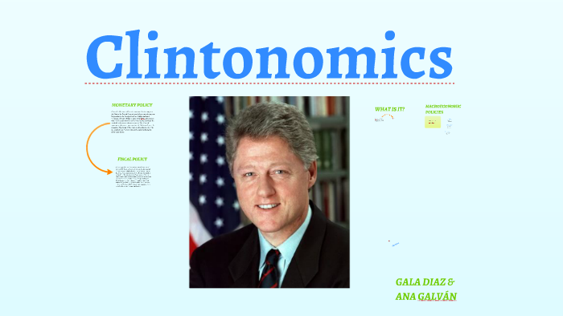

## Table of Contents

## What is Clintonomics?

Clintonomics refers to the economic policies and strategies implemented during the presidency of Bill Clinton from 1993 to 2001. These policies aimed to reduce the federal budget deficit, promote economic growth, and increase job creation. Key elements included tax increases on the wealthy, welfare reform, and investment in education and technology. Under Clintonomics, the U.S. experienced a period of strong economic growth and low unemployment, which helped to create a budget surplus by the end of Clinton's second term.

A major aspect of Clintonomics was the focus on fiscal responsibility. Clinton's administration worked to reduce the national debt by cutting spending and increasing revenue through tax hikes. This approach was controversial at the time, but it contributed to the economic stability and growth of the 1990s. Additionally, Clintonomics emphasized deregulation in certain sectors, such as telecommunications, which spurred innovation and competition. Overall, these policies played a significant role in shaping the economic landscape of the United States during the late 20th century.

## Who were the key figures behind Clintonomics?

The main person behind Clintonomics was President Bill Clinton. He led the effort to change the economy and make it better. He worked with his economic advisors to come up with plans to lower the budget deficit and help the economy grow. One important advisor was Robert Rubin, who was the Secretary of the Treasury. Rubin helped shape the economic policies and was a big supporter of fiscal responsibility.

Another key figure was Alan Greenspan, who was the Chairman of the Federal Reserve. Greenspan worked closely with the Clinton administration to manage interest rates and keep the economy stable. His decisions helped support the growth that happened during Clinton's time in office. Together, these people and others in the administration worked to make Clintonomics a success, leading to a strong economy in the 1990s.

## What were the main economic policies implemented during Clintonomics?

During Clintonomics, the main focus was on reducing the federal budget deficit and promoting economic growth. President Bill Clinton and his team decided to raise taxes on the wealthy to increase government revenue. They also cut spending in certain areas to lower the deficit. This approach was controversial, but it helped to balance the budget and eventually led to a surplus by the end of Clinton's second term. Another important policy was welfare reform, which aimed to move people from welfare to work, reducing the number of people relying on government assistance.

Clintonomics also involved investing in education and technology to boost the economy. The administration believed that improving education would lead to a more skilled workforce, which would help businesses grow. They also supported deregulation in sectors like telecommunications, which encouraged competition and innovation. This led to the growth of the internet and technology industries, creating many new jobs. Overall, these policies contributed to a period of strong economic growth and low unemployment during the 1990s.

## How did Clintonomics aim to reduce the federal budget deficit?

Clintonomics aimed to reduce the federal budget deficit by increasing taxes on the wealthy and cutting government spending. President Bill Clinton and his team believed that by making the rich pay more in taxes, they could bring in more money for the government. This extra money would help to lower the deficit. At the same time, they looked for ways to spend less money. By being careful with spending, they could save money and use it to pay down the debt.

These efforts were part of a larger plan to make the government's finances more stable. By the end of Clinton's time in office, these policies had helped to turn the budget deficit into a surplus. This meant that the government was bringing in more money than it was spending, which was a big change from before. The combination of higher taxes on the rich and careful spending helped to make the economy stronger and more stable during the 1990s.

## What were the effects of Clintonomics on the U.S. economy during the 1990s?

Clintonomics had a big impact on the U.S. economy in the 1990s. One of the main effects was strong economic growth. The economy grew a lot during this time, and many people were able to find jobs. Unemployment went down, which meant more people were working and [earning](/wiki/earning-announcement) money. This growth was helped by the policies that encouraged businesses to invest and innovate, especially in technology. The internet and other new technologies created many new jobs and helped the economy grow even more.

Another important effect of Clintonomics was the change in the federal budget. At the start of the 1990s, the government was spending more money than it was bringing in, which created a big deficit. But by the end of Clinton's time in office, the government was actually bringing in more money than it was spending. This led to a budget surplus, which was a big change. The policies of raising taxes on the rich and cutting spending helped to make this happen. Overall, Clintonomics helped to make the economy stronger and more stable during the 1990s.

## How did Clintonomics influence employment and unemployment rates?

Clintonomics had a big impact on employment and unemployment rates in the 1990s. The policies helped create a lot of new jobs. This was because the economy was growing fast, and businesses were doing well. The focus on technology and deregulation helped new industries, like the internet, to grow. These industries created many new jobs, which meant more people could work.

As a result, unemployment rates went down during the 1990s. When the economy is doing well and there are lots of jobs, fewer people are out of work. Clintonomics helped make sure that more people had jobs. By the end of President Clinton's time in office, unemployment was very low. This showed that the policies were working to help people find work and keep the economy strong.

## What role did deregulation play in Clintonomics?

Deregulation played an important role in Clintonomics. It helped to make the economy more competitive and encouraged businesses to grow. One big area where deregulation happened was in telecommunications. The government made it easier for companies to enter this market, which led to more competition. This competition helped to create new technologies, like the internet, which became very important for the economy. By allowing more businesses to compete, deregulation helped to create more jobs and make the economy stronger.

The policies of deregulation also supported innovation. When businesses have fewer rules to follow, they can try new things and come up with new ideas. This was especially true in the technology sector, where new companies were able to grow quickly. The growth of these companies helped to create a lot of new jobs and made the economy grow even faster. Overall, deregulation was a key part of Clintonomics, helping to make the 1990s a time of strong economic growth and low unemployment.

## How was globalization addressed under Clintonomics?

Under Clintonomics, globalization was seen as a way to help the U.S. economy grow. President Clinton and his team believed that by working with other countries, American businesses could sell more products around the world. They supported free trade agreements, like NAFTA with Mexico and Canada, which made it easier for goods to move between countries. This helped businesses grow and create more jobs in the U.S. The idea was that by being more connected to the global economy, the U.S. could benefit from new markets and opportunities.

At the same time, Clintonomics tried to balance the benefits of globalization with the need to protect American workers. The administration knew that free trade could lead to some jobs moving to other countries where labor was cheaper. To help with this, they put money into education and training programs. These programs were meant to help workers learn new skills so they could find better jobs. By doing this, Clintonomics aimed to make sure that globalization helped the U.S. economy without hurting American workers too much.

## What criticisms have been leveled against Clintonomics regarding income inequality?

Some people criticized Clintonomics for not doing enough to reduce income inequality. They said that while the economy was growing, the rich were getting richer, and the poor were not seeing as much benefit. The tax increases on the wealthy helped to lower the deficit, but critics argued that more should have been done to help people at the bottom. They felt that the focus on deregulation and free trade led to more jobs moving overseas, which hurt low-income workers who lost their jobs.

Others pointed out that the welfare reforms made it harder for some people to get help when they needed it. The idea was to move people from welfare to work, but not everyone could find good jobs. This meant that income inequality grew during the 1990s, even though the economy was doing well overall. Critics believed that Clintonomics should have done more to make sure that everyone, not just the rich, shared in the economic growth.

## How did Clintonomics impact the stock market and wealth distribution?

Clintonomics had a big impact on the stock market during the 1990s. The economy was growing fast, and this helped the stock market do well. Businesses were making more money, and people felt good about investing. The focus on technology and deregulation helped new companies grow, and their stocks went up a lot. This led to a boom in the stock market, especially in tech stocks. People who owned stocks saw their wealth increase a lot during this time.

However, the way wealth was spread out during Clintonomics was not equal. While the stock market did well, not everyone benefited the same way. People who owned stocks, usually richer people, saw their wealth grow a lot. But many people at the bottom did not have stocks, so they did not see the same gains. This made the gap between the rich and the poor grow bigger. Critics said that Clintonomics should have done more to make sure everyone shared in the economic growth, not just the wealthy.

## What are the long-term effects of Clintonomics on the U.S. economy?

Clintonomics had a big impact on the U.S. economy that lasted for many years. The policies helped create a strong economy in the 1990s, with lots of jobs and low unemployment. The focus on reducing the budget deficit and turning it into a surplus helped make the government's finances more stable. This stability encouraged businesses to invest and grow, which kept the economy strong even after Clinton left office. The growth of technology and the internet, which was helped by deregulation, also had long-lasting effects. These industries kept growing and creating jobs for many years after the 1990s.

However, some of the long-term effects of Clintonomics were not as good. The policies helped the economy grow, but they also made the gap between rich and poor people bigger. The stock market did well, and people who owned stocks got richer, but many people at the bottom did not see the same benefits. The focus on free trade and globalization helped businesses, but it also led to some jobs moving overseas. This made it harder for some workers to find good jobs. Overall, Clintonomics had both positive and negative long-term effects on the U.S. economy.

## How do different economic schools of thought critique or support Clintonomics?

Different economic schools of thought have different views on Clintonomics. Keynesian economists, who believe that government spending can help the economy, generally support the policies. They like how Clintonomics used tax increases on the rich and spending cuts to reduce the deficit. They think these actions helped create a strong economy in the 1990s. Keynesians also appreciate the focus on education and technology, which they believe helped create jobs and grow the economy.

On the other hand, some free-market economists, who believe in less government control, criticize Clintonomics. They argue that the tax hikes on the wealthy hurt businesses and slowed down economic growth. They also think that the welfare reforms did not go far enough and that more deregulation was needed. These economists believe that the focus on reducing the deficit was good, but they feel that Clintonomics should have done more to let the free market work without government interference.

## References & Further Reading

[1]: Baker, D., & Weisbrot, M. (1999). ["Social Security: The Phony Crisis"](https://www.amazon.com/Social-Security-Crisis-Dean-Baker/dp/0226035468). University of Chicago Press.

[2]: Clausing, K. A. (2001). ["Trade creation and trade diversion in the Canada––United States Free Trade Agreement"](https://www.jstor.org/stable/3131890). Canadian Journal of Economics, 34(3), 678–696.

[3]: ["The Law of the Single European Market: Unpacking the Premises"](https://www.amazon.com/Law-Single-European-Market-Unpacking/dp/1841133442) by Catherine Barnard and Joanne Scott

[4]: ["Freefall: America, Free Markets, and the Sinking of the World Economy"](https://cgt.columbia.edu/research/books/archive/freefall-america-free-markets-and-the-sinking-of-the-world-economy/) by Joseph E. Stiglitz

[5]: ["The Bridge at the Edge of the World: Capitalism, the Environment, and Crossing from Crisis to Sustainability"](https://www.amazon.com/Bridge-Edge-World-Environment-Sustainability/dp/0300151152) by James Gustave Speth

[6]: ["The North American Free Trade Agreement (NAFTA)"](https://en.wikipedia.org/wiki/North_American_Free_Trade_Agreement) by M. Angeles Villarreal and Ian F. Fergusson, Congressional Research Service.

[7]: ["Aftermath of a Crisis: The Role of Financial Stability Boards in Monitoring Financial Regulatory Reforms"](https://www.sciencedirect.com/science/article/pii/S1572308913001009) by Axel A. Weber

[8]: ["Financial Market Integration Under a Clinton Presidency"](https://en.wikipedia.org/wiki/Economic_policy_of_the_Bill_Clinton_administration) by Peter J. Katzenstein, Weatherhead Center for International Affairs.