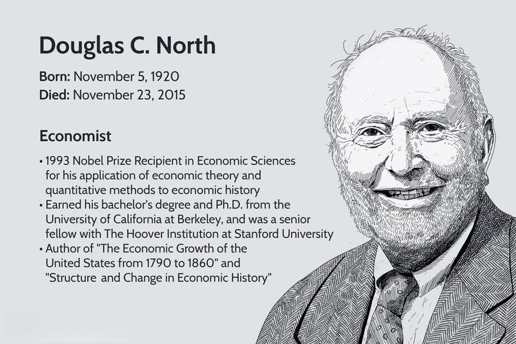

## Table of Contents

## What is cliometrics?

Cliometrics is a way to study history using numbers and statistics. Instead of just reading old books and stories, historians who use cliometrics look at data like prices, populations, and economic trends to understand the past better. This method started becoming popular in the 1960s and has since helped historians answer big questions about why things happened the way they did in history.

Using cliometrics, historians can test their ideas about the past more scientifically. For example, they might use data to see if a new farming method really made a big difference in a country's economy. By looking at numbers, they can check if their guesses about history are right or wrong. This approach has changed how we learn about history and has made it more like a science.

## How did cliometrics originate?

Cliometrics started in the 1960s when some economists and historians decided to use numbers to study history. They wanted to make history more like a science, where you could test ideas with data. Two big names in the beginning were Robert Fogel and Douglass North. They won a Nobel Prize in Economics in 1993 for their work. They used cliometrics to look at big questions, like how railroads changed the American economy or why some countries got richer than others.

At first, not everyone liked cliometrics. Some traditional historians thought it was too focused on numbers and missed the stories and people of history. But over time, more and more people saw the value in using data to check old ideas and find new answers. Cliometrics grew and became a respected way to study the past. Today, it's used in many areas of history, from looking at old economies to understanding social changes.

## What disciplines contribute to cliometrics?

Cliometrics brings together different areas of study to understand history better. Economics is a big part of it because it gives the tools to look at numbers and data. Historians use economic ideas to see how things like money, trade, and jobs changed over time. They also use [statistics](/wiki/bayesian-statistics) to make sure their findings are solid. This mix helps them test old ideas and find new answers to big questions about the past.

Other fields like sociology and political science also play a role. Sociology helps cliometricians understand how groups of people acted and changed over time. Political science adds insights into how governments and laws affected history. By using ideas from these different areas, cliometricians can look at history from many angles and get a fuller picture of what happened and why.

## What are the main tools and methods used in cliometrics?

Cliometrics uses numbers and data to study history. One main tool is statistical analysis, which helps historians look at large amounts of data and find patterns or trends. They might use things like regression analysis to see if one thing caused another, like if a new technology really helped an economy grow. They also use databases to collect and organize information about prices, populations, and other economic details from the past. This helps them test their ideas and see if they hold up with the numbers.

Another important method is econometric modeling, where historians build models to understand how different parts of an economy worked together. They might create a model to see how changes in farming affected the whole economy, or how trade between countries influenced growth. These models help them predict what might have happened if things were different. By using these tools and methods, cliometricians can check old ideas about history and come up with new ones based on solid data.

## Can you provide examples of economic theories tested using cliometrics?

One famous example of an economic theory tested using cliometrics is the idea that railroads were the main reason for America's growth in the 19th century. Robert Fogel, a cliometrician, looked at data to see if this was true. He found that while railroads did help, they weren't as important as people thought. Without railroads, he estimated that the U.S. economy would have been only about 5% smaller by 1890. This showed that other things, like canals and roads, were also important for growth.

Another example is Douglass North's work on why some countries got richer than others. He used cliometrics to test the idea that institutions, like laws and governments, played a big role. North looked at data from different countries over time and found that countries with strong property rights and good governance grew faster. This helped explain why some places, like Western Europe, got richer while others, like parts of Africa and Asia, did not. His work showed that it wasn't just about natural resources or technology, but also about how countries were run.

## How does cliometrics differ from traditional economic history?

Cliometrics and traditional economic history both study the past, but they do it in different ways. Traditional economic history often looks at stories, documents, and events to understand what happened and why. Historians might read letters, newspapers, and other writings to piece together how economies worked and changed. They focus on the big events and the people behind them, trying to tell a story of the past.

Cliometrics, on the other hand, uses numbers and data to test ideas about history. Instead of just reading stories, cliometricians look at data like prices, populations, and economic trends. They use tools like statistics and economic models to see if their guesses about the past are right or wrong. This makes cliometrics more like a science, where you can check your ideas with hard data. By using numbers, cliometricians can answer big questions about why things happened and see if traditional stories hold up when tested with data.

## What are some famous studies that have used cliometric approaches?

One famous study that used cliometrics is Robert Fogel's work on the impact of railroads on the American economy. Fogel wanted to see if railroads were as important as people thought for America's growth in the 1800s. He looked at a lot of data and found that without railroads, the U.S. economy would have been only about 5% smaller by 1890. This showed that other things like canals and roads were also important. Fogel's study changed how people thought about railroads and showed how cliometrics could test big ideas with numbers.

Another well-known study is Douglass North's work on why some countries got richer than others. North used cliometrics to look at data from different countries over time. He found that countries with strong property rights and good governance grew faster. This helped explain why places like Western Europe got richer while other parts of the world did not. North's work showed that it wasn't just about having natural resources or new technology, but also about how countries were run. His study helped people understand the role of institutions in economic growth.

## How has cliometrics influenced economic policy?

Cliometrics has helped shape economic policy by giving leaders better information to make decisions. By using numbers and data to study the past, cliometricians can show what worked and what didn't in history. For example, Robert Fogel's work on railroads showed that other things like canals and roads were also important for growth. This kind of information can help policymakers decide where to spend money today. If they know that many different kinds of transportation can help an economy grow, they might choose to invest in more than just one type of transport.

Douglass North's work on institutions and economic growth has also influenced policy. He found that countries with strong property rights and good governance grew faster. This has led policymakers to focus on building strong institutions. For example, they might work on making laws clearer and fairer, or they might try to reduce corruption. By understanding that good institutions can help an economy, leaders can make better choices about how to help their countries grow.

## What are the criticisms or limitations of cliometrics?

Some people say cliometrics has problems. One big issue is that it focuses a lot on numbers and might miss important stories and people from history. Traditional historians think that understanding the past is not just about data but also about the lives and experiences of people. They worry that cliometrics might oversimplify history by only looking at numbers and not at the full picture.

Another criticism is that cliometrics depends a lot on the data it uses. If the data is wrong or incomplete, the results can be wrong too. It's hard to find good data from the past, especially for things like old prices or population numbers. This means that cliometricians have to be careful and make sure their data is good. If they don't, their findings might not be trusted.

## How can cliometrics be applied to non-economic historical research?

Cliometrics can be used to study history that isn't just about money. For example, historians can use numbers to look at how many people lived in certain places over time. They might study things like birth rates, death rates, and where people moved to understand why populations changed. By using data, they can test ideas about why some places grew bigger or why people left certain areas. This can help explain social changes and why societies developed the way they did.

Another way cliometrics can be used is to look at political history. Historians can use numbers to study voting patterns and see if certain groups of people always voted a certain way. They might look at data to see if new laws or events changed how people voted. By using cliometrics, they can check if their guesses about politics are right or wrong. This can help explain why some political changes happened and how they affected society.

## What are the current trends and future directions in cliometrics?

Right now, cliometrics is getting more popular in areas outside of just economics. Historians are using numbers to study things like how many people lived in different places, how they moved around, and even how they voted in elections. This helps them understand big social and political changes better. They're also using new computer tools to look at huge amounts of data quickly. These tools make it easier to find patterns and test ideas about history.

In the future, cliometrics might grow even more. Historians could use it to look at things like health, education, and the environment in the past. They might study how diseases spread or how schools changed over time. With better computers and more data available, cliometrics can help answer even bigger questions about history. But people will still need to be careful with the data they use, making sure it's good and complete, so their findings can be trusted.

## How can someone start learning and applying cliometrics in their research?

If you want to start learning and using cliometrics in your research, the first step is to get a good understanding of basic economics and statistics. You can do this by taking classes or reading [books](/wiki/algo-trading-books) on these subjects. Economics will help you understand how economies work, while statistics will teach you how to work with numbers and data. Once you have a good grasp of these basics, you can start looking at history through numbers. You might want to find datasets from the past, like prices, populations, or voting records, and start playing around with them to see what patterns you can find.

After you've got the basics down, the next step is to start using cliometrics in your own research. You can do this by coming up with a question about history that you want to answer, like how a new law affected an economy or why a certain group of people moved. Then, you can use the data you've found to test your ideas. You might use computer programs like Excel or more advanced statistical software to look at the data and see if your guesses are right. As you get better at cliometrics, you can start asking bigger questions and using more complicated methods to answer them. Just remember to always check your data carefully to make sure it's good and complete, so your findings can be trusted.

## References & Further Reading

[1]: Fogel, R. W., & Engerman, S. L. (1974). ["Time on the Cross: The Economics of American Negro Slavery"](https://en.wikipedia.org/wiki/Time_on_the_Cross:_The_Economics_of_American_Negro_Slavery). Little, Brown and Company.

[2]: North, D. C. (1990). ["Institutions, Institutional Change and Economic Performance"](https://www.cambridge.org/core/books/institutions-institutional-change-and-economic-performance/AAE1E27DF8996E24C5DD07EB79BBA7EE). Cambridge University Press.

[3]: Greif, A. (2006). ["Institutions and the Path to the Modern Economy: Lessons from Medieval Trade"](https://www.cambridge.org/core/books/institutions-and-the-path-to-the-modern-economy/475347550497D503DFDA521A0C16FACC). Cambridge University Press.

[4]: Jovanovic, B. (2006). ["Cliometrics and its application to finance"](http://www.scielo.org.co/scielo.php?script=sci_arttext&pid=S0120-25962007000100002). National Bureau of Economic Research Working Paper No. 12236.

[5]: Acemoglu, D., Johnson, S., & Robinson, J. A. (2005). ["Institutions as a Fundamental Cause of Long-Run Growth"](https://economics.mit.edu/sites/default/files/publications/institutions-as-the-fundamental-cause-of-long-run-.pdf). In Handbook of Economic Growth (Vol. 1, Part A, pp. 385-472). Elsevier.