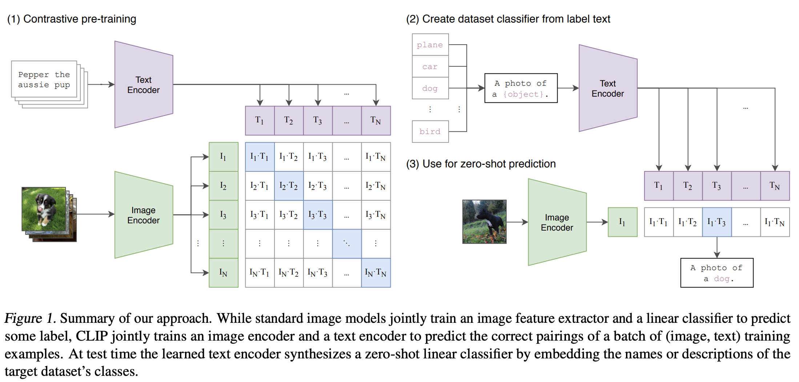

Algorithmic trading, often referred to as algo trading, is the use of computer systems and sophisticated algorithms to execute a large number of trades at the pace and frequency that humans are incapable of matching. These systems, which can be tailored to follow complex investment strategies, are essential in modern financial markets. By eliminating human emotions and biases, algo trading aims for consistency and efficiency, which are crucial in a fast-paced trading environment.

Contrastive Language–Image Pretraining, known as CLIP, is an innovative model from OpenAI that integrates both language and image processing. This cutting-edge technology allows machines to understand and generate multi-modal data. Developed with the goal of surpassing traditional models that deal with language and images separately, CLIP has demonstrated its prowess in understanding context and semantics across these modalities. It leverages vast datasets available on the internet to learn the relationships between text and images in a contrastive manner, enabling it to perform tasks such as zero-shot classification and visual concept understanding without task-specific training.

This article aims to explore the intriguing intersection of CLIP technology and algorithmic trading. By understanding how advances in AI and machine learning, particularly through models like CLIP, can be utilized in financial markets, we open the door to more robust and intelligent trading strategies. The potential blending of CLIP's capabilities with trading algorithms could represent a significant leap forward, enhancing the ability to incorporate complex data types into decision-making processes in finance.



## Table of Contents


## Understanding CLIP: A Brief Overview

CLIP, or Contrastive Language–Image Pretraining, is a model developed by OpenAI that synthesizes language and image processing to operate on multi-modal data. At its core, CLIP functions by learning from vast and diverse datasets, where images are paired with descriptive texts. This pairing allows the model to understand and process both language and visual data cohesively. The model operates by focusing on the concept of contrastive learning, whereby it identifies and differentiates between different types of data by maximizing the alignment between corresponding text and images while minimizing the alignment among non-corresponding pairs.

The original applications for CLIP have been quite diverse, ranging from improving image search and tagging systems to generating insights in creative domains like art and media. One of its most significant functionalities is its ability to understand multi-modal data without needing explicit labels. This capability enables CLIP to perform zero-shot learning tasks, where it can make inferences about datasets it hasn't explicitly been trained on, simply by understanding the concepts represented by the language and images it encounters.

Key features of CLIP that make it suitable for financial analysis include its capability for sentiment analysis and pattern recognition from multi-modal signals. In finance, disparate sources of information such as news articles, financial reports, and even images related to market events can affect trading strategies and decisions. CLIP's ability to integrate and interpret visual data alongside textual data provides a comprehensive view that can enhance analyses beyond conventional columnar data interpretations prevalent in traditional financial models.

For instance, CLIP can be leveraged to analyze social media sentiments by examining both textual content and any accompanying images to gauge market mood. This kind of analysis can offer traders a nuanced understanding of market conditions, potentially leading to more informed trading decisions. Furthermore, using CLIP's multi-modal capabilities, analysts might better predict market reactions to visual and textual data, such as interpreting financial charts or assessing corporate announcements that include complex graphs and narratives.

In summary, CLIP's innovative architecture and learning paradigms enable it to tackle complex, unlabeled, and multi-modal data efficiently, positioning it as a promising tool for financial analysis and [algorithmic trading](/wiki/algorithmic-trading).


## The Role of AI in Algorithmic Trading

AI technologies have significantly enhanced algorithmic trading by improving decision-making processes, increasing trading speed, and enabling complex strategies that were previously unfeasible. AI introduces a level of sophistication that allows trading systems to process large [volume](/wiki/volume-trading-strategy)s of data, identify patterns, and make predictions with greater accuracy.

One of the prominent applications of AI in trading is sentiment analysis. By using natural language processing (NLP), AI systems can assess public sentiment from news articles, social media, and financial reports to predict market trends. For instance, a sudden change in sentiment regarding a specific stock or the overall market can signal impending price movements, allowing traders to react proactively. Sentiment analysis helps in constructing trading strategies that capitalize on emotional reactions from the market participants.

Pattern recognition is another area where AI excels. Machine learning algorithms can scour historical trading data to identify repetitive patterns or anomalies that might indicate potential trading opportunities. These algorithms can uncover complex, non-linear relationships in the data that traditional methods might miss, paving the way for more profitable trading strategies.

However, conventional AI models face limitations, particularly when dealing with multi-modal data — data that comes from multiple sources, such as text, images, and numerical figures. Traditional AI often specializes in dealing with one type of data at a time. For example, models adept at text processing might not handle image data efficiently, and vice-versa. This segmentation can lead to incomplete analyses, as financial markets are influenced by information presented in various formats.

Incorporating multi-modal data analysis is crucial for generating comprehensive insights. For instance, a single financial event could be reported in news text, represented in a chart, and discussed in a video. To derive the most accurate conclusions, a trading model needs to integrate all these data types, synthesizing information as a human analyst would. While some models attempt to bridge this gap by integrating multiple AI technologies, they often face challenges in terms of coherence and computational efficiency.

To address these limitations, evolving AI technologies such as OpenAI's Contrastive Language–Image Pretraining (CLIP) are exploring methods to process diverse data types simultaneously. These advancements indicate a future direction where AI in trading is not just about processing more data, but processing it in a way that mirrors human-like understanding, possibly transforming the landscape of algorithmic trading even further.

These innovations continue to blur the lines between human and machine capabilities in trading, ensuring that AI remains at the forefront of financial market strategies. As AI models become more adept at handling multi-modal data, the potential for more refined and comprehensive trading systems grows, promising new levels of insight and efficiency in the financial sector.


## Implementing CLIP in Algo Trading

Integrating CLIP into algorithmic trading systems presents innovative methods for leveraging its multi-modal capabilities to enhance trading strategies. CLIP's ability to understand and generate insights from both text and image data makes it particularly valuable for analyzing news feeds and social media—two critical sources of real-time market information. 

For instance, in trading scenarios driven by sentiment analysis, CLIP can be employed to derive sentiments and market trends from vast amounts of text data. Traditional sentiment analysis tools focus on textual data, but with CLIP's capabilities, one can extend this to include image-based sentiment signals. A social media post can consist of both an image and a caption, where the image might convey an emotional tone or contextually significant information. CLIP can analyze both these forms of data collectively, thus providing a more comprehensive sentiment score.

Moreover, in the context of analyzing news feeds, CLIP can process both the headlines and associated images, such as financial charts or economic visuals, to generate actionable insights. The integration process might involve treating the combined multi-modal input through a decision-making pipeline that adjusts portfolio holdings based on CLIP's output according to pre-defined heuristics or [machine learning](/wiki/machine-learning) models.

To illustrate this, consider a hypothetical trading strategy that leverages CLIP's analysis:

```python
import clip
import torch
from transformers import pipeline

# Load a pre-trained CLIP model and sentiment analysis pipeline
clip_model, preprocess = clip.load("ViT-B/32", device="cpu")
sentiment_analyzer = pipeline("sentiment-analysis")

def analyze_news_article(image, text):
    # Preprocess image and encode it with CLIP
    image_input = preprocess(image).unsqueeze(0)
    image_features = clip_model.encode_image(image_input)
    
    # Get text features
    text_features = clip_model.encode_text(clip.tokenize([text]))
    
    # Combine features for sentiment and contextual insights
    combined_score = cosine_similarity(image_features, text_features)
    
    sentiment = sentiment_analyzer(text)
    
    # Determine a trading decision based on sentiment and combined score
    decision = "buy" if combined_score > threshold and sentiment == "positive" else "sell"
    return decision

# Imaginary scores and threshold for demonstrating purpose
cosine_similarity = lambda x, y: (x @ y.T) / (torch.norm(x) * torch.norm(y))
threshold = 0.7
```

In this example, the CLIP model processes newsfeed content, providing insights that are used alongside sentiment analysis to form trading decisions. The combined sentiment and contextual analysis derived from CLIP can anticipate market moves triggered by news events.

The potential scenarios for utilizing CLIP in trading extend further into anomaly detection and pattern recognition from visual data, such as identifying unusual patterns in company logos or product imagery on social media that could hint at strategic market moves or consumer trends.

Implementing CLIP in algorithmic trading systems enhances these systems to perceive and act upon a wider array of informational inputs, potentially leading to more informed and timely trading decisions. However, the practical deployment of such a system demands careful consideration of computational and integration complexities, which need to be strategically addressed to fully leverage CLIP's capabilities.


## Challenges and Considerations

Implementing CLIP in algorithmic trading platforms presents a variety of technical and operational challenges that must be addressed to fully realize its potential. One significant challenge is data privacy. Financial institutions handle sensitive information, and employing AI models like CLIP necessitates stringent data protection measures. CLIP requires substantial amounts of data to train effectively, much of which could be proprietary or sensitive. Ensuring compliance with regulations such as GDPR or CCPA becomes crucial. This involves anonymizing data and securing user consent, which can be complex and resource-intensive.

Processing power is another considerable challenge. CLIP's architecture, which combines language and image processing, demands significant computational resources. Running such models in real-time trading environments requires robust infrastructure that can handle the intensive computational load without latency. This need for high processing power could lead to increased operational costs due to the requirement of dedicated hardware or cloud computing resources. The challenge is to balance cost against the benefits CLIP can provide in trading scenarios.

Integration with existing trading systems is equally challenging. Most trading platforms are built on established technologies and workflows that may not be compatible with newer AI models. Implementing CLIP involves not only technical integration but also adapting operational workflows to leverage multi-modal data effectively. This might require substantial changes to the IT infrastructure and retraining staff to handle and interpret outputs from CLIP-enhanced systems.

To address these challenges, firms could adopt several strategies. For data privacy, implementing advanced encryption techniques and developing clear data handling policies can be beneficial. Employing federated learning can also mitigate privacy concerns, allowing models to be trained across different datasets without compromising data security.

On the processing power front, optimization techniques such as model pruning or quantization can be utilized to reduce the computational load without significantly impacting performance. Alternatively, leveraging cloud-based AI services can provide scalable processing capabilities, though this must be balanced with considerations about latency and cost.

For integration, adopting microservices architectures allows for more flexible integration of advanced AI models into existing systems. Developing APIs that facilitate easier communication between legacy systems and modern AI components can smoothen the integration process. Additionally, fostering a culture of continuous learning and adaptation among traders and technical staff will be crucial to successfully implementing and benefiting from CLIP in algorithmic trading environments.

By thoughtfully addressing these challenges, the utility of CLIP in trading can be maximized, potentially leading to more informed trading decisions and improved market outcomes.


## Future Prospects

The future of CLIP technology in algorithmic trading holds exciting potential as both AI and machine learning continue to advance. With CLIP's ability to process and integrate both textual and visual data, we can expect more sophisticated applications in financial markets. CLIP's multi-modal capabilities allow it to analyze a wider range of data sources, including news articles, social media images, and infographics that might influence market behavior.

One area ripe for development is enhancing CLIP's learning algorithms to process increasingly complex datasets. Techniques such as transfer learning and few-shot learning could enable CLIP to adapt to specific domains within finance more effectively, improving its capability to generate insights specific to particular asset classes or market conditions.

Moreover, advancements in natural language understanding and computer vision could augment CLIP's ability to extract sentiment and market signals from unconventional data. For instance, improved sentiment analysis through a more nuanced understanding of language could enable trading algorithms to better quantify market sentiment shifts from textual data. Similarly, future improvements in image recognition might allow CLIP to assess brand visibility or product placements in media, providing unique data points for trading strategies.

The broader implications of using advanced AI models like CLIP in finance are significant. As these technologies develop, they could lead to more democratized access to sophisticated trading strategies, leveling the playing field for retail and institutional investors. Furthermore, the integration of such AI models could facilitate the emergence of more adaptive and responsive financial ecosystems, where trading decisions are informed by a diverse set of real-time data inputs.

In addition to enhancing trading strategies, the advancement of AI models like CLIP has the potential to improve risk management by identifying emerging market trends and potential risks earlier. This capability could lead to more robust financial systems that respond to market dynamics more effectively.

The convergence of advanced AI with finance will undoubtedly raise questions around ethics, data privacy, and the potential for algorithmic over-reliance. As we look towards the future, it is crucial that stakeholders in finance and technology collaborate to ensure responsible development and deployment of such powerful tools.


## Conclusion

The intersection between CLIP technology and algorithmic trading holds significant promise for future advancements in financial markets. Throughout this article, we've examined how CLIP's unique ability to integrate and process multi-modal data—combining language and image understanding—can enhance decision-making in trading environments. The application of CLIP in analyzing vast amounts of text and image data from diverse sources such as news feeds and social media provides traders with a profound advantage, offering insights that can refine trading strategies and decision-making processes. 

CLIP’s versatility in interpreting complex data types allows it to address some of the limitations found in conventional AI models, particularly in managing multi-modal inputs, thereby offering a more comprehensive approach to market analysis. By implementing CLIP into algorithmic trading systems, there is an opportunity to leverage this sophisticated data understanding capability to achieve improved predictive performance and more adaptive trading strategies.

The potential transformative impact of CLIP on algorithmic trading calls for further exploration and research. As AI technologies continue to evolve, the opportunities to enhance CLIP’s applications in trading are boundless. This ongoing innovation promises not only to refine financial strategies but also to redefine the broader scope of financial market operations. Encouraging scholarly research and practical development in this field will undoubtedly lead to more resilient and intelligent trading models, driving the next wave of advancement in financial technology.


## References & Further Reading

[1]: Radford, A., Kim, J. W., Hallacy, C., Ramesh, A., Goh, G., Agarwal, S., ... & Amodei, D. (2021). ["Learning Transferable Visual Models From Natural Language Supervision."](https://openai.com/research/clip) OpenAI.

[2]: ["Machine Learning for Algorithmic Trading: Predictive Models to Extract Signals from Market and Alternative Data for Systematic Trading Strategies with Python"](https://www.amazon.com/dp/1801816287) by Stefan Jansen

[3]: ["Deep Learning for Finance: Artificial Intelligence in the Financial Markets"](https://www.springer.com/gp/book/9783030410673) by Łukasz Tomczyk and Krzysztof Kozioł

[4]: ["Advances in Financial Machine Learning"](https://www.amazon.com/Advances-Financial-Machine-Learning-Marcos/dp/1119482089) by Marcos Lopez de Prado