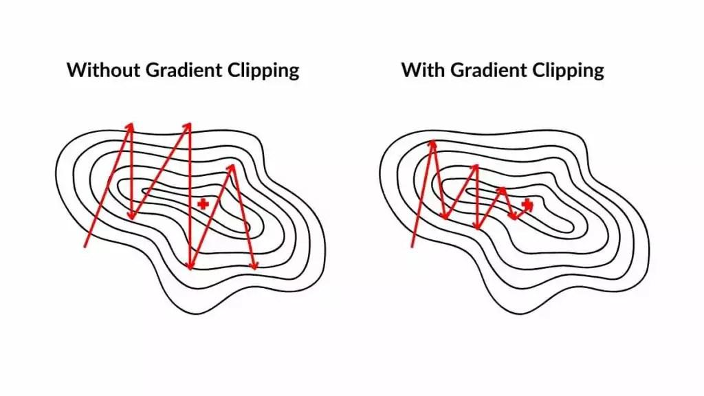

## Table of Contents

## What is clipping in the context of machine learning?

Clipping in machine learning is a technique used to limit the values of a dataset or model parameters to a specific range. This is often done to prevent extreme values from having too much influence on the model's performance. For example, if you're working with a dataset where some values are much larger than others, these large values could skew the results of your model. By clipping these values, you can make sure that all data points are treated more equally.

In the context of neural networks, clipping is often used to manage the gradients during training. Gradients are used to update the weights of the network, and if they become too large, it can lead to unstable training or a phenomenon known as exploding gradients. By applying gradient clipping, you set a maximum value for the gradients, ensuring that they do not exceed this threshold. This helps in maintaining a stable training process and can improve the overall performance of the model.

## Why is clipping used in machine learning models?

Clipping is used in machine learning models to control the range of values that data or model parameters can take. This is important because sometimes data can have very high or very low values that can mess up the model's performance. For example, if one value in a dataset is much larger than the others, it can make the model focus too much on that one value and ignore the rest. By clipping these extreme values, we make sure that all the data points are treated fairly and the model works better.

In neural networks, clipping is often used to manage the gradients during training. Gradients are like signals that tell the network how to adjust its weights to improve performance. If these gradients get too big, they can cause the training to become unstable or even make the model's performance worse, a problem known as exploding gradients. By setting a maximum value for the gradients with clipping, we keep the training stable and help the model learn more effectively.

## How does clipping help in preventing gradient explosion?

Clipping helps prevent gradient explosion by setting a limit on how large the gradients can get during the training of a [neural network](/wiki/neural-network). When gradients become very large, they can cause the weights of the network to change too much in one step, leading to unstable training. By clipping the gradients, we make sure that no matter how big they get, they will not go beyond a certain value. This keeps the training process smooth and helps the network learn better.

For example, if we set a maximum gradient value of 1, any gradient larger than 1 will be reduced to 1. This can be done using a simple formula: if the gradient $$g$$ is larger than the threshold $$t$$, then the new gradient $$g_{\text{clipped}}$$ is set to $$t$$. Otherwise, the gradient remains unchanged. This technique ensures that the network's weights are updated in a controlled manner, preventing sudden large changes that could destabilize the learning process.

## What are the different types of clipping techniques in machine learning?

There are mainly two types of clipping techniques used in [machine learning](/wiki/machine-learning): value clipping and gradient clipping. Value clipping is used on the data itself or on model outputs to limit them within a certain range. For example, if you have a dataset with values from -100 to 100 but you want to limit it to -10 to 10, you would use value clipping. This helps in making the data more manageable and can prevent outliers from skewing the model's performance. In code, value clipping might look like this: ```python
import numpy as np
data = np.clip(data, -10, 10)
``` This ensures that any value outside the range [-10, 10] is set to the nearest boundary value.

Gradient clipping, on the other hand, is used during the training of neural networks to control the size of the gradients. Gradients are used to update the weights of the network, and if they get too large, they can cause the training to become unstable. By setting a maximum value for the gradients, we prevent this from happening. For example, if we set a threshold $$t$$ of 1, any gradient larger than 1 will be reduced to 1. This can be done using the formula: if the gradient $$g$$ is larger than $$t$$, then the new gradient $$g_{\text{clipped}}$$ is set to $$t$$. Otherwise, the gradient remains unchanged. In code, gradient clipping might look like this: ```python
import torch
torch.nn.utils.clip_grad_norm_(model.parameters(), max_norm=1.0)
``` This helps in maintaining a stable training process and can improve the overall performance of the model.

## Can you explain gradient clipping and its importance?

Gradient clipping is a technique used in machine learning to stop gradients from getting too big during the training of a neural network. Gradients are like signals that tell the network how to adjust its weights to get better at its job. If these gradients become very large, they can cause the weights to change too much in one step, which can make the training unstable or even make the network's performance worse. This problem is called exploding gradients. By setting a limit on how big the gradients can get, gradient clipping helps keep the training smooth and helps the network learn better.

For example, if we set a maximum gradient value of 1, any gradient larger than 1 will be reduced to 1. This can be done using a simple formula: if the gradient $$g$$ is larger than the threshold $$t$$, then the new gradient $$g_{\text{clipped}}$$ is set to $$t$$. Otherwise, the gradient remains unchanged. This technique ensures that the network's weights are updated in a controlled way, preventing sudden large changes that could mess up the learning process. In code, gradient clipping might look like this: ```python
import torch
torch.nn.utils.clip_grad_norm_(model.parameters(), max_norm=1.0)
``` This helps in maintaining a stable training process and can improve the overall performance of the model.

## How do you implement gradient clipping in popular deep learning frameworks like TensorFlow or PyTorch?

In TensorFlow, you can implement gradient clipping using the `tf.clip_by_value` or `tf.clip_by_norm` functions. These functions help you set a limit on how big the gradients can get. For example, if you want to [clip](/wiki/clip) gradients so they don't go beyond a certain value, you can use `tf.clip_by_value`. If you want to clip them based on their overall size, you can use `tf.clip_by_norm`. Here's how you might do it in code: ```python
optimizer = tf.keras.optimizers.Adam(learning_rate=0.001)
gradients, variables = zip(*optimizer.compute_gradients(loss))
gradients, _ = tf.clip_by_global_norm(gradients, clip_norm=1.0)
train_op = optimizer.apply_gradients(zip(gradients, variables))
``` This helps keep the training stable and stops the gradients from getting too big.

In PyTorch, gradient clipping is done using the `torch.nn.utils.clip_grad_norm_` function. This function lets you set a maximum value for the gradients. If a gradient is bigger than this value, it gets reduced to that value. For example, if you want to make sure no gradient goes above 1.0, you can use this function. Here's how you might do it in code: ```python
import torch
model = YourModel()
optimizer = torch.optim.Adam(model.parameters(), lr=0.001)
# During training
optimizer.zero_grad()
loss.backward()
torch.nn.utils.clip_grad_norm_(model.parameters(), max_norm=1.0)
optimizer.step()
``` This keeps the training process smooth and helps the model learn better by preventing the gradients from exploding.

## What are the potential downsides or limitations of using clipping in machine learning?

Using clipping in machine learning can sometimes cause problems. One issue is that clipping can change the data too much. If you clip values to fit within a certain range, you might lose important information that was in the original data. For example, if you clip all values above 10 to be exactly 10, you lose the difference between values that were 11, 12, or even 100. This can make it harder for the model to learn the right patterns from the data.

Another limitation is that clipping can make training take longer. When you clip gradients in a neural network, you are making the updates to the weights smaller. This means the network might need more steps to learn what it needs to learn. While clipping helps keep the training stable, it can slow down the process. For example, if you use gradient clipping with a threshold of 1, like this: ```python
torch.nn.utils.clip_grad_norm_(model.parameters(), max_norm=1.0)
```, the training might take longer because the weights are updated more slowly.

## How does clipping affect the training dynamics of a neural network?

Clipping affects the training dynamics of a neural network by controlling how much the weights change during each step. When you use gradient clipping, like setting a maximum value for the gradients with $$g_{\text{clipped}} = \min(g, t)$$, you make sure the weights don't change too much at once. This helps keep the training stable and prevents the problem of exploding gradients, where the weights change so much that the network can't learn properly. But, it can also slow down the training because the weights are updated more slowly. For example, if you use gradient clipping in PyTorch like this: ```python
torch.nn.utils.clip_grad_norm_(model.parameters(), max_norm=1.0)
```, the training might take longer because the updates are smaller.

Clipping the data itself can also change how the network learns. When you clip values in the dataset to fit within a certain range, you might lose some important details that were in the original data. For example, if you clip all values above 10 to be exactly 10, the network won't see the difference between values that were 11, 12, or even 100. This can make it harder for the network to find the right patterns in the data. So, while clipping helps manage extreme values, it can also make the learning process less accurate by changing the data too much.

## In what scenarios should clipping be considered as a necessary technique?

Clipping should be considered when dealing with data that has extreme values, like very high or very low numbers. These extreme values can mess up the model's performance by making it focus too much on them and ignore the rest of the data. For example, if you're working on a project where some data points are much larger than others, clipping can help by limiting these values to a certain range. This way, all the data points are treated more equally, and the model can learn better patterns from the data.

In neural networks, clipping is necessary when you want to stop the gradients from getting too big during training. Gradients are like signals that tell the network how to adjust its weights to improve. If these gradients become too large, they can cause the training to become unstable, a problem called exploding gradients. By setting a maximum value for the gradients, like $$g_{\text{clipped}} = \min(g, t)$$, you keep the training smooth. For example, in PyTorch, you can use gradient clipping like this: ```python
torch.nn.utils.clip_grad_norm_(model.parameters(), max_norm=1.0)
``` This helps the network learn better by making sure the weights don't change too much at once.

## How can clipping be optimized or adjusted during the training process?

Clipping can be optimized or adjusted during the training process by changing the threshold value over time. For example, you might start with a higher threshold and slowly lower it as the training goes on. This can help the model learn quickly at first and then fine-tune its learning later. If you use gradient clipping, you can adjust the threshold $$t$$ like this: if you start with $$t = 5$$ and then lower it to $$t = 1$$ as training continues, the gradients will be clipped more tightly as the model gets closer to the best solution.

Another way to adjust clipping is by monitoring the training process and making changes based on how the model is doing. If you see that the model's performance is getting worse or the training is becoming unstable, you can change the clipping threshold to help. For example, if you're using PyTorch and you notice the loss is jumping around a lot, you can try using a smaller threshold in the gradient clipping function: ```python
torch.nn.utils.clip_grad_norm_(model.parameters(), max_norm=0.5)
``` This can help stabilize the training and improve the model's performance.

## What are some advanced strategies for applying clipping in complex models?

In complex models, one advanced strategy for applying clipping is adaptive clipping. This means changing the clipping threshold based on how the model is doing during training. For example, you might start with a higher threshold and slowly lower it as the model learns more. This can help the model learn quickly at first and then fine-tune its learning later. You can do this by keeping track of the gradients and adjusting the threshold $$t$$ based on their average size. If the gradients are getting too big, you can lower the threshold to clip them more tightly.

Another strategy is to use different clipping thresholds for different parts of the model. Some parts of a complex model might need more careful control than others. For example, in a neural network, you might use a smaller threshold for the gradients in the early layers and a larger one for the later layers. This can help the model learn better by making sure the early layers don't change too much at once. In PyTorch, you can do this by applying gradient clipping to different parts of the model separately, like this: ```python
torch.nn.utils.clip_grad_norm_(model.early_layers.parameters(), max_norm=0.5)
torch.nn.utils.clip_grad_norm_(model.later_layers.parameters(), max_norm=1.0)
``` This way, you can fine-tune the training process to fit the needs of different parts of your model.

## Can you discuss a case study or research paper where clipping played a crucial role in improving model performance?

In a research paper titled "Training Deep Networks with Gradient Clipping" by Pascanu et al. (2013), the authors explored how gradient clipping can help in training deep neural networks, especially those with recurrent structures like Long Short-Term Memory (LSTM) networks. They found that without gradient clipping, these networks often suffered from the problem of exploding gradients, where the gradients become so large that they cause the training to become unstable. By applying gradient clipping, the authors were able to keep the training process stable and improve the performance of the networks. They used a simple formula to clip the gradients: if the gradient $$g$$ is larger than the threshold $$t$$, then the new gradient $$g_{\text{clipped}}$$ is set to $$t$$. Otherwise, the gradient remains unchanged. This helped the networks learn better and achieve better results on tasks like language modeling.

Another case study that highlights the importance of clipping is from the work of researchers at Google who developed the Transformer model for machine translation. In their paper "Attention Is All You Need" by Vaswani et al. (2017), they used value clipping to manage the attention weights in their model. They found that without clipping, the attention weights could become very large, which could lead to poor performance. By clipping these values, they were able to improve the model's stability and performance. In their implementation, they used a simple clipping function to ensure that the attention weights stayed within a certain range. This helped the model focus better on the relevant parts of the input and produce more accurate translations.