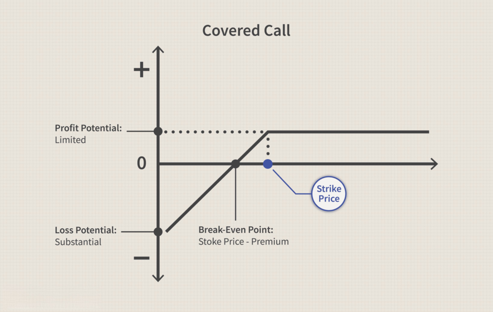

Welcome to the comprehensive guide on investment options focusing on finances and algorithmic trading. In today's fast-paced financial markets, leveraging technology in investment strategies has become a game-changer for many investors. Algorithmic trading, also known as algo trading, utilizes computer programs that follow a defined set of instructions to place trades systematically. This approach harnesses the power of complex mathematical models and algorithms, enabling traders to execute orders with precision and speed that far surpass traditional manual trading methods.

Historically, access to algorithmic trading was limited to institutional traders and financial professionals. However, the evolution of technology, coupled with the widespread availability of advanced trading platforms, has democratized this strategy, making it accessible to retail investors. The integration of algorithms into trading strategies offers a multitude of benefits, including minimized human error, increased efficiency, and the ability to capitalize on fleeting market opportunities.

This article aims to explore various investment options and how algorithmic trading can optimize your investment strategy. We'll cover the basics of algo trading, its benefits, potential risks, and how you can get started. Whether you're looking to enhance your existing portfolio or seeking a deeper understanding of modern trading techniques, this guide provides comprehensive insights into leveraging algorithmic trading within the dynamic world of finance.

## Table of Contents

## Understanding Investment Options

Investment options encompass a wide array of financial vehicles, each with distinct characteristics, risk levels, and return potentials. Understanding these options is essential for crafting a diversified and stable investment portfolio. Below is an overview of some of the most popular investment avenues available today, which can guide investors based on their unique risk tolerance, investment goals, and time horizon.

### Traditional Investment Options

1. **Stocks**: Represent ownership in a company and entitle shareholders to a portion of the corporation's profits, distributed as dividends. The value of stocks can fluctuate widely, making them a high-risk, high-reward investment. A diversified portfolio often balances stocks from different sectors to mitigate market volatility.

2. **Bonds**: Essentially loans made by investors to borrowers such as governments and corporations. In exchange, investors receive periodic interest payments and eventually the return of their principal. Bonds are generally considered safer than stocks but tend to offer lower returns. Government bonds, in particular, are viewed as low-risk investments.

3. **Mutual Funds**: Pooled investment vehicles managed by professional fund managers who allocate the fund's assets into a variety of securities, such as stocks and bonds. Mutual funds offer diversification and professional management, though they come with management fees that can eat into returns.

### Modern Investment Options

1. **Exchange-Traded Funds (ETFs)**: Similar to mutual funds, ETFs pool together various assets. However, unlike mutual funds, ETFs are traded on stock exchanges and can be bought and sold throughout the trading day at market prices. They offer diversification, liquidity, and often lower fees compared to mutual funds.

2. **Cryptocurrencies**: Digital or virtual currencies that use cryptography for security and operate independently of a central bank. Cryptocurrencies like Bitcoin and Ethereum have gained popularity for their high return potential, but they are also highly volatile and speculative.

3. **Real Estate Investment Trusts (REITs)**: Companies that own, operate, or finance income-generating real estate. REITs provide an opportunity to invest in real estate without owning property, typically offering high dividend yields and moderate long-term growth potential.

4. **Derivatives**: Financial contracts whose value is derived from an underlying asset, index, or rate. Common types include options and futures. Derivatives are predominantly used for hedging risks in a portfolio, but they can also be speculative instruments.

### Determining Your Investment Strategy

Choosing the right mix of investment options involves assessing one's risk tolerance and investment horizon. For example, younger investors with a long-term outlook might prefer a portfolio weighted towards stocks and cryptocurrencies, which offer higher potential returns. In contrast, individuals approaching retirement may prioritize the stability of bonds and dividend-paying stocks.

Furthermore, understanding the correlation between different asset classes aids in achieving a diversified portfolio, reducing the overall risk. The modern portfolio theory, introduced by Harry Markowitz, suggests that diversification can reduce risk without sacrificing returns. The goal is to find a balance that aligns with your financial objectives and comfort with risk.

By carefully selecting and managing investment options, investors can not only protect their wealth but also enhance their opportunities for growth. This strategic approach is vital for navigating today's complex financial markets and achieving long-term financial success.

## The Rise of Algorithmic Trading

Algorithmic trading has significantly transformed financial markets by automating and optimizing the trading process. Its rise is rooted in developments dating back to the 1970s and 1980s when stock exchanges began to embrace electronic trading systems. A major milestone was the adoption of the NASDAQ in 1971, which was among the first to utilize computers for trading, albeit with limited automation capabilities at the time.

The evolution of [algorithmic trading](/wiki/algorithmic-trading) further accelerated in the 1990s with the introduction of more sophisticated financial products and increased access to computing power. During this decade, quantitative traders and finance professionals started to develop complex algorithms designed to exploit minute price discrepancies, often requiring rapid execution speeds which human traders could not achieve.

The core components of a successful trading algorithm include data acquisition, signal generation, risk management, and trade execution. 

1. **Data Acquisition**: Algorithms rely on real-time data feeds, including price quotes, trading volume, and news sentiment, to make informed decisions. Access to comprehensive historical data is also crucial for backtesting purposes.

2. **Signal Generation**: This involves applying statistical models and technical indicators to identify trading opportunities. For example, a simple moving average (SMA) crossover strategy is a classic example of an algorithmic signal, where a buy/sell signal is initiated when short-term and long-term moving averages intersect.

3. **Risk Management**: Algorithms incorporate risk management features, such as stop-loss and take-profit levels, to mitigate potential losses. A common approach is employing the Kelly Criterion to determine optimal trade sizing, which balances maximizing returns while controlling risk exposure.

4. **Trade Execution**: Efficient trade execution is critical and involves sending orders to the market promptly to take advantage of identified opportunities. Execution algorithms like VWAP (Volume Weighted Average Price) and TWAP (Time Weighted Average Price) are often utilized to minimize market impact and slippage.

The proliferation of algorithmic trading has been driven by technological advancements and widespread internet access. The development of high-frequency trading ([HFT](/wiki/high-frequency-trading-strategies)) and sophisticated computing infrastructures has enabled traders to execute orders in microseconds, thereby significantly enhancing potential profitability. This improved technology landscape also reduced the barriers for individual traders and smaller firms to participate in algorithmic trading.

Understanding the growth of algorithmic trading involves recognizing its transformative impact on [liquidity](/wiki/liquidity-risk-premium) and pricing efficiency in markets. It has introduced new dynamics, such as reduced bid-ask spreads and greater market depth. However, it has also contributed to phenomena like the "flash crash," where rapid, automated sell-offs led to temporary market disruptions.

In conclusion, algorithmic trading continues to shape the evolution of financial markets, with ongoing technological advances promising further advancements in speed, sophistication, and accessibility. As the market landscape evolves, its role is anticipated to expand, offering both challenges and opportunities to market participants.

## Benefits of Algo Trading

Algorithmic trading offers several advantages that make it a compelling choice for modern investors. One of the primary benefits is the elimination of human error and emotional decision-making, which can often lead to suboptimal trades. Humans may be swayed by fear, greed, or other emotional factors, resulting in inconsistent trading behaviors. In contrast, algorithms operate strictly according to predefined rules, ensuring consistent execution.

Another significant advantage of algo trading is the speed and efficiency with which trades can be executed. Algorithms can process vast amounts of data and execute trades within fractions of a second, something unattainable by human traders. This high-speed trading capability can be particularly advantageous in fast-moving markets, where timely execution can greatly impact profitability.

Algorithmic trading also facilitates the [backtesting](/wiki/backtesting) of trading strategies using historical data, allowing traders to optimize their strategies for better performance. By analyzing past market data, traders can evaluate the potential effectiveness of their strategies and make necessary adjustments before deploying them in live markets. This process helps in fine-tuning strategies to achieve desired outcomes and mitigate risks.

In addition to these benefits, algo trading systems can automatically monitor multiple markets and instruments simultaneously. This capability enables traders to exploit opportunities across different markets without being overwhelmed by data. With algorithms doing the heavy lifting, traders can diversify their portfolios and manage risk more effectively.

Finally, algo trading can lead to improved returns on investments and reduced transaction costs. Automated trading systems can identify and capitalize on market inefficiencies faster than human traders, potentially increasing profit margins. Moreover, by operating at high volumes and speeds, these systems often incur lower per-trade costs, adding to overall cost efficiency. 

In summary, the benefits of algorithmic trading—ranging from eliminating emotional biases to executing trades with unparalleled speed—position it as a powerful tool for optimizing investment strategies in today's complex financial markets.

## Potential Risks and Challenges

Algorithmic trading, while offering numerous advantages, also poses specific risks and challenges that must be carefully considered. One primary concern is the potential for technical failures. These can arise from errors in the algorithm itself or from connectivity issues that disrupt the execution of trades. An algorithm may be based on flawed assumptions or data, leading to unexpected outcomes and significant financial losses. Additionally, network problems or system crashes can result in missed trading opportunities or incorrect order executions.

The performance of algorithmic trading strategies is also susceptible to market [volatility](/wiki/volatility-trading-strategies). Sudden and extreme market movements can lead to substantial deviations from expected outcomes, often causing strategies that rely on specific conditions to falter. Algorithms designed to exploit small price discrepancies might struggle in highly volatile situations where prices fluctuate wildly and unpredictably.

Regulatory and compliance issues constitute another challenge for algorithmic trading. Financial markets are governed by a complex set of regulations that vary across different jurisdictions. Traders need to ensure that their algorithms comply with these rules to avoid legal penalties and ensure fair market practices. Regulations may limit certain types of algorithmic activities, such as high-frequency trading, due to concerns about market manipulation and fairness.

Understanding these risks is essential for anyone considering the use of algorithmic trading strategies. Adequate risk management protocols need to be in place to mitigate potential losses from technical failures and market volatility. Regular auditing and updating of algorithms can help identify and rectify errors promptly. Furthermore, staying informed about regulatory changes can assist in maintaining compliance.

In summary, while algorithmic trading can enhance efficiency and accuracy in trading, it also requires careful management of technical, market, and regulatory risks to safeguard investments and ensure sustainable success.

## Getting Started with Algorithmic Trading

To embark on algorithmic trading, a foundational understanding of financial markets and trading strategies is paramount. This encompasses knowledge of how different markets operate, the factors influencing market trends, and the common trading strategies utilized by investors. For those new to financial markets, resources such as [books](/wiki/algo-trading-books), online courses, and financial news outlets can provide essential insights into market dynamics and trading principles.

Knowledge of programming is highly beneficial in algorithmic trading, as it enables traders to design and customize strategies according to their objectives. Python is a preferred language due to its simplicity and extensive libraries tailored for financial analysis, such as Pandas, NumPy, and TA-Lib. Beginners can leverage numerous free and paid resources available online to learn programming, such as Codecademy and Coursera.

Selecting the right trading platform is crucial, as this will serve as the infrastructure for executing your algorithmic strategies. Platforms like TradeStation and [Interactive Brokers](/wiki/interactive-brokers-api) are renowned for offering robust algo trading capabilities. These platforms typically provide APIs that allow developers to connect their algorithms for seamless trade execution. A good platform should support the necessary programming languages, offer real-time data, and ensure low latency in trade execution.

Backtesting is a critical step in the algorithmic trading process. It involves running your trading strategies against historical market data to assess their viability before live implementation. Backtesting can help identify potential pitfalls and optimize strategy parameters. In Python, libraries such as Backtrader or PyAlgoTrade can facilitate this process by providing tools to simulate trading on historical data.

Lastly, engaging with resources and communities dedicated to algorithmic trading can significantly enhance your learning curve. Online communities like QuantConnect, Quantopian, and trading forums are excellent places to interact with fellow traders, share strategies, and gain insights from experienced practitioners. Online courses from platforms like Udemy or specialized financial educational institutions can offer structured learning paths and detailed explorations of complex topics.

By combining a solid understanding of financial markets with programming skills and utilizing the right tools, aspiring algorithmic traders can build, test, and refine strategies that aim to maximize returns while managing risks effectively.

## Conclusion

Algorithmic trading, a technological marvel of modern finance, opens up exciting opportunities for investors ready to embrace innovation. By integrating algorithmic methods with traditional investment options, traders can optimize their strategies and potentially enhance returns. Through the use of sophisticated computer programs, algorithmic trading enables rapid, informed decision-making that aligns with predefined criteria, thus minimizing emotional biases and human errors that often afflict traditional trading methods.

Despite its remarkable potential, algorithmic trading is not without its challenges. Investors must navigate technical risks such as system failures and coding errors, as well as market risks including volatility and liquidity constraints. However, by being informed and strategic, traders can harness the capabilities of algorithmic trading to yield substantial benefits. This requires a commitment to continuous learning and adaptation, as the financial landscape is in constant evolution.

This guide aims to lay a robust foundation for understanding algorithmic trading, encouraging further exploration and inquiry. For those interested in pursuing algorithmic trading, a proactive approach in learning, backtesting strategies, and engaging with trading communities is indispensable. Staying informed and adaptable will not only mitigate risks but also position traders advantageously in the ever-evolving world of investments, ensuring that they can effectively seize opportunities as they arise.

## References & Further Reading

[1]: Bergstra, J., Bardenet, R., Bengio, Y., & Kégl, B. (2011). ["Algorithms for Hyper-Parameter Optimization."](https://dl.acm.org/doi/10.5555/2986459.2986743) Advances in Neural Information Processing Systems 24.

[2]: ["Advances in Financial Machine Learning"](https://www.amazon.com/Advances-Financial-Machine-Learning-Marcos/dp/1119482089) by Marcos Lopez de Prado

[3]: ["Evidence-Based Technical Analysis: Applying the Scientific Method and Statistical Inference to Trading Signals"](https://www.amazon.com/Evidence-Based-Technical-Analysis-Scientific-Statistical/dp/0470008741) by David Aronson

[4]: ["Machine Learning for Algorithmic Trading"](https://github.com/stefan-jansen/machine-learning-for-trading) by Stefan Jansen

[5]: ["Quantitative Trading: How to Build Your Own Algorithmic Trading Business"](https://www.amazon.com/Quantitative-Trading-Build-Algorithmic-Business/dp/1119800064) by Ernest P. Chan

[6]: Aldridge, I. (2013). ["High-Frequency Trading: A Practical Guide to Algorithmic Strategies and Trading Systems"](https://www.amazon.com/High-Frequency-Trading-Practical-Algorithmic-Strategies/dp/1118343506). Wiley Finance.

[7]: Narang, R. K. (2009). ["Inside the Black Box: The Simple Truth About Quantitative Trading"](https://onlinelibrary.wiley.com/doi/book/10.1002/9781118267738). Wiley Finance Series.