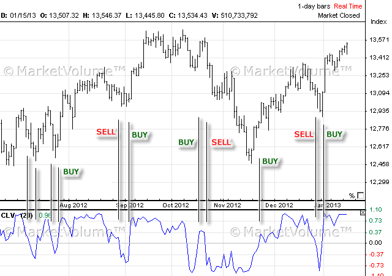

## Table of Contents

## What is Close Location Value (CLV)?

Close Location Value (CLV) is a term used in real estate to describe how close a property is to important places like schools, shops, and public transport. It helps people understand if a home is in a good spot. If a house has a high CLV, it means it's near many useful places, which can make the house more valuable and easier to sell.

CLV is important because it affects how much people are willing to pay for a house. If a home is close to good schools, people with kids might want to buy it. If it's near a train station, people who need to travel a lot might be interested. So, a high CLV can make a property more attractive to buyers and can increase its price.

## Why is CLV important in financial analysis?

Close Location Value (CLV) is important in financial analysis because it helps people understand how much a property is worth. When a house is near important places like schools, shops, and public transport, it usually has a higher value. This is because more people want to live in those areas, so they are willing to pay more for the house. Financial analysts look at CLV to see if a property is a good investment. If a house has a high CLV, it might be easier to sell and could bring in more money.

CLV also helps analysts predict future property values. If an area is getting new shops or better public transport, the CLV of nearby houses might go up. This means the houses could be worth more money in the future. By looking at CLV, financial analysts can make better guesses about where to invest their money. They can choose properties that are likely to increase in value over time, making them a smart choice for investors.

## How is CLV calculated?

Close Location Value (CLV) is calculated by looking at how close a property is to important places like schools, shops, and public transport. Each of these places gets a score based on how important it is to people. For example, a good school might get a higher score than a small shop. Then, the distance from the property to each place is measured. The closer the property is to these places, the higher the score it gets.

After getting all the scores, they are added up to find the total CLV. Sometimes, the scores are adjusted to make sure they are fair. For example, if a place is very far away, its score might be lowered a lot. This way, the CLV gives a good idea of how well-located a property is. It helps people understand if a house is in a good spot that many people would want to live in.

## What are the key components of the CLV formula?

The key components of the Close Location Value (CLV) formula are the importance scores of different places and the distance from the property to those places. Each place, like a school or a shop, gets a score based on how important it is to people. For example, a good school might get a higher score than a small shop. The distance from the property to each of these places is also measured. The closer the property is to these places, the higher the score it gets.

After getting all the scores, they are added up to find the total CLV. Sometimes, the scores are adjusted to make sure they are fair. For example, if a place is very far away, its score might be lowered a lot. This way, the CLV gives a good idea of how well-located a property is. It helps people understand if a house is in a good spot that many people would want to live in.

## Can you provide a simple example of how to calculate CLV?

Imagine you want to find the Close Location Value (CLV) for a house. You need to know how close it is to important places like a school, a shop, and a bus stop. Let's say the school is very important and gets a score of 10, the shop is less important and gets a score of 5, and the bus stop is in the middle with a score of 7. Now, you measure the distance from the house to each place. The house is 1 mile from the school, 0.5 miles from the shop, and 0.2 miles from the bus stop.

To calculate the CLV, you look at how the distance affects the score. For the school, being 1 mile away might mean its score drops to 5 (because it's not very close). The shop, being 0.5 miles away, might keep its score at 5 (since it's close enough). The bus stop, being very close at 0.2 miles, might keep its full score of 7. You add up these adjusted scores: 5 (for the school) + 5 (for the shop) + 7 (for the bus stop) = 17. So, the CLV for this house is 17. This number shows that the house is in a good spot because it's close to important places.

## What are the common uses of CLV in stock market analysis?

In stock market analysis, Close Location Value (CLV) is sometimes used to help investors understand how a company's stock price behaves at the end of trading days. Analysts look at the CLV to see if the stock often closes near its high or low for the day. If a stock's CLV is high, it means the stock often closes near its highest price of the day. This can show that the stock is strong and might keep going up. On the other hand, a low CLV might mean the stock closes near its lowest price, which could show that the stock is weak and might go down.

Investors use this information to make decisions about buying or selling stocks. For example, if a stock has a high CLV, an investor might decide to buy it because they think it will keep doing well. If a stock has a low CLV, an investor might sell it or avoid buying it because they think it might not do well. By looking at the CLV, investors can get a better idea of a stock's strength and make smarter choices about their investments.

## What are the limitations of using CLV as an indicator?

Using Close Location Value (CLV) as an indicator has some limitations. One big problem is that it only looks at how a stock closes each day. It doesn't tell you about what happens during the day or over longer periods of time. This means you might miss important information about the stock's overall trend or big changes that happen outside of the closing price.

Another limitation is that CLV can be affected by things that don't really matter for the stock's value. For example, if there's a lot of trading right before the market closes, the CLV might look high even if the stock isn't doing well overall. Also, CLV doesn't take into account other important factors like the company's earnings, news about the company, or what's happening in the economy. So, while CLV can give you some information, it's not enough on its own to make good investment decisions.

## How does CLV compare to other technical indicators like Moving Averages?

Close Location Value (CLV) and Moving Averages are both used to help people understand stock prices, but they look at different things. CLV only looks at how a stock closes each day. It tells you if the stock often closes near its high or low price for the day. This can show if the stock is strong or weak at the end of trading. Moving Averages, on the other hand, look at the average price of a stock over a certain number of days. They help you see the overall trend of the stock's price, whether it's going up, down, or staying the same.

The main difference is that CLV gives you a quick snapshot of the end of each trading day, while Moving Averages give you a longer view of the stock's price movement. CLV might help you decide if a stock is strong right now, but it doesn't tell you about what's been happening over time. Moving Averages are better for seeing trends and making decisions based on where the stock has been and where it might be going. So, while CLV can be useful, it's often better to use it along with other indicators like Moving Averages to get a fuller picture of a stock's performance.

## What are some advanced strategies for incorporating CLV into trading?

One advanced strategy for using Close Location Value (CLV) in trading is to combine it with other indicators to get a better picture of a stock's strength. For example, you could use CLV along with Moving Averages to see if a stock is strong at the end of the day and also if it's following a good trend over time. If a stock has a high CLV and is above its Moving Average, it might be a good time to buy because the stock is strong and going up. On the other hand, if a stock has a low CLV and is below its Moving Average, it might be a good time to sell or avoid buying because the stock is weak and going down.

Another strategy is to look at CLV over different time periods. Instead of just looking at the CLV for one day, you could look at the average CLV over a week or a month. This can help you see if the stock is consistently strong or weak at the end of trading days. If the average CLV is high over a longer period, it might mean the stock is in a strong trend and could keep going up. If the average CLV is low, it might mean the stock is in a weak trend and could keep going down. By looking at CLV in different ways, you can make smarter trading decisions.

## How can CLV be adjusted for different market conditions?

Close Location Value (CLV) can be adjusted for different market conditions by changing how much weight you give to different parts of the CLV calculation. For example, in a fast-moving market where prices change a lot during the day, you might want to give more weight to the CLV of the last few days. This helps you see if the stock is closing near its high or low price right now, which can be more important in a fast market. In a slow market where prices don't change much, you might want to look at the average CLV over a longer time, like a month. This gives you a better idea of the stock's overall strength and trend.

Another way to adjust CLV for different market conditions is to use it with other indicators that can help you understand what's happening in the market. For example, if the market is going up a lot, you might want to look at CLV along with indicators like the Relative Strength Index (RSI) to see if the stock is overbought. If the market is going down, you might want to look at CLV with indicators like the Moving Average Convergence Divergence (MACD) to see if the stock is oversold. By using CLV with other indicators, you can get a better idea of how to trade in different market conditions.

## What are the potential pitfalls of relying solely on CLV for investment decisions?

Relying only on Close Location Value (CLV) for investment decisions can be risky because CLV only looks at how a stock closes each day. It doesn't tell you about what happens during the day or over longer periods of time. This means you might miss important information about the stock's overall trend or big changes that happen outside of the closing price. If you only use CLV, you might think a stock is strong because it closes near its high price, but it could be going down during the day and might keep going down.

Another problem with using just CLV is that it can be affected by things that don't really matter for the stock's value. For example, if there's a lot of trading right before the market closes, the CLV might look high even if the stock isn't doing well overall. Also, CLV doesn't take into account other important factors like the company's earnings, news about the company, or what's happening in the economy. So, while CLV can give you some information, it's not enough on its own to make good investment decisions. It's better to use CLV along with other indicators and information to get a fuller picture of a stock's performance.

## How can one validate the effectiveness of CLV in different sectors or asset classes?

To validate the effectiveness of Close Location Value (CLV) in different sectors or asset classes, you need to look at how well it works in each specific area. For example, in the real estate sector, you can compare the CLV of properties in different neighborhoods to see if it matches their actual sale prices. If properties with high CLV often sell for more money, then CLV is effective in that sector. You can also look at different types of properties, like apartments and houses, to see if CLV works the same way for all of them. In the stock market, you can check if stocks with high CLV do better than stocks with low CLV over time. If they do, then CLV is a good tool for that asset class.

Another way to validate CLV is to use it in different market conditions and see if it still works well. For example, you can look at how CLV performs during a bull market when stock prices are going up, and during a bear market when prices are going down. If CLV helps you make good decisions in both types of markets, then it's a reliable indicator. You can also compare CLV with other indicators, like Moving Averages or the Relative Strength Index, to see if it gives you similar information. If CLV often agrees with these other indicators, it shows that it's a useful tool across different sectors and asset classes.

## What is Understanding Close Location Value (CLV)?

Close Location Value (CLV) is a crucial technical indicator in financial analysis, assessing how a day's closing price relates to its intraday high and low prices. This measurement helps traders and analysts to understand market sentiment by indicating whether the price momentum is skewed towards the upper or lower end of the trading range for that day.

The CLV is defined mathematically as:

$$
\text{CLV} = \frac{(\text{Close} - \text{Low}) - (\text{High} - \text{Close})}{\text{High} - \text{Low}}
$$

This formula evaluates the position of the closing price within the day's range. The numerator, $(\text{Close} - \text{Low}) - (\text{High} - \text{Close})$, can be interpreted as a measure of where the close lies in relation to the high and low. A positive result indicates a closing price closer to the high, while a negative result implies proximity to the low.

The CLV is a bounded indicator, ranging from +1 to -1:
- A CLV of +1 signifies that the closing price is at the day's high, suggesting a bullish sentiment as buyers dominate, pushing prices upward.
- Conversely, a CLV of -1 indicates that the closing price is at the day's low, pointing to a bearish sentiment dominated by sellers driving prices down.
- Values around zero often suggest indecisiveness, with the closing price near the day's midpoint.

Understanding the components of CLV provides traders with insights into daily price movements. This information can be instrumental in predicting future price trends and making informed trading decisions. By evaluating whether the close is trending towards daily highs or lows, traders can better anticipate potential market trends, making CLV a valuable tool in technical analysis.

## How can CLV be applied in trading strategies?

Close Location Value (CLV) serves as a vital component in various trading strategies, especially within [algorithmic trading](/wiki/algorithmic-trading) frameworks. Its primary function lies in quantifying the closing price's position relative to the day's high-low range, assisting traders in gauging market [momentum](/wiki/momentum) and potential reversals. Despite its inherent [volatility](/wiki/volatility-trading-strategies), CLV is frequently incorporated into other technical indicators to provide a more nuanced view of market conditions, thereby enhancing trading strategies and optimizing profit potential.

One prominent use of CLV is in the calculation of the Accumulation/Distribution (A/D) line. This indicator combines price and [volume](/wiki/volume-trading-strategy) data to assess buying and selling pressure in the market. By integrating CLV, the A/D line offers insights into the strength or weakness of a trend. The formula for the A/D line can be expressed as:

$$
A/D\_Line = \sum_{i=1}^{n} \left( \frac{(\text{Close}_i - \text{Low}_i) - (\text{High}_i - \text{Close}_i)}{\text{High}_i - \text{Low}_i} \right) \times \text{Volume}_i
$$

Here, the CLV component helps highlight the day's closing trend, enhancing the A/D line's reflection of accumulation or distribution over a given period.

Traders exploit CLV within broader frameworks to refine their strategies. One example involves using CLV in conjunction with other momentum indicators, such as Moving Average Convergence Divergence (MACD) or the Relative Strength Index (RSI). These combinations help traders filter false signals inherently associated with volatile metrics like CLV. For instance, when both CLV and RSI show a positive trend, it may indicate a stronger buy signal than when either indicator is considered alone.

Additionally, traders often employ CLV in algorithmic systems programmed to execute trades based on predetermined rules. These algorithms can be designed to automatically react to specific CLV thresholds, allowing traders to capitalize on potential reversals or trend continuations. In Python, a basic implementation to monitor CLV for trading signals might look like this:

```python
def calculate_clv(close, high, low):
    return ((close - low) - (high - close)) / (high - low)

def trading_signal(clv, threshold=0.5):
    if clv > threshold:
        return "Buy"
    elif clv < -threshold:
        return "Sell"
    else:
        return "Hold"

# Example usage
close_price = 50
high_price = 55
low_price = 45

clv_value = calculate_clv(close_price, high_price, low_price)
signal = trading_signal(clv_value)
print(f"CLV: {clv_value}, Trading Signal: {signal}")
```

However, while integrating CLV in trading strategies, caution is necessary due to its sensitivity to daily price fluctuations. Traders typically employ a multifaceted approach, combining CLV with trend confirmation tools to mitigate the risks of false signals. Such synergy not only enhances the reliability of signals generated but also improves overall trading efficacy by providing a holistic view of market dynamics.

## What are the limitations of using Close Location Value (CLV)?

Close Location Value (CLV) offers valuable insights into market dynamics; however, it also has certain limitations that traders must consider. One of the primary drawbacks of the CLV indicator is its sensitivity to random market spikes and fluctuations. Because CLV directly relates to the position of the closing price within the day’s price range, sudden and unpredictable price movements can skew the indicator, leading to potential misinterpretations.

This sensitivity to intraday volatility means that CLV may not consistently convey an accurate picture of underlying market trends if used in isolation. For instance, during highly volatile trading sessions, CLV may suggest a bullish trend based on a closing price near the day high, even if this movement is merely a short-lived spike rather than a sustained trend.

To mitigate the risk of erroneous signals, it is crucial for traders to combine CLV with other technical indicators, which can offer additional context and stability. One such indicator is the stochastic oscillator, renowned for its ability to identify overbought or oversold conditions with greater stability. Unlike CLV, which focuses solely on the closing price's location relative to the daily range, stochastic oscillators account for price momentum over a broader period. This broader scope can make stochastic oscillators more effective in certain scenarios, particularly in identifying potential reversals or continuation patterns during periods of volatile price action.

The formula for a stochastic oscillator is typically computed as:

$$
\text{Stochastic\%K} = \frac{\text{Current\ Close} - \text{Lowest\ Low}}{\text{Highest\ High} - \text{Lowest\ Low}} \times 100
$$

This formula calculates the closing price's position relative to the range over a specified number of periods, providing a more comprehensive view of price action beyond the confines of a single trading day.

By integrating CLV with stochastic oscillators, traders can enhance their analysis, minimizing the noise from random price spikes and gaining more reliable insights into market conditions. This multifaceted approach allows for a more robust identification of trends and reversals, ultimately improving decision-making processes in trading strategies.

## What is the Formula for Close Location Value (CLV)?

The Close Location Value (CLV) is a straightforward yet insightful technical indicator, offering a numerical representation of the positioning of the closing price relative to the daily high and low. This indicator aids traders in gauging whether the momentum has shifted toward the upper or lower end of the price range during the trading day.

### CLV Formula
The CLV is calculated using the formula:

$$
\text{CLV} = \frac{(\text{Close} - \text{Low}) - (\text{High} - \text{Close})}{\text{High} - \text{Low}}
$$

#### Components of the Formula:

1. **Close**: The final trading price at the end of the day. This value is used to assess how the market sentiments concluded after a session of trading.

2. **Low**: The lowest price at which the asset traded during the day. This serves as a measure of the downside pressure or the weakest point of the asset's value through the session.

3. **High**: The highest price reached during the day, reflecting the peak buying pressure or the strongest point during trading.

### Breakdown of the Formula

- **Numerator $(\text{Close} - \text{Low}) - (\text{High} - \text{Close})$**: 
  - The expression $(\text{Close} - \text{Low})$ calculates the distance between the closing price and the day’s low. A higher value suggests that the price closed closer to its high.
  - Conversely, $(\text{High} - \text{Close})$ computes the distance from the closing price to the day’s high. A lower value here also indicates that the price is near the high.
  - The subtraction of these two components effectively determines whether the closing price is closer to the day's high or low.

- **Denominator $(\text{High} - \text{Low})$**: 
  - This expresses the total range of price movement during the day. It serves to normalize the CLV value, ensuring it stays within the range of -1 to +1.

### Significance of the Values:

- **CLV = +1**: The closing price equals the high price of the day, implying strong bullish sentiment.
- **CLV = -1**: The closing price equals the low price of the day, indicating a bearish trend.
- **CLV = 0**: The close is exactly in the middle of the high and low, reflecting neutrality.

By understanding these components, traders can better interpret movements in price relative to the daily range, allowing them to craft informed trading decisions when considering the closing position of the asset’s price. This calculated position can subsequently influence strategy development when entering or exiting the market.

## What is the Comparative Analysis of CLV versus Other Indicators?

Close Location Value (CLV) is a technical indicator utilized to determine the position of a closing price within the day's high-low price range. To understand its utility, it is essential to compare CLV with other renowned indicators like the Accumulation/Distribution (A/D) line and the Relative Strength Index (RSI), each of which provides unique insights into market behavior and trends.

### CLV vs. Accumulation/Distribution Line (A/D)

The Accumulation/Distribution line aims to quantify the cumulative money flow volume, serving as a measure of supply and demand pressures on an asset's price. It incorporates the CLV by using it in its calculation, which is given by:

$$

\text{Money Flow Multiplier} = \frac{(\text{Close} - \text{Low}) - (\text{High} - \text{Close})}{\text{High} - \text{Low}}
$$
$$

\text{Money Flow Volume} = \text{Money Flow Multiplier} \times \text{Volume} 
$$
$$

\text{A/D Line} = \text{Previous A/D Value} + \text{Money Flow Volume} 
$$

The A/D line, by incorporating volume, provides a more comprehensive view than CLV alone, as it highlights the intensity of buying or selling pressure. CLV, on the other hand, only focuses on the price positioning without considering volume, making A/D line more robust in identifying significant trends.

**Practical Use Case**: CLV is prioritized when one needs a quick insight into price closure relative to daily range, while A/D is preferred when analyzing the strength behind the price movements, especially in confirming trends indicated by the CLV.

### CLV vs. Relative Strength Index (RSI)

The Relative Strength Index (RSI) is a momentum oscillator that measures the speed and change of price movements, providing a metric that fluctuates between 0 and 100. The formula for RSI is:

$$
\text{RSI} = 100 - \left(\frac{100}{1 + \frac{\text{Average Gain}}{\text{Average Loss}}}\right)
$$

RSI offers insights into overbought or oversold conditions by assessing price changes over a specific period. In contrast, CLV is centered on daily price ranges, offering a snapshot of daily closing positions rather than momentum or trend continuity.

**Practical Use Case**: CLV might be more useful for traders looking for day-to-day closing position analytics, whereas RSI is invaluable for those seeking to understand the momentum over longer periods and the potential reversal points in market trends. When used together, they can provide a comprehensive picture by marrying daily price positioning with trend momentum.

### Conclusion

CLV serves as a foundational tool in technical analysis by providing clarity on price closure within a trading day’s high-low range. However, when integrated with indicators like the A/D line and RSI, traders can achieve far richer insights. Each indicator has distinct strengths — CLV for its simplicity and immediate insight into daily trends, A/D for its volume-based comprehensive trend confirmation, and RSI for its momentum analysis over time. Selecting which indicator to prioritize depends significantly on the specific analytical needs and trading strategy employed at any given point.

## References & Further Reading

[1]: Accumulato, L. & Disorderly, D. (2020). ["The Comprehensive Guide to Accumulation/Distribution Line Strategies."](https://www.quantifiedstrategies.com/accumulation-distribution-line/) Trade Press Publications.

[2]: Pring, M. (2002). ["Technical Analysis Explained: The Successful Investor's Guide to Spotting Investment Trends and Turning Points."](https://www.amazon.com/Technical-Analysis-Explained-Fifth-Successful/dp/0071825177) McGraw-Hill.

[3]: Wilder, J. W. (1978). ["New Concepts in Technical Trading Systems."](https://archive.org/details/newconceptsintec00wild) Trend Research.

[4]: Achelis, S. B. (2000). ["Technical Analysis from A to Z."](https://www.mhebooklibrary.com/doi/book/10.1036/9780071380119) McGraw-Hill. 

[5]: Kaufman, P. J. (2013). ["Trading Systems and Methods."](https://www.amazon.com/Trading-Systems-Methods-Website-Wiley/dp/1118043561) Wiley.