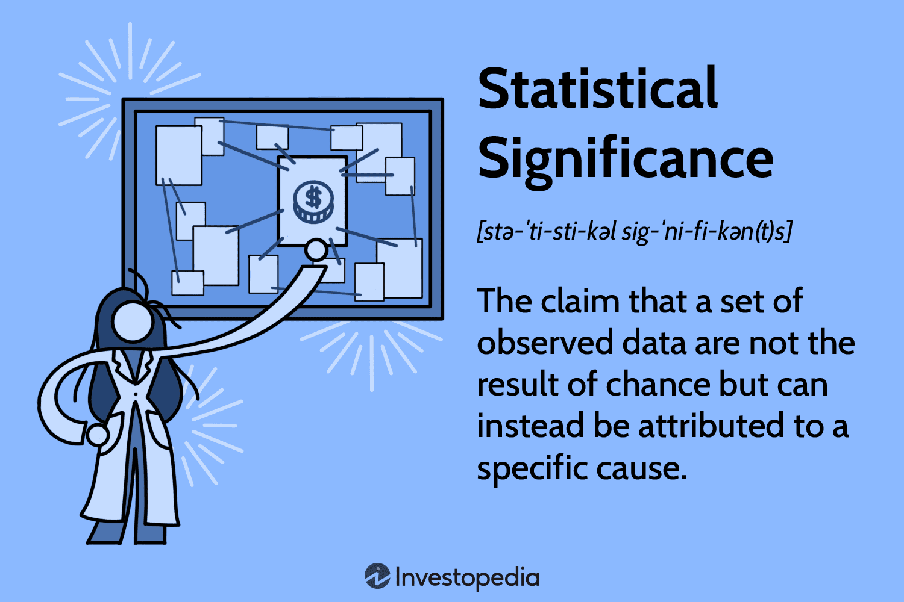

## Table of Contents

## What is a close period?

A close period is a time when certain people in a company, like managers or executives, are not allowed to buy or sell the company's stocks. This rule is to stop them from using secret information about the company to make money. The close period usually starts before the company tells everyone important news, like how much money they made or lost, and ends after the news is shared.

This rule helps make sure that everyone has a fair chance to buy or sell the company's stocks. If managers knew secret information and traded stocks based on it, it wouldn't be fair to others who don't know that information. So, the close period helps keep things honest and fair in the stock market.

## Why is a close period important in financial markets?

A close period is important in financial markets because it helps keep things fair. When a company is about to share important news, like how well they did financially, the people who work there, especially the managers and executives, know this information before everyone else. If they were allowed to buy or sell the company's stocks during this time, they could make a lot of money using this secret information. This wouldn't be fair to other people who don't know the news yet. So, the close period stops them from trading stocks until after the news is shared with everyone.

This rule makes the stock market a more honest place. Without close periods, people might lose trust in the market because they would think that some people are always getting an unfair advantage. When everyone follows the same rules, it helps to build trust and confidence in the financial system. This is good for everyone because it means more people are willing to invest, which can help the economy grow.

## How does a close period affect company insiders?

A close period affects company insiders by stopping them from buying or selling their company's stocks for a certain time. Insiders are people like managers and executives who know important things about the company before everyone else does. During the close period, they can't use this secret information to make money from the stock market. This rule is there to make sure that everyone has the same chance when it comes to buying or selling stocks.

The close period usually starts before the company shares big news, like how much money they made or lost, and ends after the news is out. This means insiders have to wait until everyone knows the news before they can trade stocks again. It can be frustrating for them because they might see good chances to buy or sell, but they have to follow the rules. This helps keep the stock market fair and honest, which is good for everyone who invests in the market.

## What are the typical durations of a close period?

A close period usually lasts from a few weeks to a couple of months. The exact time can be different for each company, but it often starts about a month before the company shares important news, like their financial results. This gives the company time to get everything ready and make sure no one can use secret information to make money.

The close period ends after the important news is shared with everyone. This means insiders have to wait until the news is out before they can buy or sell the company's stocks again. The whole point is to make sure everyone has a fair chance in the stock market, so the close period is set up to stop insiders from using secret information to their advantage.

## Can you explain the legal implications of trading during a close period?

Trading during a close period can get someone in big trouble. If an insider, like a manager or executive, buys or sells stocks when they're not supposed to, they might be breaking the law. This is called insider trading, and it's illegal because it's not fair to other people who don't know the secret information. If someone is caught doing this, they could face serious punishments like fines, losing their job, or even going to jail.

The laws about insider trading are there to make sure everyone has the same chance in the stock market. When insiders trade during a close period, it can make other people lose trust in the market. They might think it's not fair and decide not to invest anymore. This is bad for the whole economy because it needs people to invest to keep growing. So, the rules about close periods are really important to keep things honest and fair for everyone.

## How do close periods vary across different countries or regions?

Close periods can be different in different countries or regions. Each place has its own rules about when insiders can't trade stocks. For example, in the United States, the close period often starts about a month before a company shares its financial results and ends after the news is out. In the European Union, the rules might be a bit different, with close periods sometimes starting two weeks before the news and ending right after it's shared. These differences happen because each country or region has its own laws and ways of doing things.

In some countries, like Australia, the close period might be even shorter, starting just a few days before the news comes out. This shows how rules can change depending on where you are. The main idea is the same everywhere though: to stop insiders from using secret information to make money. But the exact times and rules can be different, so it's important for companies and their insiders to know the laws in their country or region. This helps keep the stock market fair and honest no matter where you are.

## What are the mechanisms companies use to enforce close periods?

Companies use different ways to make sure insiders follow the rules during close periods. One way is by having a clear policy that everyone knows about. This policy tells insiders when they can't buy or sell stocks and what will happen if they break the rules. Companies also keep a close eye on any trading that happens during these times. If they see something that looks wrong, they can start an investigation to find out if anyone broke the law.

Another way companies enforce close periods is by using technology. They might use special computer programs that watch for any trading by insiders during the close period. These programs can send alerts if they see something that shouldn't be happening. Companies also might make insiders sign agreements that say they understand the rules and will follow them. This helps make sure everyone knows what they're supposed to do and what could happen if they don't.

## How do close periods impact stock prices and market behavior?

Close periods can affect stock prices and how people act in the market. When a company is in a close period, insiders can't buy or sell stocks. This means that any changes in the stock price during this time are not because insiders are using secret information. This helps keep the market fair, because everyone is trading based on the same information. But, people might still guess what the company's news will be, and this can make the stock price go up or down a bit.

After the close period ends and the company shares its news, the stock price can change a lot. If the news is good, like the company made more money than people thought, the stock price might go up. If the news is bad, like the company lost money, the stock price might go down. This big change in the stock price after the close period can make the market more exciting, because everyone is waiting to see what the news will be. So, close periods help keep things fair, but they also make the market more interesting when the news finally comes out.

## What are the exceptions or special circumstances that allow trading during a close period?

Sometimes, there are special situations where insiders can trade during a close period. One common reason is if they have a plan set up ahead of time. This plan, called a pre-arranged trading plan, lets insiders buy or sell stocks at certain times in the future, even if it's during a close period. The key is that the plan has to be made before the close period starts, so it's not based on any secret information.

Another exception can happen if someone has a big life event, like needing money for a medical emergency or buying a house. In these cases, the company might let them trade during the close period, but they have to ask for permission first. The company will look at the situation and decide if it's okay. This way, they can make sure the trading is fair and not based on secret information.

## How can companies communicate effectively during a close period without violating regulations?

During a close period, companies need to be careful about what they say and how they say it. They can still share information with the public, but it has to be about things that are not secret or important to the company's stock price. For example, they might talk about new products or services, but they can't give out any numbers or details that could affect how people see the company's future. They also need to make sure that everyone gets the same information at the same time, so no one has an unfair advantage.

To keep things fair, companies often use official channels like press releases or their website to share information. This way, everyone can see the same news at the same time. It's important for companies to follow the rules and not talk about anything that could be seen as secret information. If they do, they could get in trouble for breaking the law. So, they have to be very careful and clear about what they can and can't say during a close period.

## What role do regulatory bodies play in overseeing close periods?

Regulatory bodies are important because they make sure companies follow the rules about close periods. They set the rules that say when insiders can't trade stocks and watch to make sure no one breaks them. If a company or an insider does something wrong, the regulatory body can start an investigation. They might look at trading records and talk to people to find out what happened. If they find out someone broke the law, they can give out punishments like fines or even send people to jail.

These bodies also help by giving out information and advice to companies. They tell them what the rules are and how to follow them. This helps companies know what they need to do during a close period. By keeping an eye on things and helping companies understand the rules, regulatory bodies make sure the stock market stays fair and honest. This is good for everyone because it helps people trust the market and feel safe investing their money.

## How have close period policies evolved over time and what might future trends look like?

Close period policies have changed a lot over time. In the past, rules about close periods were not as strict. Companies and insiders had more freedom to trade stocks, even when they knew important news was coming. But as more people started to see how unfair this could be, rules got stricter. Governments and regulatory bodies made laws to stop insiders from using secret information to make money. Now, close periods are a big part of keeping the stock market fair. Companies have to follow clear rules about when insiders can't trade, and they use technology and policies to make sure everyone follows these rules.

In the future, close period policies might keep getting stricter and more detailed. With new technology, companies can watch trading even more closely to make sure no one breaks the rules. There might also be more rules about what companies can say during close periods, to make sure they don't give out any secret information. As more people invest in the stock market, keeping things fair will be even more important. So, regulatory bodies might keep changing the rules to make sure everyone has a fair chance, no matter what new challenges come up.

## References & Further Reading

[1]: U.S. Securities and Exchange Commission. (n.d.). [SEC Rule 15c3-5: Risk Management Controls for Brokers or Dealers with Market Access](https://www.sec.gov/files/rules/final/2010/34-63241.pdf).

[2]: Commodity Futures Trading Commission. (n.d.). [Market Access]. CFTC. Retrieved from [https://www.cftc.gov/LawRegulation/DoddFrankAct/Rulemakings/DF_9_MarketAccess.html](https://www.cftc.gov/?os&ref=app).

[3]: Hasbrouck, J., & Saar, G. (2013). [Low-latency trading](https://www.sciencedirect.com/science/article/abs/pii/S1386418113000165). The Review of Financial Studies, 26(9), 2249–2295.

[4]: Jaeckel, A. (2020). ["Python for Algorithmic Trading: From Idea to Cloud Deployment"](https://home.tpq.io/books/py4at/). Springer.

[5]: Harris, L. (2003). ["Trading & Exchanges: Market Microstructure for Practitioners"](https://www.amazon.com/Trading-Exchanges-Market-Microstructure-Practitioners/dp/0195144708). Oxford University Press.

[6]: Menkveld, A. J. (2013). [High frequency trading and the new market makers](https://papers.ssrn.com/sol3/papers.cfm?abstract_id=1722924). Journal of Financial Markets, 16(4), 712-740.