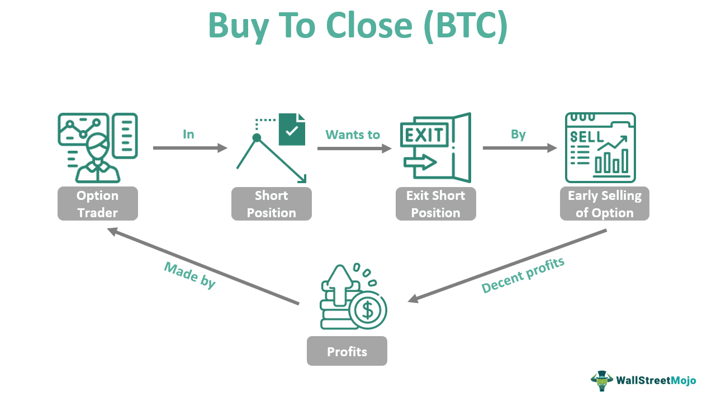

The world of financial markets trading is complex, characterized by rapid fluctuations and multifaceted variables. Traders, both individual and institutional, are continuously searching for strategies to optimize profits and curtail risks associated with market dynamics. Among the fundamental aspects of effective trading strategies is determining the precise moments to open and close positions. This decision-making process is particularly critical within the framework of algorithmic trading, where predefined criteria are used to execute trades with speed and precision.

This article examines the numerous strategies for closing positions in the financial markets, with a particular emphasis on algorithmic trading. Understanding when and how to close a position is not merely a matter of intuition but involves a combination of systematic analysis and strategic planning. We will investigate both the definition and mechanics involved in closing positions, as well as the significant role algorithmic trading plays in enhancing these processes.



The optimization of trading strategies for better results involves analyzing historical data, market indicators, and leveraging the efficiency of algorithmic trading systems. These algorithms are designed to process extensive datasets and execute trades based on predefined sets of rules, effectively minimizing human error and emotional bias. By harnessing these algorithms, traders can gain a competitive advantage, ensuring they operate with a disciplined approach in executing trading strategies. 

Furthermore, the integration of algorithmic strategies can provide an edge by offering consistent and stable application of trade rules, reducing the impact of volatile market swings. Traders can enhance their profitability and risk management through the automated and rapid execution of positions, thereby maintaining a competitive stance in today's fast-paced trading environments. Whether one is trading equities, forex, or commodities, the ability to efficiently close positions using algorithmic strategies is vital to achieving successful trading outcomes.

## Table of Contents

## Understanding Close Positions in Trading

A 'close position' in trading refers to the execution of a transaction that offsets an existing position, thereby nullifying exposure to a specific market risk. This action is foundational to risk management and involves either selling an asset that was previously bought (closing a long position) or buying back an asset that was previously sold (closing a short position).

Closing a long position occurs when a trader sells an asset they hold in the market. This is usually done to realize gains if the asset has appreciated in value or to curtail losses if its price is falling. Conversely, closing a short position involves purchasing the asset that was initially borrowed and sold, which locks in the profit or loss based on the asset's price movement.

The primary goal of closing positions is twofold: realizing profits or curbing losses. This decision hinges on the market's dynamics and the trader’s perception of future price movements. By nature, financial markets are volatile, and timely closure of positions is critical to successful trading outcomes. For instance, if a trader buys a stock at $100 and sells it at $120, the action of selling the stock at $120 closes the position, and the profit realized is $20 (excluding transaction costs).

Positions can be closed voluntarily by traders based on personal strategy or market analysis. Alternatively, they can be closed involuntarily by brokers under specific conditions, such as margin calls. A margin call occurs when the trader's account value falls below the broker's required minimum due to market fluctuations, forcing the broker to liquidate the position to cover the loaned amount.

Timing and method of closing a position affect a trader's success significantly. Traders often use stop-loss orders to automate the close of a position once the asset reaches a specified price, serving as a safeguard against excessive losses. For example, if a stock is bought at $100, a stop-loss order might be set at $90, implying that if the stock price falls to $90, the position will be closed automatically to prevent further loss.

To effectively close positions, a trader must analyze various factors including market trends, economic indicators, and trading signals. Tools such as technical analysis and [algorithmic trading](/wiki/algorithmic-trading) systems assist in identifying optimal points for closing positions. Algorithms can automate closure based on pre-defined criteria, thus enhancing decision-making precision and efficiency.

In summary, the act of closing positions is a pivotal component of trading strategies intended to manage risk, realize profits, or limit losses. For traders, mastering the techniques for timely and strategic closure is crucial, as it directly influences financial outcomes in the dynamic landscape of financial markets.

## Key Strategies for Closing Positions

Traders employ a variety of strategies to decide the optimal timing and manner for closing positions, which is essential for maximizing returns and mitigating risks. These strategies are often determined by setting specific parameters or utilizing available market data to guide the decision-making process. Here are some key strategies employed by traders:

- **Fixed Threshold Strategy**: This strategy involves setting predefined limits for both stop-loss and take-profit levels. A stop-loss order is designed to limit an investor's loss on a position in a security, while a take-profit order automatically closes a position when a specified profit level is reached. For example, if a trader buys a stock at $100, they might set a stop-loss at $95 and a take-profit at $110. This strategy ensures that positions are automatically closed when the market hits these predetermined thresholds, thus securing profits or limiting losses without requiring constant monitoring.

- **Trailing Stop Strategy**: Unlike the fixed threshold, a trailing stop strategy moves the stop-loss level in response to favorable changes in the market price. For instance, if a stock price rises from $100 to $105, the trailing stop—which might initially be set at $95—could move up to $100 in order to lock in profits while still allowing room for further gains. The trailing stop loss can be seen as a moving stop-loss order, calculated as a percentage or fixed amount below the market price. Here’s a simple implementation in Python:

  ```python
  def trailing_stop(current_price, initial_stop, trailing_percent):
      return max(initial_stop, current_price * (1 - trailing_percent))

  # Example usage
  current_price = 105
  initial_stop = 95
  trailing_percent = 0.05  # 5%
  new_stop = trailing_stop(current_price, initial_stop, trailing_percent)
  print(f"New Trailing Stop: {new_stop}")
  ```

- **Time-based Strategy**: This involves closing positions after a predetermined time period. It is particularly prevalent in day trading, where positions are often closed before the end of the trading day to avoid the risks associated with overnight market exposure. A trader may, for example, decide to exit all positions at 3:30 PM to avoid end-of-day volatility.

- **Technical Indicator-based Strategy**: Traders utilize various technical indicators, such as moving averages or the Relative Strength Index (RSI), to decide when to close positions. For instance, a trader might choose to exit a position if the market closes below a moving average, which could signal a bearish trend. Similarly, an RSI level above 70 might indicate overbought conditions, prompting a trader to close a position.

These strategies reflect the intricate balance traders must maintain between achieving optimal returns and managing the inherent risks in trading activities. Key to this is the systematic application of predetermined rules or criteria, which can be greatly enhanced through the use of algorithmic trading systems that execute these strategies automatically with precision and speed.

## The Role of Algorithmic Trading in Closing Positions

Algorithmic trading employs pre-programmed rules and complex algorithms to enhance the precision and efficiency of executing strategies for closing positions in financial markets. By leveraging these algorithms, traders can process large datasets and execute trades significantly faster than human capabilities allow. This rapid processing power minimizes delays which could potentially impact the timing and outcomes of closing positions.

One of the fundamental advantages of algorithmic trading is the ability to automatically trigger trades based on real-time market conditions and specific parameters defined by the trader. This ensures that strategies are executed with discipline, reducing the risk of human error or emotional bias influencing trading decisions. For example, algorithms can be tailored to enter or [exit](/wiki/exit-strategy) trades when certain price levels or technical indicators, such as moving averages, are reached.

Moreover, algorithmic methods can incorporate sophisticated models, including [machine learning](/wiki/machine-learning) techniques, to adapt strategies dynamically in response to evolving market conditions. Machine learning algorithms can analyze historical data to predict future price movements, thereby optimizing trading outcomes. These algorithms can continuously learn from new data, enhancing their predictive capabilities over time.

Python, a popular programming language in finance, is often used to implement these algorithms. Below is an example of a simple Python script using a moving average crossover strategy to determine when to close a position:

```python
import pandas as pd
import numpy as np

# Load historical market data
data = pd.read_csv('market_data.csv')

# Calculate short-term and long-term moving averages
short_window = 40
long_window = 100

data['Short_MA'] = data['Close'].rolling(window=short_window, min_periods=1).mean()
data['Long_MA'] = data['Close'].rolling(window=long_window, min_periods=1).mean()

# Determine when to close position based on moving average crossover
data['Signal'] = np.where(data['Short_MA'] < data['Long_MA'], 0, 1)  # 0 for close, 1 for open

# Identify points of closing a position
data['Position'] = data['Signal'].diff()
closing_points = data.loc[data['Position'] == -1].index

print("Closing positions at the following points:")
print(closing_points)
```

Additionally, algorithmic trading significantly reduces the influence of emotional biases, such as fear or greed, that can adversely affect decision-making processes in trading. By ensuring consistent and objective implementation of trading strategies, algorithms help maintain a disciplined approach, even amidst volatile market conditions.

In summary, algorithmic trading serves as a powerful tool for traders seeking to enhance their ability to close positions effectively. The integration of automated strategies not only improves execution speed and accuracy but also supports the development of more sophisticated trading models capable of adapting to the dynamic nature of financial markets.

## Common Mistakes and Pitfalls in Closing Position Strategies

Over-reliance on automated trading strategies without adequate monitoring can lead to missed nuances in market conditions. Algorithms, while powerful, can only react to predefined parameters and may not adapt to unexpected market events or shifts in economic indicators. Traders must ensure there is a human element involved to interpret complex developments that algorithms may not fully grasp.

Failing to regularly update and optimize algorithms can result in strategies lagging behind current market conditions. The financial markets are dynamic, with constant shifts due to geopolitical events, economic policy changes, and other global factors. Algorithms need continuous refinement to remain effective. A static algorithm is likely to underperform as market patterns evolve.

Ignoring transaction costs and slippage is another potential pitfall. Transaction costs, including broker fees and taxes, can accumulate over multiple trades, affecting net profitability. Slippage — the difference between the expected price of a trade and the actual price — can occur due to market [volatility](/wiki/volatility-trading-strategies) or delays in trade execution. This can erode expected profits, especially in strategies with frequent trades. Traders need to account for these variables within their strategy assessments to ensure more accurate performance evaluations.

Overfitting strategies to past market data is a common mistake that can result in poor performance. An overfitted model may perform exceptionally well on historical data but fail to generalize in real-time trading situations due to its excessive complexity. This pitfall emphasizes the need for models to strike a balance between complexity and generalizability, ensuring they can adapt to new data while maintaining effectiveness.

Incorporating robust risk management practices is crucial to mitigating unforeseen market events affecting positions. Risk management strategies, such as setting stop-loss orders and maintaining appropriate position sizes, help protect capital from unexpected market movements. By systematically assessing the potential risks and implementing corresponding safeguards, traders can endure and survive periods of high volatility and uncertainty.

## Conclusion and Future of Trading Strategies

Closing positions effectively is a pivotal aspect of successful trading strategies, forming the crux of capitalizing on market movements and managing risk. This critical step in the trading process allows participants to lock in gains or mitigate potential losses, directly influencing the overall profitability of their trading activities.

The integration of algorithmic trading has provided traders with a significant advantage due to its speed, efficiency, and data-driven decision-making abilities. Algorithms have the capability to analyze vast amounts of data in real-time, enabling them to execute trades at opportune moments without the delays associated with manual trading. This rapid execution is particularly beneficial in fast-moving markets, where price slippage can erode profits.

As technology and data processing continue to advance, the scope and precision of algorithmic trading strategies are expected to expand. Innovations such as machine learning and [artificial intelligence](/wiki/ai-artificial-intelligence) are increasingly being incorporated into trading algorithms, allowing them to adapt to changing market conditions with improved accuracy. For instance, machine learning models can be trained to recognize patterns or anomalies in market data, thereby optimizing trade execution strategies over time.

Traders who adeptly combine traditional and algorithmic strategies can enhance their trading performance and risk management. Traditional methods offer the benefit of human intuition and experience, particularly in markets with complex dynamics that may not be fully captured by algorithms. Meanwhile, algorithmic strategies provide the consistency and discipline necessary to control emotional biases that often affect human traders. A balanced approach that leverages both methodologies can offer a robust framework for decision-making in diverse market environments.

Ongoing education and adaptation to new technologies and market conditions are imperative for traders aiming to maintain a competitive edge in financial markets. The rapidly evolving landscape of trading technologies requires continuous learning and flexibility. Traders must stay informed about technological advancements and emerging market trends to refine their strategies and maintain an advantage. Moreover, investing in tools and platforms that support advanced data analytics can further enhance a trader’s ability to make informed decisions.

In conclusion, the art of closing positions effectively, when coupled with the strategic use of algorithmic trading, provides traders with a potent toolkit for navigating modern financial markets. As technological innovations continue to unfold, they promise to reshape trading strategies, offering unprecedented levels of precision and adaptability. Those who embrace these changes and commit to ongoing development will be well-equipped to thrive in the dynamic world of trading.

## References & Further Reading

[1]: Bergstra, J., Bardenet, R., Bengio, Y., & Kégl, B. (2011). ["Algorithms for Hyper-Parameter Optimization."](https://dl.acm.org/doi/10.5555/2986459.2986743) Advances in Neural Information Processing Systems 24.

[2]: ["Advances in Financial Machine Learning"](https://www.amazon.com/Advances-Financial-Machine-Learning-Marcos/dp/1119482089) by Marcos Lopez de Prado

[3]: ["Evidence-Based Technical Analysis: Applying the Scientific Method and Statistical Inference to Trading Signals"](https://www.amazon.com/Evidence-Based-Technical-Analysis-Scientific-Statistical/dp/0470008741) by David Aronson

[4]: ["Machine Learning for Algorithmic Trading"](https://github.com/stefan-jansen/machine-learning-for-trading) by Stefan Jansen

[5]: ["Quantitative Trading: How to Build Your Own Algorithmic Trading Business"](https://www.amazon.com/Quantitative-Trading-Build-Algorithmic-Business/dp/1119800064) by Ernest P. Chan