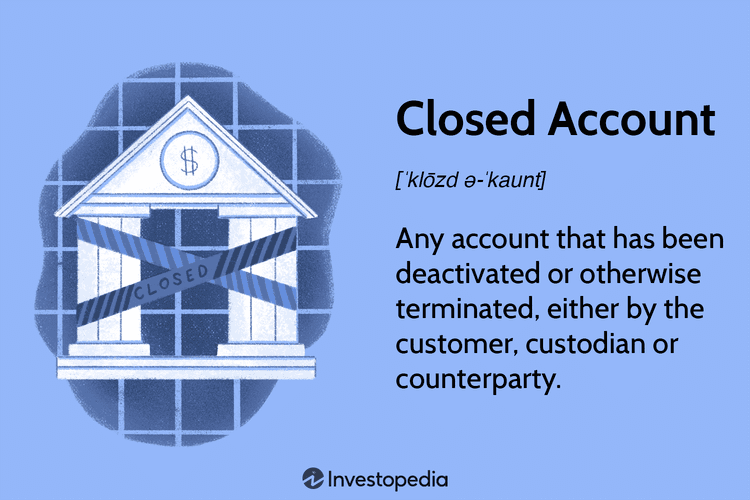

This article examines the various types of trading accounts—institutional accounts, closed accounts, and individual accounts—focusing on their roles and interactions in algorithmic trading. Institutional accounts, typically managed by entities such as hedge funds, mutual funds, and other financial organizations, wield substantial influence in the markets due to their sizeable capital and access to sophisticated trading strategies and technologies. In contrast, individual accounts are maintained by personal investors who trade for their investment portfolios. The rise of digital platforms has considerably bolstered their ability to engage in diverse trading strategies.

Closed accounts, which refer to accounts that have been terminated and cannot process further transactions, present unique considerations for both individuals and institutions. Their implications also extend to accounting practices, where closed accounts signify the resetting of temporary balances. Understanding the role of closed accounts is essential for grasping the broader implications they have on personal and organizational finance.



Algorithmic trading represents a key aspect of modern financial markets, utilizing advanced computer algorithms to execute trading strategies at unprecedented speeds. While initially the domain of institutional traders, algorithmic trading tools are increasingly accessible to individual traders, offering them enhanced market analysis capabilities. The integration of algorithmic trading across different account types has transformed trading dynamics, enabling rapid and data-driven decision-making.

Recognizing how these account types function in conjunction with algorithmic trading is crucial for market participants seeking to optimize their trading strategies. The significance of these accounts in today's fast-paced financial environment cannot be overstated, as they shape the efficiency and effectiveness of trading practices worldwide. As markets continue to evolve, understanding the intricate relationships between various trading accounts and algorithmic trading will be key to navigating future financial landscapes.

## Table of Contents

## What is a Closed Account?

A closed account refers to any account that has been deactivated or terminated, preventing further transactions. The closure can be initiated by the account holder, the custodian, or a counterparty and applies to a wide variety of financial accounts, including checking, savings, credit card, auto loan, and brokerage accounts. Once closed, these accounts are no longer active, meaning no further debits or credits can occur.

In the context of personal finance and banking, closing an account often signifies that the account holder has either fulfilled their obligations, such as settling a loan, or has chosen to cease using the account, which might happen due to various reasons such as finding a better service elsewhere or ending a financial relationship. It's crucial for account holders to confirm the settlement of all pending transactions before account closure to avoid any future complications.

Closed accounts also play a role in accounting practices. Here, the concept extends to the fiscal year-end procedure, where certain temporary accounts are reset to zero. These accounts, typically included in the income statement, such as revenues, expenses, gains, and losses, are closed to prepare for the next accounting period. This process involves transferring their balances to permanent accounts, typically the retained earnings or capital accounts, thereby ensuring that the new period begins with a clean slate. For example, in a double-entry accounting system, this might involve:

```python
# Example in Python
# Let's assume closing a revenue account

# Initial balances
revenue_account_balance = 10000
retained_earnings = 50000

# Closing the revenue account
retained_earnings += revenue_account_balance
revenue_account_balance = 0

# Resulting balances
print("Revenue Account Balance:", revenue_account_balance)
print("Retained Earnings after Closing:", retained_earnings)
```

The above script simulates closing a revenue account by transferring its balance to retained earnings, a typical year-end procedure.

The implications of closing accounts in both banking and accounting are substantial. In personal finance, it can affect credit scores, especially when closing credit accounts, and may impact financial planning. In accounting, proper closing ensures accurate financial reporting and compliance with regulatory standards. Recognizing the dual nature of closed accounts thus aids individuals and businesses in maintaining financial accuracy and integrity.

## Institutional Accounts Explained

Institutional accounts are integral components of the financial markets, being managed by large entities such as mutual funds, hedge funds, pension funds, insurance companies, and banks. These accounts are characterized by their ability to handle significant volumes of trades, wielding considerable influence over market dynamics. Institutional traders, equipped with substantial capital, often have the ability to influence security prices and market trends due to the sheer scale of their transactions.

One of the key advantages of institutional accounts is their access to exclusive financial instruments that are typically unavailable to individual investors. These instruments can include complex derivatives, leverage systems, and bespoke structured products, which allow institutions to execute sophisticated trading strategies. Additionally, institutional accounts employ teams of skilled professionals, including analysts and traders, who leverage advanced quantitative techniques and models. This analytical edge enables institutions to forecast market movements and optimize their trading strategies more effectively.

The significant capital base of institutional accounts allows these entities to negotiate lower transaction fees, an advantage not typically available to individual investors. The large [volume](/wiki/volume-trading-strategy) of trades conducted provides leverage when dealing with brokerages, which often leads to preferential rates and [liquidity](/wiki/liquidity-risk-premium) access. Moreover, institutions have the resources to invest in cutting-edge technology. Advanced trading platforms and [algorithmic trading](/wiki/algorithmic-trading) systems are commonly utilized, enabling rapid and precise execution of trades, often at speeds beyond human capability.

Institutional accounts have a profound impact on financial markets. Their trading activities contribute to market liquidity and efficiency, but they can also lead to increased [volatility](/wiki/volatility-trading-strategies). Large orders placed by institutional entities can cause abrupt price changes, thereby affecting individual investors and smaller market participants. Additionally, the strategies employed by these accounts, such as [arbitrage](/wiki/arbitrage) and high-frequency trading, can influence asset pricing and market stability.

The interplay between institutional accounts and the broader financial market is complex and multifaceted. While they offer numerous benefits in terms of liquidity provision and [market making](/wiki/market-making), the potential market impact of their large trades necessitates careful consideration by regulatory bodies. Understanding how institutional accounts function is crucial for regulators, market participants, and researchers who aim to comprehend market behavior and dynamics fully.

## Individual Accounts: A Closer Look

Individual accounts are financial accounts managed by personal investors who independently trade for their own portfolios. Unlike institutional investors, individual traders generally have less capital and access to a more limited range of financial instruments. However, these traders still play a significant role in the financial markets by utilizing a variety of trading strategies and leveraging modern technological advancements.

### Characteristics of Individual Accounts

1. **Capital and Access**: Individual traders typically operate with smaller capital bases compared to institutional counterparts. This limitation can affect the scope and scale of their trading activities. With fewer resources, individual traders may not access some financial instruments or market opportunities available to larger institutional accounts.

2. **Trading Strategies**: Retail traders, despite limited capital, can employ a diverse array of trading strategies. Common approaches include:
   - **Day Trading**: Involves executing trades within a single day, capitalizing on small market fluctuations. This strategy requires careful attention and quick decision-making.
   - **Swing Trading**: Focuses on capturing short- to medium-term gains over periods of days or weeks. Swing traders utilize technical analysis to predict market trends.
   - **Position Trading**: Involves holding positions for extended periods, often months or years. This strategy is typically driven by fundamental analysis of the asset.

3. **Digital Platforms**: The proliferation of digital platforms and online brokerages has significantly empowered individual traders. These platforms offer a suite of tools and resources, including real-time data, analytics, and educational materials, thus enabling individual traders to engage more effectively in financial markets. They also provide access to various financial instruments, such as stocks, options, and forex, through user-friendly interfaces.

### Challenges Faced by Individual Account Holders

Despite the empowerment provided by digital platforms, individual traders face several challenges:

- **Information Asymmetry**: Individual traders often lack the level of information and analytics available to institutional investors. This can result in suboptimal decision-making and reduced competitive edge.

- **Market Volatility**: Fluctuations in market conditions can pose significant risks, especially when trades are leveraged. Individual traders must employ robust risk management strategies to mitigate potential losses.

- **Emotional Bias**: Psychological factors, such as fear and greed, can heavily influence individual trading decisions. Unlike institutional traders, who often adhere to algorithm-based strategies, individual traders may face challenges in maintaining discipline during volatile market conditions.

- **Transaction Costs and Fees**: Despite reduced fees provided by many digital platforms, transaction costs can still accumulate, particularly for strategies involving frequent trading, such as day trading.

In summary, individual accounts offer personal investors the opportunity to actively participate in financial markets. While they face distinct challenges relative to institutional traders, the rise of digital platforms and accessible tools continues to bridge gaps, enhancing their ability to implement diverse trading strategies and manage personal portfolios effectively.

## Algorithmic Trading: Transforming the Landscape

Algorithmic trading utilizes advanced computer programs to execute trades at speeds and frequencies that manual trading cannot achieve. This method leverages algorithms to analyze vast amounts of market data in real-time, facilitating precise and rapid decision-making. Institutional traders are predominant users of algorithmic trading due to their need to manage large volumes of transactions efficiently and the capital to invest in sophisticated trading systems. However, technological advancements have made algorithmic trading increasingly accessible to individual traders, allowing them to benefit from its speed and efficiency.

The use of algorithms enables traders to process multiple market variables simultaneously, enhancing the ability to identify profitable trading opportunities. For example, algorithms can incorporate technical indicators such as moving averages, relative strength index (RSI), or Bollinger Bands to determine optimal trading conditions. Additionally, algorithms can perform complex analyses of market sentiment or news events, responding instantaneously to market changes.

Algorithmic trading offers several advantages across different account types. For institutional accounts, the primary benefit lies in executing large-scale trades with minimal market impact. Algorithms can break down substantial orders into smaller transactions, avoiding significant price shifts that could occur if a large order were processed at once. Furthermore, access to high-frequency trading capabilities allows institutions to capitalize on market inefficiencies, generating profits from minor price discrepancies.

For individual traders, algorithmic trading has reduced the barriers to entering the financial markets. Platforms now provide pre-built algorithms or customizable trading bots, enabling individuals to employ strategies previously exclusive to larger entities. However, successful implementation requires an understanding of the algorithms' mechanisms and potential market impact.

Despite its advantages, algorithmic trading poses challenges. The rapid pace of trading can lead to increased market volatility, as seen during events like the Flash Crash of 2010. Technical glitches or programming errors can result in substantial financial losses. Regulatory bodies are continually updating frameworks to ensure fair and transparent algorithmic trading practices, imposing strict compliance requirements on traders.

In recent years, algorithmic trading has reshaped market dynamics and trading strategies. It has increased market liquidity, reduced transaction costs, and democratized access to sophisticated trading techniques. Yet, as it continues to evolve, traders must remain vigilant of the challenges and continuously adapt to leverage the full potential of algorithmic trading.

## The Interplay Between Account Types and Algo Trading

Institutional accounts are fundamental in the application of algorithmic trading, driven by their capacity to manage extensive transaction volumes efficiently. This ability is largely due to the scale of their operations, which demands systems capable of executing trades rapidly and accurately to minimize market impact and take advantage of fleeting opportunities. Algorithmic strategies enable institutional traders to exploit market inefficiencies and execute orders at optimal prices—often through the use of high-frequency trading ([HFT](/wiki/high-frequency-trading-strategies)) algorithms designed for speed and precision.

For individual accounts, the rise of algorithmic trading presents an opportunity to harness advanced market analysis tools previously exclusive to larger entities. These tools include algorithmic platforms that provide retail traders with access to data analytics, predictive models, and automated trading systems. The democratization of algorithmic trading empowers individual traders to implement strategies such as [statistical arbitrage](/wiki/statistical-arbitrage), [momentum](/wiki/momentum) trading, or market making, albeit on a smaller scale compared to their institutional counterparts.

Closed accounts, although inactive in direct trading processes, can still influence an investor's overall strategy. Funds tied up in closed accounts can limit liquidity, delaying potential investment opportunities unless properly managed. Investors must strategically balance active and closed accounts to ensure optimal utilization of available assets.

Understanding the interaction between different account types and algorithmic trading is essential for optimizing trading strategies. Institutional accounts benefit from economies of scale and technological advancements in algorithmic infrastructures. In contrast, individual accounts derive advantages from accessible tools that enhance decision-making capabilities. Closed accounts, while not actively trading, must be considered in strategy formulations to ensure comprehensive asset management.

To illustrate, in Python, an algorithm capable of executing trades based on predefined criteria can be constructed as follows:

```python
import pandas as pd
import numpy as np

# Sample logic for a simple moving average algorithm
def moving_average_strategy(prices, window_size):
    moving_avg = prices.rolling(window=window_size).mean()
    signals = np.where(prices > moving_avg, 1, -1)  # 1 for buy, -1 for sell
    return signals

# Assume 'prices' is a pandas Series containing historical price data
prices = pd.Series([120, 121, 119, 122, 124, 123, 125])
signals = moving_average_strategy(prices, window_size=3)
print(signals)
```

This example highlights how individual traders can code simplistic but effective strategies, enabling them to automate decision-making based on historical price data. As technology advances, the lines between account types and their respective algorithmic capabilities continue to blur, suggesting that future market participants must adeptly navigate this landscape to capitalize on these evolving tools and strategies.

## Conclusion

The dynamics of institutional, closed, and individual accounts provide diverse insights into the financial markets, each having distinct characteristics that influence trading strategies and outcomes. Institutional accounts, with their significant market influence and access to advanced technologies, contrast with individual accounts, which, though smaller in scale, have been increasingly empowered by digital platforms. Closed accounts, whether in financial or accounting contexts, play a crucial role in managing resources and maintaining financial discipline. 

Algorithmic trading emerges as a crucial element across these account types, streamlining transactions and enabling quicker and more efficient market participation. Its capability to process vast amounts of data instantaneously offers traders a competitive advantage, particularly within institutional settings, where speed and volume are paramount. Individual traders, too, benefit from algorithmic trading, leveraging these technologies to enhance their decision-making processes.

As technology progresses, the interaction between the various account types and algorithmic trading is expected to deepen. The increasing availability of sophisticated trading tools to individual investors is likely to amplify this trend, fostering a more democratized trading environment. This evolution underscores the necessity for traders to thoroughly understand the specific attributes of each account type, ensuring they can adeptly navigate the complexities of modern financial landscapes.

In this rapidly changing environment, the capacity to make informed decisions regarding account types and trading strategies becomes increasingly significant. By comprehending the interplay between different types of accounts and the transformative power of algorithmic trading, market participants can better position themselves to seize opportunities and mitigate risks in the evolving financial markets.

## References & Further Reading

[1]: Bergstra, J., Bardenet, R., Bengio, Y., & Kégl, B. (2011). ["Algorithms for Hyper-Parameter Optimization."](https://dl.acm.org/doi/10.5555/2986459.2986743) Advances in Neural Information Processing Systems 24.

[2]: ["Advances in Financial Machine Learning"](https://www.amazon.com/Advances-Financial-Machine-Learning-Marcos/dp/1119482089) by Marcos Lopez de Prado.

[3]: ["Evidence-Based Technical Analysis: Applying the Scientific Method and Statistical Inference to Trading Signals"](https://www.amazon.com/Evidence-Based-Technical-Analysis-Scientific-Statistical/dp/0470008741) by David Aronson.

[4]: ["Machine Learning for Algorithmic Trading"](https://github.com/stefan-jansen/machine-learning-for-trading) by Stefan Jansen.

[5]: ["Quantitative Trading: How to Build Your Own Algorithmic Trading Business"](https://www.amazon.com/Quantitative-Trading-Build-Algorithmic-Business/dp/1119800064) by Ernest P. Chan.