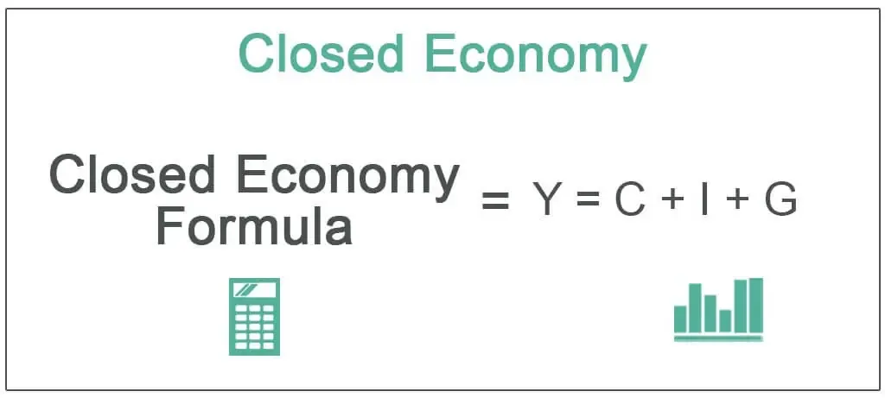

Modern economic systems have undergone significant transformations, evolving from traditional barter-based models to complex global networks. The evolution of these systems is primarily characterized by the shift from closed economies to open economies, influenced by technological advancements and globalization. These economic systems can be categorized broadly into different types based on the degree of openness, government intervention, and market dynamics.

A closed economy is one that does not interact with other economies in terms of trade, investment, or financial exchanges. It is self-sufficient, with its economic activities confined within its borders, and it relies heavily on domestic production and consumption. Closed economies were more prevalent in earlier times, particularly before the industrial revolution, when economies were largely agrarian and self-reliant. However, in today's interconnected world, closed economies are rare as globalization has ushered in an era where open economies dominate, allowing for increased trade, capital flow, and information exchange.

Algorithmic trading, or algo trading, is a revolutionary development in modern economies, primarily influencing financial markets. It involves the use of computerized algorithms to execute trades at speeds and frequencies that are impossible for human traders. This advancement has significantly impacted modern economies by enhancing market liquidity and efficiency. Algo trading systems are programmed to follow defined instructions for trading stocks, currencies, and other financial instruments, and they have become essential due to their ability to process large volumes of data faster than traditional trading routes.

The introduction of algorithmic trading has reshaped modern economies by pushing the boundaries of market efficiency. It enables the rapid analysis of market trends and execution of trade orders, contributing to a more dynamic market environment. However, it also poses challenges such as increased market volatility and the potential for systemic risks. As modern economies continue to leverage technology, understanding the balance between the opportunities and challenges presented by algo trading becomes crucial for policymakers and financial institutions.

In summary, while closed economies have declined in relevance with globalization's rise, the introduction and adoption of algorithmic trading have significantly marked modern economic landscapes, pushing forward efficiencies and complexities that must be managed in the quest for sustainable global prosperity.

## Table of Contents

## Understanding Economic Systems

Economic systems can broadly be classified into two categories: open and closed economies. An open economy engages in significant trade with other nations, permitting the free flow of goods, services, and capital across its borders. This interaction can enhance resource allocation efficiency, spur economic growth, and encourage efficient production driven by global competition. On the other hand, a closed economy endeavors to be self-sufficient by minimizing foreign trade and external financial interactions. This model strives to insulate a country's domestic economy from external shocks, relying solely on internal resources to meet its production and consumption needs.

The theoretical concept of closed economies is based on the idea of economic autarky—or complete independence from external economic interactions. Although no large economy operates as a complete autarky today, some smaller or politically isolated regions have adopted elements of a closed economy. The purpose is often to protect nascent industries, preserve cultural and social values, or maintain political sovereignty.

Globalization has catalyzed a profound shift from closed to open economies. As international trade barriers have been dismantled, and technology has advanced, global interconnectedness has increased. This transformation towards open economies is backed by the premise that access to global markets allows countries to specialize in the production of goods for which they have a comparative advantage. The concept of comparative advantage was famously formalized by economist David Ricardo, who illustrated that even if a nation is less efficient in the production of all goods than another country, mutually beneficial trade could still occur. This principle has been a driving force behind the movement towards more open economies.

Globalization's impact can be quantified by measuring trade openness, which is the ratio of a country's trade (exports + imports) to its Gross Domestic Product (GDP). As globalization has advanced, countries have generally experienced increases in trade openness, signifying greater integration into the global economy. According to the World Bank, this shift has been instrumental in the rapid economic development of many countries, such as China, which moved from a relatively closed economic model to becoming one of the world's largest trading nations.

However, globalization does not uniformly benefit all sectors or individuals within an economy. It can exacerbate income inequality and lead to the decline of certain industries unable to compete with international firms. Additionally, over-reliance on global supply chains can increase vulnerability to external economic shocks. As a result, some nations strive to maintain aspects of closed economies, such as strategic industries critical to national security.

To conclude, the nuances of different economic systems illustrate a spectrum ranging from open to closed models, influenced significantly by the forces of globalization. The transition towards more open economies has largely been predicated on the potential economic gains through increased trade and specialization, despite associated challenges and risks.

## Closed Economies in Modern Context

A closed economy is an economic system that restricts foreign trade and investment, aiming to be self-sufficient by relying primarily on domestic production and consumption. This system is characterized by limited import and export activities, minimal dependency on foreign economies, and stringent government controls over economic activities. The fundamental goal of a closed economy is to protect domestic industries, preserve national resources, and reduce exposure to global market fluctuations.

The rarity of closed economies in the contemporary world stems largely from the pervasive influence of globalization, which encourages interdependence among nations through trade, investment, technology, and information exchange. Globalization has facilitated the flow of goods, services, capital, and ideas across borders, making it difficult for nations to remain isolated without experiencing economic disadvantages. Open economies, which embrace international trade and investment, often benefit from increased competition, innovation, and access to a broader range of goods and services, translating into higher productivity and economic growth.

Several reasons explain why truly closed economies are scarce today:

1. **Economic Efficiency**: Closed economies tend to lack the efficiency brought about by competition. In open economies, competition encourages productivity and innovation, while closed economies may lead to complacent industries unaffected by external pressures.

2. **Resource Limitations**: Most countries do not possess all the resources required for a fully closed economy. Importing goods and services that a nation cannot produce efficiently on its own is often more practical.

3. **Technological Advancements**: Technology has reduced barriers to trade, making it easier and cheaper to conduct international business, a factor incompatible with the principles of a closed economy.

4. **Financial Integration**: Global financial markets are interlinked, offering advantages such as investment opportunities and capital flows that are unattainable under isolationist policies.

Despite the general trend towards openness, some countries continue to demonstrate relatively closed economic policies. For example:

- **North Korea**: North Korea's economic policies are among the most closed in the world, driven by political ideology and a focus on self-reliance known as Juche. The country limits trade and interactions with other nations to maintain political control and sovereignty.

- **Eritrea**: Eritrea maintains a closed economy with government-controlled industry and limited foreign investment. The rationale is primarily political and strategic, seeking to protect national interests and maintain control over economic resources.

- **Bhutan**: While not entirely closed, Bhutan pursues policies that limit foreign influence to preserve cultural heritage and environmental sustainability. The country famously prioritizes Gross National Happiness over GDP, reflecting a unique approach to economic development.

These examples highlight that closed economic policies are often motivated by political, ideological, or cultural considerations rather than purely economic ones. Nevertheless, as globalization continues to influence global trade dynamics, even these countries may face pressure to integrate further into the international community to achieve sustainable economic growth.

## Algorithmic Trading in Modern Economies

Algorithmic trading, often referred to as algo trading, represents a significant transformation in the financial markets. It involves using computer algorithms to execute trades based on pre-defined criteria and represents a shift from traditional trading methods that rely heavily on human decision-making. This approach leverages the power of computing to analyze vast amounts of data and execute orders at speeds beyond human capability. 

The evolution of [algorithmic trading](/wiki/algorithmic-trading) can be traced back to the early adoption of electronic trading systems in the financial markets. Over the decades, advancements in technology and computing power have facilitated the rise of sophisticated algorithms that can interpret complex market signals and execute trades within milliseconds. High-frequency trading ([HFT](/wiki/high-frequency-trading-strategies)), a subset of algorithmic trading, exemplifies this rapid evolution, where algorithms are used to capitalize on minute price discrepancies that exist for just fractions of a second.

### Benefits and Challenges of Algo Trading in Global Markets

Algorithmic trading offers several benefits to market participants. First, it enhances market [liquidity](/wiki/liquidity-risk-premium) by enabling a vast number of transactions, which narrows spreads and improves price discovery. The increased [volume](/wiki/volume-trading-strategy) of trades leads to a more robust and dynamic market environment, benefiting buyers and sellers with more efficient executions.

Cost efficiency is another significant advantage. Automation minimizes the need for human intervention, reducing the costs associated with manual trading. Additionally, algorithms can execute trades with precision, minimizing errors and slippage that might occur with human traders. 

However, the rapid uptake of algorithmic trading has introduced several challenges. Market [volatility](/wiki/volatility-trading-strategies) is a concern, as algorithmic trading can contribute to price swings, particularly during periods of financial stress or uncertainty. The flash crash of 2010, where the Dow Jones Industrial Average plummeted and rebounded in a short time span, highlighted the potential for algorithm-induced market disruptions.

Market fairness is another issue, with critics arguing that high-frequency traders have an undue advantage due to their technology and speed. This has led to regulatory scrutiny, prompting debates on the need for market regulations and safeguards to ensure a level playing field for all market participants.

### Impact of Algo Trading on Economic Efficiency and Market Dynamics

From an economic perspective, algorithmic trading significantly improves market efficiency by ensuring that securities are priced more accurately and swiftly in response to new information. This dynamism facilitates better allocation of resources and capital, contributing to overall economic growth.

Moreover, the presence of algorithmic traders in the market promotes competitive pricing and reduces the time it takes for markets to integrate new information into asset prices. This fosters an environment where market participants can react to changes more efficiently, aligning prices more closely with fundamental values.

However, the impact on market dynamics is not unambiguously positive. The speed and volume of trades executed by algorithms can lead to phenomena such as market fragmentation, where liquidity becomes distributed across multiple trading venues, potentially complicating price discovery. Additionally, there is a risk of systemic instability, as herding behaviors might be amplified by algorithms programmed to follow similar trading strategies.

Despite these challenges, the role of algorithmic trading in modern economies cannot be understated. Its capacity to transform how trades are executed and markets operate highlights the intersection of technology and finance. As markets continue to evolve, the influence of algorithmic trading is likely to grow, necessitating ongoing adaptation in regulatory frameworks and trading strategies.

## The Interplay Between Closed Economies and Algorithmic Trading

Closed economies are characterized by limited interaction with global markets. Algorithmic trading, on the other hand, drives rapid and high-frequency financial transactions globally. This section explores how algorithmic trading might influence closed economies, where traditional market controls are prevalent.

### Impact of Algorithmic Trading on Closed Economies

Algorithmic trading relies on fast data processing and market liquidity, key aspects often restricted in closed economies. In such settings, the lack of interaction with international financial systems limits the effectiveness of algorithms that depend on global market data. However, algorithmic strategies could be tailored to take advantage of any efficiencies within constrained environments by focusing on domestic market variables.

### Regulatory Challenges and Balance

Closed economies typically impose strict regulatory controls to protect domestic industries and maintain economic stability. Integrating algorithmic trading in these settings poses several regulatory challenges:

1. **Market Surveillance:** Authorities need robust systems to monitor the high-speed transactions characteristic of algorithmic trading. This requires significant investment in technology to ensure trading activities remain within permitted boundaries.

2. **Risk Management:** Algorithmic trading can result in increased market volatility, which might conflict with the goals of economic stability in closed economies. Regulators must devise policies that mitigate these risks, such as circuit breakers or trading halts during excessive movements.

3. **Data Security:** Closed economies must establish data management frameworks that prevent sensitive economic data from being exposed to international actors through algorithmic channels.

A well-balanced approach is essential, where algorithmic trading's benefits, such as enhanced liquidity and market efficiency, are harnessed without compromising on control and stability.

### Strategies for Integration

Successfully integrating algorithmic trading into closed economies requires careful strategizing. The following are potential strategies:

- **Localized Algorithms:** Creating algorithms that focus exclusively on domestic market dynamics allows leveraging localized data and trends without depending on international inputs.

- **Regulatory Sandboxes:** Implementing testing environments where firms can experiment with algorithmic trading under supervision can facilitate learning and adaptation without posing systemic risks. This approach helps in refining regulations based on empirical outcomes without significant economic disturbance.

- **Capacity Building:** Developing technical expertise and infrastructure to support domestic algorithmic trading platforms is crucial. Investment in technology and training can aid in building a robust domestic trading culture that remains insulated from external shocks.

In summary, while closed economies face significant hurdles in integrating algorithmic trading, strategic adaptations can allow these systems to exploit the efficiencies offered by automated financial strategies. The success of these integrations hinges on striking an optimal balance between maintaining regulatory controls and embracing technological innovations.

## Conclusion

In the modern era, closed economies have witnessed a notable decline as globalization has fostered interdependence and openness in international markets. Historically, closed economies, characterized by limited trade and self-sufficiency, provided a model where domestic industries were shielded from external competition. However, such systems have become increasingly rare as countries recognize the benefits of participating in global trade networks. As a result, the shift towards open economies has been driven by the potential for economic growth, innovation, and cultural exchange.

Algorithmic trading (algo trading) has emerged as a significant force within global economic systems, revolutionizing financial markets with technology. By utilizing complex algorithms to execute trades at high speed and volume, algo trading has enhanced market efficiency, reduced transaction costs, and improved liquidity. Its influence extends beyond traditional financial centers, affecting economies worldwide, regardless of their openness.

The future of closed economies seems precarious in an interconnected world where technology-driven market dynamics prevail. Those countries that maintain relatively closed economic policies may face challenges in achieving competitiveness and growth. Even so, algorithmic trading offers potential benefits, such as increased transparency and access to global capital, which can be advantageous if appropriately integrated.

As economies evolve, the adaptability of algo trading can serve as a bridge for traditionally closed market sectors to engage more effectively with global markets. Innovative regulatory frameworks that balance control and openness may allow these regions to harness the benefits of algorithmic trading while safeguarding national economic interests. Moving forward, the continuous evolution of trading technology will likely encourage even the most reluctant economies to explore greater integration within the global market landscape.

## References & Further Reading

[1]: Ricardo, D. ["On the Principles of Political Economy and Taxation"](https://www.cambridge.org/core/books/on-the-principles-of-political-economy-and-taxation/5C17BF2152379956950601EFE05AE14F). Liberty Fund, 2004.

[2]: De Long, J. Bradford, et al. (1990). ["Positive Feedback Investment Strategies and Destabilizing Rational Speculation."](https://www.jstor.org/stable/2328662) The Journal of Finance, 45(2), 379-395.

[3]: ["Globalization and Its Discontents"](https://en.wikipedia.org/wiki/Globalization_and_Its_Discontents) by Joseph E. Stiglitz

[4]: Jegadeesh, N., & Titman, S. (1993). ["Returns to Buying Winners and Selling Losers: Implications for Stock Market Efficiency."](https://www.jstor.org/stable/2328882) The Journal of Finance, 48(1), 65-91.

[5]: ["Flash Boys: A Wall Street Revolt"](https://en.wikipedia.org/wiki/Flash_Boys) by Michael Lewis

[6]: Grossman, Gene M., and Elhanan Helpman. ["Innovation and Growth in the Global Economy."](https://mitpress.mit.edu/9780262570978/innovation-and-growth-in-the-global-economy/) MIT Press, 1993.

[7]: Haldane, A. G. (2014). ["The Age of Asset Management?"](https://www.bis.org/review/r140507d.pdf) Bank of England.

[8]: Chui, Michael, et al. ["Disruptive Technologies: Advances that Will Transform Life, Business, and the Global Economy"](https://www.mckinsey.com/capabilities/mckinsey-digital/our-insights/disruptive-technologies). McKinsey Global Institute, 2013.

[9]: World Bank. ["World Development Report 2020: Trading for Development in the Age of Global Value Chains"](https://www.worldbank.org/en/publication/wdr2020). World Bank Group, 2020.