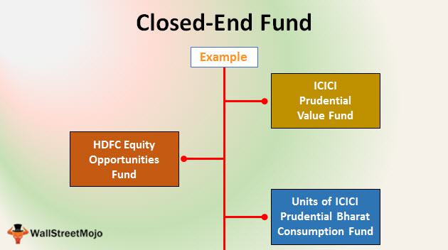

Closed-end funds (CEFs) are specialized investment vehicles distinguished by their fixed number of shares, which are traded on various stock exchanges. Unlike open-end mutual funds that continuously issue and redeem shares at net asset value (NAV), CEFs' shares fluctuate in the market, often exhibiting prices that differ from their NAV. This divergence presents a multifaceted investment scenario, as market forces and investor behavior can significantly influence the pricing dynamics of CEFs.

Price discrepancies between a CEF's market price and its NAV are a well-documented phenomenon, posing both challenges and opportunities for investors. This price deviation, often manifesting as either premiums or discounts, is central to understanding the market behavior of CEFs. Several factors contribute to this disparity, including supply-demand imbalances, market sentiment, and the intrinsic value perceived by investors.



The closed-end fund puzzle encapsulates the persistent nature of these pricing anomalies, challenging classical financial theories that suggest such discrepancies should quickly resolve through arbitrage. Various market participants have employed advanced trading strategies to exploit these differences, leveraging the capabilities of algorithmic trading. These algorithms aim to identify arbitrage opportunities by performing real-time NAV calculations and facilitating efficient execution of trades.

This article aims to provide a comprehensive exploration of the factors behind the price discrepancies in CEFs and the application of trading algorithms to capitalize on these differences. By examining the core characteristics of CEFs, elucidating the closed-end fund puzzle, and discussing algorithmic trading strategies, readers can gain a deeper understanding of this unique investment landscape and the potential for strategic gains.

## Table of Contents

## Understanding Closed-End Funds and NAV

Closed-end funds (CEFs) are a distinct category of investment vehicles characterized by a fixed number of shares issued through an initial public offering (IPO). Once issued, these shares are traded on stock exchanges similar to individual stocks, which sets them apart from open-end mutual funds that continuously issue and redeem shares at the fund's current net asset value (NAV).

The fixed capital structure of CEFs means that the fund's share supply is not affected by investor demand after the IPO. This static share count creates unique market dynamics, whereby CEFs can trade at prices either above or below their NAV. The NAV of a CEF equates to the total value of its assets minus any liabilities, divided by the number of outstanding shares. Mathematically, it is expressed as:

$$
\text{NAV} = \frac{\text{Total Assets} - \text{Total Liabilities}}{\text{Number of Outstanding Shares}}
$$

Although the underlying asset values are key to calculating NAV, CEFs typically have a diverse range of holdings including stocks, bonds, or other securities. Crucially, around 95% of CEFs compute their NAV daily. This daily calculation ensures transparency and allows investors to assess the relationship between the CEF's market price and its intrinsic value as represented by the NAV.

This shared price-NAV dynamic is notably different from open-end mutual funds, where transactions occur at the calculated NAV at the end of the trading day, providing an additional layer for market analysis. Investors can explore how CEF prices fluctuate relative to their NAV, typically leading to shares trading at either a premium (above NAV) or a discount (below NAV).

Understanding the NAV is vital in evaluating CEFs because it provides a benchmark for an investor's decision-making process, enabling them to discern whether a CEF is currently undervalued or overvalued based on market perceptions and sentiment. As CEFs are freely traded like any other equity, factors such as supply and demand, investor sentiment, and market trends can all influence the price investors are willing to pay for the fund's shares, divergent from their calculated NAV.

## Premiums and Discounts in Closed-End Funds

Premiums and discounts in closed-end funds (CEFs) are common phenomena that reflect the market's perception and valuation of these investment instruments. When a CEF's market price exceeds its net asset value (NAV), it is said to be trading at a premium. This indicates strong demand or positive sentiment towards the underlying assets within the fund. Conversely, a CEF trading at a price below its NAV is considered to be at a discount. This scenario may suggest that the market perceives the fund as undervalued or, alternatively, that there is broader pessimism about the assets or sectors it holds.

The mechanism behind these price discrepancies often lies in the unique structure of CEFs. Unlike open-end mutual funds, CEFs issue a fixed number of shares that are traded on the stock exchange. This fixed-supply feature means that the market price is primarily driven by investor demand, rather than reflecting the daily flow of cash into or out of the fund. As a result, CEFs can often deviate substantially from their NAV.

Trading at a discount is a particularly persistent attribute for many CEFs. Studies have shown that most CEFs consistently trade below their NAV, which poses both challenges and opportunities for investors. A discount might provide an attractive entry point, suggesting a potential upside if the discount narrows, and shares move closer to their NAV. In contrast, purchasing a CEF at a premium means the investor believes that the current demand will sustain or that the fund has unique attributes justifying a higher valuation above its NAV.

For investors and traders, recognizing the patterns within CEFs trading at discounts or premiums can be crucial. In the case of discounts, investors benefit from acquiring a bundle of underlying assets for less than their market value, but they risk that such a discount may persist indefinitely. In the instance of premiums, while it might be indicative of strong future performance expectations, it also presents the risk of potential overvaluation.

In summary, premiums and discounts in closed-end funds provide a nuanced perspective on market sentiment and valuation. The constant trading of CEFs at a discount offers a fertile ground for those seeking value investments, but also requires a thorough understanding and analysis to navigate the associated risks and opportunities successfully.

## The Closed-End Fund Puzzle

The closed-end fund puzzle is a well-documented phenomenon wherein closed-end funds (CEFs) frequently trade at prices that are different from their net asset values (NAV). This anomaly persists despite the general expectations of financial theory, which posits that market prices should reflect the underlying value of a fund's assets. Typically, the market value of a CEF can either exceed its NAV, resulting in a premium, or fall below it, leading to a discount.

Financial theory, particularly the efficient market hypothesis, suggests that these discrepancies should not persist, as rational investors are expected to exploit any mispricings, leading market prices to converge with NAV over time. Nonetheless, the reality often contradicts this expectation, as CEFs can consistently trade at substantial premiums or discounts for extended periods. This deviation is attributed to various factors, most notably supply-demand dynamics and investor sentiment.

Supply-demand imbalances are inherently tied to the fixed number of shares of CEFs, which distinguishes them from open-end mutual funds that can create or redeem shares according to investor demand. Limited supply can lead to price divergence from NAV, especially when market sentiment strongly favors or disfavors a particular fund or asset class.

Investor sentiment also plays a crucial role in the CEF market, driving prices independent of the fundamental value of the underlying assets. Factors influencing sentiment include general economic outlook, fund management reputation, and speculative behavior. Investors may be willing to pay a premium if they believe a fund's assets will likely increase in value or if the distribution levels are attractive compared to the market.

Understanding these persistent discrepancies provides meaningful insights into broader market behaviors and reveals potential [arbitrage](/wiki/arbitrage) opportunities. Arbitrageurs, for instance, can exploit these price differences through strategies such as [statistical arbitrage](/wiki/statistical-arbitrage), focusing on the mean-reversion properties of CEF discounts and premiums. When premiums and discounts deviate significantly from historical averages, there is an opportunity to profit by positioning trades that anticipate a return to the norm.

In conclusion, the closed-end fund puzzle challenges traditional financial theories and illuminates a market inefficiency that investors and traders can potentially capitalize on. By analyzing the factors contributing to these price discrepancies, stakeholders can gain valuable insights into market dynamics and possibly profit from the inherent anomalies within the CEF universe.

## Algorithmic Trading and Price Discrepancies

Algorithmic trading leverages advanced computational tools and technologies to exploit price discrepancies between a closed-end fund's (CEF) net asset value (NAV) and its market price. These discrepancies can result from various factors, such as market sentiment, investor behavior, or intrinsic market conditions. By utilizing high-frequency trading algorithms, traders can perform real-time NAV calculations to recognize arbitrage opportunities quickly. 

In practice, when a CEF is traded at a price below its NAV, algorithms may identify this as an undervaluation and proceed to buy the undervalued shares. Conversely, if the market price is above the NAV, indicating a potential overvaluation, the algorithm prompts selling shares to capitalize on the premium. The efficiency and speed provided by these algorithms enable traders to respond to market changes faster than manual trading approaches.

A popular strategy within [algorithmic trading](/wiki/algorithmic-trading) for CEFs is statistical arbitrage, which focuses on the mean-reversion properties of CEF pricing. This strategy involves identifying historical pricing patterns and recognizing when the current price deviates from its historical average or fair value. Algorithms are designed to execute trades based on these deviations, assuming the price will naturally revert to its mean over time. This is grounded in the statistical properties of financial markets and the belief that although prices fluctuate, they tend to revert to their historical means.

To illustrate this with a commonplace programming language like Python, consider the use of libraries such as `pandas` and `numpy` for analyzing time series data to detect mean-reversion opportunities. A simplified code snippet might look like this:

```python
import pandas as pd
import numpy as np

# Example time series data for a CEF
prices = pd.Series([10.2, 10.0, 10.5, 9.9, 10.1, 9.7, 10.4])

# Calculate moving average to identify deviation
moving_average = prices.rolling(window=3).mean()

# Detect points where price deviates from moving average
deviation_threshold = 0.2 # Arbitrary threshold for deviation
signals = (prices - moving_average).abs() > deviation_threshold

# Output buy/sell signals based on deviation
buy_signals = (prices < moving_average - deviation_threshold)
sell_signals = (prices > moving_average + deviation_threshold)

print("Buy signals:\n", prices[buy_signals])
print("Sell signals:\n", prices[sell_signals])
```

In this example, deviations from the moving average trigger buy or sell signals. By evaluating these signals across multiple CEFs or periods, traders can systematically capitalize on mean reversion, optimizing their trading decisions to maximize returns.

The integration of algorithmic trading techniques allows for the precise timing and execution of trades based on quantitative analysis. This systematic approach to exploiting price discrepancies aligns with the principles outlined in modern financial theory and provides traders with data-backed strategies for investment success.

## Key Factors Affecting CEF Pricing

Closed-end fund (CEF) pricing is significantly influenced by various factors like supply and demand dynamics, management performance, investor sentiment, and broader market conditions. Understanding these factors is crucial for predicting potential market shifts and making informed investment decisions.

Supply and demand dynamics are a primary driver of CEF pricing. When demand for a particular CEF exceeds its available supply of shares, the price may rise above the net asset value (NAV), resulting in a premium. Conversely, if demand falls short, the CEF might trade at a discount, with its market price below the NAV. Such discrepancies often reflect market perceptions of the underlying assets' performance or potential.

Management performance is another critical [factor](/wiki/factor-investing) influencing CEF prices. A fund with a strong track record of performance may command a higher price relative to its NAV, as investors are willing to pay a premium for anticipated future returns. Conversely, poor management performance can lead to a lack of confidence among investors, increasing the likelihood of the fund trading at a discount.

Investor sentiment plays a pivotal role in CEF pricing as well. Market-wide sentiment can affect how investors perceive individual CEFs, leading to price fluctuations. For instance, during periods of high market optimism, investors might be more willing to purchase CEFs at a premium, whereas during market downturns, they may become risk-averse, leading to wider discounts.

Broad market conditions, including economic indicators, interest rates, and geopolitical events, also impact CEF prices. These conditions can affect both the valuation of the underlying assets and investor behavior. For example, rising interest rates might result in higher borrowing costs for leveraged funds, potentially leading to a decline in their market value.

Behavioral finance provides a framework for understanding these deviations in CEF market prices from their NAV. It acknowledges the impact of psychological biases, such as herd behavior and overconfidence, on investor decisions, which can lead to systematic errors in pricing. Investors often rely on historical patterns, even when the current information suggests otherwise, leading to persistent premiums or discounts.

Additionally, mathematical and statistical models, like the Discount Model, can be employed to analyze CEF pricing. This model considers various inputs such as expected return, dividend yield, and growth rate to estimate a fair value. Quantitative approaches can also utilize programming languages like Python to analyze historical pricing data and simulate various scenarios for better decision-making.

By considering these factors, investors can develop strategic approaches to invest in CEFs, potentially capitalizing on pricing inefficiencies. Understanding the interplay between these factors equips investors with insights necessary to navigate the complexities of CEF pricing effectively.

## Implications for Investors

Investing in closed-end funds (CEFs) requires a nuanced understanding of the implications of trading at premiums or discounts. Price discrepancies in CEFs present both risks and opportunities for investors. Recognizing when a CEF is trading at a discount or premium can significantly influence investment decisions.

**Discounts as Entry Points**: When a CEF's market price falls below its net asset value (NAV), it is said to be trading at a discount. This situation can offer attractive entry points for investors seeking undervaluation opportunities. A discount implies that the market undervalues the fund's assets, which could be due to broader market pessimism, poor recent performance, or temporary negative sentiment. Savvy investors might see this as a chance to buy into a CEF at a reduced price, betting on a future price correction that aligns the market price more closely with the NAV.

**Premiums and Potential Overvaluation**: Conversely, a CEF trading at a premium has a market price exceeding its NAV. While purchasing shares at a premium could suggest confidence in the fund's management or future prospects, it also carries the risk of overvaluation. A premium may reflect a temporarily inflated investor sentiment that may not be sustainable in the long run. Should market sentiment change or the fund's performance not meet high expectations, investors could face a potential loss as the market price reverts towards the NAV.

**Assessing Management and Strategy**: Investors must evaluate the quality of the fund’s management and its investment strategy. Effective managers can add value by choosing investments that outperform the market, thus justifying any premium in market price. Conversely, poor management can exacerbate a discount situation, turning what might appear to be a bargain into a problematic investment.

**Market Conditions and Investor Sentiment**: Prevailing market conditions and investor sentiment play pivotal roles in determining the trading behavior of CEFs. In bullish markets, premiums might become more common as investors anticipate continued growth. In contrast, bear markets might see widespread discounts due to heightened risk aversion.

**Formulating Effective Investment Strategies**: Given the complexities surrounding CEF pricing, investors must craft strategies that weigh management quality, investment strategy, and market conditions. Tools from behavioral finance can assist in understanding investor psychology and its impact on CEF pricing. 

Ultimately, effective CEF investment strategies require a balance between identifying intrinsic value and navigating market anomalies. By carefully analyzing each fund's specific circumstances and maintaining awareness of broader economic influences, investors can potentially capitalize on the unique opportunities presented by CEFs while mitigating associated risks.

## Conclusion

The deviance of closed-end fund (CEF) market prices from their net asset values (NAVs) creates opportunities for sophisticated investment strategies, particularly those employing algorithmic trading. This disparity between market prices and NAVs emerges from various factors such as supply and demand dynamics, investor sentiment, and market inefficiencies. Algorithmic trading systems, with their ability to analyze vast amounts of data in real time, can capitalize on these price discrepancies by identifying undervalued or overvalued shares.

A meticulous evaluation of CEFs' inherent investment strategies, coupled with an understanding of prevailing market sentiments, can potentially yield substantial financial returns. Investors and traders need to consider several critical factors to navigate the CEF landscape successfully:

1. **Fund Performance**: Regular assessment of a CEF's performance in comparison to benchmarks or similar funds provides insights into its management effectiveness and long-term viability. Historical performance, volatility, and consistency in returns are essential metrics.

2. **Distribution Levels**: Distributions play a significant role in CEFs' appeal to investors seeking income. Understanding the sustainability of distribution levels, including the breakdown between income and return of capital, can indicate a fund's financial health and future prospects.

3. **Economic Conditions**: Broader economic factors can influence CEF pricing, affecting everything from interest rate changes to geopolitical events. Staying informed about macroeconomic trends and market conditions is crucial for predicting shifts that may impact CEF valuations.

Effective navigation of CEF investment therefore demands a multi-faceted approach. Investors should employ both fundamental and quantitative analyses to inform their decisions. Fundamental analysis entails examining a fund's underlying assets and management quality, while quantitative approaches, often driven by algorithmic tools, focus on identifying and exploiting market inefficiencies. This balanced strategy can help mitigate risks associated with price discrepancies, allowing investors to optimize their portfolios by taking calculated risks informed by comprehensive market analysis.

## References & Further Reading

[1]: Cherkes, M., Sagi, J. S., & Stanton, R. (2009). ["A Liquidity-Based Theory of Closed-End Funds."](https://www.jstor.org/stable/40056902) The Review of Financial Studies, 22(1), 257–297.

[2]: Lee, C. M. C., Shleifer, A., & Thaler, R. H. (1990). ["Anomalies: Closed-End Mutual Funds."](https://www.jstor.org/stable/2328690) The Journal of Economic Perspectives, 4(4), 153–164.

[3]: Pontiff, J. (1996). ["Costly Arbitrage: Evidence from Closed-End Funds."](https://academic.oup.com/qje/article-abstract/111/4/1135/1932203) The Quarterly Journal of Economics, 111(4), 1135-1151.

[4]: Zweig, M. E. (1973). ["An Investor Expectations Stock Price Predictive Model Using Closed-End Fund Premiums."](https://www.jstor.org/stable/2978169) The Journal of Finance, 28(1), 67-78.

[5]: Elton, E. J., Gruber, M. J., Blake, C. R., & Krasny, Y. (2018). ["Response of Closed-End Funds to Changes in Discounts and Premiums Using a Matching Estimator."](https://www.jstor.org/stable/2329350) The Financial Review, 53(2), 421-444.