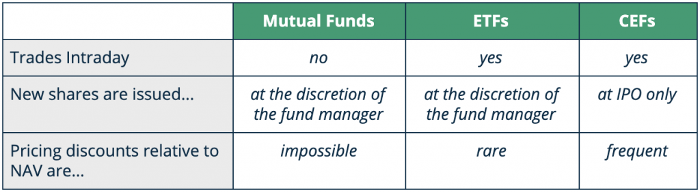

## Table of Contents

## What is a closed-end fund?

A closed-end fund is a type of investment fund that raises a fixed amount of money through an initial public offering (IPO). Once the shares are issued, the fund is closed to new investors, meaning it does not continuously issue new shares like an open-end fund. Instead, the shares of a closed-end fund trade on a stock exchange, just like stocks, and their prices can fluctuate based on supply and demand.

These funds are managed by professional investment managers who use the raised capital to invest in a variety of assets, such as stocks, bonds, or other securities. The goal is to generate income or capital gains for the shareholders. One unique aspect of closed-end funds is that they can trade at a premium or discount to their net asset value (NAV), which is the total value of the fund's assets minus its liabilities, divided by the number of shares outstanding. This can provide opportunities for investors to buy the fund at a lower price than the value of its underlying assets.

## How does the price of a closed-end fund differ from its net asset value (NAV)?

The price of a closed-end fund can be different from its net asset value (NAV). The NAV is like the total value of all the things the fund owns, minus what it owes, divided by the number of shares. But the price you see on the stock exchange, where the fund's shares are traded, can be higher or lower than this NAV. This happens because the price is set by what people are willing to pay for the shares, not just by the value of the fund's assets.

When the price of the fund's shares is higher than the NAV, we say it's trading at a premium. This means investors are willing to pay more than the actual value of the fund's assets. On the other hand, if the price is lower than the NAV, it's trading at a discount. This means you can buy the fund for less than the value of its assets. These differences can happen because of things like how popular the fund is, how well it's expected to do in the future, or even how easy it is to buy and sell the shares.

## What causes price discrepancies between a closed-end fund's market price and its NAV?

The price of a closed-end fund can be different from its net asset value (NAV) because of how people feel about the fund. If a lot of people want to buy the fund, its price can go up higher than its NAV. This is called trading at a premium. On the other hand, if not many people want to buy it, the price can drop below the NAV, which is called trading at a discount. These feelings can be influenced by how well the fund has done in the past, what people think it will do in the future, or even how easy it is to buy and sell the shares.

Another reason for these price differences is how easy it is to trade the fund's shares. If there aren't many shares being bought and sold, it can be hard to find someone to trade with. This can make the price go up or down more than the NAV. Also, if the fund uses borrowed money to invest, this can make the price more different from the NAV because it adds more risk. So, the price of a closed-end fund can be affected by what people think and how easy it is to trade the shares.

## How can investors identify if a closed-end fund is trading at a premium or a discount to its NAV?

Investors can find out if a closed-end fund is trading at a premium or a discount by comparing the fund's market price to its net asset value (NAV). The NAV is the total value of all the things the fund owns, minus what it owes, divided by the number of shares. You can find the NAV on the fund's website or in financial news websites. The market price is what people are paying for the shares on the stock exchange, and you can see this price on any stock market website or app.

To figure out if the fund is at a premium or a discount, subtract the NAV from the market price. If the result is positive, the fund is trading at a premium, meaning people are willing to pay more than the value of the fund's assets. If the result is negative, it's trading at a discount, meaning you can buy the fund for less than the value of its assets. This simple calculation helps investors see if they are getting a good deal or paying more than the fund is worth.

## What are the potential benefits of buying a closed-end fund at a discount to its NAV?

When you buy a closed-end fund at a discount to its NAV, it's like getting a bargain. The NAV is the total value of everything the fund owns, minus what it owes, divided by the number of shares. If you can buy the shares for less than this value, it means you're getting more for your money. Imagine if you could buy a dollar's worth of stuff for only 90 cents. That's what buying at a discount feels like. If the fund's assets go up in value or if the discount shrinks, you could make a profit.

Another benefit is that buying at a discount can give you a higher yield. The yield is how much money the fund pays out to you, usually as dividends. When you buy the shares cheaper, the same amount of dividend payments becomes a bigger percentage of what you paid. So, even if the fund doesn't change its payouts, your return on investment can be higher. This can be especially good for people who want to earn regular income from their investments.

## What risks are associated with closed-end funds trading at a premium to their NAV?

When you buy a closed-end fund at a premium to its NAV, you're paying more than the value of the stuff the fund owns. This means you're taking a risk because if the premium goes away, the price of the fund could drop a lot. Imagine you paid $1.10 for something worth $1. If the price comes back to what it's really worth, you lose money. So, the risk is that the market might realize the fund isn't worth the extra price, and then the price of the fund goes down.

Another risk is that the fund might not do as well as you hoped. If the investments inside the fund don't grow or if they lose value, the NAV could go down. Since you paid more than the NAV, you could lose even more money than if you had bought it at the NAV or at a discount. It's like betting that the fund will keep being popular and that its investments will do well, but if either of those things doesn't happen, you could end up losing money.

## How do market conditions affect the price discrepancies of closed-end funds?

Market conditions can really change how much people are willing to pay for a closed-end fund, which can make the price different from the NAV. When the market is doing well and people feel good about the future, they might be willing to pay more for the fund, making it trade at a premium. On the other hand, if the market is not doing well and people are worried, they might not want to pay as much, and the fund could trade at a discount. So, the mood of the market can push the price of the fund up or down, away from its NAV.

Also, things like interest rates and how easy it is to borrow money can affect these price differences. If interest rates go up, people might want to put their money in safer places like bonds, and this can make closed-end funds less popular, leading to bigger discounts. If borrowing money becomes harder or more expensive, it can also make the fund's price go down compared to its NAV. So, the overall market environment and how people feel about it can really change how much a closed-end fund's price is different from its NAV.

## What role do dividends and distributions play in the valuation of closed-end funds?

Dividends and distributions are important for how much people are willing to pay for a closed-end fund. When a fund pays out dividends, it's giving money to its shareholders. If the fund pays out a lot, people might want to buy it more, even if it costs more than the NAV. They see the high dividends as a good reason to pay extra. So, if a fund has high dividends, it might trade at a premium because people are willing to pay more for the regular money they get.

But, if the dividends are low or if they get cut, people might not want to pay as much for the fund. This can make the price drop below the NAV, trading at a discount. People might think the fund isn't worth as much if it's not giving them much money. So, the amount and reliability of dividends can really change how much people are willing to pay for a closed-end fund, making it trade at a premium or a discount to its NAV.

## How can an investor use arbitrage strategies to capitalize on closed-end fund price discrepancies?

Investors can use [arbitrage](/wiki/arbitrage) strategies to make money from the difference between a closed-end fund's market price and its NAV. One way to do this is by buying the fund when it's trading at a big discount to its NAV and then selling it when the price goes up closer to the NAV. It's like buying something on sale and then selling it when it's not on sale anymore. If the discount gets smaller, the investor can make a profit from the difference. This works because the fund's price might eventually move closer to what it's really worth, and the investor can take advantage of that change.

Another way is to use a strategy called "pairs trading." This means an investor buys the closed-end fund at a discount and at the same time, sells short a similar investment that's not at a discount. The idea is that the price difference between the two will shrink over time. If the closed-end fund's price goes up to meet its NAV, and the other investment stays the same, the investor can make money from both sides of the trade. This strategy can help balance out the risks because the investor is betting on the difference between the two investments, not just on one going up or down.

## What are the tax implications of trading closed-end funds at varying premiums or discounts to their NAV?

When you buy and sell closed-end funds, the tax you have to pay can be affected by whether you bought the fund at a premium or a discount to its NAV. If you buy a fund at a discount and then sell it when the price goes up closer to the NAV, you might make a profit. This profit is called a capital gain, and you'll have to pay taxes on it. The tax rate depends on how long you held the fund. If you held it for more than a year, it's a long-term capital gain, which usually has a lower tax rate. If you held it for less than a year, it's a short-term capital gain, and you'll pay a higher tax rate, similar to your regular income tax.

On the other hand, if you buy a fund at a premium and then sell it at a loss because the premium goes away, you can use that loss to lower your taxes. This is called a capital loss, and you can use it to offset any capital gains you made from other investments. If your losses are more than your gains, you can even use some of the loss to lower your regular income, up to a certain amount each year. So, the way you trade closed-end funds at different prices compared to their NAV can change how much tax you pay or how much you can save on your taxes.

## How do management fees and other expenses impact the NAV and market price of closed-end funds?

Management fees and other expenses can lower the NAV of a closed-end fund. The NAV is the total value of everything the fund owns minus what it owes, divided by the number of shares. When the fund has to pay fees and expenses, it's like taking money out of the fund's pocket. This means the value of the stuff the fund owns goes down a bit, which makes the NAV go down too. So, if the fund has high fees, the NAV might be lower than it would be without those fees.

These fees and expenses can also affect the market price of the fund. The market price is what people are willing to pay for the fund's shares on the stock exchange. If people know the fund has high fees, they might not want to pay as much for the shares. This can make the market price go down, even if the NAV stays the same. So, high fees can make the fund trade at a bigger discount to its NAV, because people see the fees as a reason to pay less for the fund.

## What advanced analytical tools and metrics can investors use to predict and analyze closed-end fund price discrepancies?

Investors can use several advanced tools and metrics to predict and analyze how much a closed-end fund's price might be different from its NAV. One useful tool is the "z-score," which helps investors see if a fund's current discount or premium is normal or unusual compared to its past. A high z-score means the discount or premium is bigger than usual, which could be a sign that the price might move back towards the NAV soon. Another important metric is the "historical average discount/premium," which shows what the fund's price difference has been over time. If the current discount or premium is far from this average, it might be a good time to buy or sell.

Another tool investors can use is "relative strength index" (RSI), which measures how fast the fund's price is going up or down. If the RSI shows the fund is overbought or oversold, it might mean the price will soon change, which can affect the discount or premium. Also, "correlation analysis" can help investors see how the fund's price moves with other things like the stock market or interest rates. If the fund's price is moving differently than usual, it might be a sign that the discount or premium will change. By using these tools and metrics, investors can get a better idea of when to buy or sell a closed-end fund to take advantage of price differences.

## What is the understanding of Closed-End Funds and NAV?

Closed-end funds (CEFs) are a distinct category of investment vehicles characterized by a fixed number of shares issued through an initial public offering (IPO). Once issued, these shares are traded on stock exchanges similar to individual stocks, which sets them apart from open-end mutual funds that continuously issue and redeem shares at the fund's current net asset value (NAV).

The fixed capital structure of CEFs means that the fund's share supply is not affected by investor demand after the IPO. This static share count creates unique market dynamics, whereby CEFs can trade at prices either above or below their NAV. The NAV of a CEF equates to the total value of its assets minus any liabilities, divided by the number of outstanding shares. Mathematically, it is expressed as:

$$
\text{NAV} = \frac{\text{Total Assets} - \text{Total Liabilities}}{\text{Number of Outstanding Shares}}
$$

Although the underlying asset values are key to calculating NAV, CEFs typically have a diverse range of holdings including stocks, bonds, or other securities. Crucially, around 95% of CEFs compute their NAV daily. This daily calculation ensures transparency and allows investors to assess the relationship between the CEF's market price and its intrinsic value as represented by the NAV.

This shared price-NAV dynamic is notably different from open-end mutual funds, where transactions occur at the calculated NAV at the end of the trading day, providing an additional layer for market analysis. Investors can explore how CEF prices fluctuate relative to their NAV, typically leading to shares trading at either a premium (above NAV) or a discount (below NAV).

Understanding the NAV is vital in evaluating CEFs because it provides a benchmark for an investor's decision-making process, enabling them to discern whether a CEF is currently undervalued or overvalued based on market perceptions and sentiment. As CEFs are freely traded like any other equity, factors such as supply and demand, investor sentiment, and market trends can all influence the price investors are willing to pay for the fund's shares, divergent from their calculated NAV.

## References & Further Reading

[1]: Cherkes, M., Sagi, J. S., & Stanton, R. (2009). ["A Liquidity-Based Theory of Closed-End Funds."](https://www.jstor.org/stable/40056902) The Review of Financial Studies, 22(1), 257–297.

[2]: Lee, C. M. C., Shleifer, A., & Thaler, R. H. (1990). ["Anomalies: Closed-End Mutual Funds."](https://www.jstor.org/stable/2328690) The Journal of Economic Perspectives, 4(4), 153–164.

[3]: Pontiff, J. (1996). ["Costly Arbitrage: Evidence from Closed-End Funds."](https://academic.oup.com/qje/article-abstract/111/4/1135/1932203) The Quarterly Journal of Economics, 111(4), 1135-1151.

[4]: Zweig, M. E. (1973). ["An Investor Expectations Stock Price Predictive Model Using Closed-End Fund Premiums."](https://www.jstor.org/stable/2978169) The Journal of Finance, 28(1), 67-78.

[5]: Elton, E. J., Gruber, M. J., Blake, C. R., & Krasny, Y. (2018). ["Response of Closed-End Funds to Changes in Discounts and Premiums Using a Matching Estimator."](https://www.jstor.org/stable/2329350) The Financial Review, 53(2), 421-444.